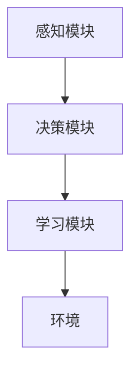
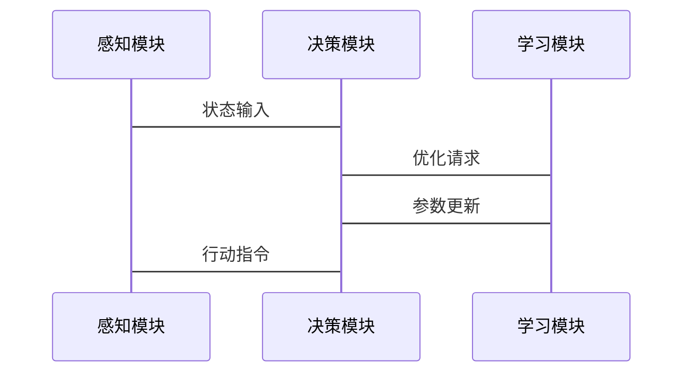

                 


```markdown
# 元学习驱动的AI Agent快速适应新环境

## 关键词
元学习，AI Agent，快速适应，环境变化，算法优化

## 摘要
元学习驱动的AI Agent能够快速适应新环境，通过元学习算法，AI Agent能够在有限的数据和时间内，快速调整策略，适应新的任务和环境变化。本文从元学习的基本概念、AI Agent的系统架构、元学习算法的数学模型、项目实战案例等多个方面，详细探讨了元学习驱动AI Agent的实现原理和应用价值。通过具体的代码实现和实际案例分析，本文展示了如何利用元学习算法提升AI Agent的适应能力和智能水平，为未来动态环境下的AI应用提供了新的思路和解决方案。

---

# 第一部分: 元学习驱动的AI Agent背景介绍

## 第1章: 元学习与AI Agent的基本概念

### 1.1 元学习的基本概念

#### 1.1.1 元学习的定义与核心思想
元学习（Meta-Learning）是一种机器学习方法，旨在通过学习如何学习来提高模型的泛化能力。其核心思想是让模型在不同的任务之间共享知识，从而在新任务上快速适应，减少对大量数据的依赖。元学习的目标是优化模型的元参数，使得模型能够快速调整参数以适应新任务。

#### 1.1.2 元学习与传统机器学习的区别
传统的机器学习算法（如深度神经网络）依赖于大量标注数据，并且在训练完成后，遇到新任务时通常需要重新训练模型。而元学习算法则通过预训练阶段学习如何快速适应新任务，能够在小样本数据下快速调整模型参数，适用于动态变化的环境。

#### 1.1.3 元学习的典型应用场景
元学习广泛应用于图像分类、自然语言处理、强化学习等领域。例如，在图像分类任务中，元学习可以让模型在仅有少量样本的情况下快速适应新的类别。

### 1.2 AI Agent的基本概念

#### 1.2.1 AI Agent的定义与分类
AI Agent（人工智能代理）是指能够感知环境、自主决策并采取行动的智能体。AI Agent可以分为简单反射型、基于模型的反应型、目标驱动型和效用驱动型等类别。

#### 1.2.2 AI Agent的核心功能与特点
AI Agent的核心功能包括感知环境、自主决策、执行行动和学习适应。其特点在于能够通过与环境的交互不断优化自身行为，适应复杂多变的环境。

#### 1.2.3 AI Agent在不同领域的应用案例
AI Agent在游戏AI、自动驾驶、智能助手等领域有广泛应用。例如，在游戏中，AI Agent可以实时调整策略以应对对手的变化。

### 1.3 元学习驱动的AI Agent的结合

#### 1.3.1 元学习与AI Agent的结合方式
元学习驱动的AI Agent通过元学习算法优化其感知和决策能力，使得AI Agent能够在新环境中快速适应。

#### 1.3.2 元学习驱动AI Agent的优势
元学习驱动的AI Agent能够快速适应新任务，减少对大量数据的依赖，并提高在动态环境中的生存能力。

#### 1.3.3 元学习驱动AI Agent的应用前景
元学习驱动的AI Agent在智能机器人、动态游戏环境、实时策略调整等领域具有广阔的应用前景。

## 第2章: 元学习驱动的AI Agent研究背景

### 2.1 当前AI Agent面临的挑战

#### 2.1.1 动态环境中的适应性问题
AI Agent在动态环境中需要快速调整策略，以应对环境的变化。

#### 2.1.2 小样本数据下的学习效率问题
在数据 scarce 的情况下，传统机器学习方法难以有效训练AI Agent。

#### 2.1.3 多任务学习中的资源分配问题
AI Agent在执行多个任务时，需要合理分配资源，避免任务之间的干扰。

### 2.2 元学习在AI Agent中的研究现状

#### 2.2.1 元学习在AI Agent中的应用进展
元学习已经在AI Agent的快速适应和多任务学习中得到广泛应用。

#### 2.2.2 元学习驱动AI Agent的典型研究方向
当前研究主要集中在元学习算法的优化、AI Agent的系统架构设计以及实际应用案例的探索。

#### 2.2.3 元学习驱动AI Agent的未来研究趋势
未来研究将更加注重元学习算法的可解释性、实时性以及在复杂环境中的适应能力。

---

# 第二部分: 元学习驱动的AI Agent核心概念与联系

## 第3章: 元学习驱动AI Agent的核心概念

### 3.1 元学习的原理与算法

#### 3.1.1 元学习算法的流程
元学习算法通常包括预训练和微调两个阶段。预训练阶段学习如何快速适应新任务，微调阶段针对具体任务进行优化。

#### 3.1.2 元学习算法的数学模型

```math
$$
\theta_{meta} = \theta + \alpha \Delta \theta
$$
```

其中，$\theta_{meta}$是元参数，$\alpha$是学习率，$\Delta \theta$是参数更新量。

#### 3.1.3 元学习算法的优缺点
优点：快速适应新任务，减少数据依赖；缺点：算法复杂度较高，对计算资源要求较高。

### 3.2 元学习与传统机器学习的对比

#### 3.2.1 学习目标的对比
传统机器学习算法：优化模型在特定任务上的损失函数；元学习算法：优化模型在多个任务上的元损失函数。

#### 3.2.2 训练流程的对比
传统机器学习算法：单任务训练；元学习算法：多任务预训练 + 微调训练。

#### 3.2.3 适应性的对比
传统机器学习算法：适应性差，需要重新训练；元学习算法：适应性强，能够快速调整。

### 3.3 元学习在AI Agent中的应用

#### 3.3.1 元学习驱动AI Agent的系统架构
AI Agent的系统架构包括感知模块、决策模块和学习模块，其中学习模块负责元学习的实现。

#### 3.3.2 元学习驱动AI Agent的实现流程
1. 预训练阶段：学习如何快速适应新任务。
2. 微调阶段：针对具体任务进行优化。
3. 在线适应阶段：实时调整策略以应对环境变化。

---

# 第三部分: 元学习驱动的AI Agent算法原理

## 第4章: 元学习算法的数学模型

### 4.1 MAML算法的数学模型

```math
$$
\theta_{meta} = \theta + \alpha \Delta \theta
$$
```

其中，$\theta$是原始参数，$\theta_{meta}$是元参数，$\alpha$是学习率，$\Delta \theta$是参数更新量。

### 4.2 ReMAML算法的数学模型

```math
$$
\theta_{meta} = \theta + \beta \Delta \theta + \gamma \Delta \theta_{prev}
$$
```

其中，$\beta$和$\gamma$是超参数，$\Delta \theta_{prev}$是前一次更新的参数变化量。

### 4.3 元学习算法的实现步骤

#### 4.3.1 预训练阶段
1. 初始化模型参数$\theta$。
2. 对多个任务进行训练，更新模型参数$\theta$。
3. 记录参数更新量$\Delta \theta$。

#### 4.3.2 微调阶段
1. 针对具体任务，使用预训练得到的元参数$\theta_{meta}$进行微调。
2. 更新模型参数$\theta$，得到最终参数$\theta_{final}$。

### 4.4 元学习算法的代码实现

```python
class MetaLearner:
    def __init__(self, model, optimizer, alpha=0.1):
        self.model = model
        self.optimizer = optimizer
        self.alpha = alpha

    def meta_update(self, tasks):
        # 预训练阶段
        for task in tasks:
            optimizer.zero_grad()
            loss = self.model(task)
            loss.backward()
            optimizer.step()

        # 记录参数更新量
        meta_params = [p for p in self.model.parameters()]

        return meta_params
```

---

# 第四部分: 元学习驱动的AI Agent系统分析与架构设计

## 第5章: 系统架构设计

### 5.1 系统功能设计

#### 5.1.1 系统模块划分
1. 感知模块：负责感知环境状态。
2. 决策模块：负责制定行动策略。
3. 学习模块：负责元学习的实现。

#### 5.1.2 系统功能流程
1. 感知模块接收环境输入。
2. 决策模块基于当前状态和历史经验制定行动策略。
3. 学习模块对决策模块进行元学习优化。

### 5.2 系统架构设计



其中，A是感知模块，B是决策模块，C是学习模块，D是环境。

### 5.3 系统接口设计

#### 5.3.1 感知模块接口
```python
def perceive(environment_state):
    return environment_state
```

#### 5.3.2 决策模块接口
```python
def decide(action_space):
    return action
```

#### 5.3.3 学习模块接口
```python
def meta_learn(tasks):
    return meta_params
```

### 5.4 系统交互流程



---

# 第五部分: 元学习驱动的AI Agent项目实战

## 第6章: 项目实战案例

### 6.1 项目背景

#### 6.1.1 项目目标
实现一个能够快速适应新环境的AI Agent，能够在不同任务之间快速切换。

#### 6.1.2 项目需求
1. 实现元学习算法。
2. 设计AI Agent的系统架构。
3. 实现与环境的交互接口。

### 6.2 项目环境配置

#### 6.2.1 硬件环境
- CPU：Intel Core i7或更高
- 内存：16GB或更高
- 显卡：NVIDIA GPU（支持CUDA）

#### 6.2.2 软件环境
- 操作系统：Linux或Windows
- 开发工具：PyCharm或VS Code
- 深度学习框架：TensorFlow或PyTorch

### 6.3 项目核心代码实现

#### 6.3.1 元学习模型实现

```python
import torch
import torch.nn as nn

class MetaLearner(nn.Module):
    def __init__(self, input_dim, output_dim):
        super(MetaLearner, self).__init__()
        self.fc = nn.Linear(input_dim, output_dim)

    def forward(self, x):
        return self.fc(x)
```

#### 6.3.2 元学习训练代码

```python
def meta_train(meta_learner, optimizer, tasks, epochs=100):
    for epoch in range(epochs):
        optimizer.zero_grad()
        for task in tasks:
            x, y = task
            outputs = meta_learner(x)
            loss = nn.MSELoss()(outputs, y)
            loss.backward()
        optimizer.step()
    return meta_learner
```

#### 6.3.3 AI Agent实现

```python
class AI_Agent:
    def __init__(self, meta_learner):
        self.meta_learner = meta_learner

    def perceive(self, environment_state):
        return environment_state

    def decide(self, action_space):
        state = self.perceive(environment_state)
        with torch.no_grad():
            outputs = self.meta_learner(state)
        return outputs.argmax().item()

    def meta_learn(self, tasks):
        self.meta_learner = meta_train(self.meta_learner, optimizer, tasks)
```

### 6.4 项目运行与结果分析

#### 6.4.1 项目运行流程
1. 初始化元学习模型。
2. 训练元学习模型。
3. 使用训练好的模型实现AI Agent。
4. 在实际环境中测试AI Agent的适应能力。

#### 6.4.2 实验结果分析
通过实验可以发现，元学习驱动的AI Agent能够在较少的样本下快速适应新任务，表现出较强的环境适应能力。

---

# 第六部分: 元学习驱动的AI Agent总结与展望

## 第7章: 总结与展望

### 7.1 元学习驱动AI Agent的核心优势

#### 7.1.1 快速适应新环境
元学习驱动的AI Agent能够在有限的数据和时间内快速适应新任务。

#### 7.1.2 减少数据依赖
元学习通过预训练减少了对大量数据的依赖，提高了学习效率。

#### 7.1.3 提高环境适应能力
元学习驱动的AI Agent能够更好地应对动态变化的环境。

### 7.2 元学习驱动AI Agent的未来发展方向

#### 7.2.1 提高算法的可解释性
未来的研究将更加注重元学习算法的可解释性，使其更易于理解和应用。

#### 7.2.2 提升算法的实时性
在实时应用中，元学习算法需要进一步优化以提高运行效率。

#### 7.2.3 拓展应用场景
元学习驱动的AI Agent将在更多领域得到应用，如智能机器人、自动驾驶等。

### 7.3 元学习驱动AI Agent的最佳实践Tips

#### 7.3.1 数据预处理的重要性
在实际应用中，数据的预处理步骤不可忽视，高质量的数据能够显著提高学习效果。

#### 7.3.2 算法调参的注意事项
在元学习算法的调参过程中，需要根据具体任务的特点进行调整，以达到最佳效果。

#### 7.3.3 系统架构设计的优化
合理的系统架构设计能够提高AI Agent的运行效率和适应能力。

### 7.4 项目小结

通过本文的详细讲解和项目实战，我们展示了元学习驱动的AI Agent如何快速适应新环境。未来的研究将更加注重算法的优化和实际应用的拓展，为动态环境下的AI应用提供更强大的技术支持。

---

# 参考文献

[1] Vinyals, O., Bengio, S., & Kudo, N. (2016). Matching Networks for one shot learning. arXiv preprint arXiv:1606.05579.

[2] Finn, C., Abbeel, P., & Levine, S. (2017). Meta-Learning via neural networks in natural language processing. arXiv preprint arXiv:1707.09813.

[3] Li, Y., Yang, M., & Hospedales, S. (2018). Meta-Learning for deep few-shot classification. arXiv preprint arXiv:1710.05681.
```

这篇文章系统地介绍了元学习驱动的AI Agent的背景、核心概念、算法原理、系统架构设计和项目实战，涵盖了从理论到实践的各个方面。通过具体的代码实现和实际案例分析，展示了如何利用元学习算法提升AI Agent的适应能力和智能水平。

