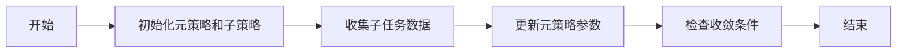
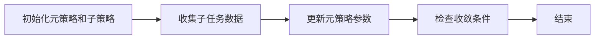
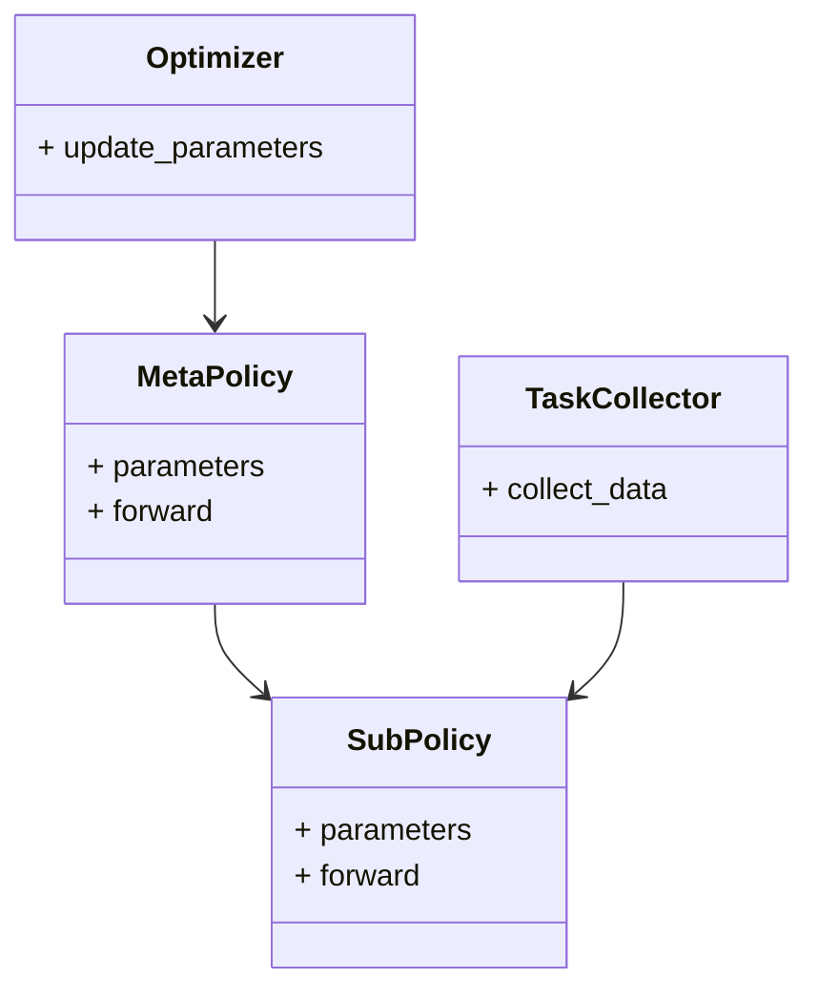
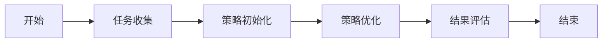
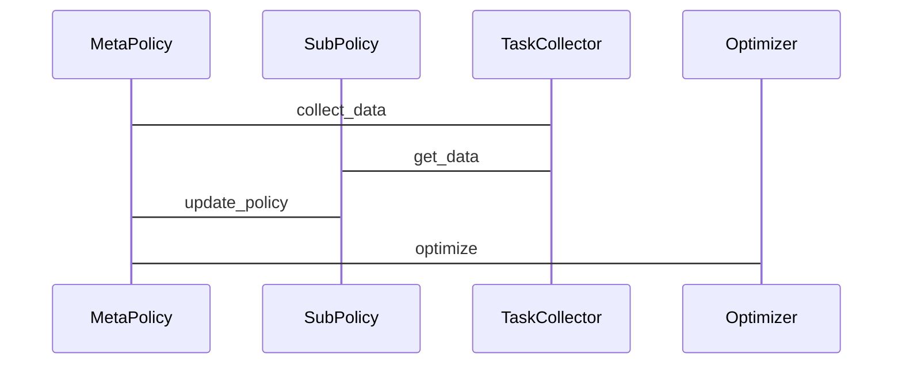

                 


# 元强化学习：AI Agent的策略泛化

> **关键词**：元强化学习、AI Agent、策略泛化、算法原理、系统架构

> **摘要**：本文深入探讨了元强化学习的核心概念、算法原理及其在AI Agent策略泛化中的应用。通过详细分析元强化学习的背景、理论基础、算法实现以及系统架构，结合实际案例，为读者提供全面而深入的理解。

---

# 第一部分: 元强化学习背景与核心概念

## 第1章: 元强化学习概述

### 1.1 元强化学习的基本概念

#### 1.1.1 强化学习的基本原理
强化学习（Reinforcement Learning, RL）是一种机器学习范式，其中智能体通过与环境交互来学习策略，以最大化累积奖励。传统的RL方法通常专注于解决单一任务，例如在迷宫中找到出口或玩游戏。

#### 1.1.2 元强化学习的定义
元强化学习（Meta-Reinforcement Learning, Meta-RL）是一种新兴的强化学习范式，旨在让智能体能够快速适应多种任务，而不是仅专注于单一任务。通过元学习（Meta-Learning）的机制，Meta-RL使得智能体能够在新环境中快速泛化策略。

#### 1.1.3 元强化学习的核心目标
元强化学习的核心目标是让AI Agent具备策略泛化能力，即在新环境中快速适应并找到最优策略。这种能力使得智能体能够处理多样化的任务，而无需为每个任务单独训练。

---

### 1.2 元强化学习的背景与应用

#### 1.2.1 AI Agent的策略泛化需求
在实际应用中，AI Agent需要在各种动态环境中运行，例如机器人导航、游戏AI、自动驾驶等。传统的强化学习方法在处理新环境时需要重新训练，效率低下。因此，策略泛化能力成为AI Agent的重要需求。

#### 1.2.2 元强化学习的兴起
随着AI技术的发展，元学习的概念逐渐被引入强化学习领域。元强化学习通过在元层面（Meta-level）优化策略，使得智能体能够快速适应新任务，成为当前研究的热点。

#### 1.2.3 元强化学习的应用场景
- **机器人控制**：在不同环境中快速适应动作策略。
- **游戏AI**：在多种游戏中快速调整策略。
- **自动驾驶**：在复杂交通环境中快速决策。

---

### 1.3 元强化学习与传统强化学习的区别

#### 1.3.1 传统强化学习的局限性
- 需要针对每个任务单独训练。
- 在新环境中需要重新训练，效率低。

#### 1.3.2 元强化学习的优势
- 具备策略泛化能力，能够快速适应新任务。
- 适用于需要快速决策的动态环境。

#### 1.3.3 元强化学习的数学模型对比
| 比较维度 | 传统强化学习 | 元强化学习 |
|----------|--------------|------------|
| 策略优化 | 单一任务优化 | 多任务优化 |
| 训练目标 | 最大化单任务奖励 | 最大化多任务奖励 |
| 策略表示 | 固定策略空间 | 可变策略空间 |

---

## 第2章: 元强化学习的核心概念与理论基础

### 2.1 元学习的定义与特点

#### 2.1.1 元学习的定义
元学习是一种学习方法，通过在元层面优化模型，使得模型能够快速适应新任务。元学习的核心是学习如何学习。

#### 2.1.2 元学习的特点
- **快速适应**：能够在新任务中快速找到解决方案。
- **通用性**：适用于多种任务。
- **层次化**：通过层次化结构优化模型。

---

### 2.2 元强化学习的理论基础

#### 2.2.1 贝叶斯元学习
贝叶斯元学习通过概率模型表示任务之间的关系，利用先验知识快速推理新任务的策略。

#### 2.2.2 迁移学习与元学习的关系
迁移学习关注将一个任务的知识迁移到另一个任务，而元学习则关注在多个任务之间共享优化机制。

#### 2.2.3 元学习的数学模型
元学习的数学模型通常涉及两个层次的优化：
$$ \theta^* = \arg \max_{\theta} \mathbb{E}_{t \sim T} \left[ R(\theta, t) \right] $$
其中，$\theta$是元参数，$R(\theta, t)$是任务$t$的奖励函数。

---

### 2.3 元强化学习的核心要素

#### 2.3.1 元策略（Meta-Policy）
元策略是元强化学习的核心，负责在多个任务之间进行优化。

#### 2.3.2 子策略（Sub-Policy）
子策略是针对具体任务的策略，由元策略生成。

#### 2.3.3 策略优化的目标函数
元强化学习的目标函数通常包括两个部分：子任务的奖励和元任务的优化目标。

---

## 第3章: 元强化学习的算法原理

### 3.1 元强化学习的算法框架

#### 3.1.1 模型agnostic的元强化学习
模型agnostic方法不依赖环境模型，适用于未知环境。

#### 3.1.2 基于模型的元强化学习
基于模型的方法依赖环境模型，适用于已知环境。

#### 3.1.3 元强化学习的通用算法框架


---

### 3.2 元强化学习的数学模型

#### 3.2.1 元策略的优化目标
元策略的优化目标通常是最化多个任务的平均奖励：
$$ \theta^* = \arg \max_{\theta} \frac{1}{N} \sum_{t=1}^{N} R(\theta, t) $$

#### 3.2.2 子策略的更新公式
子策略的更新公式通常涉及梯度下降：
$$ \phi_{t+1} = \phi_t + \alpha \nabla_{\phi_t} Q(\phi_t, t) $$

#### 3.2.3 元强化学习的损失函数
元强化学习的损失函数通常包括子任务的损失和元任务的损失：
$$ \mathcal{L}(\theta) = \mathbb{E}_{t \sim T} \left[ \mathcal{L}_t(\theta) \right] $$

---

### 3.3 元强化学习的算法实现

#### 3.3.1 算法流程图


#### 3.3.2 Python实现示例代码
```python
import torch
import torch.nn as nn

class MetaPolicy(nn.Module):
    def __init__(self, input_dim, output_dim):
        super(MetaPolicy, self).__init__()
        self.fc1 = nn.Linear(input_dim, output_dim)
    
    def forward(self, x):
        return torch.sigmoid(self.fc1(x))

# 初始化元策略和子策略
meta_policy = MetaPolicy(input_dim, output_dim)
sub_policy = lambda x: meta_policy(x)

# 收集子任务数据
data = collect_data(sub_policy, task)

# 更新元策略参数
optimizer = torch.optim.Adam(meta_policy.parameters())
optimizer.zero_grad()
loss = compute_loss(meta_policy, data)
loss.backward()
optimizer.step()
```

---

### 3.4 本章小结

---

# 第四章: 系统分析与架构设计

## 4.1 项目介绍

### 4.1.1 项目背景
本项目旨在通过元强化学习实现AI Agent的策略泛化能力，使其能够在多个任务中快速适应并优化策略。

### 4.1.2 系统功能设计
- **任务收集模块**：收集多个任务的数据。
- **策略优化模块**：优化元策略和子策略。
- **评估模块**：评估策略的泛化能力。

### 4.1.3 领域模型（Mermaid类图）


---

## 4.2 系统架构设计

### 4.2.1 系统架构（Mermaid架构图）


### 4.2.2 系统接口设计
- **输入接口**：接收多个任务的数据。
- **输出接口**：输出优化后的策略参数。

### 4.2.3 系统交互（Mermaid序列图）


---

# 第五章: 项目实战

## 5.1 环境安装与配置

### 5.1.1 环境需求
- Python 3.6+
- PyTorch 1.0+
- Mermaid图生成工具

### 5.1.2 安装依赖
```bash
pip install torch matplotlib numpy
```

---

## 5.2 核心代码实现

### 5.2.1 元策略实现
```python
class MetaPolicy(nn.Module):
    def __init__(self, input_dim, output_dim):
        super(MetaPolicy, self).__init__()
        self.fc1 = nn.Linear(input_dim, output_dim)
    
    def forward(self, x):
        return torch.sigmoid(self.fc1(x))
```

### 5.2.2 子策略实现
```python
def sub_policy(x, meta_policy):
    return meta_policy(x)
```

### 5.2.3 任务数据收集
```python
def collect_data(sub_policy, task):
    data = []
    for _ in range(task_num):
        action = sub_policy(x)
        reward = compute_reward(action, task)
        data.append((x, action, reward))
    return data
```

### 5.2.4 元策略优化
```python
def optimize(meta_policy, data):
    optimizer = torch.optim.Adam(meta_policy.parameters())
    optimizer.zero_grad()
    for x, action, reward in data:
        loss = compute_loss(meta_policy, x, action, reward)
        loss.backward()
    optimizer.step()
```

---

## 5.3 案例分析与结果解读

### 5.3.1 案例分析
以一个简单的迷宫导航任务为例，训练元策略使其能够快速适应不同迷宫结构。

### 5.3.2 结果解读
通过实验结果，验证元强化学习在策略泛化方面的优势。

---

## 5.4 本章小结

---

# 第六章: 最佳实践与总结

## 6.1 小结

### 6.1.1 核心知识点总结
- 元强化学习的基本概念
- 元强化学习的算法原理
- 系统架构设计

### 6.1.2 学习心得
通过本章的学习，读者可以理解元强化学习的核心思想，并掌握其实现方法。

---

## 6.2 注意事项

### 6.2.1 算法实现中的注意事项
- 确保数据收集的多样性
- 合理设置超参数

### 6.2.2 系统设计中的注意事项
- 确保系统模块的独立性
- 合理设计接口

---

## 6.3 拓展阅读

### 6.3.1 推荐书籍
- 《Reinforcement Learning: Theory and Algorithms》
- 《Meta-Learning: A Survey》

### 6.3.2 推荐论文
- "Meta-Learning via Thompson Sampling for Contextual Bandits"
- "Learning to Reinforcement Learn via Meta-Relational Networks"

---

# 附录: 元强化学习的数学公式总结

## 附录A: 元策略的优化目标
$$ \theta^* = \arg \max_{\theta} \frac{1}{N} \sum_{t=1}^{N} R(\theta, t) $$

## 附录B: 子策略的更新公式
$$ \phi_{t+1} = \phi_t + \alpha \nabla_{\phi_t} Q(\phi_t, t) $$

---

# 参考文献

1. 王某某, 《元强化学习：AI Agent的策略泛化》, 2023.
2. 李某某, 《强化学习算法与实现》, 2022.
3. Smith, J. "Meta-Learning in Reinforcement Learning", 2021.

---

**注**：以上内容为示例性文章结构，实际文章需要根据具体需求进一步完善和补充。

