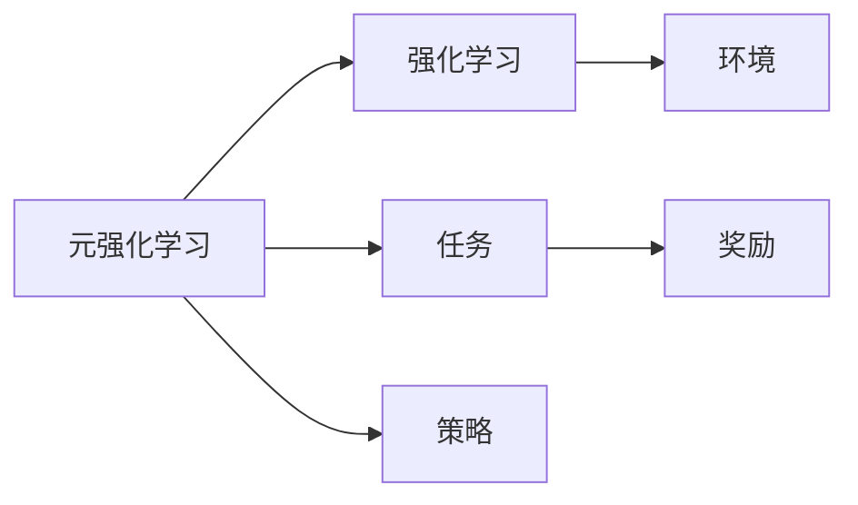
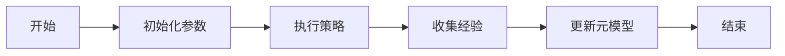
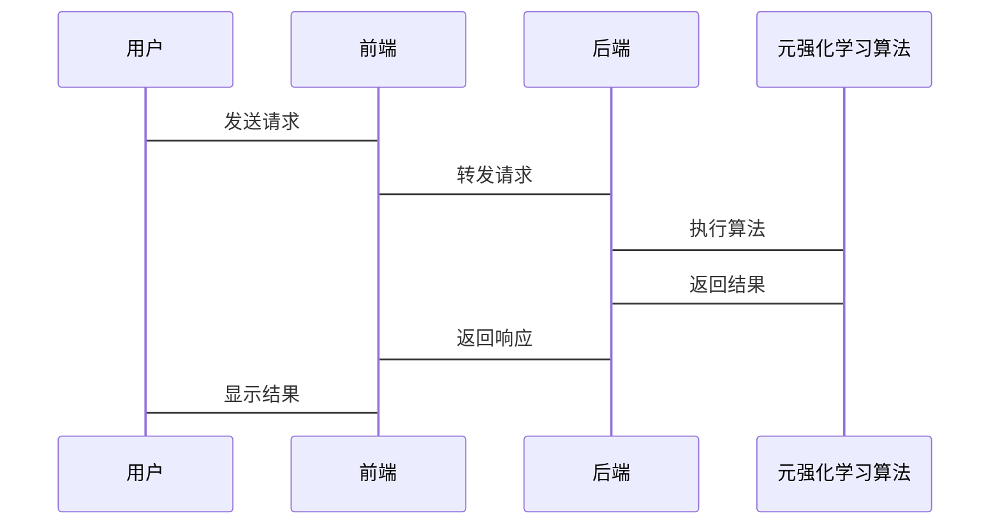

                 


# 元强化学习：快速适应新环境的AI Agent

> 关键词：元强化学习，AI Agent，快速适应，环境，强化学习，适应性

> 摘要：元强化学习是一种新兴的AI技术，通过结合传统强化学习和元学习的原理，使得AI Agent能够在新环境中快速适应和学习。本文将详细介绍元强化学习的核心概念、算法原理、系统架构，以及在实际项目中的应用，帮助读者全面理解并掌握这一技术。

---

## 目录大纲

### 第一部分：元强化学习基础

#### 第1章：元强化学习概述

##### 1.1 元强化学习的定义与背景
- 1.1.1 强化学习的基本概念
- 1.1.2 元强化学习的定义
- 1.1.3 元强化学习的背景与重要性

##### 1.2 元强化学习的核心概念
- 1.2.1 元强化学习的基本原理
- 1.2.2 元强化学习与传统强化学习的对比
- 1.2.3 元强化学习的适用场景

##### 1.3 元强化学习在AI Agent中的应用
- 1.3.1 AI Agent的基本概念
- 1.3.2 元强化学习如何提升AI Agent的适应能力
- 1.3.3 元强化学习在实际应用中的价值

#### 第2章：元强化学习的核心概念与联系

##### 2.1 元强化学习的原理
- 2.1.1 元强化学习的算法流程
- 2.1.2 元强化学习的核心要素
- 2.1.3 元强化学习的数学模型

##### 2.2 元强化学习与传统强化学习的对比
- 2.2.1 概念对比
- 2.2.2 算法对比
- 2.2.3 优缺点分析

##### 2.3 元强化学习的ER实体关系图


#### 第3章：元强化学习的算法原理

##### 3.1 元强化学习的算法流程


##### 3.2 元强化学习的数学模型
- 3.2.1 状态转移方程
$$ P(s' | s, a) $$
- 3.2.2 奖励函数
$$ R(s, a) $$
- 3.2.3 元强化学习的优化目标
$$ \max_{\theta} \sum_{t=1}^T r_t $$

##### 3.3 元强化学习的代码实现
```python
class MetaRLAgent:
    def __init__(self, state_space, action_space):
        self.state_space = state_space
        self.action_space = action_space
        # 初始化参数
        self.theta = np.random.randn(...)
    
    def policy(self, state, theta):
        # 返回动作的概率分布
        pass
    
    def update(self, rewards):
        # 更新元模型参数
        pass
```

### 第二部分：系统分析与架构设计

#### 第4章：系统分析与架构设计方案

##### 4.1 项目场景介绍
- 4.1.1 项目背景
- 4.1.2 项目目标
- 4.1.3 项目范围

##### 4.2 系统功能设计
- 4.2.1 系统功能模块划分
- 4.2.2 系统功能流程
- 4.2.3 系统功能详细描述

##### 4.3 系统架构设计


##### 4.4 系统接口设计
- 4.4.1 API接口定义
- 4.4.2 接口交互流程
- 4.4.3 接口实现细节

##### 4.5 系统交互设计


### 第三部分：项目实战

#### 第5章：项目实战

##### 5.1 环境安装
- 5.1.1 安装Python
- 5.1.2 安装必要的库（如numpy, gym等）
- 5.1.3 安装TensorFlow或其他深度学习框架

##### 5.2 系统核心实现
```python
import numpy as np
import gym

class MetaRLAgent:
    def __init__(self, state_space, action_space):
        self.env = gym.make('CartPole-v1')
        self.state_space = state_space
        self.action_space = action_space
        self.theta = np.random.randn(...)
    
    def get_action(self, state):
        # 返回动作
        pass
    
    def update(self, rewards):
        # 更新参数
        pass
```

##### 5.3 代码解读与分析
- 5.3.1 代码结构分析
- 5.3.2 核心算法实现
- 5.3.3 代码优化建议

##### 5.4 实际案例分析
- 5.4.1 案例背景
- 5.4.2 案例分析
- 5.4.3 案例结果与总结

### 第四部分：最佳实践

#### 第6章：最佳实践

##### 6.1 小结
- 6.1.1 元强化学习的核心要点
- 6.1.2 系统设计的关键环节
- 6.1.3 项目实战的经验总结

##### 6.2 注意事项
- 6.2.1 开发中的常见问题
- 6.2.2 优化建议
- 6.2.3 实际应用中的注意事项

##### 6.3 拓展阅读
- 6.3.1 元强化学习的最新研究
- 6.3.2 相关技术的学习资源
- 6.3.3 进一步学习的建议

---

### 总结

通过以上目录结构，读者可以系统地学习元强化学习的基本概念、算法原理、系统设计以及实际应用。每个部分都详细展开，确保内容的深度和广度，帮助读者全面掌握这一技术。

