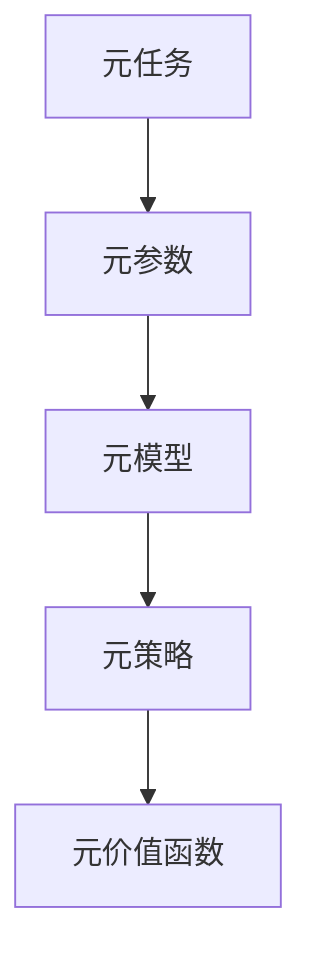
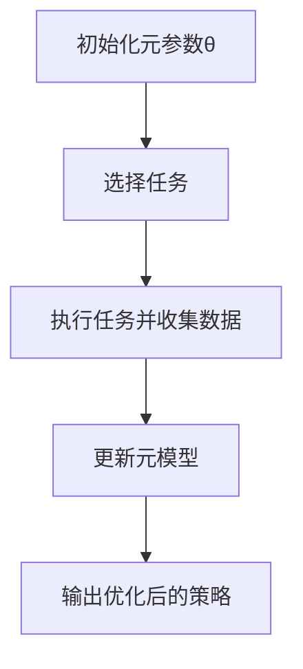

                 


# 元强化学习：提高AI Agent在新环境中的适应能力

## 关键词：元强化学习, 强化学习, 适应性, AI Agent, 环境迁移, 多任务学习

## 摘要：  
元强化学习（Meta-Reinforcement Learning）是一种新兴的机器学习范式，旨在提高AI代理在新环境中的快速适应能力。通过结合元学习和强化学习的核心思想，元强化学习能够在有限的交互中，快速掌握新任务的策略，从而显著提升AI Agent在动态环境中的灵活性和适应性。本文将从背景、核心概念、算法原理、系统设计、项目实战到最佳实践，全面解析元强化学习的核心思想和实际应用。

---

# 第一部分：元强化学习背景与核心概念

## 第1章：元强化学习的背景与问题背景

### 1.1 元强化学习的背景

#### 1.1.1 传统强化学习的局限性  
传统的强化学习（Reinforcement Learning, RL）通过试错机制与环境交互，逐步优化策略以最大化累积奖励。然而，传统RL在面对新任务或新环境时，需要从头开始学习，效率较低。例如，一个经过训练的机器人在新环境中完成任务时，可能需要重新学习数小时甚至数天的交互经验。

#### 1.1.2 元强化学习的提出与意义  
元强化学习（Meta-Reinforcement Learning, Meta-RL）通过结合元学习（Meta-Learning）的思想，允许AI代理在新环境中快速适应并掌握任务策略。Meta-RL的目标是通过在多个任务或环境中预训练，使得代理能够在新环境中快速调整其策略，从而减少对新环境的探索时间。

#### 1.1.3 元强化学习的应用场景  
元强化学习在多个领域展现出潜力，例如：  
- **机器人控制**：快速适应新环境中的任务，如家庭服务机器人在不同房间执行任务。  
- **游戏AI**：在新游戏中快速掌握策略，减少训练时间。  
- **智能推荐系统**：快速适应用户行为的变化，提升推荐效率。  

---

### 1.2 元强化学习的核心概念

#### 1.2.1 元任务与元参数  
在Meta-RL中，元任务（Meta-Task）指的是用于训练代理的多个任务或环境。元参数（Meta-Parameter）是对多个任务进行优化的参数，用于快速调整代理在新任务中的策略。  

#### 1.2.2 元策略与元价值函数  
元策略（Meta-Policy）是一个参数化函数，用于根据当前任务的特征快速生成策略。元价值函数（Meta-Value Function）则用于评估状态和动作对后续任务的影响。

#### 1.2.3 元强化学习与迁移学习的联系  
元强化学习与迁移学习（Transfer Learning）有相似之处，但侧重点不同。迁移学习关注将一个任务的知识迁移到另一个任务，而元强化学习关注通过预训练快速适应新任务。

---

## 第2章：元强化学习的核心概念与联系

### 2.1 元强化学习的核心概念

#### 2.1.1 元任务的定义与特点  
元任务是Meta-RL中的基础单位，包括多个任务或环境。通过在多个任务上预训练，代理可以学习到适用于新任务的通用策略。

#### 2.1.2 元参数的作用  
元参数用于快速调整代理在新任务中的策略。通过优化元参数，代理可以在新任务中快速找到最优策略，减少探索时间。

#### 2.1.3 元策略的机制  
元策略通过参数化函数的形式，根据当前任务的特征生成具体的策略。这使得代理能够在新任务中快速调整其行为。

---

## 第3章：元强化学习的核心要素对比

### 3.1 元强化学习的核心要素对比

#### 3.1.1 元参数与传统参数的对比  
| 对比维度 | 元参数 | 传统参数 |
|----------|--------|----------|
| 作用 | 跨任务优化 | 单任务优化 |
| 灵活性 | 高 | 低 |
| 训练目标 | 快速适应新任务 | 优化单任务性能 |

#### 3.1.2 元策略与传统策略的对比  
| 对比维度 | 元策略 | 传统策略 |
|----------|--------|----------|
| 参数共享 | 是 | 否 |
| 适应性 | 高 | 低 |
| 适用场景 | 新环境或任务 | 稳定环境或任务 |

---

## 第4章：ER实体关系图架构

### 4.1 ER实体关系图  


---

# 第二部分：元强化学习算法原理

## 第5章：元强化学习算法原理

### 5.1 元强化学习算法概述

#### 5.1.1 元强化学习算法的分类  
元强化学习算法主要分为两类：基于模型的Meta-RL和无模型的Meta-RL。  
- 基于模型的Meta-RL：通过学习环境的动态模型，快速调整策略。  
- 无模型的Meta-RL：直接优化策略，无需环境模型。  

#### 5.1.2 元强化学习算法的核心思想  
通过在多个任务上预训练，优化元参数，使得代理能够在新任务中快速调整策略。

### 5.2 元强化学习算法的数学模型

#### 5.2.1 元参数的更新公式  
元参数的更新通常采用梯度下降方法：  
$$ \theta_{t+1} = \theta_t + \alpha (\nabla_{\theta} L) $$  
其中，$\theta$ 表示元参数，$\alpha$ 表示学习率，$L$ 表示损失函数。

#### 5.2.2 元策略的更新公式  
元策略通常是一个参数化函数，用于生成具体任务的策略：  
$$ \pi_{\theta}(a|s) = \text{softmax}(\theta s + b) $$  
其中，$\theta$ 表示元参数，$s$ 表示状态，$a$ 表示动作。

#### 5.2.3 元价值函数的更新公式  
元价值函数用于评估状态的价值：  
$$ V_{\phi}(s) = \text{max}_a Q_{\phi}(s,a) $$  
其中，$\phi$ 表示元价值函数的参数，$Q$ 表示Q值函数。

### 5.3 元强化学习算法的流程图



---

## 第6章：元强化学习算法的Python实现

### 6.1 环境安装与依赖

```bash
pip install gym numpy torch
```

### 6.2 核心代码实现

```python
import gym
import torch
import torch.nn as nn

class MetaRLAgent:
    def __init__(self, state_space, action_space):
        self.state_space = state_space
        self.action_space = action_space
        self.theta = nn.Parameter(torch.randn(1, state_space))  # 元参数
        self.phi = nn.Parameter(torch.randn(1, state_space))    # 元价值函数参数

    def get_policy(self, state):
        # 根据元参数生成具体策略
        logits = torch.mm(state.unsqueeze(0), self.theta)  # 输出形状：(1, action_space)
        action_probs = torch.softmax(logits, dim=-1)
        return action_probs

    def update_meta_model(self, loss):
        # 更新元模型参数
        self.theta.grad = None
        loss.backward()
        torch.optim.SGD([self.theta], lr=0.01).step()

# 初始化环境
env = gym.make('CartPole-v0')
agent = MetaRLAgent(env.observation_space.shape[0], env.action_space.n)

# 训练过程
for episode in range(1000):
    state = env.reset()
    done = False
    while not done:
        action_probs = agent.get_policy(state)
        action = torch.multinomial(action_probs, 1).item()
        next_state, reward, done, _ = env.step(action)
        # 更新元模型
        agent.update_meta_model(calculate_loss(next_state, reward))
```

---

## 第7章：系统分析与架构设计方案

### 7.1 系统分析

#### 7.1.1 问题场景介绍  
假设我们有一个AI代理，需要在多个环境中执行任务。每个环境都有不同的动态特性，代理需要快速适应这些环境。

#### 7.1.2 系统功能设计  
- **任务选择模块**：根据当前环境选择合适的任务。  
- **策略生成模块**：根据元参数生成具体任务的策略。  
- **元模型优化模块**：通过多个任务的反馈优化元参数。

---

## 第8章：项目实战

### 8.1 环境安装与代码实现

#### 8.1.1 环境安装  
```bash
pip install gym numpy torch
```

#### 8.1.2 核心代码实现  
```python
import gym
import torch
import torch.nn as nn

class MetaRLAgent:
    def __init__(self, state_space, action_space):
        self.state_space = state_space
        self.action_space = action_space
        self.theta = nn.Parameter(torch.randn(1, state_space))  # 元参数
        self.phi = nn.Parameter(torch.randn(1, state_space))    # 元价值函数参数

    def get_policy(self, state):
        # 根据元参数生成具体策略
        logits = torch.mm(state.unsqueeze(0), self.theta)  # 输出形状：(1, action_space)
        action_probs = torch.softmax(logits, dim=-1)
        return action_probs

    def update_meta_model(self, loss):
        # 更新元模型参数
        self.theta.grad = None
        loss.backward()
        torch.optim.SGD([self.theta], lr=0.01).step()

# 初始化环境
env = gym.make('CartPole-v0')
agent = MetaRLAgent(env.observation_space.shape[0], env.action_space.n)

# 训练过程
for episode in range(1000):
    state = env.reset()
    done = False
    while not done:
        action_probs = agent.get_policy(state)
        action = torch.multinomial(action_probs, 1).item()
        next_state, reward, done, _ = env.step(action)
        # 更新元模型
        agent.update_meta_model(calculate_loss(next_state, reward))
```

---

## 第9章：最佳实践与注意事项

### 9.1 最佳实践

#### 9.1.1 系统设计建议  
- 确保系统具有良好的扩展性，能够支持多个任务和环境。  
- 在实际应用中，建议结合迁移学习和多任务学习的思想，进一步提升系统的适应能力。  

#### 9.1.2 代码实现建议  
- 在实现元强化学习算法时，建议使用高效的深度学习框架（如PyTorch），并结合GPU加速。  
- 在训练过程中，建议设置合理的超参数（如学习率、批量大小等），以确保模型收敛。

### 9.2 小结

#### 9.2.1 核心要点总结  
- 元强化学习通过结合元学习和强化学习的思想，能够在新环境中快速适应并掌握任务策略。  
- 元参数和元策略是实现快速适应的核心要素。  

#### 9.2.2 未来展望  
- 元强化学习在动态环境和多任务学习中具有广阔的应用前景。  
- 随着算法的不断优化和硬件性能的提升，元强化学习将在更多领域得到广泛应用。

---

## 第10章：结论与展望

### 10.1 结论  
元强化学习通过预训练和元参数的优化，显著提升了AI代理在新环境中的适应能力。其核心思想和算法框架为解决动态环境下的任务适应问题提供了新的思路。

### 10.2 未来展望  
随着深度学习和强化学习技术的不断发展，元强化学习将在更多领域展现出其潜力。未来的研究方向可能包括更高效的算法设计、多任务学习的结合，以及在实际应用中的进一步探索。

---

# 结语

元强化学习作为一种新兴的机器学习范式，正在逐步改变AI代理在复杂动态环境中的适应方式。通过本文的深入探讨，读者可以更好地理解元强化学习的核心思想和实际应用。希望本文能够为相关领域的研究和实践提供有价值的参考和启发。

