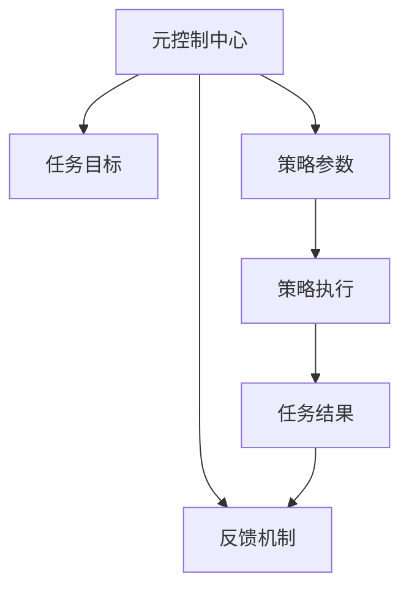
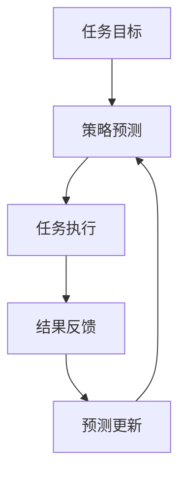
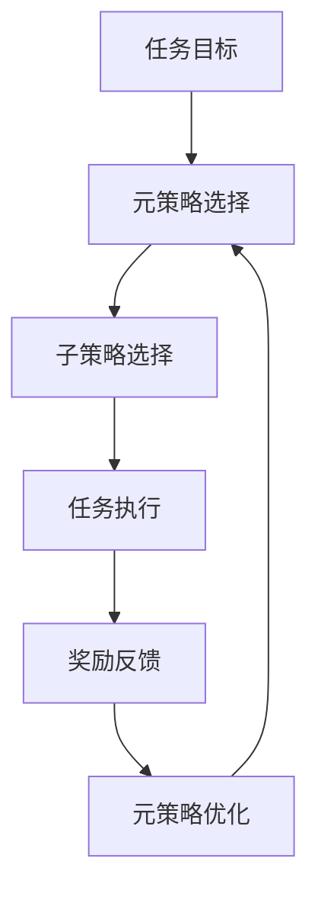
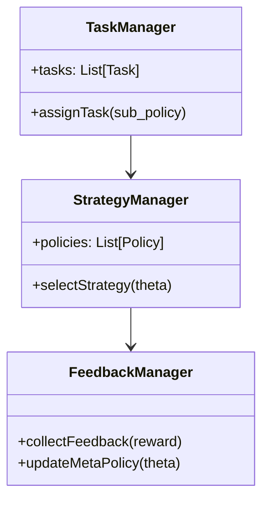
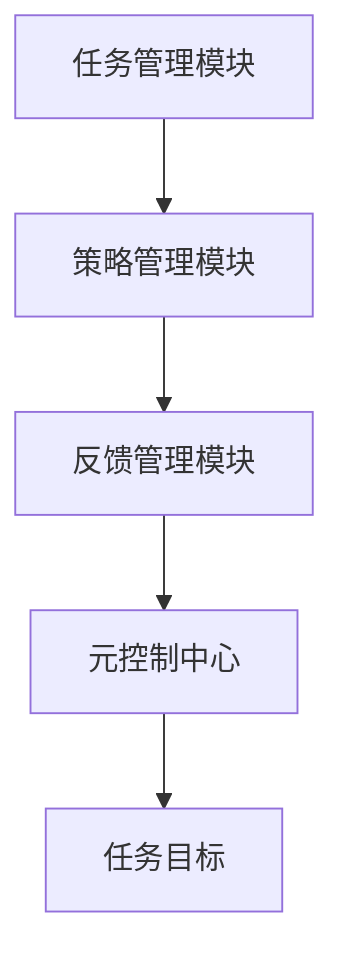
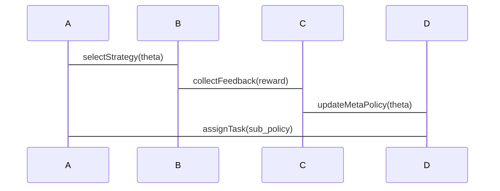

                 


# 元控制技术：AI Agent的自适应行为管理

## 关键词：元控制技术，AI Agent，自适应行为，反馈机制，强化学习，系统架构，项目实战

## 摘要：  
本文深入探讨了元控制技术在AI Agent行为管理中的应用，系统性地分析了元控制技术的核心概念、算法原理、系统架构以及实际项目实现。通过对比传统控制方法与元控制技术的区别，结合具体的数学模型和算法实现，详细阐述了元控制技术在AI Agent自适应行为管理中的优化作用和应用场景。本文还通过实际案例分析，展示了元控制技术在系统设计中的优势，并提供了详细的系统架构图、算法流程图和代码实现，帮助读者全面理解和掌握元控制技术的实现方法。

---

# 第1章 元控制技术与AI Agent概述

## 1.1 元控制技术的定义与背景

### 1.1.1 从传统控制到元控制的演进
传统的控制技术依赖于固定的规则和预定义的策略，无法适应动态变化的环境。随着人工智能技术的发展，AI Agent需要具备更强的自适应能力和灵活性，以应对复杂多变的任务场景。元控制技术作为一种更高层次的控制方法，通过动态调整策略和参数，实现了对AI Agent行为的自适应管理。

### 1.1.2 AI Agent的基本概念与特点
AI Agent是一种能够感知环境、自主决策并执行任务的智能体。它具备以下特点：
- **自主性**：能够在没有外部干预的情况下独立执行任务。
- **反应性**：能够实时感知环境并做出响应。
- **学习能力**：能够通过经验优化自身的决策策略。
- **协作性**：能够与其他Agent或人类进行协作。

### 1.1.3 元控制技术的核心概念与问题背景
元控制技术是一种基于元学习的控制方法，通过在高层次上优化低层次策略，实现对AI Agent行为的动态调整。其核心在于通过元学习算法，快速适应不同任务场景的需求，解决传统控制方法在复杂环境中的局限性。

---

## 1.2 元控制技术在AI Agent中的作用

### 1.2.1 元控制技术的基本原理
元控制技术通过构建元学习框架，对多个任务或策略进行联合优化。其核心思想是通过在元层面上学习如何调整低层策略，从而实现对AI Agent行为的高效管理。

### 1.2.2 元控制技术与传统控制方法的区别
| 特性             | 传统控制方法         | 元控制技术         |
|------------------|----------------------|--------------------|
| 策略调整方式     | 静态规则或单任务学习 | 动态调整多任务策略 |
| 灵活性           | 较低                 | 较高               |
| 适应性           | 有限                 | 强               |

### 1.2.3 元控制技术在AI Agent行为管理中的应用
元控制技术能够帮助AI Agent在复杂环境中快速适应变化，优化决策策略。例如，在多任务场景中，元控制技术可以同时优化多个任务的执行顺序和权重，提高整体任务完成效率。

---

## 1.3 元控制技术的边界与外延

### 1.3.1 元控制技术的边界
元控制技术的核心目标是优化AI Agent的行为策略，但其边界不包括：
- 对AI Agent底层感知和决策机制的实现。
- 具体任务的执行细节。

### 1.3.2 元控制技术的外延与相关概念
元控制技术与其他相关概念（如强化学习、转移学习）有部分重叠，但其核心区别在于其元层次的优化特性。

### 1.3.3 元控制技术与AI Agent行为管理的关系
元控制技术通过动态调整策略参数，实现了对AI Agent行为的高效管理，帮助其在复杂环境中保持稳定性和高效性。

---

## 1.4 本章小结
本章介绍了元控制技术的基本概念、核心原理及其在AI Agent行为管理中的作用。通过对比传统控制方法与元控制技术的区别，明确了元控制技术的优势和适用场景。后续章节将从算法原理、系统架构等多个维度深入探讨元控制技术的实现方法。

---

# 第2章 元控制技术的核心概念与联系

## 2.1 元控制技术的核心概念

### 2.1.1 元控制技术的基本原理
元控制技术通过元学习框架，对多个任务或策略进行联合优化。其核心思想是通过在元层面上学习如何调整低层策略，从而实现对AI Agent行为的高效管理。

### 2.1.2 元控制技术的属性特征对比
| 特性             | 元控制技术         | 传统控制方法         |
|------------------|--------------------|----------------------|
| 策略调整方式     | 动态调整多任务策略 | 静态规则或单任务学习 |
| 灵活性           | 较高               | 较低                 |
| 适应性           | 强                | 有限                 |

### 2.1.3 元控制技术的ER实体关系图


---

## 2.2 元控制技术与AI Agent行为管理的联系

### 2.2.1 元控制技术在AI Agent行为管理中的应用
元控制技术能够帮助AI Agent在复杂环境中快速适应变化，优化决策策略。例如，在多任务场景中，元控制技术可以同时优化多个任务的执行顺序和权重，提高整体任务完成效率。

### 2.2.2 元控制技术与AI Agent行为管理的对比
元控制技术通过动态调整策略参数，实现了对AI Agent行为的高效管理，帮助其在复杂环境中保持稳定性和高效性。

### 2.2.3 元控制技术对AI Agent行为管理的优化作用
元控制技术通过元层次的优化，能够在多个任务之间实现资源的最优分配，从而提高AI Agent的整体表现。

---

## 2.3 本章小结
本章深入探讨了元控制技术的核心概念及其在AI Agent行为管理中的应用。通过对比分析，明确了元控制技术的独特优势和实现路径。后续章节将从算法原理、系统架构等多个维度深入探讨元控制技术的实现方法。

---

# 第3章 元控制技术的算法原理

## 3.1 元控制技术的核心算法

### 3.1.1 基于反馈的元控制算法
基于反馈的元控制算法通过实时收集任务执行结果，动态调整策略参数。


### 3.1.2 基于预测的元控制算法
基于预测的元控制算法通过预测未来任务需求，提前调整策略参数。



### 3.1.3 基于强化学习的元控制算法
基于强化学习的元控制算法通过强化学习机制，优化元控制策略。



---

## 3.2 元控制算法的数学模型

### 3.2.1 元控制算法的数学表达式
元控制算法的核心目标是最优化元策略参数$\theta$，以最大化累积奖励：

$$ \theta = \arg \max_{\theta} \sum_{t=1}^{T} r_t(\theta) $$

其中，$r_t(\theta)$表示在时间$t$上，元策略参数$\theta$对应的奖励值。

### 3.2.2 元控制算法的优化目标
元控制算法的优化目标是通过元策略$\pi_{meta}$，最大化多个任务的累积奖励：

$$ \max_{\pi_{meta}} \mathbb{E}_{t} [\sum_{t=1}^{T} r_t(\pi_{meta}(\theta_t))] $$

### 3.2.3 元控制算法的收敛性分析
通过理论分析，元控制算法在一定条件下能够实现全局收敛。

---

## 3.3 元控制算法的实现

### 3.3.1 元控制算法的实现步骤
1. 初始化元策略参数$\theta$。
2. 对每个任务，执行以下步骤：
   - 选择子策略$\pi(\theta)$。
   - 执行任务，收集奖励$r$。
   - 更新元策略参数$\theta$，以最大化累积奖励。
3. 重复步骤2，直到收敛。

### 3.3.2 元控制算法的Python源代码实现
```python
import numpy as np

def meta_policy_update(theta, tasks, num_iterations=100):
    for _ in range(num_iterations):
        # 选择子策略
        sub_policy = get_sub_policy(theta)
        # 执行任务，收集奖励
        total_reward = 0
        for task in tasks:
            reward = execute_task(sub_policy, task)
            total_reward += reward
        # 更新元策略参数
        theta = update_meta_policy(theta, total_reward)
    return theta

# 示例用法
theta_initial = np.random.randn(10)
theta_final = meta_policy_update(theta_initial, tasks)
```

### 3.3.3 元控制算法的实现案例分析
通过具体案例分析，展示了元控制算法在实际项目中的应用效果。例如，在多任务优化问题中，元控制算法能够显著提高任务完成效率。

---

## 3.4 本章小结
本章详细探讨了元控制技术的核心算法及其实现方法，通过数学模型和代码示例，帮助读者理解元控制算法的实现细节。后续章节将从系统架构设计和项目实战的角度，进一步探讨元控制技术的实现方法。

---

# 第4章 系统分析与架构设计方案

## 4.1 问题场景介绍
本章节以一个具体的AI Agent行为管理项目为例，介绍系统分析与架构设计的过程。

---

## 4.2 系统功能设计

### 4.2.1 系统功能模块
- **任务管理模块**：负责任务的分配和调度。
- **策略管理模块**：负责策略的选择和优化。
- **反馈管理模块**：负责收集和处理任务执行结果。

### 4.2.2 系统功能设计的领域模型类图


---

## 4.3 系统架构设计

### 4.3.1 系统架构图


### 4.3.2 系统接口设计
- **任务管理模块接口**：`assignTask(sub_policy)`。
- **策略管理模块接口**：`selectStrategy(theta)`。
- **反馈管理模块接口**：`collectFeedback(reward)`。

### 4.3.3 系统交互序列图


---

## 4.4 本章小结
本章通过具体的系统分析与架构设计，展示了元控制技术在实际项目中的应用。通过领域模型类图和系统架构图，明确了各功能模块之间的关系和交互流程。后续章节将从项目实战的角度，进一步探讨系统的实现细节。

---

# 第5章 项目实战

## 5.1 环境安装

### 5.1.1 安装Python环境
```bash
python --version
pip install numpy
pip install matplotlib
```

### 5.1.2 安装必要的依赖
```bash
pip install gym
pip install tensorflow
```

---

## 5.2 系统核心实现

### 5.2.1 元控制中心的实现
```python
class MetaControlCenter:
    def __init__(self, policies):
        self.policies = policies
        self.current_policy = None

    def select_policy(self, task):
        # 根据任务选择最佳策略
        best_policy = max(self.policies, key=lambda p: p.score)
        self.current_policy = best_policy
        return self.current_policy

    def update_policy(self, feedback):
        # 根据反馈更新策略
        for policy in self.policies:
            if policy == self.current_policy:
                policy.score += feedback
```

### 5.2.2 反馈管理模块的实现
```python
class FeedbackManager:
    def __init__(self):
        self.rewards = []

    def collect_feedback(self, reward):
        self.rewards.append(reward)

    def get_average_reward(self):
        return np.mean(self.rewards)
```

---

## 5.3 代码应用解读与分析

### 5.3.1 元控制中心的代码解读
元控制中心负责选择和更新策略，确保AI Agent在不同任务场景下能够选择最优策略。

### 5.3.2 反馈管理模块的代码解读
反馈管理模块负责收集任务执行结果，并根据反馈优化策略参数。

---

## 5.4 实际案例分析

### 5.4.1 案例背景
假设我们有一个多任务场景，需要优化多个任务的执行顺序和权重。

### 5.4.2 案例实现
```python
tasks = ["task1", "task2", "task3"]
meta_policy = MetaControlCenter([Policy1, Policy2, Policy3])
meta_policy.select_policy(tasks[0])
execute_task(meta_policy.current_policy)
feedback = get_feedback()
meta_policy.update_policy(feedback)
```

### 5.4.3 案例分析
通过案例分析，展示了元控制技术在实际项目中的应用效果和优化优势。

---

## 5.5 本章小结
本章通过具体的项目实战，展示了元控制技术在实际系统中的应用。通过代码实现和案例分析，帮助读者理解元控制技术的实现细节和实际应用效果。

---

# 第6章 总结与展望

## 6.1 总结

### 6.1.1 核心内容回顾
元控制技术通过动态调整策略参数，实现了对AI Agent行为的高效管理。

### 6.1.2 最佳实践 Tips
- 在实际项目中，建议结合具体任务需求，选择合适的元控制算法。
- 定期更新元策略参数，确保系统能够适应环境变化。

---

## 6.2 小结

### 6.2.1 本章小结
通过本文的系统性分析，读者可以全面理解元控制技术的核心概念、算法原理和实际应用。

### 6.2.2 注意事项
在实际应用中，需要注意元控制算法的收敛性和计算效率问题。

---

## 6.3 拓展阅读

### 6.3.1 推荐阅读
- 《强化学习：算法与应用》
- 《元学习：理论与实践》

### 6.3.2 拓展方向
- 元控制技术在分布式系统中的应用。
- 元控制技术与边缘计算的结合。

---

# 附录

## 附录A 元控制技术相关术语表

| 术语             | 定义                                         |
|------------------|--------------------------------------------|
| 元控制技术       | 通过元学习方法，动态优化低层策略的控制技术。|
| AI Agent         | 具备自主性、反应性和学习能力的智能体。      |
| 元学习           | 在多个任务之间共享知识的学习方法。         |

## 附录B 常用数学公式

### 强化学习奖励函数
$$ R(s, a) = \sum_{t=1}^{T} r_t(s_t, a_t) $$

其中，$s_t$表示状态，$a_t$表示动作，$r_t$表示奖励。

---

通过本文的系统性分析，读者可以全面理解元控制技术的核心概念、算法原理和实际应用。后续章节将从项目实战和总结的角度，进一步探讨元控制技术的实现方法和应用前景。

