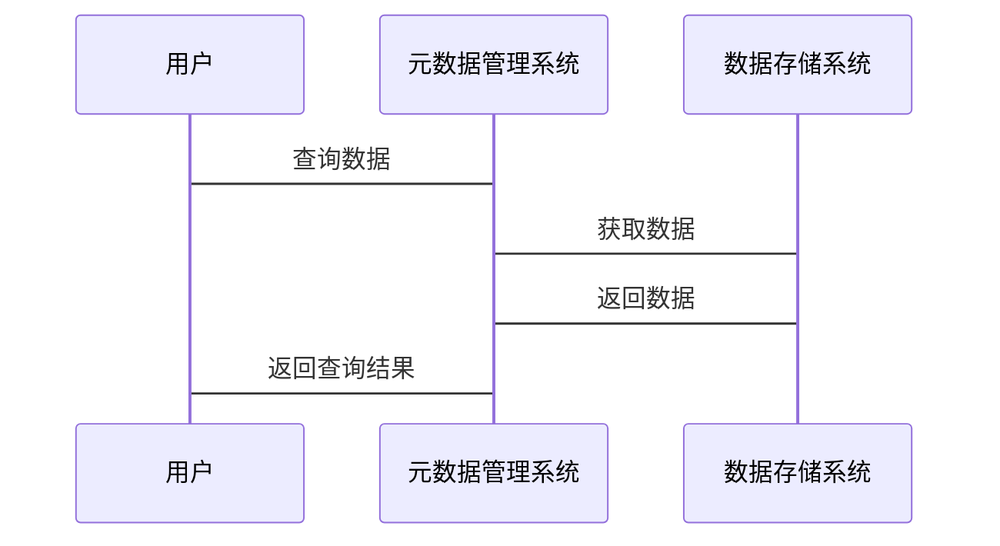

                 


# 元数据管理：组织和利用AI Agent的数据资产

## 关键词：元数据、数据资产、AI Agent、数据管理、数据治理、数据智能、机器学习

## 摘要：  
在数字化转型的今天，数据资产的重要性日益凸显，而元数据作为数据的“DNA”，在数据管理和利用中扮演着关键角色。本文深入探讨元数据管理的核心概念、算法原理、系统架构及其实现，结合AI Agent的实际应用，揭示元数据在数据资产组织与利用中的独特价值。通过理论与实践相结合的方式，本文为读者提供了一套系统化的元数据管理方法论，助力企业在AI时代更好地管理和利用数据资产。

---

## 正文

### 第一部分：元数据管理基础

#### 第1章：元数据管理概述

##### 1.1 元数据的基本概念

元数据（Metadata）是指描述数据的数据，它记录了数据的属性、来源、用途、质量、安全等信息。元数据的出现可以追溯到数据管理的早期阶段，随着数据量的爆炸式增长，元数据的重要性愈发凸显。

- **数据的“DNA”**：元数据不仅描述了数据的结构和内容，还揭示了数据的上下文信息，使数据能够被更好地理解和利用。  
- **元数据的分类**：元数据可以分为描述性元数据、结构化元数据、行为元数据等，每种类型都有其独特的应用场景。

##### 1.2 元数据管理的重要性

在AI Agent时代，元数据管理的重要性体现在以下几个方面：

- **数据治理的基础**：元数据是数据治理的核心，它帮助组织建立数据标准、确保数据质量、降低数据风险。  
- **数据资产的组织与利用**：通过元数据，AI Agent能够快速识别和定位所需的数据资产，提高数据利用效率。  
- **数据智能的支撑**：元数据为AI Agent提供了数据的上下文信息，使其能够更智能地理解和分析数据。

##### 1.3 元数据管理的目标与范围

元数据管理的目标是实现数据的全生命周期管理，确保数据的可用性、一致性和安全性。其范围涵盖数据的采集、存储、处理、分析和应用等各个阶段。

- **全生命周期管理**：从数据生成到数据归档，元数据管理贯穿数据的整个生命周期。  
- **数据资产管理**：元数据管理帮助组织识别、评估和利用数据资产，提升数据价值。  
- **数据安全与隐私保护**：元数据管理通过记录数据的访问权限、使用记录等信息，保障数据安全。

##### 1.4 元数据管理的现状与趋势

当前，元数据管理正在经历从传统数据管理向智能化数据管理的转变。随着AI、大数据和区块链等技术的快速发展，元数据管理正在向着以下方向演进：

- **智能化**：利用机器学习等技术，实现元数据的自动识别、分类和管理。  
- **分布式与去中心化**：区块链技术的应用使得元数据管理更加安全和透明。  
- **实时化**：实时元数据管理能够满足动态数据环境的需求，提升数据管理的响应速度。

---

### 第二部分：元数据管理的核心概念与联系

#### 第2章：元数据管理的核心概念

##### 2.1 元数据管理的原理

元数据管理的原理可以概括为以下几个步骤：

1. **元数据的采集**：通过数据目录、数据字典等方式，采集数据的元数据信息。  
2. **元数据的存储**：将元数据存储在元数据管理系统中，通常采用数据库或知识图谱的形式。  
3. **元数据的应用**：通过查询、分析和可视化等方式，利用元数据支持数据治理、数据资产管理和数据智能应用。

##### 2.2 元数据与数据治理的关系

数据治理是组织对数据资产进行管理、监控和优化的过程，而元数据管理是数据治理的重要组成部分。元数据在数据治理中的作用如下：

- **数据标准化**：通过元数据，组织可以建立统一的数据标准，确保数据的一致性和可比性。  
- **数据质量管理**：元数据记录了数据的来源、格式和质量信息，帮助组织识别和处理数据质量问题。  
- **数据安全与隐私保护**：元数据记录了数据的访问权限和使用记录，帮助组织保障数据安全。

##### 2.3 元数据与数据资产的关系

数据资产是指具有价值且能够为企业创造收益的数据资源。元数据在数据资产管理中的作用不可忽视：

- **数据资产评估**：通过元数据，组织可以快速评估数据资产的价值，识别高价值数据。  
- **数据资产目录化**：元数据管理帮助组织建立数据资产目录，实现数据资产的可视化管理。  
- **数据资产全生命周期管理**：元数据管理贯穿数据资产的整个生命周期，确保数据资产的高效利用和安全存储。

##### 2.4 元数据与AI Agent的关联

AI Agent是一种能够自主感知环境、执行任务的智能体。元数据在AI Agent中的应用场景包括：

- **数据发现与定位**：通过元数据，AI Agent可以快速定位所需的数据资产，提高数据利用效率。  
- **数据理解和解释**：元数据为AI Agent提供了数据的上下文信息，帮助其更好地理解和分析数据。  
- **数据治理与合规**：元数据管理确保AI Agent在使用数据时符合组织的合规要求，降低数据风险。

---

### 第三部分：元数据管理的算法原理

#### 第3章：元数据分类算法

##### 3.1 元数据分类的基本原理

元数据分类是指根据元数据的特征和属性，将其划分为不同的类别。常见的元数据分类方法包括层次分类、属性分类和聚类分析等。

- **层次分类**：将元数据按照层次结构进行分类，例如按数据类型、数据来源等。  
- **属性分类**：根据元数据的属性（如数据格式、数据用途）进行分类。  
- **聚类分析**：通过聚类算法，将具有相似特征的元数据自动分组。

##### 3.2 基于机器学习的元数据分类

机器学习是一种强大的元数据分类方法，常用的算法包括决策树、随机森林和朴素贝叶斯等。

- **决策树分类**：决策树是一种基于树状结构的分类方法，适用于元数据的层次分类。  
- **随机森林分类**：随机森林通过集成多个决策树模型，提高分类的准确性和鲁棒性。  
- **朴素贝叶斯分类**：朴素贝叶斯基于概率论，适用于元数据的属性分类。

##### 3.3 元数据分类的数学模型

元数据分类的数学模型可以通过以下公式表示：

$$ P(y|x) = \frac{P(x|y) \cdot P(y)}{P(x)} $$

其中，$P(y|x)$ 表示在给定特征 $x$ 的情况下，元数据属于类别 $y$ 的概率。

---

### 第四部分：系统分析与架构设计

#### 第4章：AI Agent的系统架构

##### 4.1 系统功能设计

AI Agent的系统功能设计包括以下几个方面：

- **数据采集**：通过传感器、API等方式采集数据，并记录元数据信息。  
- **数据存储**：将数据和元数据存储在数据库或知识图谱中。  
- **数据处理**：对数据进行清洗、转换和分析，生成新的元数据。  
- **数据应用**：基于元数据，支持数据可视化、预测分析等应用场景。

##### 4.2 系统架构设计

AI Agent的系统架构可以分为以下几个层次：

1. **数据采集层**：负责数据的采集和初步处理。  
2. **数据管理层**：负责元数据的存储和管理。  
3. **数据应用层**：基于元数据，提供数据应用服务。  
4. **用户交互层**：提供人机交互界面，支持用户对数据的访问和操作。

##### 4.3 系统接口设计

系统接口设计包括以下几个方面：

- **元数据查询接口**：支持基于元数据的查询和检索。  
- **数据访问接口**：提供数据的读取和写入功能。  
- **数据分析接口**：支持基于元数据的数据分析和挖掘。

##### 4.4 系统交互设计

系统交互设计可以通过以下流程图表示：



---

### 第五部分：项目实战

#### 第5章：元数据管理的项目实现

##### 5.1 环境安装

项目实现需要以下环境：

- **Python**：编程语言  
- **机器学习库**：如Scikit-learn、XGBoost  
- **数据库**：如MySQL、MongoDB  
- **可视化工具**：如Matplotlib、Seaborn

##### 5.2 核心代码实现

以下是元数据分类算法的Python实现示例：

```python
from sklearn.tree import DecisionTreeClassifier
from sklearn.metrics import accuracy_score

# 数据预处理
X = ...  # 元数据特征
y = ...  # 元数据标签

# 模型训练
model = DecisionTreeClassifier()
model.fit(X, y)

# 模型预测
y_pred = model.predict(X)

# 模型评估
print("准确率:", accuracy_score(y, y_pred))
```

##### 5.3 项目小结

通过本项目，我们可以看到元数据管理在实际应用中的重要性。元数据分类算法的实现不仅提高了数据管理的效率，还为AI Agent的应用提供了强有力的支持。

---

### 第六部分：总结与展望

#### 第6章：总结与展望

##### 6.1 最佳实践

- **建立元数据管理系统**：通过元数据管理系统，实现数据的全生命周期管理。  
- **结合机器学习技术**：利用机器学习算法，提高元数据分类和分析的准确性。  
- **注重数据安全与隐私保护**：在元数据管理中，必须重视数据安全和隐私保护。

##### 6.2 小结

元数据管理是数据资产管理的核心，其在AI Agent中的应用前景广阔。通过元数据管理，组织可以更好地利用数据资产，提升数据智能，实现数据价值的最大化。

##### 6.3 注意事项

- **数据质量**：元数据的质量直接影响数据管理的效果，必须重视元数据的准确性。  
- **技术选型**：根据实际需求，选择合适的元数据管理技术和工具。  
- **团队协作**：元数据管理需要跨团队协作，确保数据管理的高效性和一致性。

##### 6.4 拓展阅读

- 《Data Governance: How to Design, Implement and Sustain an Effective Data Governance Program》  
- 《Metadata and Data Quality: The Key to Data Integration》  
- 《Machine Learning for Data Management》  

---

以上是《元数据管理：组织和利用AI Agent的数据资产》的完整目录大纲及部分正文内容。如需进一步扩展某一章节的内容，请随时告知。

