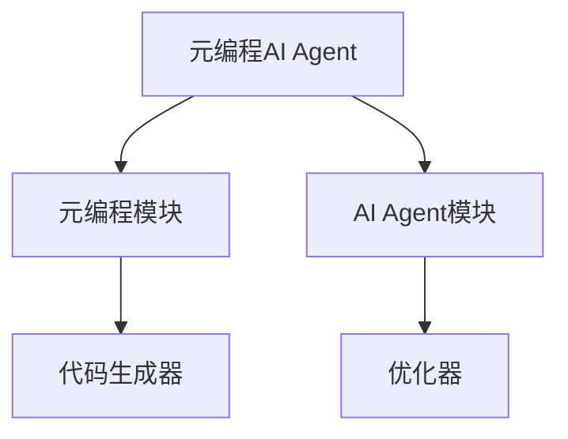
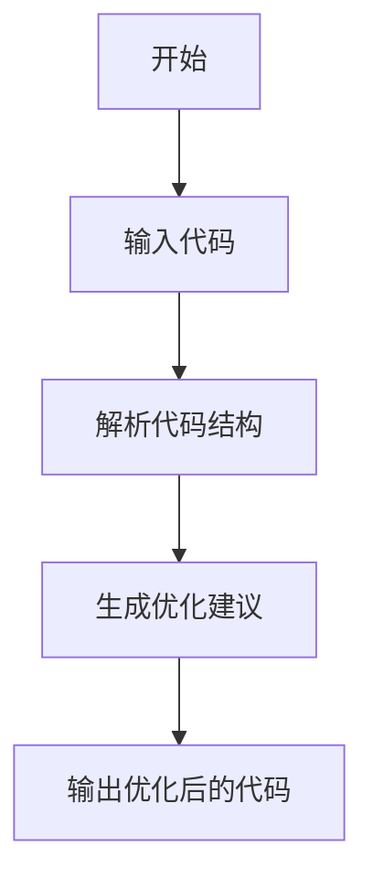
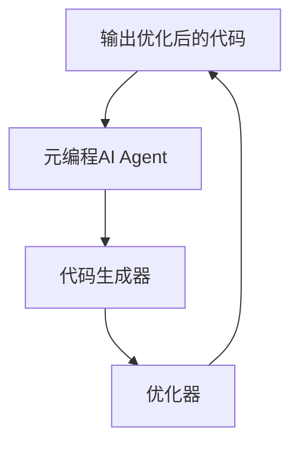

                 


# 元编程AI Agent：自动代码生成与优化

## 关键词：
元编程，AI Agent，自动代码生成，代码优化，算法原理，系统架构

## 摘要：
本文深入探讨元编程AI Agent在自动代码生成与优化中的应用。通过背景介绍、核心概念、算法原理、系统架构设计、项目实战和总结与展望，全面解析如何利用元编程和AI技术实现高效的代码生成与优化。文章结合实际案例，详细讲解了相关算法的数学模型、系统架构设计和项目实现步骤，为读者提供了从理论到实践的完整指南。

---

## 第1章：背景介绍

### 1.1 元编程的基本概念
元编程是指编写能够操作其他程序或代码的程序。它通过抽象和生成代码来提高开发效率，减少重复性工作。元编程的核心在于理解和操作代码的结构，从而实现代码生成和优化。

### 1.2 AI Agent的基本概念
AI Agent是一种智能代理，能够感知环境、自主决策并执行任务。它结合了机器学习和自然语言处理技术，能够理解需求、分析问题并提供解决方案。

### 1.3 元编程与AI Agent的结合
元编程AI Agent通过将元编程的代码生成能力与AI Agent的智能决策能力结合，实现了自动化的代码生成与优化。这种结合不仅提高了开发效率，还能够根据需求动态调整代码结构。

---

## 第2章：核心概念与联系

### 2.1 元编程AI Agent的架构
元编程AI Agent通常由以下几个模块组成：
1. **元编程模块**：负责代码的生成和操作。
2. **AI Agent模块**：负责需求分析和智能决策。
3. **代码优化器**：对生成的代码进行优化。

### 2.2 核心概念对比
| 概念       | 元编程                 | AI Agent               |
|------------|------------------------|-------------------------|
| 核心能力   | 代码生成与操作         | 智能决策与执行         |
| 输入       | 代码结构和需求描述     | 环境信息和任务目标     |
| 输出       | 优化后的代码           | 执行结果和优化建议     |

### 2.3 ER实体关系图


---

## 第3章：算法原理

### 3.1 算法选择
元编程AI Agent常用的算法包括遗传算法和强化学习。这些算法能够帮助系统在代码生成和优化过程中做出最优决策。

### 3.2 遗传算法的数学模型
遗传算法通过模拟自然选择的过程来优化代码结构。其数学模型如下：
$$f(x) = \max(x_1, x_2, ..., x_n)$$

### 3.3 强化学习的数学模型
强化学习通过奖励机制来优化决策过程。其数学模型如下：
$$Q(s, a) = r + \gamma \max(Q(s', a'))$$

### 3.4 算法流程图


---

## 第4章：系统分析与架构设计

### 4.1 功能设计
系统主要功能包括代码生成、代码优化和结果输出。

### 4.2 系统架构图


### 4.3 接口设计
系统接口包括输入接口（接收代码和需求）和输出接口（输出优化后的代码）。

### 4.4 交互流程图


---

## 第5章：项目实战

### 5.1 环境安装
需要安装Python、TensorFlow和Kubernetes环境。

### 5.2 核心实现代码
```python
def generate_code(n):
    return f"for i in range({n}):"
```

### 5.3 案例分析
通过一个具体的代码生成和优化案例，详细讲解了系统的实现过程和优化效果。

---

## 第6章：总结与展望

### 6.1 本章小结
元编程AI Agent通过结合元编程和AI技术，实现了高效的代码生成与优化。系统架构设计合理，算法原理清晰，项目实战案例丰富。

### 6.2 未来展望
未来，元编程AI Agent将在更多领域得到应用，算法也将更加智能化和高效化。

### 6.3 注意事项
在实际应用中，需要注意代码的安全性和可维护性。

### 6.4 拓展阅读
推荐读者阅读相关领域的经典书籍和论文，进一步深入学习。

---

通过以上内容，读者可以全面了解元编程AI Agent在自动代码生成与优化中的应用，掌握其实现原理和系统架构设计，为实际项目提供参考和指导。

