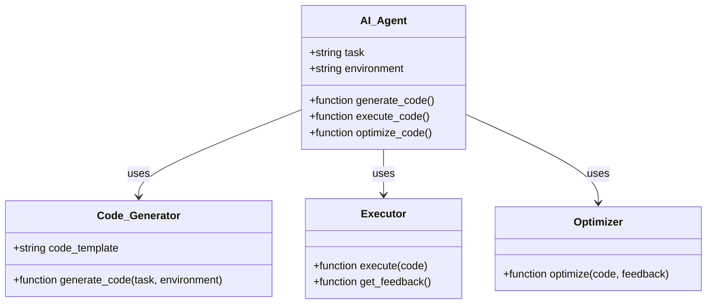
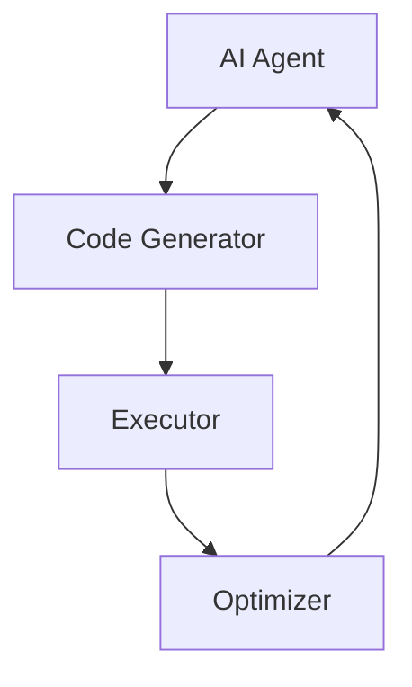
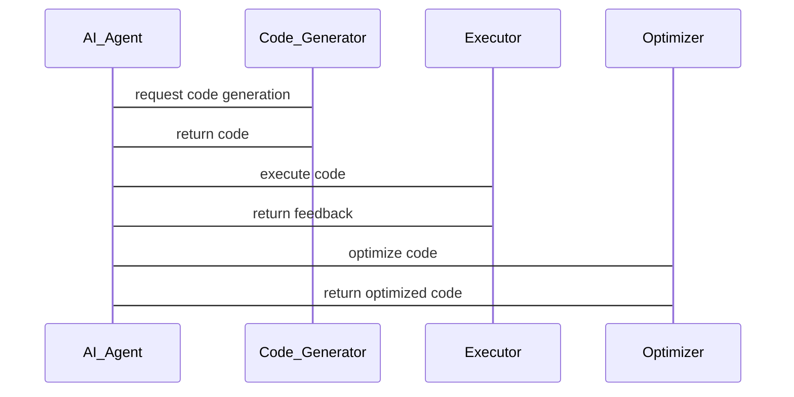

                 


# 元编程技术：使AI Agent具备代码生成能力

## 关键词：元编程、AI Agent、代码生成、动态代码执行、自适应优化

## 摘要：  
本文深入探讨了元编程技术在使AI Agent具备代码生成能力方面的应用。通过介绍元编程的核心概念、算法原理、系统架构设计以及实际项目案例，详细分析了如何利用元编程技术提升AI Agent的代码生成能力和智能化水平。文章从背景介绍、核心概念、算法实现、系统设计到项目实战，全面解析了元编程技术的实现细节和应用价值，为读者提供了从理论到实践的全面指导。

---

# 第1章 元编程技术概述

## 1.1 元编程的基本概念

### 1.1.1 元编程的定义与特点

元编程是一种编写“程序的程序”的技术，其核心在于通过代码生成、动态执行和自适应优化等手段，实现对程序本身的修改和扩展。元编程的特点包括高度的灵活性、动态性和智能化。与传统编程相比，元编程能够根据运行时环境的变化自动生成和优化代码，从而显著提高程序的适应性和效率。

### 1.1.2 元编程的核心概念

元编程的核心概念包括代码生成、动态执行和自适应优化。代码生成是元编程的基础，通过生成代码片段或完整的程序，元编程能够快速构建复杂的系统。动态执行则允许程序在运行时动态修改和执行生成的代码，而自适应优化则通过分析运行时数据，进一步优化代码的性能和功能。

### 1.1.3 元编程与传统编程的区别

传统编程是静态的，代码在编译时已经确定，而元编程是动态的，能够在运行时生成和修改代码。此外，元编程还能够根据不同的输入和环境生成不同的代码，从而实现高度的定制化和智能化。

## 1.2 AI Agent与元编程的关系

### 1.2.1 AI Agent的基本概念

AI Agent是一种智能代理，能够感知环境、执行任务并做出决策。AI Agent的核心能力包括感知、推理、规划和执行。

### 1.2.2 元编程在AI Agent中的作用

元编程能够赋予AI Agent代码生成的能力，使其能够根据任务需求自动生成代码，从而实现更复杂的任务。通过元编程，AI Agent可以动态调整其行为，优化任务执行效率。

### 1.2.3 AI Agent具备代码生成能力的意义

赋予AI Agent代码生成能力，使其能够快速构建和优化程序，从而显著提升其智能性和灵活性。这种能力在复杂任务和动态环境中尤为重要。

## 1.3 元编程技术的背景与发展趋势

### 1.3.1 元编程技术的发展历程

元编程技术起源于20世纪60年代，经历了从静态代码生成到动态代码生成，再到智能化代码生成的演变。

### 1.3.2 当前元编程技术的应用领域

当前，元编程技术广泛应用于软件开发、数据分析、人工智能和自动化系统等领域。

### 1.3.3 元编程技术的未来趋势

未来，元编程技术将更加智能化和自适应，能够在更复杂的环境中生成和优化代码。

---

# 第2章 元编程技术的核心概念与原理

## 2.1 元编程的核心概念

### 2.1.1 元编程的四个核心要素

元编程的四个核心要素包括代码生成、动态执行、自适应优化和智能化决策。

### 2.1.2 元编程的层次结构

元编程的层次结构包括代码生成层、动态执行层和自适应优化层。

### 2.1.3 元编程的实现机制

元编程的实现机制包括代码生成、动态代码执行和自适应优化。

## 2.2 元编程的核心原理

### 2.2.1 元编程的代码生成机制

元编程的代码生成机制包括代码模板、动态参数和自适应生成。

### 2.2.2 元编程的动态代码执行原理

元编程的动态代码执行原理包括动态编译、动态加载和动态执行。

### 2.2.3 元编程的自适应优化算法

元编程的自适应优化算法包括性能优化、代码优化和功能优化。

## 2.3 元编程的核心概念对比表

### 2.3.1 元编程与传统编程的对比

| 特性         | 传统编程         | 元编程             |
|--------------|------------------|--------------------|
| 静态性        | 静态             | 动态               |
| 灵活性        | 低               | 高                 |
| 自适应能力    | 低               | 高                 |

### 2.3.2 元编程与AI技术的对比

| 特性         | 元编程             | AI技术             |
|--------------|--------------------|--------------------|
| 核心能力     | 代码生成           | 数据分析与决策     |
| 应用场景     | 软件开发           | 人工智能应用       |

### 2.3.3 元编程与代码生成工具的对比

| 特性         | 元编程             | 代码生成工具       |
|--------------|--------------------|--------------------|
| 智能性        | 高                 | 低                 |
| 灵活性        | 高                 | 中                 |
| 自适应能力    | 高                 | 低                 |

---

# 第3章 元编程技术的算法原理

## 3.1 元编程算法的基本原理

### 3.1.1 元编程算法的输入输出模型

元编程算法的输入包括任务需求、环境数据和历史数据，输出包括生成的代码和优化的建议。

### 3.1.2 元编程算法的执行流程

1. 分析输入数据。
2. 生成初始代码。
3. 动态执行代码并收集反馈。
4. 根据反馈优化代码。
5. 输出优化后的代码。

### 3.1.3 元编程算法的数学模型

元编程算法的数学模型可以表示为：

$$ f(x) = \argmax_{\theta} \sum_{i=1}^{n} \text{score}(x_i, \theta) $$

其中，$x_i$ 表示输入数据，$\theta$ 表示代码生成的参数，$\text{score}$ 表示代码的质量评分。

## 3.2 元编程算法的实现步骤

### 3.2.1 算法输入的处理

处理输入数据，提取任务需求和环境信息。

### 3.2.2 算法中间状态的维护

维护中间状态，包括生成的代码和执行结果。

### 3.2.3 算法输出的生成与验证

生成代码并验证其正确性。

## 3.3 元编程算法的优化策略

### 3.3.1 算法的性能优化

通过分析历史数据，优化代码生成的效率。

### 3.3.2 算法的可扩展性优化

设计模块化的代码生成框架，提高系统的可扩展性。

### 3.3.3 算法的可维护性优化

引入代码生成模板，降低代码的维护成本。

---

# 第4章 元编程技术的数学模型与公式

## 4.1 元编程算法的数学模型

### 4.1.1 元编程算法的基本数学模型

元编程算法的基本数学模型可以表示为：

$$ f(x) = \argmax_{\theta} \sum_{i=1}^{n} \text{score}(x_i, \theta) $$

其中，$x_i$ 表示输入数据，$\theta$ 表示代码生成的参数，$\text{score}$ 表示代码的质量评分。

### 4.1.2 元编程算法的优化数学模型

元编程算法的优化数学模型可以表示为：

$$ f(x) = \argmax_{\theta} \sum_{i=1}^{n} \text{score}(x_i, \theta) + \lambda \cdot \text{regularization}(\theta) $$

其中，$\lambda$ 是正则化系数，$\text{regularization}$ 是正则化函数。

### 4.1.3 元编程算法的复杂度分析

元编程算法的时间复杂度可以表示为：

$$ O(n \cdot m) $$

其中，$n$ 是输入数据的数量，$m$ 是代码生成的参数数量。

---

# 第5章 元编程技术的系统分析与架构设计

## 5.1 系统功能设计

### 5.1.1 领域模型

领域模型可以表示为一个类图，如图1所示。



### 5.1.2 系统架构设计

系统架构设计如图2所示。



### 5.1.3 系统接口设计

系统接口包括代码生成接口、执行接口和优化接口。

### 5.1.4 系统交互设计

系统交互流程如图3所示。



---

# 第6章 项目实战：实现AI Agent的代码生成能力

## 6.1 环境安装

安装所需的开发环境和工具，如Python、虚拟环境和必要的库。

## 6.2 系统核心实现

### 6.2.1 代码生成模块

代码生成模块的实现代码如下：

```python
def generate_code(task, environment):
    # 生成代码逻辑
    pass
```

### 6.2.2 动态执行模块

动态执行模块的实现代码如下：

```python
def execute_code(code):
    # 动态执行逻辑
    pass
```

### 6.2.3 自适应优化模块

自适应优化模块的实现代码如下：

```python
def optimize_code(code, feedback):
    # 自优化逻辑
    pass
```

## 6.3 代码应用解读与分析

详细解读代码的功能和实现逻辑，分析其优缺点。

## 6.4 实际案例分析

通过实际案例分析，验证系统的功能和性能。

---

# 第7章 最佳实践与未来展望

## 7.1 最佳实践 tips

总结元编程技术在实际应用中的最佳实践，如代码生成模板的设计、动态执行的优化等。

## 7.2 小结

总结全文，强调元编程技术的重要性和应用价值。

## 7.3 注意事项

提醒读者在实际应用中需要注意的问题，如代码生成的安全性、动态执行的稳定性等。

## 7.4 拓展阅读

推荐相关领域的书籍和资源，供读者深入学习。

---

通过以上章节的详细讲解，读者可以全面理解元编程技术在使AI Agent具备代码生成能力方面的应用，并能够实际操作和应用这些技术。

