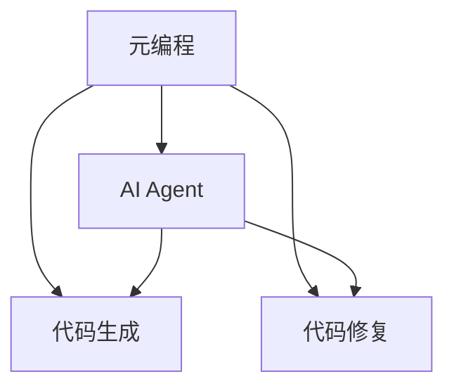
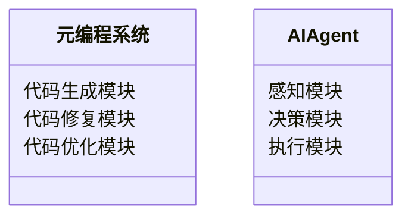
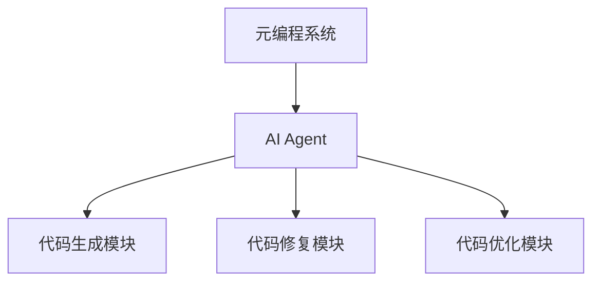

                 


# 元编程：让AI Agent生成和修改代码

## 关键词：
元编程, AI Agent, 代码生成, 代码修复, 代码优化

## 摘要：
元编程是一种能够生成或操作其他程序的编程方式，它在AI Agent领域中具有重要意义。本文将详细探讨元编程与AI Agent的关系，分析它们的核心概念、算法原理、系统架构，并通过实际案例展示如何利用元编程让AI Agent生成和修改代码。文章最后将总结最佳实践，展望未来发展方向。

---

# 第一部分: 元编程与AI Agent概述

## 第1章: 元编程与AI Agent的基本概念

### 1.1 元编程的定义与特点
元编程是编写能够生成或操作其他程序的代码，其特点包括：
- **代码生成**：动态生成新代码。
- **代码操作**：修改现有代码。
- **抽象性**：通过抽象语法树（AST）操作代码。
- **自适应性**：根据需求自动生成适应性代码。

### 1.2 AI Agent的定义与特点
AI Agent是一种智能程序，能够感知环境并执行任务，特点包括：
- **自主性**：无需外部干预。
- **反应性**：实时响应环境变化。
- **目标导向**：为实现目标执行操作。
- **学习能力**：通过数据学习改进性能。

### 1.3 元编程与AI Agent的关系
元编程为AI Agent提供代码生成和操作的能力，AI Agent则为元编程提供智能化的执行环境。两者结合可以实现代码的自动生成、修复和优化。

---

## 第2章: 元编程与AI Agent的核心概念

### 2.1 元编程的核心概念
元编程的核心概念包括：
- **生成式AI**：利用生成模型（如GPT）生成代码。
- **符号编程**：通过符号逻辑操作代码。
- **抽象语法树（AST）**：代码的树状结构，用于代码操作。

### 2.2 AI Agent的核心概念
AI Agent的核心概念包括：
- **感知**：通过API或日志感知环境。
- **决策**：基于感知信息做出决策。
- **执行**：执行任务，如生成或修改代码。

### 2.3 元编程与AI Agent的关系
| 概念 | 元编程 | AI Agent |
|------|--------|----------|
| 定义 | 生成或操作代码 | 智能程序，执行任务 |
| 核心能力 | 代码生成与操作 | 感知与决策 |
| 应用场景 | 代码生成、修复 | 代码生成、修复 |

### 2.4 实体关系图


---

# 第二部分: 元编程与AI Agent的算法原理

## 第3章: 元编程的算法原理

### 3.1 生成代码的算法
基于生成式AI的代码生成算法：
1. **输入**：用户需求或代码片段。
2. **处理**：通过模型生成代码。
3. **输出**：生成的代码。

### 3.2 生成代码的数学模型
交叉熵损失函数：
$$ \text{Loss} = -\frac{1}{n}\sum_{i=1}^{n} \log p(y_i|x_i) $$
其中，$p(y|x)$ 是模型预测的概率。

### 3.3 代码修复的算法
代码修复算法步骤：
1. **输入**：错误代码和错误信息。
2. **处理**：模型分析并生成修复代码。
3. **输出**：修复后的代码。

---

## 第4章: AI Agent的算法原理

### 4.1 感知环境
AI Agent通过API感知环境，获取代码信息。

### 4.2 决策逻辑
AI Agent根据感知信息，通过符号逻辑或生成式模型做出决策。

### 4.3 执行操作
AI Agent根据决策结果，执行代码生成或修复操作。

---

# 第三部分: 元编程与AI Agent的系统架构

## 第5章: 系统功能设计

### 5.1 系统功能模块
- **代码生成模块**：生成新代码。
- **代码修复模块**：修复错误代码。
- **代码优化模块**：优化代码性能。

### 5.2 领域模型


## 第6章: 系统架构设计

### 6.1 系统架构


### 6.2 系统接口
- 元编程系统提供API，供AI Agent调用。
- AI Agent通过API感知环境并执行操作。

---

# 第四部分: 项目实战

## 第7章: 项目环境与安装

### 7.1 环境安装
安装Python和相关库（如Hugging Face）。

## 第8章: 核心实现

### 8.1 生成代码的实现
```python
def generate_code(prompt):
    # 使用生成模型生成代码
    pass
```

### 8.2 修复代码的实现
```python
def fix_code(code, error_info):
    # 使用修复模型修复代码
    pass
```

## 第9章: 项目实战与案例分析

### 9.1 实际案例
生成计算器代码并修复错误。

## 第10章: 项目总结

### 10.1 项目总结
总结项目实现过程，分析优缺点。

---

# 第五部分: 最佳实践与未来展望

## 第11章: 最佳实践

### 11.1 注意事项
- 安全性：防止代码注入。
- 伦理问题：确保代码生成的合法性。

## 第12章: 小结与展望

### 12.1 小结
元编程与AI Agent的结合能够显著提升代码生成和修复效率。

### 12.2 未来展望
未来将更加智能化和自动化，进一步提升代码质量。

---

## 附录: 更多资源

### 附录A: 推荐阅读
- 《元编程入门》
- 《AI Agent开发指南》

### 附录B: 工具推荐
- Hugging Face
- OpenAI API

---

# 结束语

通过本文的详细讲解，读者可以全面了解元编程与AI Agent的关系，掌握其实现原理和系统架构设计。希望本文能为相关领域的研究和实践提供有价值的参考。

