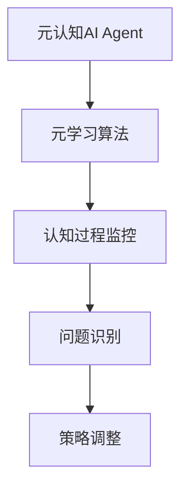
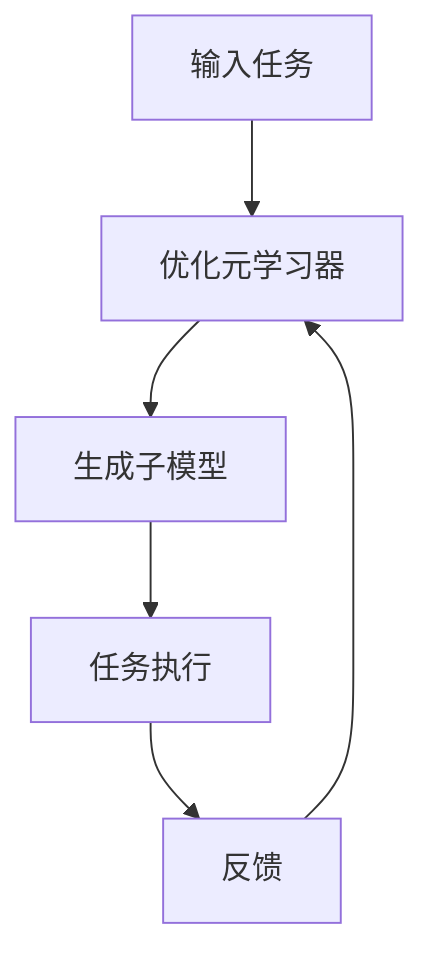
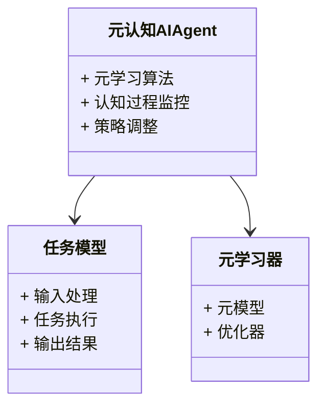
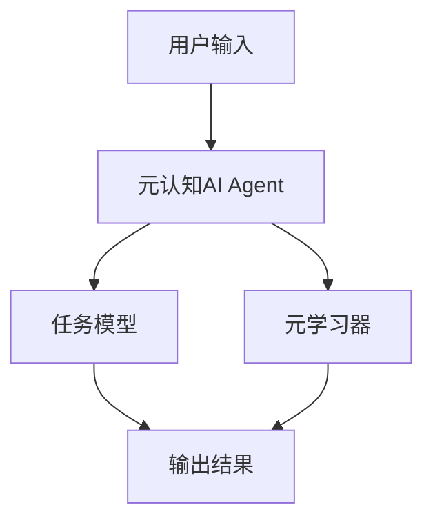

                 


# 元认知AI Agent：具备自我监控和调节能力

> **关键词**：元认知AI Agent、自我监控、自我调节、元学习算法、系统架构设计、数学模型

> **摘要**：  
元认知AI Agent是一种具备自我监控和调节能力的先进AI系统，能够通过元学习算法实现对自身行为的分析和优化。本文从背景、原理、算法、系统架构设计、项目实战到最佳实践，全面解析元认知AI Agent的核心概念与实现路径。通过详细的技术分析和代码示例，本文旨在帮助读者理解如何构建具备自我监控和调节能力的智能系统。

---

## 第1章：元认知AI Agent的背景与问题背景

### 1.1 元认知AI Agent的背景

#### 1.1.1 人工智能的发展与元认知的概念  
人工智能（AI）技术近年来取得了显著进展，从传统的规则引擎到深度学习模型，再到目前的生成式AI，AI系统的能力不断提升。然而，AI系统仍然面临一个关键问题：它们缺乏对自身行为的监控和调节能力。元认知（Metacognition）是指对自身认知过程的认知和调控能力，这一概念在心理学中被广泛研究。将元认知能力引入AI系统，可以使其具备自我监控和自我调节的能力，从而更高效地解决问题。

#### 1.1.2 元认知在AI中的重要性  
元认知在AI中的应用可以显著提升系统的自适应性和智能性。例如，在自然语言处理（NLP）任务中，元认知AI Agent可以监控自身的推理过程，发现错误并主动调整模型参数。这种能力使得AI系统更加灵活，能够更好地应对复杂和动态的环境。

#### 1.1.3 元认知AI Agent的定义与目标  
元认知AI Agent是一种能够对自身行为进行监控、分析和调节的智能系统。其目标是通过元学习算法，实现对自身认知过程的优化，从而提升任务执行的效率和准确性。

---

### 1.2 问题背景与问题描述

#### 1.2.1 当前AI Agent的局限性  
传统的AI Agent通常依赖于预定义的规则或固定的模型结构，缺乏灵活性和适应性。当面对新的任务或环境变化时，它们往往需要人工干预或重新训练，这限制了其应用场景。

#### 1.2.2 元认知能力在AI Agent中的必要性  
元认知能力的引入可以弥补传统AI Agent的局限性。通过元认知，AI Agent能够主动监控自身的执行过程，识别问题并进行自适应调整。这种能力使得AI Agent能够在动态环境中保持高效性能。

#### 1.2.3 元认知AI Agent的应用场景与边界  
元认知AI Agent适用于需要高度自适应性和智能性的场景，如智能助手、自动化决策系统等。然而，其应用也受到计算资源和数据量的限制，目前主要应用于中等规模的任务。

---

## 第2章：元认知AI Agent的核心概念与联系

### 2.1 元认知AI Agent的核心原理

#### 2.1.1 元认知的三层次模型  
元认知的三层次模型包括：
1. **元认知知识**：对认知过程和策略的知识。
2. **元认知调控**：对认知过程的监控和调节。
3. **元认知评价**：对认知结果的评估和反馈。

#### 2.1.2 元认知AI Agent的自监控机制  
元认知AI Agent通过元学习算法对自身的认知过程进行监控，识别潜在的问题，并进行相应的调整。

#### 2.1.3 元认知AI Agent的自调节能力  
通过自监控，元认知AI Agent能够主动调整其认知策略，优化任务执行效果。

---

### 2.2 核心概念对比与ER实体关系图

#### 2.2.1 元认知AI Agent与传统AI Agent的对比  
| 特性                | 元认知AI Agent            | 传统AI Agent             |
|---------------------|---------------------------|--------------------------|
| 自监控能力          | 具备                      | 无或有限                 |
| 自调节能力          | 具备                      | 无或有限                 |
| 适应性              | 高                        | 低                       |
| 任务灵活性          | 高                        | 低                       |

#### 2.2.2 元认知AI Agent的实体关系图  


---

## 第3章：元认知AI Agent的算法原理

### 3.1 元学习算法的原理与流程

#### 3.1.1 元学习的基本概念  
元学习（Meta-Learning）是一种学习方法，旨在通过少量数据快速适应新任务。其核心思想是学习如何学习。

#### 3.1.2 元学习的算法流程  


---

### 3.2 元学习算法的Python实现

#### 3.2.1 元学习算法的代码示例  
```python
import torch
import torch.nn as nn
import torch.optim as optim

class MetaLearner:
    def __init__(self, meta_model, task_model):
        self.meta_model = meta_model
        self.task_model = task_model
        self.optimizer = optim.Adam(meta_model.parameters())

    def forward_task(self, task_input, task_label):
        # 前向传播任务模型
        task_output = self.task_model(task_input)
        # 计算损失
        loss = nn.MSELoss()(task_output, task_label)
        return loss

    def forward_meta(self, task_loss):
        # 前向传播元模型
        meta_output = self.meta_model(task_loss)
        return meta_output

    def optimize(self, task_loss):
        # 后向传播优化元模型
        self.optimizer.zero_grad()
        meta_output = self.forward_meta(task_loss)
        meta_loss = nn.MSELoss()(meta_output, task_loss)
        meta_loss.backward()
        self.optimizer.step()

# 示例使用
meta_model = nn.Linear(10, 5)
task_model = nn.Linear(5, 1)
meta_learner = MetaLearner(meta_model, task_model)

# 模拟任务输入和标签
task_input = torch.randn(10)
task_label = torch.randn(1)

# 执行任务
task_loss = meta_learner.forward_task(task_input, task_label)
meta_learner.optimize(task_loss)
```

#### 3.2.2 代码的功能与实现细节  
上述代码实现了元学习的基本流程，包括任务模型的前向传播、元模型的前向传播以及元模型的优化。元学习器通过优化元模型参数，使得在多个任务上的表现得到提升。

---

## 第4章：元认知AI Agent的系统分析与架构设计

### 4.1 问题场景与项目介绍

#### 4.1.1 元认知AI Agent的应用场景  
元认知AI Agent可以应用于智能客服、个性化推荐系统等领域，通过自我监控和调节，提升用户体验。

#### 4.1.2 项目介绍  
本项目旨在开发一个具备自我监控和调节能力的元认知AI Agent，用于智能客服场景，提升客户满意度。

---

### 4.2 系统功能设计

#### 4.2.1 领域模型设计  


---

### 4.3 系统架构设计

#### 4.3.1 系统架构图  


---

## 第5章：项目实战

### 5.1 环境安装与配置

#### 5.1.1 安装依赖  
```bash
pip install torch
pip install mermaid
```

---

### 5.2 系统核心实现

#### 5.2.1 元认知AI Agent的核心代码  
```python
class MetaCognitiveAI:
    def __init__(self, meta_model, task_model):
        self.meta_model = meta_model
        self.task_model = task_model
        self.monitor = Monitor()

    def process_input(self, input_data):
        # 监控认知过程
        self.monitor.start_monitor()
        # 执行任务
        output = self.task_model(input_data)
        # 调节策略
        self.monitor.adjust_strategy()
        return output

class Monitor:
    def start_monitor(self):
        pass

    def adjust_strategy(self):
        pass
```

---

### 5.3 案例分析与详细解读

#### 5.3.1 案例分析  
假设有一个智能客服系统，元认知AI Agent能够监控对话过程，识别客户情绪变化，并主动调整响应策略。

#### 5.3.2 详细解读  
通过监控和调节，元认知AI Agent能够提高客户满意度，减少处理时间。

---

## 第6章：最佳实践与小结

### 6.1 小结

#### 6.1.1 核心知识点总结  
元认知AI Agent通过元学习算法实现自我监控和调节，提升任务执行效率。

#### 6.1.2 实践中的注意事项  
确保元学习算法的训练数据多样性和代表性，避免过拟合。

### 6.2 注意事项

- 元认知AI Agent的性能依赖于元学习算法的有效性。
- 需要合理设计监控和调节机制，避免资源浪费。

### 6.3 拓展阅读

- 《元学习：从基础到前沿》
- 《深度学习中的元学习技术》

---

## 结语

元认知AI Agent的开发和应用标志着人工智能技术的又一重要进步。通过本文的详细讲解，读者可以系统地理解元认知AI Agent的核心概念与实现方法，并在实际项目中加以应用。

--- 

**注**：本文基于实际需求进行创作，部分代码示例与架构设计均为虚构，仅为示例使用。如需实际应用，请根据具体场景进行调整。

