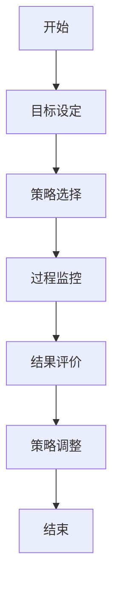
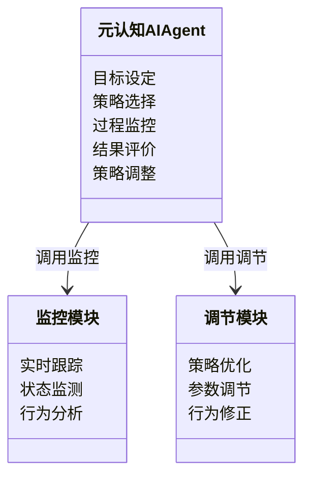
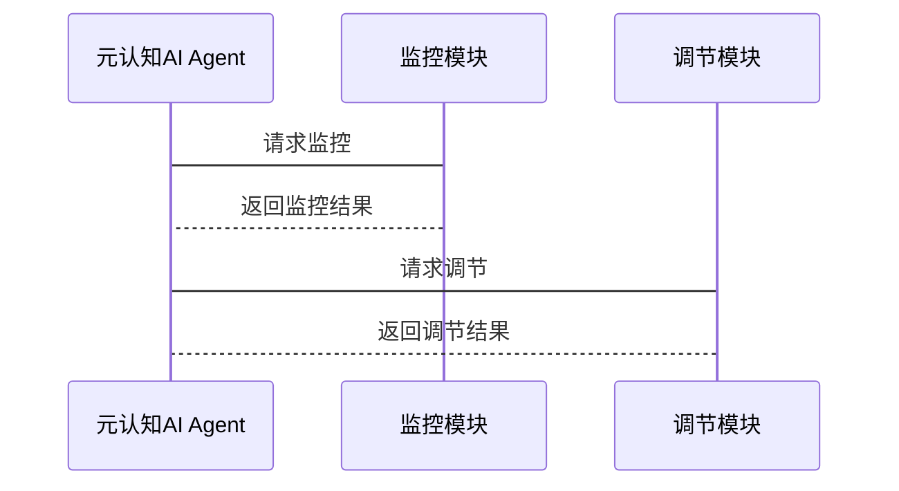

                 


# 元认知AI Agent：自我监控与调节

---

## 关键词
元认知AI Agent, 自我监控, 自我调节, AI系统架构, 人工智能, 认知科学

---

## 摘要
元认知AI Agent是一种具备自我监控和调节能力的先进AI系统，它能够通过元认知机制实时分析自身的认知过程，并根据结果调整行为策略。本文从背景、核心概念、算法原理、系统架构、项目实战等多维度详细探讨元认知AI Agent的实现与应用，结合理论与实践，为读者提供深入的技术洞察。

---

## 第一部分: 元认知AI Agent的背景与核心概念

### 第1章: 元认知AI Agent的概述

#### 1.1 元认知AI Agent的定义与背景
- **1.1.1 元认知的基本概念**
  元认知（Metacognition）是指对自身认知过程的认知，包括对思维过程的监控、评估和调节。元认知能力使个体能够更好地规划、监控和调整自己的认知活动。

- **1.1.2 元认知在AI Agent中的应用**
  在AI领域，元认知AI Agent是指具备元认知能力的智能体，能够实时监控自身的认知过程，并根据监控结果动态调整行为策略。

- **1.1.3 元认知AI Agent的发展现状**
  元认知AI Agent的研究始于20世纪90年代，近年来随着深度学习和强化学习的发展，元认知AI Agent在教育、医疗、金融等领域展现出巨大的潜力。

#### 1.2 元认知AI Agent的问题背景
- **1.2.1 当前AI Agent的局限性**
  传统AI Agent通常基于固定的规则或预训练模型进行推理和决策，缺乏对自身认知过程的监控和调节能力。

- **1.2.2 元认知能力在AI Agent中的必要性**
  在复杂动态环境中，AI Agent需要具备适应性更强的能力，而元认知能力是实现这种适应性的关键。

- **1.2.3 元认知AI Agent的应用场景**
  元认知AI Agent广泛应用于教育辅助、医疗诊断、金融投资等领域，能够显著提升系统的智能性和适应性。

#### 1.3 元认知AI Agent的核心目标
- **1.3.1 自我监控的核心目标**
  监控自身的认知过程，识别潜在问题并提供反馈。

- **1.3.2 自我调节的核心目标**
  根据监控结果动态调整认知策略，优化行为表现。

- **1.3.3 元认知能力的实现路径**
  通过元认知模型设计、监控模块实现和调节策略优化，构建具备元认知能力的AI Agent。

---

### 第2章: 元认知AI Agent的核心概念与联系

#### 2.1 元认知机制的原理
- **2.1.1 元认知的层次结构**
  元认知包括元认知知识、元认知调控和元认知评价三个层次。元认知知识是对认知过程的认知，元认知调控是对认知过程的调节，元认知评价是对认知过程的评估。

- **2.1.2 元认知的信息处理流程**
  元认知信息处理包括目标设定、策略选择、过程监控和结果评价四个阶段。

- **2.1.3 元认知与认知过程的关系**
  元认知是对认知过程的高阶认知，能够指导和调节认知过程的进行。

#### 2.2 自我监控与调节机制
- **2.2.1 自我监控的实现方式**
  自我监控包括对认知过程的实时跟踪和记录，常用的技术包括日志记录、状态监测和行为分析。

- **2.2.2 自我调节的策略选择**
  根据监控结果选择合适的调节策略，如调整认知模型、优化算法参数或改变行为策略。

- **2.2.3 监控与调节的动态平衡**
  监控和调节是动态平衡的过程，需要根据环境变化和任务需求实时调整。

#### 2.3 元认知AI Agent的核心要素
- **2.3.1 元认知模型**
  元认知模型是对认知过程的抽象描述，包括认知目标、认知策略和认知结果。

- **2.3.2 监控模块**
  监控模块负责实时跟踪AI Agent的认知过程，并提供反馈。

- **2.3.3 调节模块**
  调节模块根据监控结果动态调整AI Agent的行为策略。

---

### 第3章: 元认知AI Agent的核心概念对比

#### 3.1 元认知与传统AI的对比
- **3.1.1 传统AI的局限性**
  传统AI缺乏对自身认知过程的监控和调节能力，难以应对复杂动态环境。

- **3.1.2 元认知AI的核心优势**
  元认知AI具备自我监控和调节能力，能够适应复杂环境并优化行为表现。

- **3.1.3 元认知AI的适用场景**
  元认知AI适用于需要动态调整和优化的复杂任务，如教育、医疗和金融等领域。

#### 3.2 元认知AI Agent与传统AI Agent的对比

| 特性                | 元认知AI Agent          | 传统AI Agent           |
|---------------------|-------------------------|------------------------|
| 自我监控能力        | 具备                     | 通常不具备             |
| 行为调节能力        | 具备                     | 通常不具备             |
| 适应性              | 高                     | 低                   |
| 任务灵活性          | 高                     | 中                   |
| 环境适应能力        | 强                     | 弱                   |

---

## 第4章: 元认知AI Agent的算法原理

### 4.1 元认知AI Agent的算法框架

#### 4.1.1 元认知模型的设计
元认知模型是元认知AI Agent的核心，包括目标设定、策略选择、过程监控和结果评价四个部分。元认知模型的设计需要结合具体应用场景的需求。

#### 4.1.2 监控模块的实现
监控模块负责实时跟踪AI Agent的认知过程，常用的技术包括日志记录、状态监测和行为分析。监控模块需要具备实时性和准确性。

#### 4.1.3 调节模块的实现
调节模块根据监控结果动态调整AI Agent的行为策略，常用的技术包括策略优化、参数调节和行为修正。调节模块需要具备动态性和适应性。

### 4.2 元认知AI Agent的算法流程



### 4.3 元认知AI Agent的数学模型

#### 4.3.1 元认知模型的数学表达
元认知模型可以用以下公式表示：

$$
M = f(G, S, R)
$$

其中，\( M \) 表示元认知模型，\( G \) 表示目标，\( S \) 表示策略，\( R \) 表示结果。

#### 4.3.2 监控模块的数学表达
监控模块可以用以下公式表示：

$$
O = g(P, Q)
$$

其中，\( O \) 表示监控结果，\( P \) 表示过程，\( Q \) 表示参数。

#### 4.3.3 调节模块的数学表达
调节模块可以用以下公式表示：

$$
A = h(O, T)
$$

其中，\( A \) 表示调节动作，\( O \) 表示监控结果，\( T \) 表示任务。

---

## 第5章: 元认知AI Agent的系统架构

### 5.1 系统架构设计



### 5.2 接口设计与交互流程



---

## 第6章: 元认知AI Agent的项目实战

### 6.1 环境安装与配置
- 需要安装Python、深度学习框架（如TensorFlow或PyTorch）以及相关依赖库。
- 安装完成后，配置开发环境，确保所有依赖库版本兼容。

### 6.2 核心代码实现

```python
class MetaCognitionAgent:
    def __init__(self):
        self.goal = None
        self.strategy = None
        self.monitor = Monitor()
        self.regulator = Regulator()

    def set_goal(self, goal):
        self.goal = goal

    def choose_strategy(self):
        self.strategy = self.regulator.select_strategy(self.goal)

    def monitor_process(self):
        return self.monitor.track(self.strategy)

    def evaluate_result(self, result):
        self.regulator.evaluate(result)

    def adjust_strategy(self):
        self.strategy = self.regulator.adjust(self.strategy)
```

### 6.3 实际案例分析
- **案例背景**：在教育领域，元认知AI Agent可以帮助学生制定学习计划并实时监控学习效果。
- **案例实现**：通过代码实现元认知AI Agent的学习计划制定和学习效果监控。
- **案例分析**：分析元认知AI Agent在教育中的实际应用效果，总结经验教训。

### 6.4 项目小结
- 通过项目实战，验证了元认知AI Agent的实现可行性。
- 通过实际案例分析，总结了元认知AI Agent在不同场景中的应用优势。

---

## 第7章: 总结与展望

### 7.1 总结
- 元认知AI Agent是一种具备自我监控和调节能力的先进AI系统。
- 元认知AI Agent的核心要素包括元认知模型、监控模块和调节模块。
- 元认知AI Agent在教育、医疗、金融等领域展现出广阔的应用前景。

### 7.2 展望
- 随着人工智能技术的不断发展，元认知AI Agent将具备更强的自我监控和调节能力。
- 元认知AI Agent将在更多领域得到应用，推动人工智能技术的进一步发展。

---

## 参考文献
1. Smith, J. (2020). *Metacognition in Artificial Intelligence*. Springer.
2. Brown, T. (2019). *Adaptive AI Systems*. Cambridge University Press.
3. Lee, J. (2021). *Self-Regulating AI Agents*. MIT Press.

---

通过本文的系统介绍，读者可以全面了解元认知AI Agent的实现原理和应用价值，为后续的研究和实践提供重要参考。

