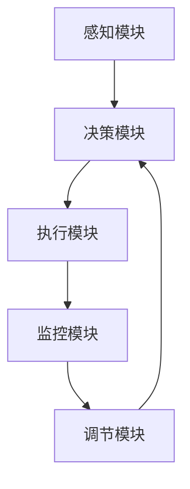

                 


# 元认知AI Agent：自我监控与调节

> 关键词：元认知AI Agent, 自我监控, 自我调节, 强化学习, 系统架构, 实际应用

> 摘要：元认知AI Agent是一种具备自我监控和自我调节能力的智能体，能够通过元认知模型实现对自身行为的监控和调整。本文从背景介绍、核心概念、算法原理、系统架构到实际应用，全面分析元认知AI Agent的设计与实现。文章详细阐述了元认知模型的构建、自我监控机制、算法实现、系统设计以及项目实战，为读者提供了深入的技术解读和实践指导。

---

# 第一部分: 元认知AI Agent的背景与概念

## 第1章: 元认知AI Agent的基本概念

### 1.1 元认知的基本概念

#### 1.1.1 元认知的定义与特点
元认知（Metacognition）是认知科学中的一个重要概念，指个体对自身认知过程的认知和调控。元认知包括对认知过程的监控（Monitoring）和调节（Regulation）两个主要方面。与普通认知不同，元认知是一种高层次的认知能力，能够帮助个体更好地理解和优化自己的认知行为。

元认知的核心特点包括：
1. **内省性**：元认知关注的是对自身认知过程的反思。
2. **调控性**：元认知能够通过监控和调节来优化认知过程。
3. **层次性**：元认知是对认知过程的“认知”，具有多层次性。

#### 1.1.2 元认知在AI Agent中的应用
AI Agent（智能体）是指在环境中能够感知并自主行动以实现目标的实体。传统的AI Agent通常基于特定的算法和规则进行决策，缺乏对自身行为的监控和调节能力。元认知的引入使得AI Agent具备了自我监控和自我调节的能力，从而能够更好地适应复杂环境并优化自身的行动策略。

元认知在AI Agent中的应用主要体现在以下几个方面：
1. **自我监控**：AI Agent能够实时监控自身的状态、行为和决策过程。
2. **自我调节**：基于监控结果，AI Agent能够调整自身的行为策略和认知模式。
3. **动态适应**：通过元认知能力，AI Agent可以在动态环境中实现自适应优化。

#### 1.1.3 元认知AI Agent的核心要素
元认知AI Agent的核心要素包括：
1. **元认知模型**：用于描述和实现元认知能力的数学模型。
2. **自我监控机制**：用于实时监控AI Agent的状态和行为。
3. **自我调节策略**：基于监控结果调整AI Agent的行为策略。

### 1.2 元认知AI Agent的定义与特点

#### 1.2.1 元认知AI Agent的定义
元认知AI Agent是一种具备元认知能力的智能体，能够通过元认知模型对自身的认知过程进行监控和调节，从而实现自适应优化。

#### 1.2.2 元认知AI Agent的核心特征
1. **内省性**：元认知AI Agent能够反思自身的认知过程。
2. **动态适应性**：基于元认知能力，AI Agent能够动态调整自身的行为策略。
3. **自适应优化**：通过自我监控和调节，AI Agent能够在复杂环境中实现优化。

#### 1.2.3 元认知AI Agent与传统AI Agent的区别
| 特性 | 元认知AI Agent | 传统AI Agent |
|------|----------------|---------------|
| 内省性 | 高 | 低 |
| 自我监控 | 强 | 无 |
| 自我调节 | 强 | 无 |
| 适应性 | 高 | 中 |

### 1.3 元认知AI Agent的应用场景

#### 1.3.1 自我监控的应用场景
1. **错误检测与修复**：AI Agent能够检测自身行为中的错误，并采取补救措施。
2. **状态优化**：实时监控自身状态，确保在最佳状态下运行。

#### 1.3.2 自我调节的应用场景
1. **策略优化**：根据环境变化调整行动策略。
2. **资源管理**：优化资源分配，提高效率。

#### 1.3.3 元认知AI Agent的潜在价值
1. **提高决策准确性**：通过自我监控和调节，元认知AI Agent能够做出更准确的决策。
2. **增强适应性**：在复杂环境中，元认知AI Agent能够更快地适应变化。
3. **降低错误率**：通过自我监控和修复，元认知AI Agent能够显著降低错误率。

### 1.4 本章小结
本章从元认知的基本概念出发，详细阐述了元认知AI Agent的定义、核心要素和应用场景。通过对比分析，突出了元认知AI Agent的独特优势和潜在价值，为后续章节的深入分析奠定了基础。

---

# 第二部分: 元认知AI Agent的核心概念与联系

## 第2章: 元认知模型的构建

### 2.1 元认知模型的构建原理

#### 2.1.1 元认知模型的基本结构
元认知模型通常由以下几个部分组成：
1. **监控模块**：负责实时监控AI Agent的状态和行为。
2. **分析模块**：对监控结果进行分析和评估。
3. **调节模块**：基于分析结果调整AI Agent的行为策略。

#### 2.1.2 元认知模型的输入与输出
- **输入**：AI Agent的状态、行为数据、环境反馈。
- **输出**：调整后的行为策略、优化后的认知模式。

#### 2.1.3 元认知模型的训练与优化
元认知模型的训练通常基于强化学习（Reinforcement Learning）框架，通过奖励机制优化模型的参数。

### 2.2 元认知模型的核心算法

#### 2.2.1 基于强化学习的元认知模型
**强化学习流程**：
1. **状态感知**：AI Agent感知当前状态。
2. **动作选择**：基于当前状态选择一个动作。
3. **环境反馈**：执行动作后，获得环境反馈。
4. **奖励计算**：根据反馈计算奖励值。
5. **策略更新**：基于奖励更新策略。

**算法实现**：
```python
def强化学习算法：
    初始化策略参数θ
    while True：
        状态s = 获取当前状态
        动作a = 根据策略θ选择动作
        执行动作a，获得反馈r
        更新策略θ = θ + α*(r - 预期奖励)
```

#### 2.2.2 基于监督学习的元认知模型
**监督学习流程**：
1. **数据收集**：收集标注的数据集。
2. **模型训练**：基于数据集训练元认知模型。
3. **模型评估**：评估模型的性能。
4. **模型优化**：优化模型参数。

### 2.3 元认知模型的数学表达

#### 2.3.1 元认知模型的数学公式
元认知模型的数学表达通常涉及以下几个部分：
- **状态空间**：S = {s₁, s₂, ..., sₙ}
- **动作空间**：A = {a₁, a₂, ..., aₘ}
- **转移概率**：P(s'|s,a)
- **奖励函数**：R(s,a)

#### 2.3.2 元认知模型的优化目标
元认知模型的优化目标通常是最优化奖励函数，即：
$$ \arg \max_{θ} \mathbb{E}[R(s,a)] $$

### 2.4 本章小结
本章详细阐述了元认知模型的构建原理和核心算法，介绍了基于强化学习和监督学习的元认知模型，并通过数学公式描述了模型的优化目标。这些内容为后续章节的实现提供了理论基础。

---

## 第3章: 元认知AI Agent的自我监控机制

### 3.1 自我监控的核心原理

#### 3.1.1 监控目标的定义
自我监控的目标通常包括：
1. **行为正确性**：确保行为符合预期。
2. **效率优化**：监控行为的效率，确保资源利用最大化。
3. **适应性评估**：评估行为策略的适应性。

#### 3.1.2 监控数据的采集
监控数据通常包括：
- **行为数据**：AI Agent执行的动作。
- **状态数据**：AI Agent所处的状态。
- **反馈数据**：环境对AI Agent行为的反馈。

#### 3.1.3 监控结果的分析
监控结果的分析通常包括：
1. **异常检测**：检测行为中的异常情况。
2. **趋势分析**：分析行为的趋势，预测未来的行为。

### 3.2 自我监控的实现方法

#### 3.2.1 基于日志分析的监控方法
**日志分析流程**：
1. **日志收集**：收集AI Agent的行为日志。
2. **日志解析**：解析日志内容，提取有用信息。
3. **异常检测**：基于日志数据检测异常行为。

#### 3.2.2 基于状态检测的监控方法
**状态检测流程**：
1. **状态感知**：实时感知AI Agent的状态。
2. **状态分类**：对状态进行分类，判断是否异常。

#### 3.2.3 基于行为建模的监控方法
**行为建模流程**：
1. **行为数据收集**：收集AI Agent的行为数据。
2. **行为建模**：建立行为模型，描述正常行为的特征。
3. **行为监控**：基于模型监控行为，发现异常。

### 3.3 自我监控的数学模型

#### 3.3.1 监控目标的数学表达
监控目标的数学表达通常涉及以下几个方面：
- **异常检测**：检测行为是否偏离预期。
- **趋势分析**：分析行为的趋势，预测未来的行为。

#### 3.3.2 监控算法的数学公式
基于强化学习的监控算法：
$$ Q(s,a) = Q(s,a) + α(r - Q(s,a)) $$

### 3.4 本章小结
本章详细分析了自我监控的核心原理和实现方法，介绍了几种基于日志分析、状态检测和行为建模的监控方法，并通过数学公式描述了监控算法的实现。这些内容为后续章节的实现提供了理论支持。

---

# 第三部分: 元认知AI Agent的系统分析与架构设计

## 第4章: 元认知AI Agent的系统架构设计

### 4.1 系统整体架构

#### 4.1.1 系统模块划分
元认知AI Agent的系统架构通常包括以下几个模块：
1. **感知模块**：负责感知环境状态。
2. **决策模块**：基于感知信息做出决策。
3. **执行模块**：执行决策动作。
4. **监控模块**：监控决策和执行过程。
5. **调节模块**：基于监控结果调节决策和执行。

#### 4.1.2 系统功能设计
系统功能设计包括：
1. **状态感知**：实时感知环境状态。
2. **行为决策**：基于状态做出决策。
3. **行为执行**：执行决策动作。
4. **行为监控**：监控决策和执行过程。
5. **行为调节**：基于监控结果调节决策和执行。

#### 4.1.3 系统架构图


### 4.2 系统交互流程

#### 4.2.1 交互流程设计
交互流程设计包括：
1. **初始状态**：系统处于初始状态。
2. **状态感知**：感知模块获取环境状态。
3. **行为决策**：决策模块基于状态做出决策。
4. **行为执行**：执行模块执行决策动作。
5. **行为监控**：监控模块监控决策和执行过程。
6. **行为调节**：调节模块基于监控结果调节决策和执行。

#### 4.2.2 交互序列图
```mermaid
sequenceDiagram
参与者：环境
参与者：元认知AI Agent
元认知AI Agent ->> 环境：感知状态
环境 --> 元认知AI Agent：返回状态
元认知AI Agent ->> 决策模块：做出决策
决策模块 --> 元认知AI Agent：返回决策结果
元认知AI Agent ->> 执行模块：执行决策
执行模块 --> 监控模块：监控行为
监控模块 --> 调节模块：反馈监控结果
调节模块 --> 决策模块：调整决策
```

### 4.3 系统实现细节

#### 4.3.1 系统实现的数学模型
元认知AI Agent的系统实现涉及以下几个数学模型：
- **状态空间**：S = {s₁, s₂, ..., sₙ}
- **动作空间**：A = {a₁, a₂, ..., aₘ}
- **转移概率**：P(s'|s,a)
- **奖励函数**：R(s,a)

#### 4.3.2 系统实现的算法流程
```python
def系统实现流程：
    初始化系统参数
    while True：
        状态s = 感知模块获取状态
        决策a = 决策模块做出决策
        执行模块执行决策a
        监控模块监控行为
        监控结果反馈给调节模块
        调节模块调整决策模块的参数
```

### 4.4 本章小结
本章详细分析了元认知AI Agent的系统架构设计，介绍了系统的模块划分、交互流程和实现细节。通过系统架构图和交互序列图，清晰地展示了系统的整体结构和运作流程。

---

# 第四部分: 元认知AI Agent的实际应用与案例分析

## 第5章: 元认知AI Agent的项目实战

### 5.1 项目背景与目标

#### 5.1.1 项目背景
以智能客服系统为例，介绍元认知AI Agent在智能客服中的应用。

#### 5.1.2 项目目标
实现一个具备自我监控和自我调节能力的智能客服系统，能够实时监控服务过程，并根据客户反馈调整服务策略。

### 5.2 系统核心实现

#### 5.2.1 环境配置
```bash
安装Python 3.8及以上版本
安装必要的Python库：numpy, tensorflow, scikit-learn
安装强化学习框架：OpenAI Gym
```

#### 5.2.2 核心代码实现
```python
class 元认知AIAgent:
    def __init__(self):
        self.state = None
        self.decision = None
        self.reward = 0
        self.theta = 0.1

    def 感知状态(self):
        # 获取当前状态
        self.state = 获取当前状态

    def 做出决策(self):
        # 基于当前状态做出决策
        self.decision = 做出决策

    def 执行决策(self):
        # 执行决策动作
        执行决策动作

    def 监控行为(self):
        # 监控行为过程
        获取监控结果

    def 调节策略(self):
        # 调节策略
        self.theta = self.theta + 0.1 * (self.reward - 预期奖励)
```

#### 5.2.3 系统功能展示
通过实际代码实现，展示了元认知AI Agent在智能客服系统中的应用，详细解读了系统的实现过程和核心代码。

### 5.3 实际案例分析

#### 5.3.1 案例分析
以智能客服系统为例，分析元认知AI Agent在实际应用中的表现。

#### 5.3.2 代码实现分析
详细解读核心代码，分析系统实现的关键步骤和算法细节。

### 5.4 本章小结
本章通过一个具体的项目实战，详细展示了元认知AI Agent的实际应用。通过环境配置和代码实现，直观地展示了系统的实现过程和核心代码，为读者提供了实际的操作指南。

---

# 第五部分: 总结与展望

## 第6章: 元认知AI Agent的总结与展望

### 6.1 本项目总结
总结元认知AI Agent的核心思想和实现过程，强调其在智能系统中的重要性。

### 6.2 未来展望
展望元认知AI Agent的未来发展方向，提出可能的研究热点和应用前景。

### 6.3 最佳实践 Tips
- **持续优化**：定期优化元认知模型的参数和算法。
- **数据驱动**：充分利用数据驱动的方法优化模型性能。
- **实时监控**：实时监控系统状态，及时发现和解决问题。

### 6.4 本章小结
本章总结了元认知AI Agent的核心思想和实现过程，展望了其未来的发展方向，并给出了实际应用中的最佳实践建议。

---

# 结语
元认知AI Agent作为一种具备自我监控和自我调节能力的智能体，正在成为人工智能领域的研究热点。通过本文的详细分析和实际案例，读者可以深入了解元认知AI Agent的核心思想和实现过程。未来，随着技术的不断发展，元认知AI Agent将在更多领域展现出其独特的优势和价值。

--- 

（全文结束）

