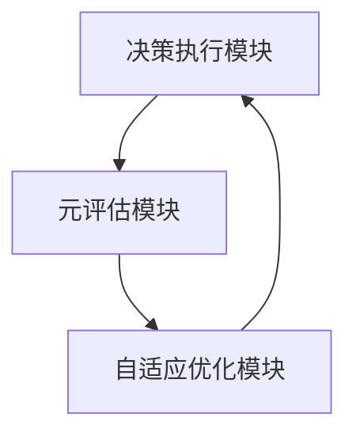
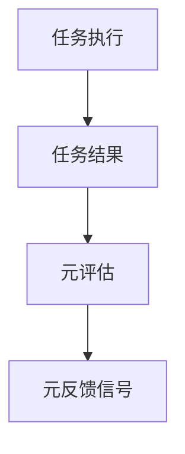
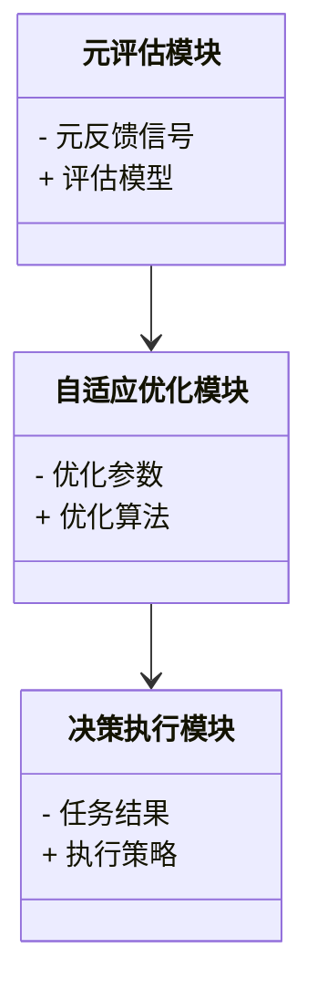
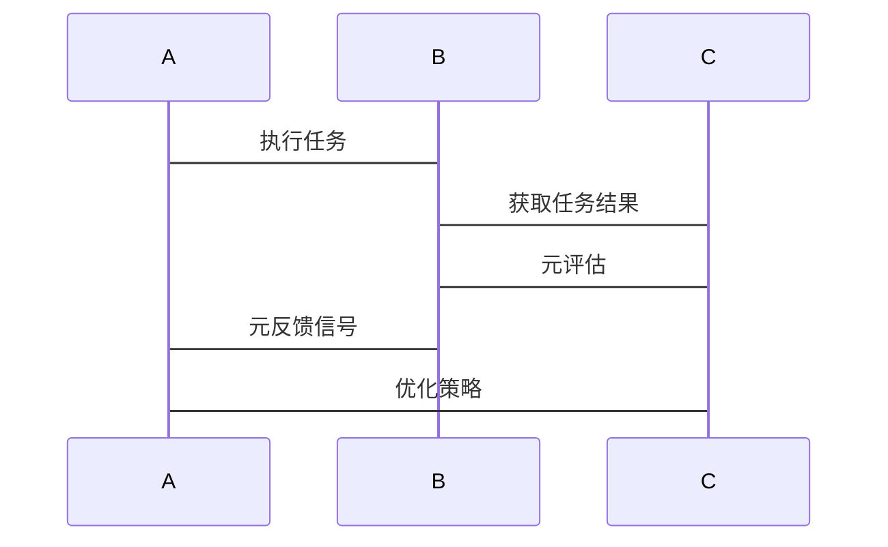

                 


# 元认知AI：具有自我评估能力的AI Agent

---

## 关键词：元认知AI，AI Agent，自我评估，算法原理，系统架构

---

## 摘要：

本文探讨了元认知AI（Metacognitive AI）这一前沿技术，详细介绍了其核心概念、算法原理、系统架构以及实际应用。元认知AI是一种能够自我评估、自我优化的AI代理，它通过元评估机制和自适应优化算法实现对自身行为的监控和改进。本文从背景、原理到实现，层层深入，旨在为AI开发者和研究人员提供理论支持和实践指导。

---

# 第1章: 元认知AI的背景与核心概念

## 1.1 元认知AI的定义与问题背景

### 1.1.1 元认知AI的基本概念

元认知AI（Metacognitive AI）是一种具备自我评估和自我优化能力的人工智能代理。它能够主动监控自身的决策过程，并根据结果调整策略，从而提高任务执行的效率和准确性。

### 1.1.2 元认知AI的核心问题背景

传统AI系统通常依赖于固定的规则和数据进行推理和决策，缺乏对自身行为的反思和优化能力。在复杂多变的环境中，这种局限性可能导致AI系统在面对不确定性时表现不佳。元认知AI的出现，正是为了解决这一问题，通过引入元评估机制，使AI能够动态调整其决策策略。

### 1.1.3 元认知AI的潜在应用场景

元认知AI的应用场景广泛，包括自动驾驶、智能助手、机器人控制等领域。例如，在自动驾驶中，元认知AI可以通过评估当前驾驶策略的有效性，动态调整以应对复杂的交通环境。

---

## 1.2 元认知AI的核心问题与解决思路

### 1.2.1 元认知AI的核心问题

元认知AI的核心问题在于如何实现对自身行为的评估和优化。这涉及两个关键环节：**元评估**（Metalevaluation）和**自适应优化**（Adaptive Optimization）。元评估是对AI行为的评估，而自适应优化是基于评估结果进行策略调整。

### 1.2.2 元认知AI的边界与外延

元认知AI的边界在于其自我评估的能力，它不仅关注任务执行的结果，还关注执行过程中的策略选择。外延则包括与元认知AI相关的技术，如强化学习、自适应控制等。

### 1.2.3 元认知AI的概念结构与核心要素

元认知AI的概念结构由以下核心要素组成：
- **元评估模块**：负责对AI的行为进行评估。
- **自适应优化模块**：基于评估结果优化决策策略。
- **决策执行模块**：根据优化后的策略执行任务。

---

## 1.3 元认知AI与传统AI的区别

### 1.3.1 传统AI的局限性

传统AI系统通常依赖固定的规则和数据，缺乏灵活性和自适应能力。例如，在面对未见过的场景时，传统AI可能会表现不佳。

### 1.3.2 元认知AI的创新点

元认知AI的创新点在于其具备自我评估和优化的能力。它能够根据任务执行的结果动态调整策略，从而更好地应对复杂环境。

### 1.3.3 元认知AI的核心优势

元认知AI的核心优势在于其动态适应性和灵活性。它能够根据实时反馈优化决策策略，从而在复杂环境中表现更优。

---

## 1.4 本章小结

本章从背景出发，介绍了元认知AI的基本概念、核心问题以及与传统AI的区别。通过对比分析，我们明确了元认知AI的核心优势及其潜在应用场景。

---

# 第2章: 元认知AI的核心概念与联系

## 2.1 元认知机制的原理

### 2.1.1 元认知的定义与特征

元认知是指对自身认知过程的认知，具有以下特征：
- **内省性**：能够监控自身的认知过程。
- **调控性**：能够根据监控结果调整认知策略。

### 2.1.2 元认知在AI中的应用

在AI中，元认知机制被用于对AI的行为进行监控和评估。例如，在强化学习中，元评估模块可以监控学习过程，动态调整学习策略。

### 2.1.3 元认知AI的实体关系图（ER图）



---

## 2.2 元认知AI的核心模型

### 2.2.1 元评估模型

元评估模型是对AI行为的评估模型，其核心思想是通过评估结果生成元反馈信号。元反馈信号可以用于调整决策策略。

### 2.2.2 自适应优化模型

自适应优化模型基于元反馈信号对决策策略进行优化。优化过程可能涉及参数调整或策略更新。

### 2.2.3 元认知AI的属性特征对比表

| 属性 | 传统AI | 元认知AI |
|------|--------|----------|
| 自我评估 | 无     | 有       |
| 策略优化 | 固定    | 动态     |
| 灵活性 | 低      | 高       |

---

## 2.3 元认知AI的系统架构

### 2.3.1 元认知AI的系统组成

元认知AI的系统组成包括：
- **决策执行模块**：负责执行具体任务。
- **元评估模块**：负责对决策过程进行评估。
- **自适应优化模块**：负责根据评估结果优化决策策略。

### 2.3.2 元认知AI的实体关系图（Mermaid流程图）


---

## 2.4 本章小结

本章从核心概念出发，详细介绍了元认知AI的系统架构及其与传统AI的区别。通过对比分析，我们明确了元认知AI的核心优势。

---

# 第3章: 元认知AI的算法原理

## 3.1 元评估算法的原理

### 3.1.1 元评估算法的数学模型

元评估算法的数学模型如下：

$$
\text{元反馈信号} = f(\text{任务结果}, \text{决策过程})
$$

其中，$f$ 是一个函数，用于根据任务结果和决策过程生成元反馈信号。

### 3.1.2 元评估算法的流程图（Mermaid）



---

## 3.2 自适应优化算法的实现

### 3.2.1 自适应优化算法的数学模型

自适应优化算法的数学模型如下：

$$
\text{优化策略} = \arg\min_{\theta} \text{损失函数}(\theta, \text{元反馈信号})
$$

其中，$\theta$ 是优化参数，损失函数是根据元反馈信号定义的。

### 3.2.2 自适应优化算法的Python实现代码

```python
def metamodel评估(self, 任务结果):
    元反馈信号 = 评估模型(任务结果)
    return 元反馈信号

def 自适应优化(self, 元反馈信号):
    优化参数 = 优化算法(元反馈信号)
    return 优化参数
```

---

## 3.3 元认知AI的算法对比分析

### 3.3.1 不同算法的优缺点对比

| 算法类型 | 优点 | 缺点 |
|----------|------|------|
| 元评估算法 | 高灵活性 | 高计算成本 |
| 自适应优化算法 | 高效率 | 可能过优化 |

### 3.3.2 元认知AI算法的性能评估

元认知AI算法的性能可以通过以下指标进行评估：
- **评估准确率**：元评估模块的准确率。
- **优化效果**：自适应优化模块的优化效果。

---

## 3.4 本章小结

本章详细介绍了元认知AI的算法原理，包括元评估算法和自适应优化算法的实现。通过对比分析，我们明确了不同算法的优缺点。

---

# 第4章: 元认知AI的系统分析与架构设计

## 4.1 问题场景介绍

### 4.1.1 元认知AI的应用场景

元认知AI的应用场景包括自动驾驶、智能助手、机器人控制等领域。

### 4.1.2 问题描述

在自动驾驶中，元认知AI可以通过评估当前驾驶策略的有效性，动态调整以应对复杂的交通环境。

---

## 4.2 系统功能设计

### 4.2.1 系统功能模块

系统功能模块包括：
- **决策执行模块**：负责执行具体任务。
- **元评估模块**：负责对决策过程进行评估。
- **自适应优化模块**：负责根据评估结果优化决策策略。

### 4.2.2 领域模型类图（Mermaid）



---

## 4.3 系统架构设计

### 4.3.1 系统架构图（Mermaid）


---

## 4.4 系统接口设计

### 4.4.1 系统接口

系统接口包括：
- `元评估接口`：用于获取元反馈信号。
- `自适应优化接口`：用于优化决策策略。

### 4.4.2 系统交互流程图（Mermaid）



---

## 4.5 本章小结

本章从系统架构设计出发，详细介绍了元认知AI的系统组成和接口设计。通过Mermaid图展示了系统架构和交互流程。

---

# 第5章: 元认知AI的项目实战

## 5.1 环境安装

### 5.1.1 安装Python环境

安装Python 3.8及以上版本，并安装以下库：

```bash
pip install numpy matplotlib
```

### 5.1.2 安装机器学习框架

安装TensorFlow或PyTorch框架。

---

## 5.2 系统核心实现

### 5.2.1 元评估模块的实现

```python
class 元评估模块:
    def __init__(self):
        self.评估模型 = 评估函数
```

### 5.2.2 自适应优化模块的实现

```python
class 自适应优化模块:
    def __init__(self):
        self.优化算法 = 优化函数
```

### 5.2.3 决策执行模块的实现

```python
class 决策执行模块:
    def __init__(self):
        self.执行策略 = 执行函数
```

---

## 5.3 代码应用解读与分析

### 5.3.1 元评估模块的代码解读

元评估模块的代码如下：

```python
def 评估函数(任务结果):
    元反馈信号 = 评估模型(任务结果)
    return 元反馈信号
```

### 5.3.2 自适应优化模块的代码解读

自适应优化模块的代码如下：

```python
def 优化函数(元反馈信号):
    优化参数 = 优化算法(元反馈信号)
    return 优化参数
```

---

## 5.4 实际案例分析

### 5.4.1 案例背景

在自动驾驶场景中，元认知AI通过评估当前驾驶策略的有效性，动态调整以应对复杂的交通环境。

### 5.4.2 案例实现

实现步骤如下：
1. 安装环境。
2. 编写元评估模块。
3. 编写自适应优化模块。
4. 实现决策执行模块。
5. 测试和优化。

### 5.4.3 代码实现与解读

代码实现如下：

```python
class 元评估模块:
    def __init__(self):
        self.评估模型 = 评估函数

class 自适应优化模块:
    def __init__(self):
        self.优化算法 = 优化函数

class 决策执行模块:
    def __init__(self):
        self.执行策略 = 执行函数
```

---

## 5.5 项目小结

本章通过项目实战，详细介绍了元认知AI的实现过程。通过代码实现，我们明确了元评估模块和自适应优化模块的具体实现方式。

---

# 第6章: 元认知AI的最佳实践与小结

## 6.1 最佳实践 tips

### 6.1.1 系统设计建议

在设计元认知AI系统时，建议采用模块化设计，明确各模块的功能和接口。

### 6.1.2 算法优化建议

在实现元评估算法和自适应优化算法时，建议采用高效的算法和数据结构。

### 6.1.3 系统测试建议

在系统测试阶段，建议进行全面的测试，包括单元测试和集成测试。

---

## 6.2 小结

通过本文的探讨，我们深入了解了元认知AI的核心概念、算法原理和系统架构。元认知AI作为一种具备自我评估和优化能力的AI代理，将在未来的AI应用中发挥重要作用。

---

## 6.3 注意事项

在实现元认知AI系统时，需要注意以下几点：
- 确保元评估模块的准确性和实时性。
- 优化自适应优化算法的效率和稳定性。
- 注意系统的可扩展性和可维护性。

---

## 6.4 拓展阅读

对于感兴趣的朋友，可以进一步阅读以下资料：
- 《深度学习》—— Ian Goodfellow
- 《强化学习》—— Sutton 和 Barto
- 《元认知与人工智能》—— 相关论文和书籍

---

# 附录: 元认知AI的未来展望

元认知AI的未来发展方向包括：
1. 更高效的元评估算法。
2. 更智能的自适应优化算法。
3. 更广泛的应用场景。

通过不断的研究和实践，元认知AI将为人工智能的发展注入新的活力。

