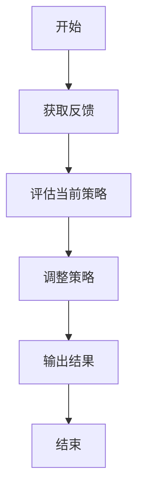
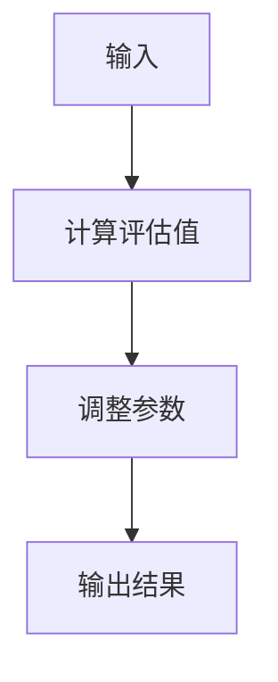

                 


```markdown
# 元认知：赋予AI Agent自我评估能力

**关键词**：元认知，AI Agent，自我评估，算法原理，系统设计，项目实战

**摘要**：  
元认知是赋予AI Agent自我评估能力的关键，通过理解元认知的基本概念、算法原理、系统设计和项目实战，我们可以深入探讨如何实现具备自我评估能力的AI Agent。本文从元认知的定义、作用、算法流程、系统架构到实际案例，全面解析元认知在AI Agent中的应用。

---

## 第一部分：元认知与AI Agent的背景介绍

### 第1章：元认知的基本概念
#### 1.1 元认知的定义与特点
- **元认知的定义**：元认知是指对自身认知过程的认知，包括对知识、思维过程和行为的监控与调节。
- **元认知的核心特点**：
  - **监控性**：能够监控自身的认知过程。
  - **调节性**：能够根据监控结果调整认知策略。
  - **元认知知识**：关于认知过程的知识，包括策略、方法和资源。

#### 1.2 元认知在AI中的作用
- **元认知在AI Agent中的应用背景**：
  - 元认知使AI Agent能够评估自身的决策过程和结果。
  - 通过元认知，AI Agent可以主动调整算法和策略，提高问题解决能力。
- **元认知与传统AI算法的区别**：
  - 传统算法依赖于预定义规则，而元认知使AI Agent具备动态调整能力。
  - 元认知增强了AI Agent的适应性和灵活性。

### 第2章：元认知与AI Agent的核心概念对比
#### 2.1 元认知与其他相关概念的对比
- **元认知与自我意识的对比**：
  - 自我意识涉及对“自我”的认知，而元认知更关注认知过程的监控与调整。
- **元认知与自适应算法的对比**：
  - 自适应算法根据反馈调整参数，而元认知涉及对整个认知过程的监控与调节。
- **元认知与反馈机制的对比**：
  - 反馈机制提供外部输入，元认知利用反馈进行内部调整。

#### 2.2 元认知的属性特征对比表格
| 特性         | 元认知               | 自我意识             | 自适应算法           |
|--------------|----------------------|----------------------|----------------------|
| 定义         | 监控与调节认知过程     | 认识自我             | 根据反馈调整参数     |
| 作用         | 提高问题解决能力       | 无                   | 改善算法性能         |
| 示例         | 元认知评估模型         | 自我反思             | 自适应神经网络       |

#### 2.3 元认知的ER实体关系图
```mermaid
erd
    Entity: 元认知
    Entity: AI Agent
    Entity: 认知过程
    Entity: 反馈机制
    Entity: 调整策略
    元认知 --> 认知过程: 监控
    元认知 --> 调整策略: 调节
    反馈机制 --> 元认知: 输入
```

---

## 第二部分：元认知的算法原理与数学模型

### 第3章：元认知算法的原理与流程
#### 3.1 元认知算法的基本原理
- **元认知的输入输出模型**：
  - 输入：AI Agent的决策过程、环境反馈。
  - 输出：对决策过程的评估、调整策略。
- **元认知的反馈机制**：
  - AI Agent通过反馈调整认知策略。
- **元认知的自适应学习过程**：
  - 根据历史数据优化元认知模型。

#### 3.2 元认知算法的流程图


### 第4章：元认知的数学模型与公式
#### 4.1 元认知评估模型的数学表达
- **公式**：$$评估值 = f(输入, 反馈, 参数)$$
- **详细解释**：评估值的计算公式及其各参数的意义，如输入向量、反馈向量和模型参数。

#### 4.2 元认知自适应算法的数学推导


---

## 第三部分：系统分析与架构设计方案

### 第5章：系统功能设计与架构
#### 5.1 问题场景介绍
- AI Agent在复杂任务中的表现评估。

#### 5.2 系统功能设计
- 数据收集模块：收集AI Agent的决策过程和结果。
- 评估模型：对决策过程进行评估。
- 反馈机制：根据评估结果调整策略。

#### 5.3 系统架构设计
- **领域模型**：使用Mermaid类图展示系统模块之间的关系。
- **架构图**：展示系统的整体结构，包括数据流和模块交互。

#### 5.4 系统接口设计
- API接口定义：如RESTful API，用于数据收集和反馈机制。

---

## 第四部分：项目实战

### 第6章：项目实战与案例分析
#### 6.1 环境安装
- 安装Python、相关库（如TensorFlow、PyTorch）。

#### 6.2 核心代码实现
- 使用Python实现元认知评估模型。

#### 6.3 代码解读与分析
- 详细解释代码的功能和实现逻辑。

#### 6.4 案例分析
- 在自然语言处理任务中应用元认知，展示如何通过反馈机制优化模型。

---

## 第五部分：总结与展望

### 第7章：总结与注意事项
#### 7.1 总结
- 元认知在AI Agent中的重要性。
- 未来发展方向：增强元认知能力，实现更智能的AI系统。

#### 7.2 注意事项
- 元认知的实现需要结合具体应用场景。
- 数据质量和反馈机制的有效性是关键。

### 第8章：拓展阅读
- 推荐相关书籍和论文，深入学习元认知和AI Agent的知识。

---

通过以上目录结构，读者可以系统地理解元认知在AI Agent中的应用，从理论到实践逐步深入，最终掌握如何赋予AI Agent自我评估能力。
```

