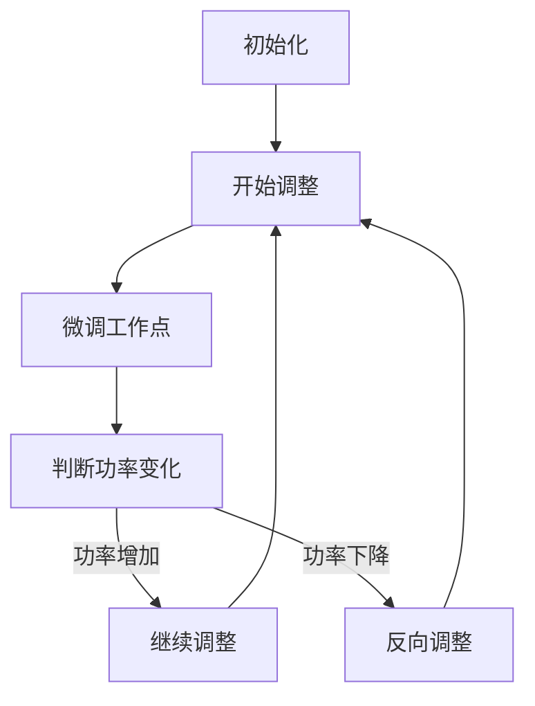
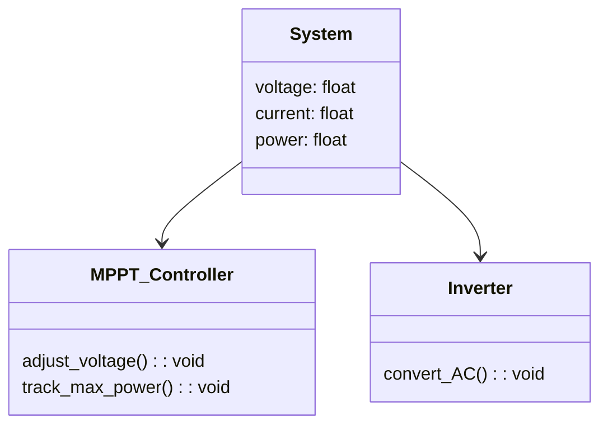
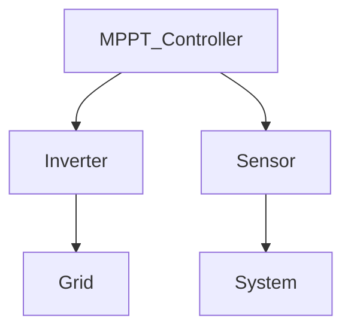
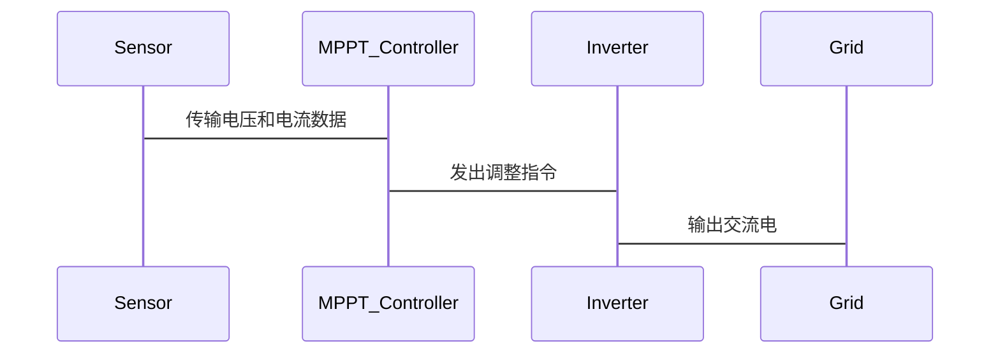

                 


# 光伏发电效率提升带来的新一轮投资机会

> 关键词：光伏发电效率，投资机会，能源转型，可再生能源，智能电网

> 摘要：随着全球能源结构转型的推进，光伏发电作为重要的可再生能源之一，其效率提升已成为行业发展的关键。本文从技术、经济和环境等多个维度分析光伏发电效率提升的必要性，并探讨其带来的投资机会。通过详细讲解高效电池技术、智能逆变器技术和系统集成优化技术，本文揭示了如何通过技术创新实现效率提升，并进一步转化为投资收益。

---

## 第一部分: 光伏发电效率提升的背景与趋势

### 第1章: 光伏发电的背景与发展

#### 1.1 全球能源结构转型的背景
- 传统能源的局限性：化石能源的不可再生性、环境污染和气候变化问题。
- 可再生能源的发展趋势：全球能源结构向清洁化、低碳化转型。
- 光伏发电在能源转型中的地位：作为可再生能源的重要组成部分，光伏发电在减少碳排放和能源安全方面起着关键作用。

#### 1.2 光伏发电技术的发展历程
- 起源与演变：从实验室研究到商业化应用的历程。
- 技术突破：高效电池技术、双面组件技术、薄膜电池技术的出现。
- 当前市场现状：全球光伏发电装机容量增长迅速，成本持续下降。

#### 1.3 光伏发电效率提升的必要性
- 提升效率对降低发电成本的意义：高效组件和系统设计可以降低单位千瓦时的成本。
- 对环境保护的重要性：提高效率意味着单位电量的碳排放更低。
- 全球碳中和目标下的效率提升需求：实现更高的效率是实现碳中和目标的关键路径之一。

### 第2章: 光伏发电效率提升的核心概念

#### 2.1 光伏发电效率的影响因素
- 光资源利用率：光照强度、角度和光谱分布对发电效率的影响。
- 转换效率：光伏组件将光能转化为电能的效率。
- 系统损耗：包括线路损耗、逆变器损耗等。

#### 2.2 光伏发电效率提升的关键技术
- 高效电池技术：如钝化发射极后接触（PERC）电池、双面电池。
- 双面组件技术：利用背面反射光提高发电效率。
- 薄膜电池技术：具有更高的转换效率潜力。

#### 2.3 光伏发电效率提升的边界与外延
- 技术边界：高效电池技术的极限和现有技术水平。
- 经济边界：提升效率的投资成本与收益的平衡点。
- 环境边界：效率提升对资源消耗和环境的影响。

---

## 第二部分: 光伏发电效率提升的技术路径

### 第3章: 高效电池技术

#### 3.1 高效电池技术的原理
- PERC电池：通过优化电池结构减少表面反射和载流子复合，提高转换效率。
- N型双面电池：双面设计可以利用背面的反射光，进一步提高效率。

#### 3.2 双面组件技术的应用
- 双面组件的安装方式：平单轴、斜单轴支架等。
- 反射光的利用：通过地面反射增加入射光，提高发电量。

#### 3.3 薄膜电池技术的优势
- 更高的转换效率潜力：实验室条件下效率可达20%以上。
- 更好的弱光性能：在低光照条件下发电效果更好。

---

## 第三部分: 光伏发电效率提升的算法与数学模型

### 第4章: 最大功率点跟踪算法（MPPT）

#### 4.1 MPPT算法的原理
- 概念：通过调整逆变器的工作状态，使光伏系统在最大功率点运行。
- 常见算法：恒定电压法、扰动观察法、爬山法。

#### 4.2 爬山法的实现步骤
1. 初始化：设置初始工作点。
2. 扰动：微调工作点，观察输出功率变化。
3. 判断：如果功率增加，则继续沿当前方向调整；如果功率下降，则反向调整。
4. 重复步骤2和3，直到达到最大功率点。

#### 4.3 爬山法的mermaid流程图


#### 4.4 爬山法的Python实现
```python
def mppt_climbing(initial_voltage, step_size):
    voltage = initial_voltage
    max_power = calculate_power(voltage)
    while True:
        voltage += step_size
        new_power = calculate_power(voltage)
        if new_power > max_power:
            max_power = new_power
        else:
            voltage -= 2 * step_size
            break
    return voltage, max_power
```

#### 4.5 数学模型：最大功率点的微分方程
$$ \frac{dP}{dV} = 0 $$

### 第5章: 㶲效率优化模型

#### 5.1 㶲效率的定义
- 㶲效率：考虑㶲损失后的效率，公式为：
$$ \eta_{ex} = \frac{W}{W + L} $$
其中，$W$ 是有用功，$L$ 是损失功。

#### 5.2 㶲效率优化的数学模型
- 最优化问题：最大化 $ \eta_{ex} $，受约束于 $ V \in [V_{min}, V_{max}] $。

#### 5.3 㶲效率优化的实现
```python
def exergy_efficiency(voltage, current):
    power = voltage * current
    losses = calculate_losses(voltage, current)
    ex_efficiency = power / (power + losses)
    return ex_efficiency

def optimize_ex_efficiency(initial_voltage, initial_current):
    max_efficiency = 0
    best_voltage = initial_voltage
    best_current = initial_current
    for v in range(initial_voltage, V_{max}+1):
        for i in range(initial_current, I_{max}+1):
            eff = exergy_efficiency(v, i)
            if eff > max_efficiency:
                max_efficiency = eff
                best_voltage = v
                best_current = i
    return best_voltage, best_current, max_efficiency
```

---

## 第四部分: 光伏发电效率提升的系统架构与设计

### 第6章: 系统架构设计

#### 6.1 智能光伏电站的系统功能设计
- 领域模型类图：


#### 6.2 系统架构设计


#### 6.3 接口设计与交互流程图


---

## 第五部分: 光伏发电效率提升的项目实战

### 第7章: 项目实战与案例分析

#### 7.1 项目环境安装
- Python和相关库的安装：
  ```bash
  pip install numpy matplotlib scipy
  ```

#### 7.2 核心代码实现
```python
import numpy as np
import matplotlib.pyplot as plt

def calculate_power(voltage, current):
    return voltage * current

voltage = np.linspace(0, 1000, 1000)
current = np.random.uniform(0.1, 0.5, 1000)
power = calculate_power(voltage, current)

plt.plot(voltage, power)
plt.xlabel('Voltage (V)')
plt.ylabel('Power (W)')
plt.show()
```

#### 7.3 实际案例分析
- 某电站改造前后对比：
  - 改造前：效率为15%，年发电量为100万千瓦时。
  - 改造后：效率提升至20%，年发电量增加至133万千瓦时，投资回报期为3年。

#### 7.4 项目小结
- 技术提升的效果显著。
- 投资回报周期短，经济效益明显。

---

## 第六部分: 光伏发电效率提升的投资机会与总结

### 第8章: 投资机会与总结

#### 8.1 投资策略
- 重点关注高效电池技术和智能逆变器技术。
- 投资光伏电站改造项目，提升系统效率。

#### 8.2 技术选型建议
- 根据地理位置选择适合的组件类型。
- 优先采用具有高效率和低损耗的设备。

#### 8.3 长期发展建议
- 加强技术研发，推动技术进步。
- 提高公众对光伏发电的认知，促进市场发展。

#### 8.4 风险与挑战
- 技术更新快，投资需谨慎。
- 政策变化可能影响收益。

---

## 结语

光伏发电效率的提升不仅是技术发展的必然趋势，也是实现碳中和目标的重要途径。通过技术创新和投资优化，光伏发电将带来巨大的投资机会和经济效益。未来，随着技术的进一步发展，光伏发电将在全球能源结构中占据更重要的地位，为投资者带来丰厚的回报。

---

以上是文章的完整目录和内容结构，您可以根据需要进一步扩展每个部分的具体内容。

