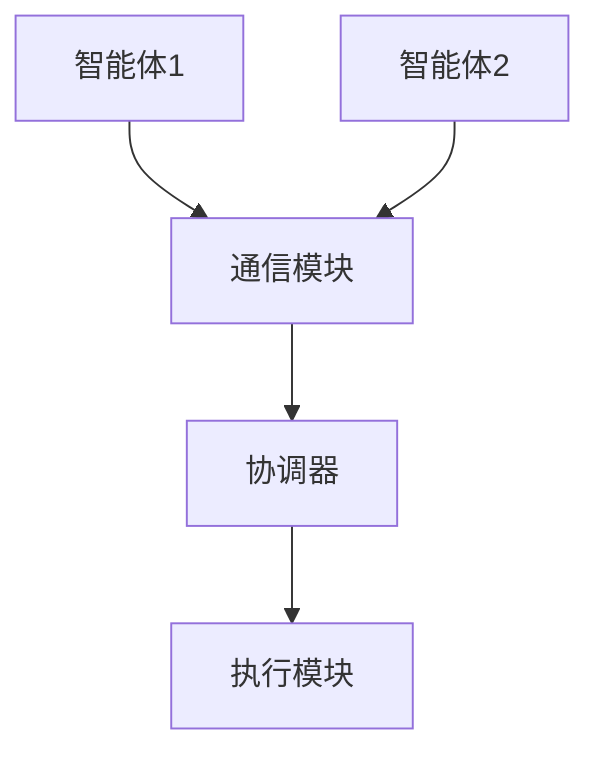

                 


# 克服AI Agent开发挑战：常见问题及其解决方案

> 关键词：AI Agent，开发挑战，解决方案，系统设计，算法原理，项目实战

> 摘要：本文深入探讨了AI Agent开发中的常见问题，并提供了一系列解决方案。通过分析AI Agent的核心概念、算法原理、系统架构设计以及实际项目案例，本文为开发者提供了从理论到实践的全面指导，帮助他们克服开发中的各种挑战。

---

## 第一部分：AI Agent开发背景与挑战

### 1. AI Agent的核心概念与背景

#### 1.1 AI Agent的定义
AI Agent（人工智能代理）是一种能够感知环境、自主决策并执行任务的智能实体。它通过传感器获取信息，利用推理能力做出决策，并通过执行器与环境交互。AI Agent可以是软件程序、机器人或其他智能系统。

#### 1.2 AI Agent的核心特征
- **自主性**：AI Agent能够在没有外部干预的情况下自主运行。
- **反应性**：能够实时感知环境变化并做出响应。
- **学习能力**：通过数据和经验不断优化自身性能。
- **社交能力**：能够在多智能体系统中与其他智能体或人类进行协作或竞争。

#### 1.3 AI Agent的分类与应用场景
AI Agent可以根据功能、智能水平和环境类型进行分类：

- **按功能分类**：推理型、规划型、学习型、反应型。
- **按智能水平分类**：简单规则型、复杂规则型、半自主型、完全自主型。
- **按环境类型分类**：静态环境、动态环境、确定性环境、不确定性环境。

应用场景包括自动驾驶、智能助手（如Siri、Alexa）、智能推荐系统、机器人控制等。

---

### 2. AI Agent开发中的常见问题

#### 2.1 数据获取与处理
- **问题**：AI Agent需要依赖高质量的数据进行训练和推理，但数据获取困难、数据质量不高或数据量不足是常见问题。
- **解决方案**：
  - 使用数据增强技术（Data Augmentation）扩充数据集。
  - 利用迁移学习（Transfer Learning）技术，从预训练模型中继承知识。
  - 采用主动学习（Active Learning），通过选择性采样提高数据利用率。

#### 2.2 模型训练与优化
- **问题**：模型训练时间长、训练效果不佳、计算资源不足。
- **解决方案**：
  - 使用分布式计算框架（如Spark、Distributed TensorFlow）加速训练。
  - 应用模型压缩和剪枝技术（Model Pruning）减少计算开销。
  - 利用强化学习（Reinforcement Learning）优化模型参数。

#### 2.3 系统集成与部署
- **问题**：AI Agent需要与其他系统、设备或服务集成，但接口不兼容、通信延迟或安全性问题可能导致系统不稳定。
- **解决方案**：
  - 制定统一的接口标准，确保不同模块之间的兼容性。
  - 采用边缘计算（Edge Computing）技术，减少通信延迟。
  - 使用加密技术和访问控制机制保障系统安全性。

---

## 第二部分：AI Agent的核心概念与原理

### 3. 知识表示与推理

#### 3.1 知识表示
知识表示是AI Agent理解世界的基础。常用的表示方法包括：
- **逻辑表示**：使用谓词逻辑（Predicate Logic）表示事实和规则。
- **语义网络**：通过节点和边表示概念及其关系。
- **本体论（Ontology）**：定义领域内的概念、关系和属性。

#### 3.2 推理算法
推理算法帮助AI Agent从已知事实中推导出新结论。常见的推理算法包括：
- **逻辑推理**：基于命题逻辑或谓词逻辑进行推理。
- **概率推理**：利用贝叶斯网络（Bayesian Network）进行概率计算。
- **模糊推理**：处理模糊信息的推理方法。

**示例**：使用贝叶斯网络进行推理的步骤如下：

1. 构建贝叶斯网络，定义变量之间的依赖关系。
2. 根据观测数据更新变量的概率分布。
3. 基于概率分布进行推理，得出结论。

---

### 4. 行为规划与决策

#### 4.1 行为规划
行为规划是AI Agent根据目标和环境状态制定行动计划的过程。常见的规划方法包括：
- **基于规则的规划**：通过预定义的规则生成动作。
- **基于搜索的规划**：利用搜索算法（如A*、Dijkstra）寻找最优路径。
- **基于强化学习的规划**：通过试错学习优化决策策略。

#### 4.2 决策算法
决策算法帮助AI Agent在多个选项中选择最优动作。常用的决策算法包括：
- **Q-Learning**：一种基于值迭代的强化学习算法，通过更新Q值表来优化决策。
- **策略梯度方法**：通过优化策略函数直接获得最优动作。
- **马尔可夫决策过程（MDP）**：将环境建模为状态、动作、奖励和转移概率的组合。

**示例**：Q-Learning算法的伪代码如下：

```python
初始化Q表为全零矩阵
设置学习率α和折扣因子γ
while 未达到终止条件：
    状态s = 当前状态
    动作a = 选择一个动作（ε-greedy策略）
    执行动作a，获得奖励r和下一个状态s'
    Q(s, a) = Q(s, a) + α * (r + γ * max(Q(s', a')) - Q(s, a))
```

---

## 第三部分：AI Agent的系统设计与实现

### 5. 系统架构设计

#### 5.1 分层体系结构
AI Agent的系统架构通常采用分层设计，包括感知层、决策层和执行层：
- **感知层**：负责感知环境信息，如传感器数据。
- **决策层**：负责分析信息并制定决策。
- **执行层**：负责执行决策，如发送指令或控制设备。

#### 5.2 多智能体系统
在多智能体系统中，多个AI Agent需要协同工作。常见的协同机制包括：
- **分布式协作**：每个智能体独立决策，通过通信协议进行协作。
- **集中式协作**：由一个中央协调器分配任务并协调各智能体的行为。

**示例**：使用通信协议进行多智能体协作的流程图如下：



---

### 6. 项目实战：开发一个多轮对话系统

#### 6.1 项目背景
开发一个多轮对话系统，目标是实现一个能够与用户进行自然对话的AI Agent。

#### 6.2 环境安装
安装必要的库和工具：
```bash
pip install numpy tensorflow keras transformers
```

#### 6.3 核心代码实现
实现基于Transformer的对话模型：
```python
import tensorflow as tf
from tensorflow.keras.layers import Input, Dense, LSTM, Dropout, Bidirectional
from tensorflow.keras.models import Model

# 定义模型输入
inputs = Input(shape=(None, 128))
# 双向LSTM层
lstm = Bidirectional(LSTM(64, return_sequences=True))(inputs)
# 添加Dropout层防止过拟合
dropout = Dropout(0.5)(lstm)
# 全连接层
dense = Dense(64, activation='relu')(dropout)
# 输出层
outputs = Dense(1, activation='sigmoid')(dense)

# 编译模型
model = Model(inputs=inputs, outputs=outputs)
model.compile(optimizer='adam', loss='binary_crossentropy', metrics=['accuracy'])
```

#### 6.4 案例分析
通过实际对话测试模型的性能，分析其优点和不足，并根据测试结果优化模型参数。

---

## 第四部分：最佳实践与总结

### 7. 最佳实践

#### 7.1 数据处理
- 确保数据的多样性和代表性。
- 使用数据清洗和特征工程提高模型性能。

#### 7.2 模型优化
- 使用交叉验证和超参数调优提高模型泛化能力。
- 采用模型融合技术（如Stacking、Blending）提升性能。

#### 7.3 系统集成
- 制定统一的接口标准，确保模块间的兼容性。
- 使用容错机制处理系统异常。

### 8. 小结
AI Agent的开发涉及多个方面的知识，从数据处理到模型训练，再到系统集成，每一步都需要仔细设计和优化。通过理解AI Agent的核心概念、掌握算法原理和系统设计方法，开发者可以有效克服开发中的各种挑战。

---

## 第五部分：拓展阅读与参考文献

### 8. 拓展阅读
- 《Deep Learning》——Ian Goodfellow
- 《Reinforcement Learning: Theory and Algorithms》—— Sutton 和 Barto
- 《Multi-Agent Systems: Algorithmic, Game-Theoretic, and Modal Logic Foundations》—— Wooldridge

---

通过本文的系统讲解，读者可以全面了解AI Agent开发中的常见问题，并掌握相应的解决方案。希望本文能够为AI Agent的开发者提供有价值的参考和指导。

