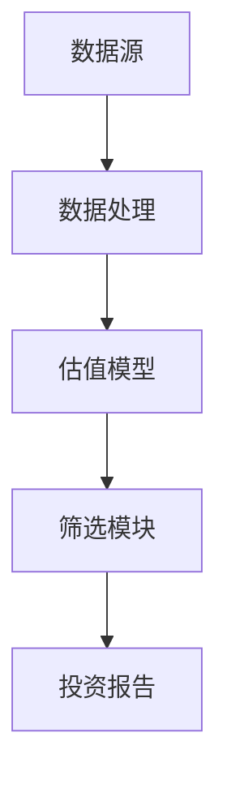

                 


# 小盘股价值投资策略：克里斯托弗·布朗的方法与实现

## 关键词
- 小盘股投资
- 价值投资
- 克里斯托弗·布朗
- 估值模型
- 安全边际
- 投资策略

## 摘要
克里斯托弗·布朗的小盘股价值投资策略是一种基于基本面分析和安全边际的投资方法，旨在从小盘股中发现被市场低估的投资机会。本文系统地介绍了小盘股的定义、特点、价值投资的核心概念，详细讲解了布朗的投资策略及其与其他价值投资者的比较。通过数学模型和系统架构的设计，本文展示了如何利用DCF模型、市盈率和市净率等指标进行估值，并结合安全边际和竞争优势分析筛选出优质标的。最后，通过实际案例分析和代码实现，本文为读者提供了可操作的投资策略，并总结了最佳实践和注意事项。

---

# 第一部分: 小盘股价值投资的背景与概念

## 第1章: 小盘股的定义与特点

### 1.1 小盘股的定义与特点

#### 1.1.1 小盘股的定义
小盘股是指市值较小的公司股票，通常指市值在 $100 million 到 $2 billion 之间的公司。与大盘股相比，小盘股具有较高的波动性和潜在的高增长性。

#### 1.1.2 小盘股市场的特点
- 市场流动性较低
- 公司规模较小
- 增长潜力较高
- 波动性较大
- 市场关注度较低

#### 1.1.3 小盘股与大盘股的区别
| 属性 | 大盘股 | 小盘股 |
|------|--------|--------|
| 市值  | 高     | 低     |
| 流动性 | 高     | 低     |
| 波动性 | 低     | 高     |
| 增长潜力 | 中 | 高 |

---

## 第2章: 价值投资的核心概念

### 2.1 价值投资的定义
价值投资是一种投资策略，旨在通过寻找市场价格低于其内在价值的股票，长期持有以实现超额收益。

### 2.2 小盘股价值投资的核心原则
- 安全边际：买入价格低于内在价值。
- 财务健康：关注企业的盈利能力、资产负债表和现金流。
- 竞争优势：选择具有竞争优势的企业。

### 2.3 克里斯托弗·布朗的投资策略
克里斯托弗·布朗专注于小盘股投资，注重基本面分析和安全边际。他通过以下步骤筛选股票：
1. 筛选市值较小的公司。
2. 分析财务报表，评估企业的盈利能力和财务健康状况。
3. 计算内在价值，寻找价格低于内在价值的股票。
4. 选择具有竞争优势的企业。

---

# 第二部分: 小盘股价值投资的核心概念与方法

## 第3章: 小盘股价值评估的核心指标

### 3.1 基本面分析的关键指标
- 市盈率（P/E）：市盈率 = 股价 / 每股净利润。
- 市净率（P/B）：市净率 = 股价 / 每股净资产。
- 股息率：股息率 = 每股股息 / 股价。
- 赢利能力指标：ROE（净资产收益率）和 ROA（资产回报率）。

### 3.2 小盘股估值模型

#### 3.2.1 现金流折现模型（DCF）
DCF模型通过将未来现金流折现，计算企业的内在价值。

公式：
$$DCF = \sum_{t=1}^{n} \frac{CF_t}{(1+r)^t} + \frac{TV}{(1+r)^n}$$

其中：
- $CF_t$ 是第 $t$ 年的现金流。
- $r$ 是折现率。
- $TV$ 是终值。

#### 3.2.2 市盈率模型
$$\text{内在价值} = \text{净利润} \times \text{目标市盈率}$$

#### 3.2.3 市净率模型
$$\text{内在价值} = \text{每股净资产} \times \text{目标市净率}$$

### 3.3 安全边际
安全边际 = 内在价值 - 市场价格。

---

## 第4章: 小盘股投资中的竞争优势分析

### 4.1 企业的竞争优势
- 技术优势
- 市场领先地位
- 低成本优势

### 4.2 财务健康状况
- 低负债率
- 稳定的现金流
- 高利润率

### 4.3 管理团队
- 经验丰富的管理团队
- 良好的治理结构

---

# 第三部分: 小盘股价值投资的数学模型与算法原理

## 第5章: 小盘股价值评估的数学模型

### 5.1 DCF模型的实现
代码实现：
```python
def dcf_model(cash_flows, discount_rate, terminal_value):
    present_value = 0
    for t in range(len(cash_flows)):
        if t == 0:
            cf = cash_flows[t]
        else:
            cf = cash_flows[t] / (1 + discount_rate) ** t
        present_value += cf
    present_value += terminal_value / (1 + discount_rate) ** len(cash_flows)
    return present_value

# 示例
cash_flows = [100, 150, 200, 250]
discount_rate = 0.1
terminal_value = 500
intrinsic_value = dcf_model(cash_flows, discount_rate, terminal_value)
print(f"DCF模型计算的内在价值为：{intrinsic_value}")
```

### 5.2 市盈率与市净率模型
- 市盈率模型：$ \text{目标价格} = \text{净利润} \times \text{目标市盈率} $
- 市净率模型：$ \text{目标价格} = \text{每股净资产} \times \text{目标市净率} $

---

## 第6章: 小盘股投资系统的架构设计

### 6.1 系统功能设计
- 数据收集：收集小盘股的基本面数据。
- 估值模型：计算股票的内在价值。
- 筛选模块：筛选出符合安全边际的股票。
- 报告生成：生成投资报告。

### 6.2 系统架构图


---

## 第7章: 项目实战

### 7.1 环境安装
安装必要的库：
```bash
pip install pandas numpy matplotlib
```

### 7.2 核心实现代码
```python
import pandas as pd
import numpy as np

def calculate_intrinsic_value(financial_data, discount_rate, terminal_value):
    cash_flows = financial_data['现金流']
    present_value = sum(cash_flows / (1 + discount_rate) ** t for t in range(len(cash_flows)))
    present_value += terminal_value / (1 + discount_rate) ** len(cash_flows)
    return present_value

# 示例数据
data = {
    '现金流': [100, 150, 200],
    '净利润': 50,
    '每股净资产': 20,
    '市盈率': 15,
    '市净率': 2
}

df = pd.DataFrame(data)
intrinsic_value = calculate_intrinsic_value(data, 0.1, 600)
print(f"DCF模型计算的内在价值为：{intrinsic_value}")
```

---

## 第8章: 总结与最佳实践

### 8.1 总结
小盘股价值投资需要结合基本面分析和数学模型，通过安全边际筛选出优质的标的。

### 8.2 最佳实践
- 定期复盘投资组合。
- 保持长期视角，耐心持有。
- 风险控制：分散投资，避免过度集中。

### 8.3 注意事项
- 小盘股波动较大，需注意市场风险。
- 数据来源要可靠，避免信息偏差。
- 定期更新估值模型，适应市场变化。

### 8.4 拓展阅读
- 《小盘股投资指南》
- 克里斯托弗·布朗的书籍推荐

---

通过以上步骤，克里斯托弗·布朗的小盘股价值投资策略得以系统化和实现。读者可以结合实际案例，利用代码和数学模型，找到优质的小盘股投资机会。

