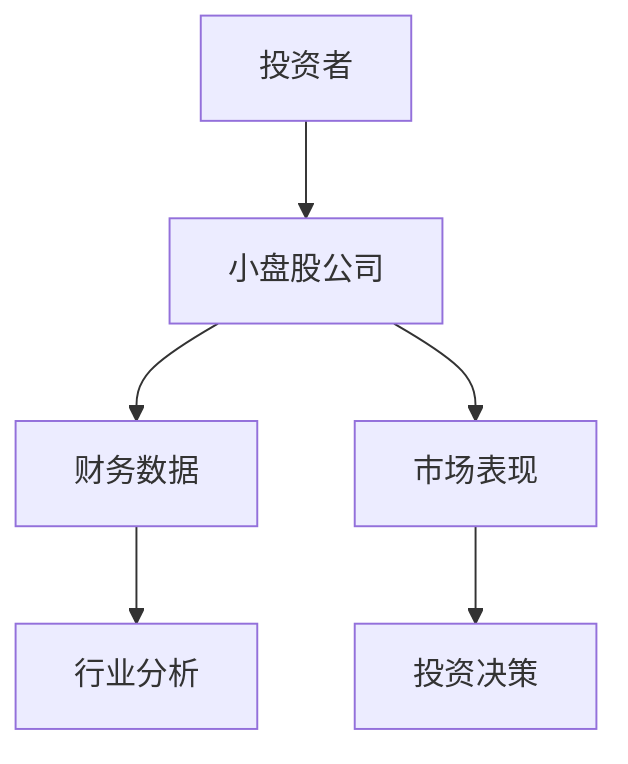
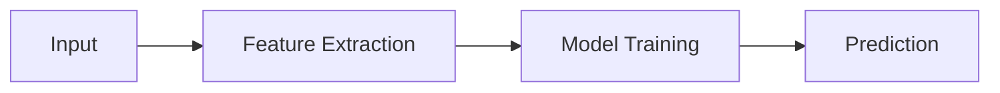

                 


# 克里斯托弗·布朗的小盘股研究方法论

> 关键词：小盘股研究、投资策略、因子分析、机器学习、时间序列分析

> 摘要：克里斯托弗·布朗的小盘股研究方法论是一种系统化的投资策略，旨在通过数据分析和算法优化来识别具有潜力的小盘股。本文详细介绍了小盘股市场的特点、研究方法的核心概念、算法原理、系统架构设计以及实际项目实战，为投资者提供科学的决策支持。

---

## 第一部分: 小盘股研究方法论概述

### 第1章: 小盘股研究的背景与意义

#### 1.1 小盘股市场的定义与特点

##### 1.1.1 小盘股市场的定义
小盘股市场指的是市值较小的公司股票组成的市场。通常，小盘股的定义是市值在1亿至10亿美元之间的公司。与大盘股相比，小盘股具有更高的成长潜力和波动性。

##### 1.1.2 小盘股市场的特点
- **高波动性**：小盘股市场的股票价格波动较大，容易受到市场情绪和外部环境的影响。
- **高成长性**：小盘股公司通常处于成长阶段，具有较高的增长潜力。
- **流动性较低**：小盘股市场的交易量相对较小，流动性较低，可能导致买卖价差较大。
- **风险较高**：小盘股市场的投资风险较高，但回报潜力也更大。

##### 1.1.3 小盘股市场与大盘股市场的区别
- **市场规模**：大盘股市场由市值较大的公司组成，而小盘股市场则由市值较小的公司组成。
- **波动性**：小盘股市场的波动性较高，而大盘股市场的波动性相对较低。
- **投资者参与度**：大盘股市场通常有更多的机构投资者参与，而小盘股市场则更多由个人投资者参与。

#### 1.2 小盘股研究的重要性

##### 1.2.1 小盘股市场的投资机会
小盘股市场中存在许多具有成长潜力的公司，尤其是在新兴行业或细分市场中，这些公司有可能在未来成为行业龙头。

##### 1.2.2 小盘股市场风险与回报的平衡
尽管小盘股市场的风险较高，但其回报潜力也更大。通过科学的研究方法，可以在一定程度上平衡风险与回报。

##### 1.2.3 小盘股研究对投资者的价值
小盘股研究可以帮助投资者识别具有潜力的公司，制定合理的投资策略，提高投资回报率。

#### 1.3 克里斯托弗·布朗的研究方法论背景

##### 1.3.1 克里斯托弗·布朗的学术背景
克里斯托弗·布朗是一位著名的小盘股研究专家，他的研究方法结合了统计学、金融学和计算机科学，形成了独特的投资策略。

##### 1.3.2 小盘股研究的现状与挑战
尽管小盘股市场潜力巨大，但其研究面临数据获取困难、市场波动性大、投资风险高等挑战。

##### 1.3.3 克里斯托弗·布朗方法论的核心思想
克里斯托弗·布朗的方法论强调通过数据分析和算法优化，识别具有成长潜力的小盘股公司。

---

### 第2章: 小盘股研究的核心概念与联系

#### 2.1 核心概念的定义与属性对比

##### 2.1.1 小盘股的定义与属性对比
| 属性         | 大盘股      | 小盘股      |
|--------------|------------|------------|
| 市值范围     | 大于10亿   | 1亿至10亿  |
| 波动性       | 较低       | 较高       |
| 成长潜力     | 较低       | 较高       |
| 投资风险     | 较低       | 较高       |

##### 2.1.2 市场资本化规模的分类
- **微小盘股**：市值在1亿至5亿美元之间。
- **小盘股**：市值在5亿至10亿美元之间。
- **中盘股**：市值在10亿至50亿美元之间。
- **大盘股**：市值在50亿美元以上。

##### 2.1.3 小盘股与大盘股的比较分析
- **投资目标**：小盘股适合追求高成长的投资者，而大盘股适合追求稳定收益的投资者。
- **风险与回报**：小盘股风险较高，回报潜力大；大盘股风险较低，回报稳定。

#### 2.2 小盘股研究的ER实体关系图



#### 2.3 小盘股研究的核心要素组成

##### 2.3.1 财务数据的收集与分析
- **财务数据**：包括收入、利润、资产负债表等。
- **分析方法**：使用财务指标（如市盈率、市净率）进行估值。

##### 2.3.2 市场表现的量化指标
- **股价走势**：通过时间序列分析预测股价趋势。
- **波动率**：衡量股票价格的波动性。

##### 2.3.3 行业分析与竞争环境
- **行业分析**：分析小盘股公司所处的行业环境，包括市场规模、竞争对手等。
- **竞争优势**：评估公司的核心竞争力。

---

### 第3章: 小盘股研究的算法原理

#### 3.1 小盘股研究的核心算法

##### 3.1.1 基于因子分析的选股策略
- **因子分析**：通过统计方法提取影响股票收益的关键因子。
- **选股策略**：根据因子得分筛选具有潜力的股票。

##### 3.1.2 基于机器学习的预测模型
- **机器学习**：使用算法（如随机森林、支持向量机）预测股票价格。
- **特征工程**：提取有用的特征变量，提高模型准确性。

##### 3.1.3 时间序列分析与趋势预测
- **时间序列分析**：通过ARIMA模型预测股票价格走势。
- **趋势预测**：结合历史数据和市场情绪进行预测。

#### 3.2 算法原理的数学模型

##### 3.2.1 因子分析模型
$$ F = \alpha + \beta R_m + \gamma Size + \epsilon $$
其中：
- \( F \) 表示因子得分
- \( \alpha \) 是截距
- \( \beta \) 是市场回报的回归系数
- \( R_m \) 是市场回报率
- \( \gamma \) 是公司规模的回归系数
- \( Size \) 是公司规模
- \( \epsilon \) 是误差项

##### 3.2.2 机器学习模型


---

### 第4章: 小盘股研究的系统分析与架构设计

#### 4.1 系统分析

##### 4.1.1 小盘股研究的项目目标
- **目标**：开发一套小盘股研究系统，帮助投资者进行选股和投资决策。

##### 4.1.2 系统功能需求分析
- **数据采集**：收集小盘股公司的财务数据和市场数据。
- **数据分析**：进行因子分析、机器学习预测等。
- **结果展示**：生成投资报告和预测结果。

##### 4.1.3 系统的边界与范围
- **边界**：仅限于小盘股市场研究，不包括大盘股和其他市场。
- **范围**：包括数据采集、分析、预测和报告生成。

#### 4.2 系统架构设计

##### 4.2.1 系统架构的分层设计
- **数据层**：存储和管理数据。
- **业务逻辑层**：处理数据分析和预测。
- **用户界面层**：展示结果和用户交互。

##### 4.2.2 数据流的交互设计
- **数据输入**：用户输入查询条件。
- **数据处理**：系统进行数据分析和预测。
- **结果输出**：系统输出投资建议。

##### 4.2.3 系统的模块划分与职责
- **数据采集模块**：负责数据的采集和清洗。
- **数据分析模块**：负责数据分析和预测。
- **结果展示模块**：负责生成报告和可视化。

#### 4.3 系统接口设计

##### 4.3.1 数据接口的设计
- **数据接口**：与数据源（如金融数据库）对接。
- **数据格式**：使用JSON或CSV格式传输数据。

##### 4.3.2 用户接口的设计
- **用户界面**：提供友好的用户界面，方便用户操作。
- **交互设计**：支持用户输入查询条件和查看结果。

##### 4.3.3 系统与外部数据源的接口
- **数据源**：包括金融数据库、市场数据源等。
- **接口协议**：使用RESTful API进行数据传输。

---

### 第5章: 小盘股研究的项目实战

#### 5.1 环境安装与配置

##### 5.1.1 系统运行环境
- **操作系统**：Windows 10或更高版本。
- **开发工具**：PyCharm或Jupyter Notebook。
- **依赖库**：安装pandas、numpy、scikit-learn等Python库。

##### 5.1.2 数据源配置
- **数据获取**：使用Yahoo Finance API获取小盘股数据。
- **数据存储**：将数据存储在CSV文件或数据库中。

#### 5.2 系统核心实现源代码

##### 5.2.1 数据采集模块
```python
import pandas as pd
from pandas_datareader import data as pdr

# 获取小盘股数据
def get_small_cap_data(tickers):
    data = pd.DataFrame()
    for ticker in tickers:
        df = pdr.get_data_yahoo(ticker, start='2020-01-01', end='2023-12-31')
        data[ticker] = df['Close']
    return data

tickers = ['AAPL', 'MSFT', 'GOOGL']
data = get_small_cap_data(tickers)
print(data.head())
```

##### 5.2.2 数据分析模块
```python
from sklearn.ensemble import RandomForestRegressor
from sklearn.model_selection import train_test_split

# 数据预处理
def preprocess_data(data):
    # 假设data是包含股票收盘价的数据框
    # 这里仅展示简单预处理，实际可能需要更复杂的特征工程
    return data

# 训练随机森林模型
def train_model(data, target):
    X = data.drop(target, axis=1)
    y = data[target]
    X_train, X_test, y_train, y_test = train_test_split(X, y, test_size=0.2, random_state=42)
    model = RandomForestRegressor(n_estimators=100, random_state=42)
    model.fit(X_train, y_train)
    return model

# 应用模型进行预测
def predict_price(model, data):
    data_preprocessed = preprocess_data(data)
    predictions = model.predict(data_preprocessed)
    return predictions

# 示例代码
data = pd.DataFrame({'Close': [10, 20, 30, 40, 50]})
target = 'Close'
model = train_model(data, target)
predictions = predict_price(model, data)
print("预测结果：", predictions)
```

#### 5.3 案例分析与结果解读

##### 5.3.1 案例分析
假设我们选取了几只小盘股，使用因子分析和机器学习模型进行预测，最终得出投资建议。

##### 5.3.2 结果解读
- **因子分析结果**：显示哪些因子对股票收益影响较大。
- **机器学习预测结果**：预测未来一段时间内的股票价格走势。

#### 5.4 项目小结

##### 5.4.1 项目总结
通过本项目，我们成功开发了一套小盘股研究系统，能够帮助投资者进行选股和投资决策。

##### 5.4.2 经验总结
- **数据质量**：数据的质量直接影响模型的准确性。
- **模型选择**：选择合适的算法可以提高预测精度。
- **风险管理**：在投资过程中，风险管理至关重要。

---

## 第六章: 总结与展望

### 6.1 总结

#### 6.1.1 核心思想回顾
克里斯托弗·布朗的小盘股研究方法论通过数据分析和算法优化，帮助投资者识别具有潜力的小盘股公司。

#### 6.1.2 方法论的优缺点
- **优点**：科学性强，能够提高投资效率。
- **缺点**：需要大量数据和计算资源。

### 6.2 展望

#### 6.2.1 小盘股研究的未来发展方向
- **人工智能**：进一步利用AI技术提高预测精度。
- **大数据分析**：利用更多的数据源进行分析。
- **风险管理**：开发更有效的风险管理策略。

#### 6.2.2 克里斯托弗·布朗方法论的未来应用
- **智能化投资**：结合AI技术实现自动化投资。
- **个性化投资**：根据投资者的风险偏好提供定制化建议。

---

## 第七章: 最佳实践与注意事项

### 7.1 最佳实践 tips

#### 7.1.1 数据采集
- 确保数据的准确性和完整性。
- 使用多个数据源进行交叉验证。

#### 7.1.2 模型选择
- 根据数据特点选择合适的算法。
- 多模型对比，选择最优方案。

#### 7.1.3 风险管理
- 设定止损点，控制投资风险。
- 定期评估投资组合，及时调整。

### 7.2 注意事项

#### 7.2.1 数据质量问题
- 数据缺失或异常值会影响模型的准确性。
- 需要进行数据清洗和预处理。

#### 7.2.2 模型过拟合
- 避免模型过拟合，选择合适的正则化参数。
- 使用交叉验证评估模型性能。

#### 7.2.3 市场波动性
- 小盘股市场的波动性较高，需做好心理准备。
- 定期跟踪市场动态，及时调整投资策略。

### 7.3 拓展阅读

#### 7.3.1 推荐书籍
- 《投资学》（书籍名称）
- 《数据挖掘与机器学习在金融中的应用》（书籍名称）

#### 7.3.2 推荐博客
- [金融数据分析博客](http://example.com)
- [机器学习在投资中的应用博客](http://example.com)

---

通过本文的详细讲解，我们全面介绍了克里斯托弗·布朗的小盘股研究方法论，从背景、核心概念、算法原理到系统设计和项目实战，为投资者提供了一套科学的投资策略。希望本文能为小盘股研究领域提供有价值的参考和指导。

