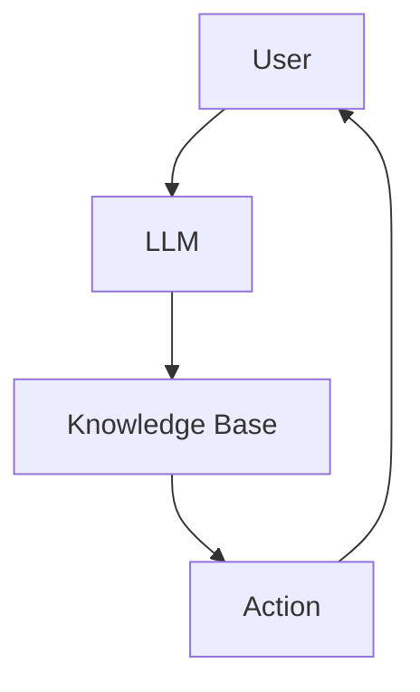
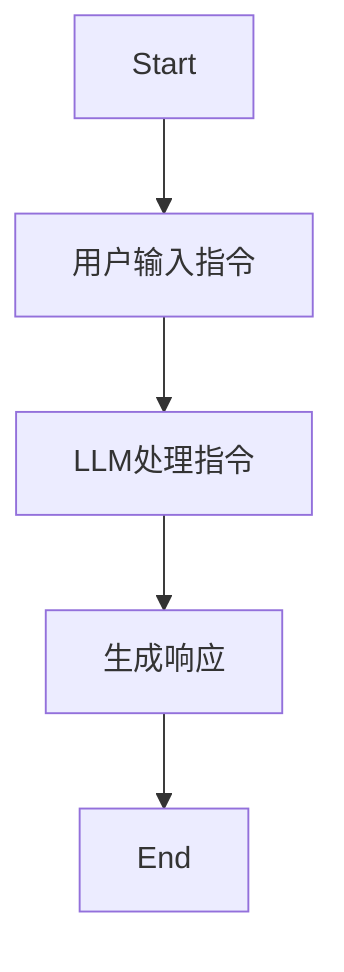
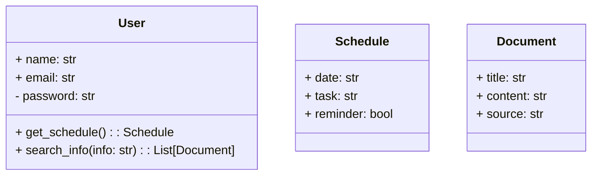

                 


# 全方位生活助手AI Agent：LLM驱动的个人管理系统

## 关键词
AI Agent, LLM, 个人管理系统, 人工智能, 自然语言处理, 算法原理, 系统架构

## 摘要
在现代生活中，个人管理系统的效率直接影响着我们的生活质量。传统的管理工具逐渐显现出其局限性，而AI Agent，特别是由大语言模型（LLM）驱动的AI Agent，为个人管理带来了革命性的变化。本文将从背景介绍、核心概念、算法原理、系统架构到项目实战，全方位解析这一创新技术。通过详细的技术分析和实例展示，我们将探讨如何利用AI Agent提升个人管理效率，实现真正的全方位生活助手。

---

# 第一部分：背景介绍

## 第1章：AI Agent与LLM驱动的个人管理概述

### 1.1 问题背景
在当今快节奏的生活中，个人时间管理、任务安排和信息处理的复杂性日益增加。传统的方法，如手写笔记、电子表格和简单的任务管理软件，难以满足现代人对高效、智能管理的需求。人们需要一种能够理解上下文、主动提供解决方案，并能够持续学习和优化的工具。

### 1.2 问题描述
传统个人管理工具存在以下问题：
- **信息孤岛**：无法整合来自不同来源的数据。
- **被动性**：需要用户主动输入指令，无法主动提供帮助。
- **缺乏深度理解**：难以理解和处理复杂的语义信息。

AI Agent，尤其是基于大语言模型（LLM）的AI Agent，能够通过自然语言处理技术，理解用户的意图，并主动提供个性化的解决方案。这使得AI Agent成为解决上述问题的理想选择。

### 1.3 问题解决
AI Agent通过以下方式实现对个人管理的支持：
- **自然语言交互**：用户可以通过简单的语言指令与系统交互。
- **上下文理解**：系统能够理解上下文，提供更智能的建议。
- **主动学习**：系统能够通过不断的学习和优化，提供更精准的服务。

### 1.4 边界与外延
AI Agent的应用范围包括但不限于：
- **时间管理**：任务安排、日程提醒。
- **信息管理**：信息整理、知识库构建。
- **决策支持**：提供数据驱动的决策建议。

与传统任务管理工具相比，AI Agent的优势在于其智能化和主动性。它不仅能够执行任务，还能通过学习不断优化服务。

### 1.5 概念结构与核心要素
AI Agent的核心组成包括：
- **用户界面**：用于用户与系统交互。
- **自然语言处理引擎**：负责理解和生成自然语言。
- **知识库**：存储和管理相关信息。
- **学习模块**：通过反馈不断优化服务。

---

# 第二部分：核心概念与联系

## 第2章：AI Agent与LLM的核心概念

### 2.1 核心概念原理
AI Agent的核心原理在于其对自然语言的理解和生成能力。LLM通过处理大量文本数据，掌握了语言的规律和语义信息。当用户输入指令时，LLM能够生成相应的响应，从而实现与用户的交互。

### 2.2 概念属性特征对比
以下是AI Agent与传统任务管理工具的对比分析：

| 特性             | AI Agent                          | 传统任务管理工具                     |
|------------------|-----------------------------------|--------------------------------------|
| **交互方式**     | 自然语言交互                     | 命令式交互                           |
| **主动性**       | 主动提供解决方案                 | 被动响应指令                         |
| **学习能力**     | 能够通过反馈学习                 | 无法学习                             |
| **智能化程度**   | 高                                | 低                                   |

### 2.3 ER实体关系图
以下是AI Agent的实体关系图（Mermaid流程图）：



说明：
- **User**：用户输入指令。
- **LLM**：处理用户的指令，生成响应。
- **Knowledge Base**：存储和管理相关知识。
- **Action**：执行具体的操作或提供反馈。

---

# 第三部分：算法原理讲解

## 第3章：LLM驱动的AI Agent算法原理

### 3.1 算法流程
以下是LLM驱动的AI Agent算法流程图（Mermaid）：



算法实现步骤如下：
1. **输入处理**：用户通过自然语言输入指令。
2. **模型处理**：LLM解析指令，生成响应。
3. **输出结果**：系统将响应返回给用户。

### 3.2 算法实现
以下是Python实现示例代码：

```python
def ai_agent_response(prompt):
    # 处理用户的输入
    response = llm.generate_response(prompt)
    return response

# 示例用法
user_input = "提醒我明天早上8点开会"
print(ai_agent_response(user_input))
```

代码说明：
- `llm.generate_response(prompt)`：调用大语言模型生成响应。
- `user_input`：用户的输入指令。

---

# 第四部分：数学模型与公式

## 第4章：LLM的数学模型与公式

### 4.1 概率分布模型
大语言模型通常基于概率分布生成文本。以下是一个简单的概率分布公式：

$$ P(w_i | w_{i-1}, ..., w_{i-n}) $$

其中，$w_i$ 表示当前词，$w_{i-1}, ..., w_{i-n}$ 表示之前的词。

### 4.2 损失函数
模型的损失函数通常采用交叉熵损失：

$$ \mathcal{L} = -\sum_{i=1}^{N} \log P(w_i | \text{之前的词}) $$

---

# 第五部分：系统分析与架构设计

## 第5章：系统架构与设计

### 5.1 问题场景介绍
用户需要一个能够处理多种任务的个人管理系统，包括日程安排、信息检索和决策支持。

### 5.2 系统功能设计
以下是系统的领域模型类图（Mermaid）：



### 5.3 系统架构设计
以下是系统的架构图（Mermaid）：

```mermaid
graph TD
    User --> Controller
    Controller --> LLM
    LLM --> Knowledge Base
    Knowledge Base --> Output
    Output --> User
```

---

# 第六部分：项目实战

## 第6章：项目实战与应用

### 6.1 环境安装
需要安装以下依赖：
- Python 3.8+
- transformers库
- numpy库

安装命令：
```bash
pip install transformers numpy
```

### 6.2 核心代码实现
以下是核心代码实现：

```python
from transformers import pipeline

def main():
    # 初始化模型
    nlp = pipeline("text-generation", model="gpt2")

    while True:
        user_input = input("请输入指令：")
        if user_input == "退出":
            break
        response = nlp(user_input)
        print(response[0]['generated_text'])

if __name__ == "__main__":
    main()
```

### 6.3 案例分析
假设用户输入“提醒我明天早上8点开会”，系统将生成响应：“好的，我已为您设置明天早上8点的提醒。请问还有其他需要帮助的吗？”

### 6.4 项目小结
通过本项目，我们可以看到AI Agent在个人管理中的巨大潜力。它不仅能够执行简单的任务，还能够通过学习不断优化服务。

---

# 第七部分：总结与展望

## 7.1 最佳实践
- **持续优化**：定期更新模型和知识库。
- **安全性**：确保用户数据的安全。
- **易用性**：优化用户界面，使其更易用。

## 7.2 小结
本文详细介绍了AI Agent在个人管理中的应用，从背景、概念到算法和系统设计，再到项目实战，为读者提供了全面的视角。

## 7.3 注意事项
- 在使用AI Agent时，注意保护个人隐私。
- 定期检查系统，确保其正常运行。

## 7.4 拓展阅读
- 《Large Language Models: A Survey》
- 《AI in Personal Information Management》

---

以上是《全方位生活助手AI Agent：LLM驱动的个人管理系统》的完整目录和内容概览。通过本文，读者可以深入了解AI Agent在个人管理中的应用，并掌握其实现的技术细节。

