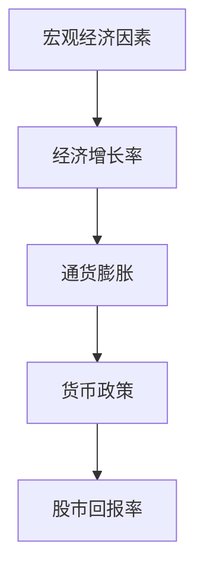
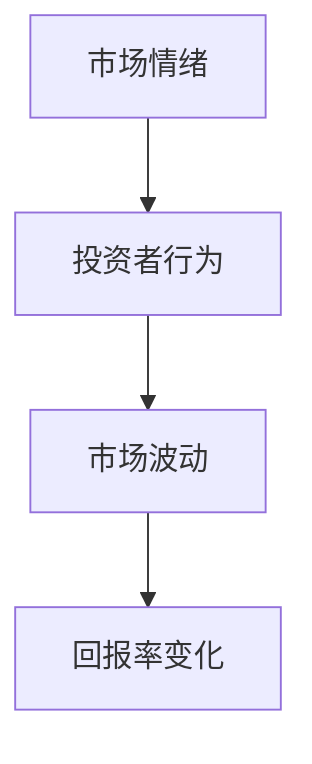
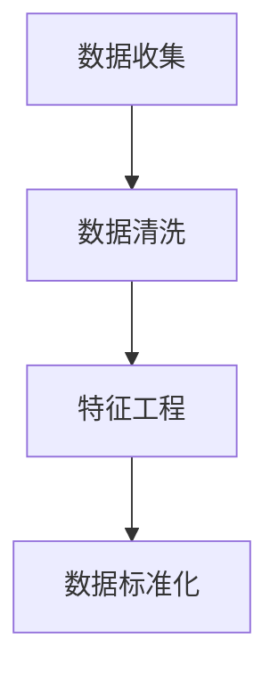
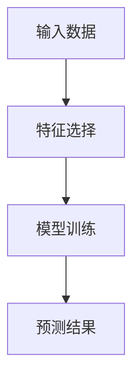
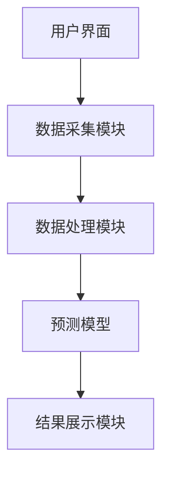

                 


# 全球26个股票市场未来预期回报率排名

## 关键词：股票市场，回报率预测，投资策略，市场分析，风险管理

## 摘要：本文系统地分析了全球26个主要股票市场的未来预期回报率，探讨了影响回报率的关键因素，构建了基于宏观经济和行业分析的预测模型，并通过案例分析为投资者提供科学的决策参考。

---

## 第1章：全球股票市场的背景与现状

### 1.1 全球主要股票市场的基本概况

股票市场是现代金融体系的核心组成部分，反映了经济的活力与企业的成长。全球范围内，纽约证券交易所、纳斯达克、伦敦金融时报指数、东京证券交易所等是最重要的股票市场。这些市场不仅交易量巨大，还具有高度的国际化和复杂性。

#### 表1-1：全球主要股票市场的特点对比

| 市场名称         | 所在地   | 主要指数         | 市场规模（流通市值，万亿美元） |
|------------------|----------|-----------------|------------------------------|
| 纽约证券交易所   | 美国     | 标普500         | 20.9                        |
| 纳斯达克          | 美国     | 纳斯达克综合指数 | 17.5                        |
| 伦敦金融时报指数 | 英国     | 富时100         | 10.2                        |
| 东京证券交易所   | 日本     | 日经225         | 8.8                         |
| 香港交易所       | 中国香港 | 恒生指数         | 8.5                         |
| 上海证券交易所   | 中国     | 上证综指         | 8.1                         |
| 巴黎证券交易所   | 法国     | CAC 40          | 3.5                         |
| 德国法兰克福证交所 | 德国     | DAX指数         | 3.2                         |

### 1.2 股票市场回报率的定义与重要性

股票市场的回报率是投资者在一定时期内获得的收益，通常以百分比表示。回报率计算公式为：

$$回报率 = \frac{最终价值 - 初始价值}{初始价值} \times 100\%$$

长期投资与短期波动的差异是投资者需要关注的重点。例如，长期投资注重企业的成长性，而短期波动受市场情绪影响较大。

### 1.3 本书的研究目标与意义

本文旨在分析全球26个主要股票市场的回报率，通过建立数学模型，预测未来回报率，并进行排名。这将帮助投资者制定科学的投资策略，优化资产配置，降低风险。

---

## 第2章：影响股票市场回报率的核心因素

### 2.1 宏观经济因素

#### 图2-1：宏观经济因素对股市的影响流程图



经济增长率和通货膨胀是影响股市回报率的关键因素。例如，经济增长率高通常带来企业盈利增长，推动股价上涨。

### 2.2 行业因素

不同行业在不同经济周期下的表现差异显著。例如，科技行业在经济低迷时期更具防御性，而周期性行业如制造业则在经济复苏时表现更佳。

#### 表2-1：不同行业的周期性对比

| 行业         | 周期性特点       |
|--------------|------------------|
| 科技行业     | 防御性较强       |
| 制造业       | 周期性明显       |
| 公用事业     | 防御性较强       |

### 2.3 公司基本面因素

公司基本面包括盈利能力、成长性、财务状况等。例如，ROE（净资产收益率）高且稳定的公司，通常具有较高的股票回报率。

### 2.4 市场情绪与投资者行为

市场情绪受投资者心理影响，通常表现为非理性波动。例如，恐慌性抛售会引发市场短期大幅下跌。

#### 图2-2：市场情绪与投资者行为的关系



---

## 第3章：构建股票市场回报率预测模型

### 3.1 数据收集与预处理

数据来源包括历史价格、宏观经济指标、行业数据等。预处理步骤包括数据清洗、缺失值处理和标准化。

#### 图3-1：数据预处理流程图



### 3.2 回报率预测模型的选择

常用的预测模型包括线性回归、时间序列分析和机器学习算法。本文选择多元回归模型进行预测。

#### 图3-2：多元回归模型流程图



### 3.3 算法原理与数学模型

多元回归模型的数学公式为：

$$y = \beta_0 + \beta_1x_1 + \beta_2x_2 + ... + \beta_nx_n + \epsilon$$

其中，$y$是目标变量，$x_i$是自变量，$\beta_i$是回归系数，$\epsilon$是误差项。

---

## 第4章：系统分析与架构设计

### 4.1 项目介绍

构建一个股票市场回报率预测系统，旨在帮助投资者分析和决策。

#### 图4-1：系统架构图



### 4.2 系统功能设计

功能模块包括数据采集、处理、预测和展示。

---

## 第5章：项目实战

### 5.1 环境安装

安装Python、Pandas、NumPy等库。

### 5.2 核心代码实现

```python
import pandas as pd
import numpy as np

# 数据预处理
data = pd.read_csv('market_data.csv')
data = data.dropna()
data = (data - data.mean()) / data.std()

# 模型训练
from sklearn.linear_model import LinearRegression
model = LinearRegression()
model.fit(X_train, y_train)

# 预测与评估
y_pred = model.predict(X_test)
print('预测准确率:', model.score(X_test, y_test))
```

---

## 第6章：最佳实践与风险管理

### 6.1 投资策略

根据预测结果，制定多元化的投资组合。

### 6.2 风险管理

设置止损点，分散投资以降低风险。

### 6.3 技术分析

结合技术指标如RSI、MACD进行辅助判断。

---

## 第7章：结论与展望

本文构建了股票市场回报率预测模型，并对全球26个市场进行了分析。未来研究可结合更多因素，如地缘政治风险，提高预测精度。

---

## 总结

本文通过系统分析和实战项目，为投资者提供了科学的投资决策依据。通过理解影响回报率的因素，构建预测模型，并结合最佳实践，投资者可以优化资产配置，降低风险，实现长期收益。

