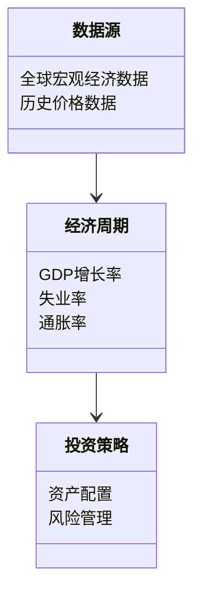

                 


# 全球宏观策略：利用经济周期差异进行投资

---

## 关键词：经济周期、投资策略、资产配置、风险管理、宏观分析、系统架构

---

## 摘要

在全球化的背景下，经济周期的差异为投资者提供了独特的机会。本文系统地探讨了如何利用不同地区的经济周期差异制定投资策略。首先，文章介绍了经济周期的基本概念和分析方法，然后深入分析了全球主要经济体的经济周期特点。接下来，文章详细讲解了资产配置模型和风险管理策略，结合数学模型和算法原理，展示了如何构建有效的投资组合。最后，通过实战案例和系统架构设计，提供了从理论到实践的完整解决方案。

---

## 第一部分：经济周期的基础

### 第1章：经济周期的基本概念

#### 1.1 经济周期的定义与特点

##### 1.1.1 经济周期的定义

经济周期是指经济活动在时间上的波动，通常分为四个阶段：衰退、萧条、复苏和繁荣。经济周期的波动是由多种因素引起的，包括货币政策、财政政策、技术创新和外部冲击等。

##### 1.1.2 经济周期的主要阶段

- **衰退阶段**：经济增长放缓，企业盈利下降，失业率上升。
- **萧条阶段**：经济活动达到最低点，消费者和企业信心下降。
- **复苏阶段**：经济开始逐步恢复，企业利润回升。
- **繁荣阶段**：经济增长强劲，企业盈利最大化，泡沫风险增加。

##### 1.1.3 经济周期的驱动因素

- **货币政策**：中央银行通过调整利率和货币供应量影响经济周期。
- **财政政策**：政府通过调整税收和支出影响经济活动。
- **技术创新**：技术进步推动经济增长，改变经济周期的形态。
- **外部冲击**：如自然灾害、战争和全球性疫情等。

#### 1.2 经济周期的分析方法

##### 1.2.1 宏观经济指标的选取与分析

常用的宏观经济指标包括GDP增长率、失业率、通胀率、工业生产指数（IP）和消费者信心指数等。

##### 1.2.2 经济周期的预测方法

- **统计方法**：如移动平均法和指数平滑法。
- **模型方法**：如ARIMA模型和向量自回归模型（VAR）。
- **专家判断**：结合经济理论和市场经验进行判断。

##### 1.2.3 经济周期对投资的影响

经济周期的不同阶段对资产价格有不同的影响。例如，在衰退阶段，债券和黄金通常表现较好，而在繁荣阶段，股票和房地产可能表现较好。

#### 1.3 本章小结

本章介绍了经济周期的基本概念和主要阶段，并分析了其驱动因素和预测方法。理解经济周期是制定投资策略的基础。

---

## 第二部分：全球宏观策略的理论基础

### 第2章：全球宏观策略的理论基础

#### 2.1 有效市场假说与资产定价

##### 2.1.1 有效市场假说的定义与应用

有效市场假说认为，资产价格已经反映了所有可获得的信息。在有效市场中，投资者无法通过分析公开信息获得超额收益。

##### 2.1.2 资产定价模型的理论基础

- **CAPM模型**：资本资产定价模型（CAPM）用于确定资产的预期收益率。
- **APT模型**：套利定价理论（APT）用于解释资产定价。

##### 2.1.3 宏观经济环境对资产定价的影响

宏观经济因素如通胀率、利率和经济增长率会影响资产定价。例如，通胀上升会导致债券收益率上升，而经济增长率上升通常会推高股票价格。

#### 2.2 经济周期与投资策略

##### 2.2.1 经济周期对投资策略的影响

在不同的经济周期阶段，适合的投资策略有所不同。例如，在衰退阶段，防御性资产如债券和黄金可能更适合；在繁荣阶段，周期性股票可能表现较好。

##### 2.2.2 不同经济周期阶段的投资策略

- **衰退阶段**：增加防御性资产的配置。
- **复苏阶段**：逐步增加股票和房地产配置。
- **繁荣阶段**：增加周期性股票和高风险资产。
- **萧条阶段**：减少风险资产配置，增加现金持有。

#### 2.3 本章小结

本章探讨了有效市场假说和资产定价模型，并分析了经济周期对投资策略的影响，为后续的策略构建奠定了理论基础。

---

## 第三部分：经济周期的跨市场分析

### 第3章：跨市场的经济周期分析

#### 3.1 全球主要经济体的经济周期特点

##### 3.1.1 美国、欧洲和亚洲的经济周期分析

- **美国**：经济周期波动较为明显，受货币政策影响较大。
- **欧洲**：经济周期较为稳定，受财政政策影响较大。
- **亚洲**：新兴市场经济周期波动较大，受外部冲击影响显著。

##### 3.1.2 不同地区的经济周期差异

不同地区的经济结构和政策差异导致其经济周期存在差异。例如，新兴市场通常比发达国家更容易受到全球经济波动的影响。

##### 3.1.3 经济周期差异对投资的影响

经济周期差异可以通过跨市场投资来分散风险并捕捉机会。例如，在一个地区经济衰退时，另一个地区的经济可能处于复苏阶段。

#### 3.2 经济周期差异的识别方法

##### 3.2.1 经济指标的对比分析

通过对比不同地区的GDP增长率、通胀率和失业率等指标，识别经济周期差异。

##### 3.2.2 经济周期差异的量化方法

使用统计方法量化不同地区经济周期的相关性和差异性。例如，计算不同地区的GDP增长率的协方差和相关系数。

##### 3.2.3 经济周期差异的可视化

通过时间序列图和热图等工具，直观展示不同地区的经济周期差异。

#### 3.3 本章小结

本章分析了全球主要经济体的经济周期特点，并探讨了经济周期差异的识别方法，为跨市场投资提供了理论支持。

---

## 第四部分：投资策略的构建与优化

### 第4章：投资策略的构建与优化

#### 4.1 资产配置策略

##### 4.1.1 资产配置的基本原理

资产配置是指将资金分配到不同的资产类别中，以实现风险和收益的平衡。

##### 4.1.2 不同经济周期阶段的资产配置策略

- **衰退阶段**：增加债券和现金配置。
- **复苏阶段**：增加股票和房地产配置。
- **繁荣阶段**：增加周期性股票和 commodities 配置。
- **萧条阶段**：减少风险资产配置，增加防御性资产。

##### 4.1.3 资产配置的动态调整

根据经济周期的变化，动态调整资产配置比例，以捕捉机会并规避风险。

#### 4.2 风险管理与绩效评估

##### 4.2.1 风险管理的基本原则

风险管理是投资策略的重要组成部分，包括风险识别、风险评估和风险控制。

##### 4.2.2 风险调整后的收益评估

使用夏普比率和特雷纳比率等指标评估投资组合的风险调整后收益。

#### 4.3 本章小结

本章探讨了资产配置策略和风险管理方法，并强调了动态调整资产配置以适应经济周期变化的重要性。

---

## 第五部分：系统分析与架构设计

### 第5章：系统分析与架构设计

#### 5.1 问题场景介绍

为了利用经济周期差异进行投资，需要构建一个能够实时分析全球宏观经济数据、识别经济周期差异并制定投资策略的系统。

#### 5.2 系统功能设计

##### 5.2.1 领域模型



##### 5.2.2 系统架构


##### 5.2.3 系统接口设计

系统需要与全球宏观经济数据库接口，实时获取数据并进行分析。同时，需要提供用户友好的界面，方便用户查询和调整投资策略。

#### 5.3 本章小结

本章设计了一个基于经济周期差异的投资系统，包括系统架构和功能模块设计。

---

## 第六部分：项目实战

### 第6章：项目实战

#### 6.1 环境配置

安装必要的软件和工具，如Python、Pandas、NumPy和Matplotlib等。

#### 6.2 核心实现

##### 6.2.1 数据获取与处理

```python
import pandas as pd
import numpy as np

# 获取全球宏观经济数据
data = pd.read_csv('macro_data.csv')

# 数据清洗和处理
data = data.dropna()
data = (data - data.mean()) / data.std()
```

##### 6.2.2 经济周期识别

```python
from statsmodels.tsa.holtwinters import Holt

# 使用Holt模型识别经济周期
model = Holt(data['GDP增长率'])
model = model.fit()

# 预测未来经济周期
forecast = model.forecast(12)
```

##### 6.2.3 投资策略实现

```python
def asset_allocation(strategy):
    if strategy == '防御':
        return {'债券': 60%, '现金': 40%}
    elif strategy == '进攻':
        return {'股票': 60%, '房地产': 40%}
```

#### 6.3 案例分析

通过具体案例分析，展示如何利用经济周期差异制定投资策略并实现收益最大化。

#### 6.4 本章小结

本章通过实战案例展示了如何利用Python和相关工具进行经济周期分析和投资策略制定。

---

## 第七部分：总结与展望

### 第7章：总结与展望

#### 7.1 总结

本文系统地探讨了利用经济周期差异进行投资的策略，从理论到实践提供了完整的解决方案。

#### 7.2 展望

未来的研究可以进一步探讨机器学习在经济周期分析中的应用，以及如何利用大数据技术提高投资策略的准确性。

---

## 关键词索引

- 经济周期
- 投资策略
- 资产配置
- 风险管理
- 宏观分析
- 系统架构

---

## 参考文献

1. 弗里德曼，M. (1968). 《货币政策论》
2. 格林wald, W. A. (1987). 《资本资产定价模型》
3. 格林，J. (2018). 《投资学基础》

--- 

以上是《全球宏观策略：利用经济周期差异进行投资》的完整目录和内容框架，涵盖了从基础理论到系统设计和实战应用的各个方面。

