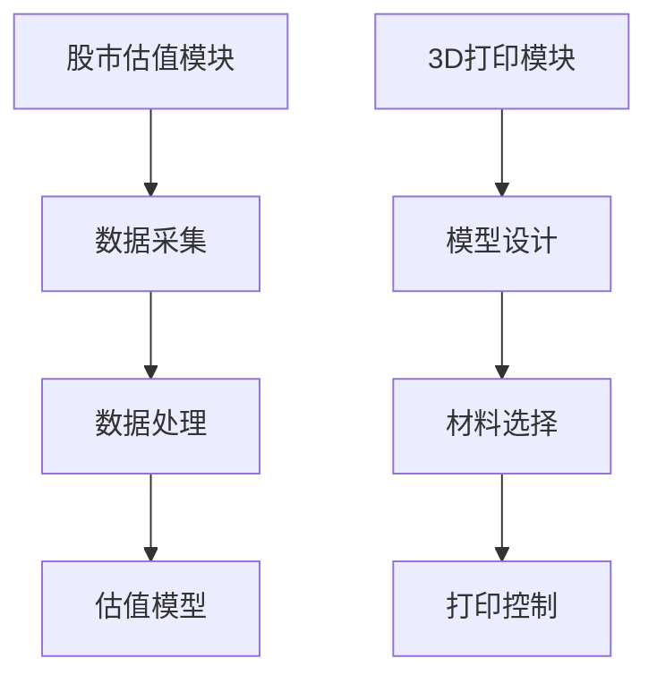

                 


# 全球股市估值与3D打印器官移植的伦理问题

> 关键词：股市估值、3D打印、器官移植、伦理问题、技术伦理

> 摘要：本文探讨全球股市估值与3D打印器官移植两个领域的核心概念、技术原理及其伦理问题。通过分析股市估值的数学模型、3D打印技术的实现原理，以及两者在伦理上的挑战，本文旨在揭示技术进步与伦理约束之间的复杂关系，为读者提供深刻的思考与见解。

---

## 第一部分: 全球股市估值与3D打印器官移植的背景与概述

### 第1章: 全球股市估值的背景与现状

#### 1.1 股市估值的基本概念

##### 1.1.1 股市估值的定义与作用
股市估值是指通过对公司基本面、市场环境和宏观经济因素的分析，对股票的内在价值进行评估的过程。其作用在于帮助投资者做出理性的投资决策，降低市场波动性。

##### 1.1.2 股市估值的核心要素
- **公司基本面**：包括收入、利润、资产负债表等。
- **市场环境**：包括利率、通货膨胀、政策环境等。
- **宏观经济因素**：GDP增长率、就业数据等。

##### 1.1.3 股市估值的历史演变
从早期的简单市盈率计算到现代的复杂算法模型，股市估值经历了从经验主义到技术驱动的转变。

#### 1.2 3D打印技术的概述

##### 1.2.1 3D打印技术的基本原理
3D打印是一种基于数字模型的制造技术，通过逐层叠加材料构建三维物体。其核心是将数字模型转化为物理实体。

##### 1.2.2 3D打印技术在医疗领域的应用
- **定制化医疗设备**：如 prosthetics（假肢）和 orthotics（矫形器）。
- **生物打印**：用于制造人工器官和组织。

##### 1.2.3 3D打印技术的现状与发展趋势
当前，3D打印技术在医疗领域的应用逐步扩大，但成本高、技术复杂性仍然是主要挑战。

---

### 第2章: 3D打印器官移植的伦理问题

#### 2.1 3D打印器官移植的伦理背景

##### 2.1.1 医疗伦理的基本原则
- **患者自主权**：患者有权决定是否接受某种治疗。
- **不伤害原则**：治疗不应对患者造成伤害。
- **公正性**：资源分配应公平合理。

##### 2.1.2 3D打印技术的伦理争议
- **技术可行性**：3D打印器官的性能是否能达到自然器官的水平？
- **伦理争议**：打印器官是否涉及生命伦理问题？

##### 2.1.3 器官移植的伦理框架
包括供体选择、手术风险、术后护理等伦理问题。

#### 2.2 3D打印器官移植的伦理挑战

##### 2.2.1 伦理问题的来源与分类
- **技术层面**：技术不成熟可能导致并发症。
- **法律层面**：知识产权和医疗责任问题。
- **伦理层面**：生命伦理和人权问题。

##### 2.2.2 3D打印器官移植的潜在风险
- **免疫排斥**：患者可能对3D打印器官产生免疫反应。
- **技术缺陷**：打印器官的功能可能不如自然器官。

##### 2.2.3 伦理问题的解决路径
- **政策法规**：制定严格的监管框架。
- **伦理审查**：建立伦理审查委员会。
- **公众教育**：提高公众对3D打印器官移植的认知。

---

## 第二部分: 全球股市估值与3D打印器官移植的核心概念与联系

### 第3章: 全球股市估值的核心概念与数学模型

#### 3.1 股市估值的核心概念

##### 3.1.1 股市估值的主要方法
- **相对估值法**：市盈率、市净率等。
- **绝对估值法**：现金流折现法（DCF）。

##### 3.1.2 股市估值的关键指标
- **市盈率（P/E）**：股价与每股收益的比率。
- **市净率（P/B）**：股价与每股净资产的比率。

##### 3.1.3 股市估值的数学模型
$$\text{DCF模型} = \sum_{t=1}^{n} \frac{\text{现金流}}{(1+r)^t} + \frac{\text{终值}}{(1+r)^n}$$
其中，\( r \) 是折现率，\( n \) 是预测期数。

#### 3.2 3D打印器官移植的核心概念

##### 3.2.1 3D打印器官的材料选择
- **生物相容性材料**：如PLA、PCL等。
- **细胞支架**：用于组织再生。

##### 3.2.2 3D打印器官的结构设计
- **多孔结构**：促进细胞 infiltration（渗入）。
- **功能化设计**：模拟自然器官的结构和功能。

##### 3.2.3 3D打印器官的功能实现
- **生物活性**：通过添加生长因子促进细胞生长。
- **可定制性**：根据患者需求定制器官形状和功能。

---

### 第4章: 全球股市估值与3D打印器官移植的联系

#### 4.1 两者的技术关联

##### 4.1.1 技术创新的交叉影响
- **数据驱动**：股市估值依赖大数据分析，而3D打印技术同样依赖数据驱动的制造。
- **算法优化**：股市估值中的算法优化与3D打印技术的优化有相似之处。

#### 4.2 伦理问题的交叉影响

##### 4.2.1 技术进步与伦理约束
- **股市估值的伦理**：技术进步可能导致市场操纵。
- **3D打印的伦理**：技术进步可能引发生命伦理问题。

##### 4.2.2 技术与伦理的平衡
- **技术创新**：推动技术进步，同时遵守伦理规范。
- **伦理审查**：在技术创新中引入伦理审查机制。

---

## 第三部分: 项目实战与结论

### 第5章: 项目实战与伦理分析

#### 5.1 环境安装与系统设计

##### 5.1.1 系统功能设计
- **股市估值模块**：实现股票估值的算法模型。
- **3D打印模块**：实现器官打印的结构设计与功能模拟。

##### 5.1.2 系统架构设计
使用 mermaid 绘制系统架构图：



#### 5.2 系统实现与伦理分析

##### 5.2.1 核心代码实现
股市估值算法实现：

```python
def stock_valuation(financial_data):
    # 简单的DCF模型实现
    cash_flow = financial_data['cash_flow']
    discount_rate = financial_data['discount_rate']
    n = len(cash_flow)
    present_value = sum([cash_flow[i]/(1+discount_rate)**i for i in range(n)])
    return present_value
```

3D打印器官结构设计：

```python
def print_organ(desired_shape):
    # 3D打印的分层制造
    layers = desired_shape['layers']
    material = desired_shape['material']
    for layer in layers:
        print(f"Printing layer {layer} with {material}")
```

##### 5.2.2 伦理分析
- **股市估值的伦理风险**：算法可能导致市场操纵。
- **3D打印的伦理风险**：技术可能导致资源分配不均。

---

## 第六章: 结论与展望

### 6.1 结论

本文通过分析全球股市估值与3D打印器官移植的核心概念、技术原理及其伦理问题，揭示了技术进步与伦理约束之间的复杂关系。股市估值的算法优化与3D打印技术的创新，必须在伦理框架内进行。

### 6.2 展望

未来，随着技术的进一步发展，股市估值与3D打印技术的伦理问题将更加复杂。如何在技术创新中平衡伦理约束，是值得深入研究的方向。

---

## 参考文献与拓展阅读

- 理论基础：技术伦理学、金融学、生物工程。
- 实践案例：实际的股市估值模型与3D打印器官案例。
- 拓展阅读：相关领域的最新研究成果与政策法规。

---

通过以上目录大纲，我们可以看到，本文不仅涵盖了技术和伦理的深度分析，还结合了实际案例和系统设计，为读者提供了全面的视角。

