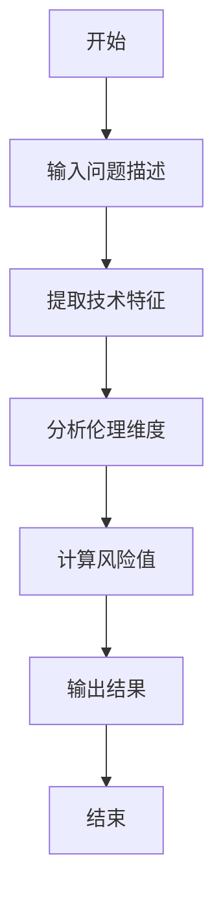
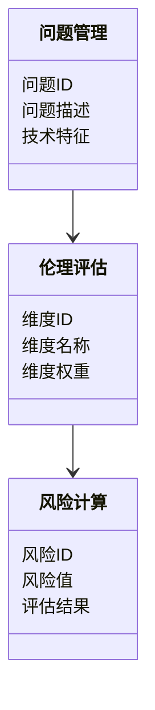
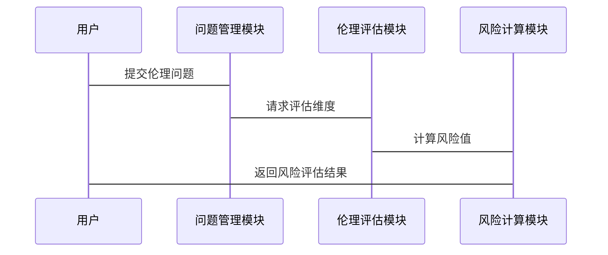

                 


# 全球股市估值与3D生物打印人造器官的伦理问题

> 关键词：全球股市、估值模型、3D生物打印、器官伦理、技术伦理

> 摘要：本文探讨了全球股市估值与3D生物打印技术的伦理问题，分析了3D生物打印技术在医疗领域的应用及其引发的伦理争议，提出了结合股市估值模型的伦理风险评估方法，为技术伦理研究提供了新视角。

---

## 第一部分: 全球股市估值与3D生物打印人造器官的概述

### 第1章: 全球股市估值的背景与现状

#### 1.1 股市估值的基本概念
- **定义**: 股市估值是通过对企业的财务数据、行业地位、市场前景等多维度分析，确定股票的内在价值。
- **现状**: 全球股市估值受宏观经济、政策变化和企业业绩等多种因素影响，呈现出波动性大、复杂性高的特点。
- **影响因素**: 包括宏观经济指标（GDP、利率）、企业盈利状况（净利润、ROE）、行业竞争格局等。

#### 1.2 3D生物打印技术的背景与发展
- **定义**: 3D生物打印是一种通过计算机辅助技术，将生物材料逐层构建出具有生物活性结构的技术。
- **现状**: 3D生物打印技术在医疗领域（如组织修复、器官制造）和生物研究领域（如药物筛选）已取得显著进展。
- **应用领域**: 医疗、制药、生物工程等领域。

#### 1.3 问题背景与解决思路
- **背景**: 3D生物打印技术的快速发展带来了新的伦理挑战，尤其是在器官制造的伦理性和商业化方面。
- **解决思路**: 结合股市估值模型，从技术、经济、伦理三重维度分析3D生物打印技术的潜在风险和伦理问题。

---

## 第二部分: 3D生物打印技术的伦理问题

### 第2章: 伦理问题的核心概念

#### 2.1 伦理问题的属性特征
| 属性 | 特征描述 |
|------|----------|
| 伦理性 | 涉及生命伦理、隐私保护等问题 |
| 技术性 | 依赖先进的生物技术 |
| 社会性 | 影响社会医疗资源分配 |

#### 2.2 伦理问题的系统分析
- **ER实体关系图**: 下图展示了伦理问题的核心实体及其关系。
```mermaid
er
    entity 伦理问题(问题ID, 问题描述, 问题类型) {
        关键属性: 问题描述、问题类型
        外键: 问题ID
    }
    entity 技术特征(技术ID, 技术类型, 技术属性) {
        关键属性: 技术类型、技术属性
        外键: 技术ID
    }
    entity 伦理维度(维度ID, 维度名称, 维度描述) {
        关键属性: 维度名称、维度描述
        外键: 维度ID
    }
    伦理问题 <-- 关联关系--> 技术特征
    伦理问题 <-- 关联关系--> 伦理维度
```

---

### 第3章: 伦理问题的算法原理

#### 3.1 伦理风险评估算法
- **算法流程图**: 下图展示了伦理风险评估的流程。


- **数学模型**: 风险评估公式如下：
  $$ R = \sum_{i=1}^{n} (w_i \cdot f_i) $$
  其中，\( w_i \) 是第 \( i \) 个伦理维度的权重，\( f_i \) 是第 \( i \) 个维度的风险值。

- **代码实现**: 下面是一个简单的伦理风险评估代码示例。
```python
def calculate_ethical_risk(issues):
    dimensions = {
        '生命伦理': 0.4,
        '隐私保护': 0.3,
        '社会公平': 0.2,
        '环境影响': 0.1
    }
    risk_scores = []
    for issue in issues:
        score = 0
        for dim, weight in dimensions.items():
            score += weight * get_dimension_score(issue, dim)
        risk_scores.append(score)
    return risk_scores

def get_dimension_score(issue, dimension):
    # 示例：计算生命伦理维度的得分
    pass
```

---

## 第三部分: 项目实战与最佳实践

### 第4章: 伦理问题的系统架构设计

#### 4.1 系统功能设计
- **领域模型**: 下图展示了系统功能的领域模型。


#### 4.2 系统接口设计
- **接口描述**: 下图展示了系统接口的交互设计。


---

## 第四部分: 结语

### 4.1 最佳实践
- **技术伦理教育**: 加强对3D生物打印技术的伦理教育，确保技术应用符合伦理规范。
- **风险评估模型**: 使用伦理风险评估模型，提前识别和规避潜在的伦理问题。

### 4.2 小结
本文通过分析全球股市估值与3D生物打印技术的伦理问题，提出了结合技术特征、伦理维度和风险评估的系统性解决方案，为技术伦理研究提供了新的视角。

### 4.3 注意事项
- 在实际应用中，需结合具体场景调整伦理评估模型的权重和参数。
- 定期更新伦理评估模型，以适应技术发展的新趋势。

### 4.4 拓展阅读
- 推荐阅读《生物技术的伦理挑战》和《金融科技中的伦理问题》，以深入理解技术与伦理的复杂关系。

---

通过以上分析，我们不仅能够理解3D生物打印技术的伦理问题，还能结合全球股市估值的方法，为技术伦理研究提供新的思路。

