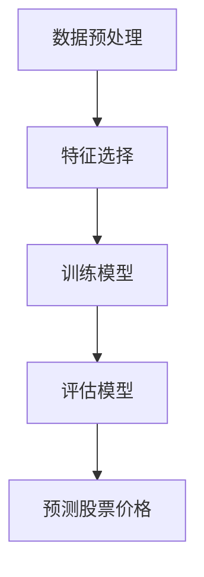
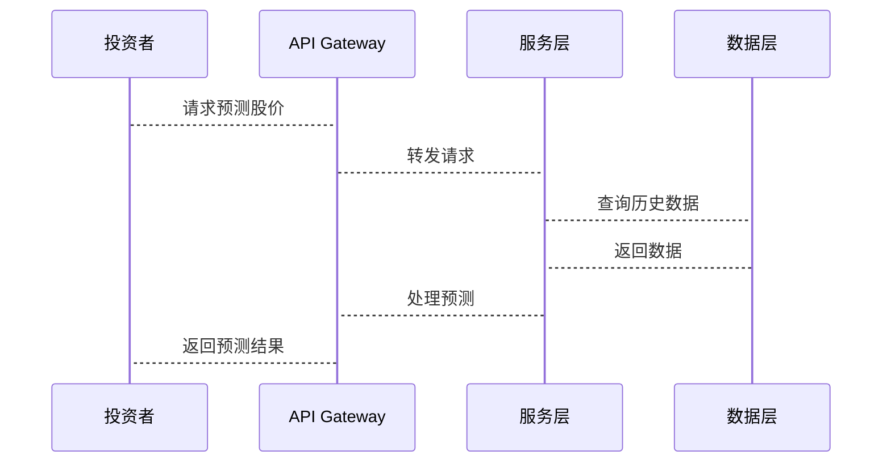

                 


# 全球股市估值与人工智能伦理的关联

## 关键词：全球股市估值，人工智能，伦理，机器学习，算法，系统架构

## 摘要

本文探讨了全球股市估值与人工智能伦理之间的关联。首先，介绍了全球股市估值的基本概念和人工智能伦理的核心问题。接着，详细分析了人工智能在股市估值中的应用，包括算法原理和数学模型。然后，通过对比表格和ER图展示了两者的核心要素及其联系。随后，设计了系统的架构图和交互图，阐述了系统的组成部分和数据流。最后，通过实际案例分析，展示了项目实战的应用，并提出了总结和注意事项。

---

# 正文

## 第一部分：全球股市估值与人工智能伦理的背景介绍

### 第1章：全球股市估值概述

#### 1.1 股市估值的基本概念

- **1.1.1 股市估值的定义**  
  股市估值是指对股票内在价值的估算，帮助投资者决定是否买入或卖出股票。常用的方法包括市盈率（P/E）、市净率（P/B）和股息率（Dividend Yield）。

- **1.1.2 股市估值的方法与模型**  
  常用的估值模型包括：
  - 市盈率模型：通过比较股票的当前价格与盈利倍数。
  - 市净率模型：比较股票价格与每股净资产。
  - 现金流折现模型：估算未来现金流的现值。

#### 1.2 人工智能伦理概述

- **1.2.1 人工智能的基本概念**  
  人工智能（AI）是模拟人类智能的技术，包括学习、推理和自我修正能力。

- **1.2.2 人工智能伦理的核心问题**  
  - 数据隐私：AI系统处理大量数据，可能导致隐私泄露。
  - 算法透明性：算法决策的透明性和可解释性问题。
  - 决策责任：AI决策的伦理责任归属问题。

#### 1.3 两者的关联性

- **1.3.1 人工智能在股市估值中的应用**  
  AI技术如机器学习算法被广泛用于预测股票价格和优化投资组合。

- **1.3.2 伦理问题对股市估值的影响**  
  数据隐私和算法透明性问题可能影响AI模型的准确性和公平性。

---

## 第二部分：核心概念与联系

### 第2章：核心概念原理

#### 2.1 股市估值的核心要素

- **2.1.1 市盈率（P/E）**  
  P/E = 市场价 / 每股收益。

- **2.1.2 市净率（P/B）**  
  P/B = 市场价 / 每股净资产。

- **2.1.3 股息率**  
  股息率 = 每股股息 / 市场价 × 100%。

#### 2.2 人工智能伦理的核心要素

- **2.2.1 数据隐私**  
  AI系统可能收集大量个人数据，需确保数据不被滥用。

- **2.2.2 算法透明性**  
  需要明确算法的决策过程，确保透明和可解释。

- **2.2.3 决策责任**  
  AI决策的错误或偏见需明确责任归属。

#### 2.3 对比分析

- **2.3.1 股市估值与人工智能伦理的对比表格**

| 要素       | 股市估值                 | 人工智能伦理             |
|------------|--------------------------|--------------------------|
| 核心目标    | 估算股票价值             | 确保AI行为符合伦理标准    |
| 关键因素    | 市盈率、市净率、股息率    | 数据隐私、算法透明性、决策责任 |

- **2.3.2 ER实体关系图**

```mermaid
erd
  股票(股票代码, 名称, 行业)
  投资者(投资者ID, 名称, 资产)
  算法(算法ID, 名称, 描述)
  数据集(数据集ID, 名称, 类型)
  股价预测(预测ID, 预测日期, 预测值)
  交易记录(交易ID, 时间, 类型)
  伦理规则(规则ID, 名称, 描述)
  责任归属(责任ID, 人员/机构, 职责)
  知识产权(产权ID, 名称, 所有权)
  风险评估(评估ID, 日期, 结果)
```

---

## 第三部分：算法原理讲解

### 第3章：机器学习算法在股市估值中的应用

#### 3.1 算法原理

- **3.1.1 线性回归模型**  
  使用最小二乘法拟合直线，预测股票价格。

  $$ y = \beta_0 + \beta_1x + \epsilon $$

- **3.1.2 支持向量机（SVM）**  
  用于分类和回归，适合高维数据。

- **3.1.3 随机森林**  
  集成学习方法，通过多个决策树减少过拟合。

#### 3.2 mermaid流程图展示



#### 3.3 Python代码实现

- **3.3.1 线性回归代码示例**

```python
import numpy as np
from sklearn.linear_model import LinearRegression

# 示例数据
X = np.array([[1], [2], [3], [4]])
y = np.array([2, 4, 5, 4])

# 创建模型
model = LinearRegression()
model.fit(X, y)

# 预测
print(model.predict([[5]]))  # 输出：[[6.5]]
```

---

## 第四部分：系统分析与架构设计方案

### 第4章：系统分析与架构设计

#### 4.1 问题场景介绍

- 系统目标：构建一个基于AI的股市估值平台。
- 用户角色：投资者、数据科学家、系统管理员。

#### 4.2 系统功能设计

- **领域模型**：mermaid类图


- **系统架构图**：mermaid架构图


- **系统接口设计**：API接口

  - 输入：股票代码、时间范围。
  - 输出：预测股价、风险评估。

- **系统交互图**：mermaid序列图



---

## 第五部分：项目实战

### 第5章：项目实战

#### 5.1 环境安装

- **工具安装**：Python、Jupyter Notebook、Scikit-learn、Mermaid工具。

#### 5.2 核心实现

- **数据预处理**：清洗和特征工程。
- **模型训练**：使用随机森林算法。
- **结果展示**：可视化预测结果。

#### 5.3 案例分析

- **案例选择**：预测某科技股的股价。
- **结果分析**：比较实际与预测值，评估模型准确性。

#### 5.4 伦理问题

- **数据隐私**：确保数据来源合法。
- **算法透明性**：解释模型决策过程。

---

## 第六部分：总结与注意事项

### 第6章：总结

#### 6.1 最佳实践 tips

- 确保数据隐私和算法透明性。
- 定期更新模型以适应市场变化。
- 结合人工审核确保决策的合理性。

#### 6.2 小结

本文详细探讨了全球股市估值与人工智能伦理的关联，从背景、核心概念、算法原理到系统设计和项目实战，提供了全面的分析和解决方案。

#### 6.3 注意事项

- 避免过度依赖AI，结合人工分析。
- 定期进行伦理审查和风险评估。

#### 6.4 拓展阅读

- 推荐阅读《机器学习实战》和《人工智能伦理》相关书籍。

---

通过以上结构，文章详细分析了全球股市估值与人工智能伦理的关联，提供了从理论到实践的全面指导。

