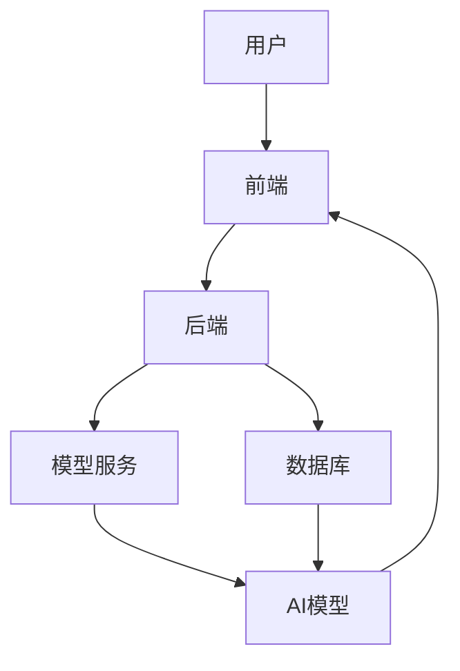
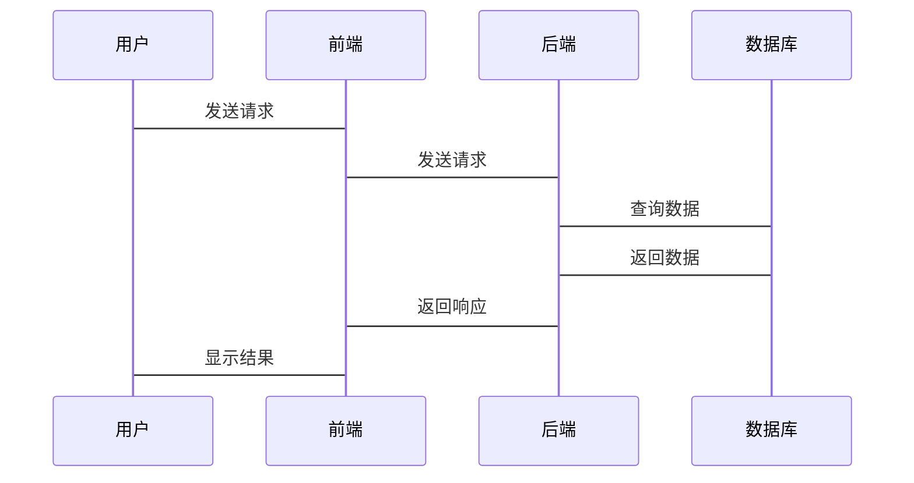

                 

# 全球股市估值与人工智能在法律合规中的应用

> 关键词：股票估值，人工智能，机器学习，法律合规，深度学习

> 摘要：本文探讨了全球股市估值与人工智能技术的结合，分析了人工智能在股票估值和法律合规中的应用。通过详细讲解股票估值的基本概念、人工智能的核心技术、基于机器学习和深度学习的股票估值模型，以及人工智能在法律合规中的具体应用，本文为读者提供了全面的技术视角和实践指导。

---

## 第一部分: 全球股市估值与人工智能技术基础

### 第1章: 全球股市估值概述

#### 1.1 股票估值的基本概念

##### 1.1.1 股票估值的定义
股票估值是指通过对公司财务数据、市场环境、行业趋势等多方面因素的分析，估算公司股票的内在价值或市场价格的过程。股票估值的核心目标是帮助投资者判断股票是否被高估或低估，从而做出投资决策。

##### 1.1.2 股票估值的核心要素
股票估值的核心要素包括：
1. **公司基本面**：包括收入、利润、资产、负债、现金流等财务指标。
2. **行业环境**：行业的竞争格局、增长潜力、政策法规等。
3. **宏观经济环境**：GDP增长率、利率、通货膨胀率、货币政策等。
4. **市场情绪**：投资者情绪、市场波动性等。

##### 1.1.3 股票估值的分类与特点
股票估值可以分为以下几类：
1. **相对估值法**：通过比较股票与市场或行业指数的关系来判断估值，如市盈率（P/E）和市净率（P/B）。
2. **绝对估值法**：通过现金流折现模型（DCF）等方法计算股票的内在价值。
3. **技术分析法**：通过价格走势、成交量等技术指标来预测股票价格的变化。

股票估值的特点包括：
- 数据驱动：依赖财务数据和市场数据。
- 动态变化：受宏观经济、行业和公司基本面的影响，估值会随时间变化。
- 主观性：不同投资者对同一股票的估值可能不同。

#### 1.2 股票估值的主要方法

##### 1.2.1 市盈率法
市盈率（P/E）是股票价格与每股收益（EPS）的比值，用于衡量投资者对每股收益的支付意愿。公式为：
$$ \text{P/E} = \frac{\text{股价}}{\text{每股收益}} $$

##### 1.2.2 市净率法
市净率（P/B）是股票价格与每股净资产的比值，用于衡量股票价格相对于公司资产的价值。公式为：
$$ \text{P/B} = \frac{\text{股价}}{\text{每股净资产}} $$

##### 1.2.3 股息率法
股息率是股票的年股息与股票价格的比值，用于衡量股票的投资回报率。公式为：
$$ \text{股息率} = \frac{\text{股息}}{\text{股价}} $$

##### 1.2.4 内在价值法
内在价值法通过对公司未来现金流的折现来估算股票的合理价值。常用模型包括：
- **股利折现模型（DDM）**：基于股息的折现。
- **现金流折现模型（DCF）**：基于自由现金流的折现。

##### 1.2.5 现金流折现法
现金流折现模型（DCF）通过预测公司未来自由现金流，并将其折现为现值，来估算股票的内在价值。公式为：
$$ V = \sum_{t=1}^{n} \frac{CF_t}{(1+r)^t} + \frac{TV}{(1+r)^n} $$
其中，$CF_t$ 是第$t$年的自由现金流，$r$是折现率，$TV$是终值。

#### 1.3 股票估值的影响因素

##### 1.3.1 宏观经济因素
宏观经济因素包括GDP增长率、利率、通货膨胀率、货币政策等，这些因素会影响整个市场的估值水平。

##### 1.3.2 行业因素
行业因素包括行业竞争格局、行业政策、行业增长潜力等，不同行业的估值标准可能有所不同。

##### 1.3.3 公司基本面因素
公司基本面因素包括收入、利润、资产、负债、现金流等财务指标，是股票估值的核心依据。

##### 1.3.4 市场情绪因素
市场情绪因素包括投资者情绪、市场波动性等，会影响股票的短期价格波动。

##### 1.3.5 政策法规因素
政策法规因素包括政府的经济政策、行业监管政策等，会对股票估值产生长期影响。

### 第2章: 人工智能技术基础

#### 2.1 人工智能的定义与特点

##### 2.1.1 人工智能的定义
人工智能（AI）是指通过计算机模拟人类智能的技术，包括学习、推理、自适应等能力。

##### 2.1.2 人工智能的核心技术
人工智能的核心技术包括：
1. **机器学习**：通过数据训练模型，使其能够从数据中学习规律。
2. **深度学习**：基于人工神经网络的机器学习方法，能够处理复杂的非结构化数据。
3. **自然语言处理**：处理和理解人类语言的技术，如文本分析、情感分析等。
4. **计算机视觉**：处理图像和视频的技术，如目标检测、图像识别等。

##### 2.1.3 人工智能的应用领域
人工智能的应用领域包括：
1. **金融**：股票预测、风险评估、欺诈检测等。
2. **医疗**：疾病诊断、药物研发等。
3. **交通**：自动驾驶、交通优化等。
4. **教育**：个性化教学、教育管理等。

#### 2.2 机器学习的基本原理

##### 2.2.1 机器学习的定义
机器学习是指通过数据训练模型，使其能够从数据中学习规律并进行预测或分类。

##### 2.2.2 监督学习、无监督学习和强化学习的区别
1. **监督学习**：基于标记的数据进行训练，预测新数据的标签。
2. **无监督学习**：基于未标记的数据进行训练，发现数据中的结构或模式。
3. **强化学习**：通过与环境交互，学习最优策略以最大化奖励。

##### 2.2.3 常见的机器学习算法
1. **线性回归**：用于回归问题，预测连续型变量。
2. **支持向量机（SVM）**：用于分类问题，通过找到最优分割线。
3. **随机森林**：基于决策树的集成学习方法，用于分类和回归。
4. **K均值聚类**：无监督学习算法，用于数据聚类。

#### 2.3 深度学习的基本原理

##### 2.3.1 深度学习的定义
深度学习是基于人工神经网络的机器学习方法，能够处理复杂的非结构化数据。

##### 2.3.2 神经网络的基本结构
神经网络包括输入层、隐藏层和输出层，通过多层神经元之间的连接和激活函数进行数据处理。

##### 2.3.3 常见的深度学习模型
1. **卷积神经网络（CNN）**：用于图像识别和处理。
2. **循环神经网络（RNN）**：用于处理序列数据，如时间序列和自然语言处理。
3. **长短期记忆网络（LSTM）**：改进的RNN，用于处理长期依赖关系。
4. **生成对抗网络（GAN）**：通过生成器和判别器对抗训练，用于生成数据。

### 第3章: 人工智能在股票估值中的应用

#### 3.1 人工智能在股票预测中的作用

##### 3.1.1 人工智能如何提高股票预测的准确性
人工智能通过分析海量数据，发现传统方法难以察觉的规律，从而提高股票预测的准确性。

##### 3.1.2 人工智能在股票预测中的优势
1. **数据处理能力**：能够处理海量的结构化和非结构化数据。
2. **自动化学习**：能够自动调整模型参数，适应数据变化。
3. **实时性**：能够实时更新模型，适应市场变化。

##### 3.1.3 人工智能在股票预测中的挑战
1. **数据质量**：需要高质量的数据支持。
2. **模型过拟合**：可能因数据噪声导致模型过拟合。
3. **市场不确定性**：市场波动和突发事件难以完全预测。

#### 3.2 基于机器学习的股票估值模型

##### 3.2.1 线性回归模型
线性回归模型适用于简单的线性关系，但难以处理复杂的非线性关系。

##### 3.2.2 支持向量机模型
支持向量机模型适用于小规模数据，但在大规模数据上表现不佳。

##### 3.2.3 随机森林模型
随机森林模型是一种集成学习方法，能够处理高维数据，具有较强的鲁棒性。

##### 3.2.4 神经网络模型
神经网络模型能够处理复杂的非线性关系，但需要大量的数据和计算资源。

#### 3.3 基于深度学习的股票估值模型

##### 3.3.1 RNN在股票预测中的应用
RNN适用于处理时间序列数据，能够捕捉价格的短期波动。

##### 3.3.2 LSTM在股票预测中的应用
LSTM通过长短期记忆机制，能够捕捉价格的长期趋势。

##### 3.3.3 CNN在股票预测中的应用
CNN适用于处理图像数据，但也可以用于处理时间序列数据。

## 第二部分: 人工智能在法律合规中的应用

### 第4章: 人工智能在法律合规中的应用

#### 4.1 法律合规的基本概念

##### 4.1.1 法律合规的定义
法律合规是指企业和个人在经营活动中遵守相关法律法规，确保行为合法合规。

##### 4.1.2 法律合规的核心要素
法律合规的核心要素包括：
1. **法律法规**：包括国家和地方的法律法规。
2. **行业规范**：包括行业内的自律规则和标准。
3. **合规管理**：包括合规政策、合规流程和合规监控。

##### 4.1.3 法律合规的分类与特点
法律合规可以分为以下几类：
1. **企业合规**：包括公司治理、内部控制等。
2. **金融合规**：包括反洗钱、反欺诈等。
3. **数据合规**：包括数据保护、隐私保护等。
4. **税务合规**：包括税务申报、税务规划等。

#### 4.2 人工智能在法律合规中的应用

##### 4.2.1 合同审查与分析
人工智能可以通过自然语言处理技术，自动审查合同中的法律条款，识别潜在的法律风险。

##### 4.2.2 风险评估与管理
人工智能可以通过分析企业的财务数据和市场数据，评估企业的法律风险，并制定相应的风险管理策略。

##### 4.2.3 法律咨询与问答
人工智能可以通过自然语言处理技术，为用户提供法律咨询和问答服务，帮助用户解决法律问题。

##### 4.2.4 法律文书生成
人工智能可以通过自然语言处理技术，自动生成法律文书，如合同、法律意见书等。

### 第5章: 人工智能在法律合规中的系统架构设计

#### 5.1 系统功能设计

##### 5.1.1 数据采集与处理
系统需要采集企业的财务数据、市场数据、法律法规数据等，进行清洗和预处理。

##### 5.1.2 数据分析与建模
系统需要通过机器学习和深度学习技术，对数据进行分析和建模，识别潜在的法律风险。

##### 5.1.3 系统输出与反馈
系统需要将分析结果输出给用户，并根据用户反馈不断优化模型。

#### 5.2 系统架构设计

##### 5.2.1 系统架构图

##### 5.2.2 接口设计
系统需要设计API接口，用于前端和后端之间的数据交互。

##### 5.2.3 交互流程图

## 第六章: 结论与展望

### 6.1 结论
人工智能在股票估值和法律合规中的应用具有重要意义，能够提高估值的准确性和合规的效率。通过结合机器学习和深度学习技术，人工智能能够处理复杂的金融数据和法律文本，为投资者和企业提供有力的支持。

### 6.2 展望
未来，人工智能在股票估值和法律合规中的应用将更加广泛和深入。随着技术的进步，人工智能将能够处理更多复杂的数据和问题，为企业和投资者提供更精准的决策支持。

---

通过本文的详细讲解，读者可以深入了解人工智能在股票估值和法律合规中的应用，掌握相关的技术原理和实际案例。希望本文能够为读者提供有价值的技术视角和实践指导。

