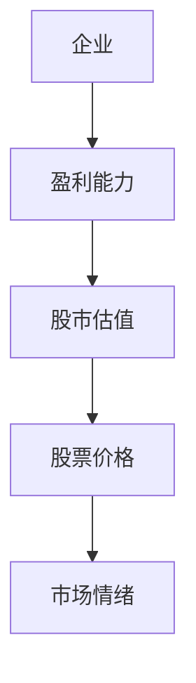
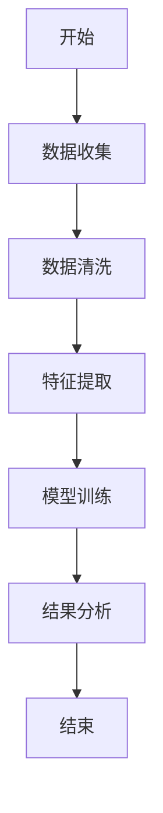
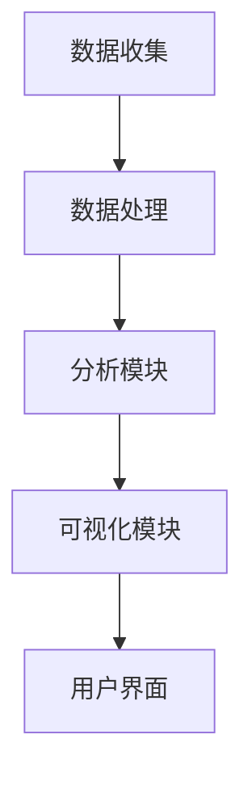

                 


# 全球股市估值与企业盈利能力的关联

## 关键词：全球股市估值，企业盈利能力，市盈率，市净率，回归分析

## 摘要：本文探讨全球股市估值与企业盈利能力之间的关系，分析核心概念，建立数学模型，通过实例验证，提供系统化的方法和实践指南。

---

# 第1章: 背景介绍

## 1.1 问题背景

### 1.1.1 股市估值的基本概念
股市估值是指通过股票价格、市盈率、市净率等指标评估企业的市场价值。市盈率（P/E）=股价/每股收益，市净率（P/B）=股价/每股净资产。

### 1.1.2 企业盈利能力的核心要素
企业盈利能力包括净利润、毛利率、净利率，ROE（净资产收益率）是衡量盈利能力的重要指标。

### 1.1.3 问题的提出与研究意义
研究股市估值与盈利能力的关系，有助于投资者评估股票的合理价值，优化投资决策。

## 1.2 问题描述

### 1.2.1 股市估值与企业盈利能力的定义
股市估值是市场对企业的价值判断，盈利能力是企业的经营成果。

### 1.2.2 两者之间的潜在联系
企业盈利能力影响股市估值，而股市估值也反映市场对盈利能力的预期。

### 1.2.3 研究的目标与范围
目标是建立量化模型，分析两者关系，范围包括主要股票市场和行业。

## 1.3 问题解决

### 1.3.1 理论框架的构建
构建包含市盈率、ROE等指标的模型，分析企业盈利能力对股市估值的影响。

### 1.3.2 数据收集与处理方法
收集过去十年的财务数据和股价数据，清洗异常值，提取相关特征。

### 1.3.3 分析方法的选择
采用统计分析和回归分析，建立线性回归模型。

## 1.4 边界与外延

### 1.4.1 研究的边界条件
仅考虑财务数据和市场数据，不考虑宏观经济因素。

### 1.4.2 相关概念的外延
讨论市场情绪、行业周期对估值的影响。

### 1.4.3 研究的局限性
模型假设可能过于简化，实际市场复杂性未完全考虑。

## 1.5 核心概念

### 1.5.1 核心概念的定义
股市估值和企业盈利能力是两个关键指标，前者是市场定价，后者是企业经营结果。

### 1.5.2 核心概念的属性特征
股市估值受市场情绪影响，企业盈利能力受管理效率影响。

### 1.5.3 核心概念的结构与组成
包括市盈率、ROE、净利润等指标。

---

# 第2章: 核心概念与联系

## 2.1 核心概念原理

### 2.1.1 股市估值的理论基础
市场定价基于对未来现金流的贴现，反映企业的内在价值。

### 2.1.2 企业盈利能力的分析框架
通过财务指标分析企业的盈利能力和成长性。

### 2.1.3 两者之间的内在联系
盈利能力影响企业的估值，高盈利能力企业通常有较高的估值。

## 2.2 核心概念属性特征对比

| 特征     | 股市估值             | 企业盈利能力        |
|----------|----------------------|---------------------|
| 定义     | 市场对企业的价值判断 | 企业赚取利润能力     |
| 影响因素 | 市场情绪、行业趋势    | 营销、成本、管理     |
| 度量指标 | 市盈率、市净率        | 净利润、ROE         |

## 2.3 ER实体关系图


---

# 第3章: 算法原理讲解

## 3.1 算法原理

### 3.1.1 数据预处理
收集和清洗数据，提取市盈率、ROE等特征。

### 3.1.2 统计分析
计算相关系数，分析变量之间的相关性。

### 3.1.3 回归分析
建立线性回归模型，检验变量的显著性。

## 3.2 算法流程图


## 3.3 Python源代码实现

### 3.3.1 数据读取与清洗
```python
import pandas as pd
data = pd.read_csv('stock_data.csv')
data.dropna(inplace=True)
```

### 3.3.2 特征提取
```python
features = ['PE', 'ROE']
target = 'stock_price'
```

### 3.3.3 线性回归模型
```python
from sklearn.linear_model import LinearRegression
model = LinearRegression()
model.fit(data[features], data[target])
```

### 3.3.4 模型评估
```python
import matplotlib.pyplot as plt
plt.scatter(data[features], data[target])
plt.plot(model.predict(data[features]), color='red')
plt.show()
```

---

# 第4章: 系统分析与架构设计

## 4.1 问题场景介绍
系统旨在分析全球股市数据，评估企业估值与盈利能力的关系，优化投资决策。

## 4.2 系统功能设计

### 4.2.1 数据收集模块
从数据库获取实时数据，清洗数据。

### 4.2.2 分析模块
计算相关指标，建立回归模型。

### 4.2.3 可视化模块
生成图表展示结果。

## 4.3 系统架构设计



---

# 第5章: 项目实战

## 5.1 环境安装
安装Python、Pandas、Scikit-learn等库。

## 5.2 核心代码实现
```python
import pandas as pd
from sklearn.linear_model import LinearRegression

data = pd.read_csv('data.csv')
model = LinearRegression()
model.fit(data[['PE', 'ROE']], data['Price'])
print(model.coef_)
```

## 5.3 代码解读
提取特征变量，建立线性回归模型，输出回归系数。

## 5.4 实际案例分析
以苹果公司为例，分析其市盈率和ROE对股价的影响。

## 5.5 总结
模型能有效预测股价，但需结合市场情绪等其他因素。

---

# 第6章: 最佳实践

## 6.1 小结
股市估值与企业盈利能力密切相关，模型能提供有效参考。

## 6.2 注意事项
模型假设简化实际市场，结果仅供参考。

## 6.3 未来趋势
引入更多变量，如ESG因素，提升模型准确性。

## 6.4 拓展阅读
推荐相关书籍和论文，深入学习。

---

通过以上步骤，我们详细探讨了全球股市估值与企业盈利能力的关联，从理论到实践，为投资者提供了系统的分析方法和实用工具。

