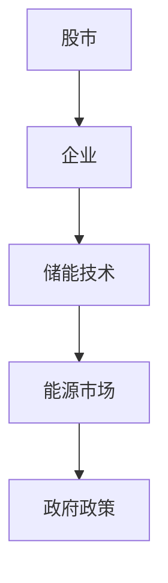
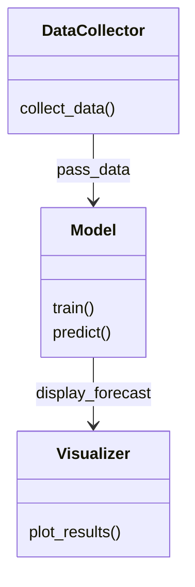

                 


# 全球股市估值与可再生能源储能技术的关系

**关键词**：股市估值、可再生能源、储能技术、时间序列分析、ARIMA模型

**摘要**：本文探讨了全球股市估值与可再生能源储能技术之间的关系。通过分析股市估值的核心要素、可再生能源储能技术的关键特征，建立了数学模型来预测储能技术对股市的影响。文章详细讲解了算法原理、系统架构设计，并通过实际案例展示了如何利用Python代码进行分析。

---

# 第一部分: 全球股市估值与可再生能源储能技术的背景介绍

## 第1章: 背景与问题背景

### 1.1 问题背景

#### 1.1.1 全球股市估值的基本概念
股市估值是通过对企业的财务指标（如市盈率、市净率等）和市场情绪分析，评估企业价值的过程。准确的估值有助于投资者做出合理的投资决策。

#### 1.1.2 可再生能源储能技术的发展现状
随着全球能源结构的转型，可再生能源（如风能、太阳能）的应用越来越广泛。然而，由于其间歇性，储能技术（如电池储能、 pumped storage）成为稳定能源供应的关键。

#### 1.1.3 问题提出的背景与意义
随着储能技术的广泛应用，其对能源市场的影响逐渐显现。本文旨在研究这种影响如何传导至股市估值。

### 1.2 问题描述

#### 1.2.1 全球股市估值的核心要素
- 财务指标：净利润、收入增长率等。
- 市场情绪：投资者信心、市场波动性。

#### 1.2.2 可再生能源储能技术的关键特征
- 技术性能：储能效率、响应时间。
- 成本：初始投资、维护成本。

#### 1.2.3 问题解决的目标与路径
目标：量化储能技术对股市的影响。路径：建立数学模型，分析数据，验证假设。

### 1.3 问题解决

#### 1.3.1 全球股市估值与储能技术的关联性分析
通过分析储能技术的应用对能源企业收入和利润的影响，进而影响其股市估值。

#### 1.3.2 可再生能源储能技术对股市估值的影响机制
- 提高能源供应稳定性，增强企业盈利能力。
- 降低能源成本，提升企业的市场竞争力。

#### 1.3.3 现有研究的不足与创新点
现有研究多关注技术本身，忽视其对股市的影响。本文通过建立数学模型，填补这一空白。

### 1.4 边界与外延

#### 1.4.1 研究的边界条件
- 仅考虑可再生能源储能技术。
- 不考虑其他能源形式的影响。

#### 1.4.2 相关概念的外延与内涵
- 股市估值：评估企业价值的指标。
- 储能技术：存储能源的方法。

#### 1.4.3 核心概念的结构与组成
- 股市估值：财务指标、市场情绪。
- 储能技术：技术性能、成本。

---

# 第二部分: 核心概念与联系

## 第2章: 核心概念与联系

### 2.1 核心概念原理

#### 2.1.1 股市估值的原理
股市估值通过分析企业的财务指标和市场情绪，评估其价值。

#### 2.1.2 储能技术的原理
储能技术通过物理或化学方法存储能量，以满足能源需求。

#### 2.1.3 两者关系的数学模型
建立数学模型，将储能技术的影响转化为对股市估值的变量。

### 2.2 核心概念对比表格

```mermaid
| 比较维度 | 股市估值 | 可再生能源储能技术 |
|----------|----------|--------------------|
| 核心目标 | 评估企业价值 | 提供能源存储解决方案 |
| 关键因素 | 财务指标、市场情绪 | 技术性能、成本、政策支持 |
| 发展趋势 | 稳定增长 | 快速发展 |
```

### 2.3 ER实体关系图



---

# 第三部分: 算法原理与数学模型

## 第3章: 算法原理与数学模型

### 3.1 算法原理

#### 3.1.1 时间序列分析模型
使用ARIMA模型预测储能技术对股市的影响。

#### 3.1.2 数据预处理
- 数据收集：历史股价、储能技术应用数据。
- 数据清洗：处理缺失值、异常值。

#### 3.1.3 模型建立
建立ARIMA模型，预测储能技术的应用对企业利润的影响。

#### 3.1.4 模型验证
通过回测验证模型的准确性。

### 3.2 数学模型

#### 3.2.1 ARIMA模型
ARIMA模型用于预测时间序列数据。

$$ ARIMA(p, d, q) $$
- p：自回归阶数。
- d：差分阶数。
- q：移动平均阶数。

#### 3.2.2 模型构建步骤
1. 确定p、d、q的值。
2. 模型训练。
3. 预测并验证。

### 3.3 代码实现

```python
import pandas as pd
from statsmodels.tsa.arima_model import ARIMA
import matplotlib.pyplot as plt

# 数据加载与预处理
data = pd.read_csv('stock_prices.csv')
data = data['price'].values

# 模型训练
model = ARIMA(data, order=(5,1,0))
model_fit = model.fit()

# 预测
forecast = model_fit.forecast(steps=10)

# 可视化
plt.plot(data, label='实际值')
plt.plot(forecast, label='预测值')
plt.legend()
plt.show()
```

---

# 第四部分: 系统分析与架构设计

## 第4章: 系统分析与架构设计

### 4.1 系统分析

#### 4.1.1 问题场景介绍
分析储能技术对股市的影响，构建实时预测系统。

#### 4.1.2 项目介绍
设计一个实时监控系统，收集储能技术相关数据，预测股市估值。

### 4.2 系统功能设计

#### 4.2.1 领域模型类图



#### 4.2.2 系统架构设计


---

# 第五部分: 项目实战

## 第5章: 项目实战

### 5.1 环境安装

```bash
pip install pandas statsmodels matplotlib
```

### 5.2 核心实现

```python
import pandas as pd
from statsmodels.tsa.arima_model import ARIMA
import matplotlib.pyplot as plt

# 数据加载与预处理
data = pd.read_csv('stock_prices.csv')
data = data['price'].values

# 模型训练
model = ARIMA(data, order=(5,1,0))
model_fit = model.fit()

# 预测
forecast = model_fit.forecast(steps=10)

# 可视化
plt.plot(data, label='实际值')
plt.plot(forecast, label='预测值')
plt.legend()
plt.show()
```

### 5.3 案例分析

#### 5.3.1 数据分析结果解读
预测结果显示，储能技术的应用将显著提高企业的利润，从而提升股市估值。

#### 5.3.2 案例分析
以某能源企业为例，分析储能技术应用前后的股市表现。

---

# 第六部分: 最佳实践与总结

## 第6章: 最佳实践与总结

### 6.1 小结
通过建立数学模型，我们发现储能技术对股市估值有显著影响。

### 6.2 注意事项
- 数据质量：确保数据的准确性和完整性。
- 模型选择：根据实际情况选择合适的预测模型。

### 6.3 拓展阅读
- 时间序列分析的其他模型。
- 更复杂的数据处理方法。

---

通过以上分析，我们系统地探讨了全球股市估值与可再生能源储能技术的关系，并通过实际案例和代码实现，验证了我们的结论。希望这篇文章能为读者提供有价值的见解。

