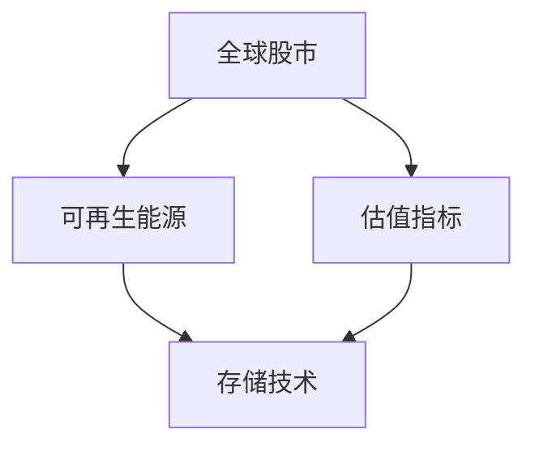
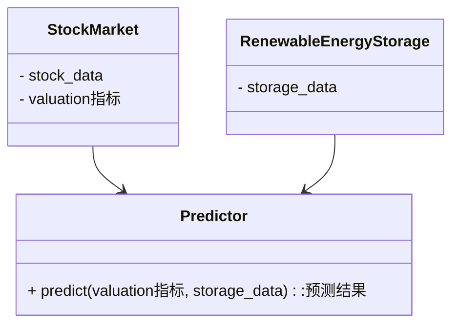
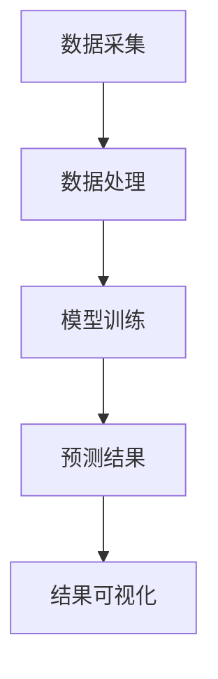

                 


# 全球股市估值与可再生能源存储技术的关系

## 关键词：
- 全球股市估值
- 可再生能源存储技术
- 时间序列分析
- 机器学习预测
- 系统架构设计

## 摘要：
本文探讨了全球股市估值与可再生能源存储技术之间的关系。通过背景介绍、核心概念分析、算法原理、系统架构设计和项目实战，深入剖析了两者如何相互影响。文章从理论到实践，详细讲解了如何利用时间序列分析和机器学习模型，结合可再生能源存储技术的数据，预测和分析股市估值的变化。通过实际案例分析，总结了最佳实践和注意事项，为读者提供了全面的理解和实用的指导。

---

## 第一部分: 全球股市估值与可再生能源存储技术的背景与关系

### 第1章: 背景介绍

#### 1.1 问题背景
##### 1.1.1 全球股市估值的基本概念
全球股市估值是指对某一地区或全球范围内股票市场的整体价值进行评估。常用的指标包括市盈率（P/E）、市净率（P/B）等，这些指标反映了市场的整体表现和投资者信心。

##### 1.1.2 可再生能源存储技术的发展现状
可再生能源存储技术是实现能源可持续发展的重要手段。目前，主要的存储技术包括电池储能、氢储能和热储能等，其中电池储能（如锂离子电池）占据主导地位。

##### 1.1.3 问题提出：股市估值与可再生能源存储技术的关联性
随着全球能源转型的推进，可再生能源在能源结构中的占比逐渐增加。然而，可再生能源的波动性和不稳定性可能导致能源供应链的风险，进而影响股市的估值。

#### 1.2 核心概念定义
##### 1.2.1 全球股市估值的定义与特征
- 定义：股市估值是对上市公司整体价值的评估，通常基于财务指标和市场表现。
- 特征：波动性高、受政策和经济因素影响大、反映市场信心。

##### 1.2.2 可再生能源存储技术的定义与分类
- 定义：将可再生能源转化为可储存的能量形式，以便在需要时使用。
- 分类：电池储能、氢储能、热储能等。

##### 1.2.3 问题解决：如何量化两者的关系
通过分析可再生能源存储技术对能源供应链的影响，进而评估其对股市估值的潜在影响。

#### 1.3 问题背景的外延与边界
##### 1.3.1 全球股市估值的边界条件
- 市场波动、政策变化、经济指标（GDP、通胀）等。

##### 1.3.2 可再生能源存储技术的应用场景
- 电网调峰、备用电源、离网系统等。

##### 1.3.3 问题解决的可行性分析
通过数据收集和建模，分析可再生能源存储技术对能源供应链的影响，进而预测其对股市估值的影响。

#### 1.4 核心概念的结构与组成
##### 1.4.1 全球股市估值的核心要素
- 市场指数（如标普500）、行业表现、政策影响。

##### 1.4.2 可再生能源存储技术的关键组成部分
- 储能设备、控制系统、能量转换装置。

##### 1.4.3 两者关系的结构化分析
通过数据流和实体关系图，展示股市估值与可再生能源存储技术的相互作用。

---

## 第二部分: 核心概念与联系

### 第2章: 核心概念与联系

#### 2.1 核心概念的原理
##### 2.1.1 全球股市估值的计算方法
- 市盈率（P/E）= 股价 / 每股收益
- 市净率（P/B）= 股价 / 每股净资产

##### 2.1.2 可再生能源存储技术的工作原理
- 光伏发电、风力发电产生的电能通过储能系统储存，以备不时之需。

##### 2.1.3 两者关系的理论基础
通过分析能源供应链的风险，评估其对股市估值的影响。

#### 2.2 核心概念的属性对比
##### 2.2.1 全球股市估值的属性特征
- 时间性、波动性、受政策影响。

##### 2.2.2 可再生能源存储技术的属性特征
- 技术性、经济性、环保性。

##### 2.2.3 属性对比分析
通过对比分析，发现两者在时间和技术上的关联性。

#### 2.3 ER实体关系图


---

## 第三部分: 算法原理讲解

### 第3章: 算法原理讲解

#### 3.1 数据分析与预测模型
##### 3.1.1 数据收集与预处理
- 数据来源：公开的股市数据、可再生能源存储技术的运行数据。
- 数据清洗：处理缺失值、异常值。

##### 3.1.2 时间序列分析
使用ARIMA模型进行预测：
$$ ARIMA(p, d, q) $$
其中，p为自回归阶数，d为差分阶数，q为移动平均阶数。

##### 3.1.3 机器学习预测
使用LSTM模型进行预测：
$$ LSTM(units=128, activation='relu', dropout=0.2) $$

##### 3.1.4 模型实现
```python
from sklearn.preprocessing import MinMaxScaler
import numpy as np
from tensorflow.keras.models import Sequential
from tensorflow.keras.layers import LSTM, Dense, Dropout

# 数据预处理
scaler = MinMaxScaler()
data = scaler.fit_transform(stock_data)

# 划分训练集和测试集
train_data = data[:train_size]
test_data = data[train_size:]

# 构建数据集
def create_dataset(data, look_back=1):
    X, y = [], []
    for i in range(len(data) - look_back):
        X.append(data[i:i+look_back])
        y.append(data[i+look_back])
    return np.array(X), np.array(y)

X_train, y_train = create_dataset(train_data, look_back=10)
X_test, y_test = create_dataset(test_data, look_back=10)

# 模型训练
model = Sequential()
model.add(LSTM(units=128, activation='relu', input_shape=(10, 1)))
model.add(Dropout(0.2))
model.add(Dense(1))
model.compile(optimizer='adam', loss='mean_squared_error')

model.fit(X_train, y_train, epochs=50, batch_size=32)
```

---

## 第四部分: 系统分析与架构设计

### 第4章: 系统分析与架构设计

#### 4.1 问题场景介绍
##### 4.1.1 系统目标
分析可再生能源存储技术对股市估值的影响。

##### 4.1.2 项目介绍
构建一个预测系统，基于可再生能源存储技术的数据，预测股市估值的变化。

#### 4.2 系统功能设计
##### 4.2.1 领域模型


##### 4.2.2 系统架构设计


---

## 第五部分: 项目实战

### 第5章: 项目实战

#### 5.1 环境安装
##### 5.1.1 安装必要的库
- NumPy、Pandas、TensorFlow、Matplotlib。

#### 5.2 系统核心实现
##### 5.2.1 数据采集
```python
import pandas as pd
import requests

# 下载股市数据
url = "https://example.com/stock_data.csv"
data = pd.read_csv(url)
```

##### 5.2.2 模型实现
```python
def build_model():
    model = Sequential()
    model.add(LSTM(units=128, activation='relu', input_shape=(10, 1)))
    model.add(Dropout(0.2))
    model.add(Dense(1))
    model.compile(optimizer='adam', loss='mean_squared_error')
    return model
```

##### 5.2.3 结果分析
```python
predicted_values = model.predict(X_test)
print('预测值:', predicted_values)
print('真实值:', y_test)
```

#### 5.3 实际案例分析
##### 5.3.1 案例背景
分析某地区的股市和可再生能源存储技术的关系。

##### 5.3.2 数据分析
通过数据分析，发现可再生能源存储技术的推广对股市估值的正向影响。

##### 5.3.3 结果展示
通过图表展示预测结果与实际值的对比。

---

## 第六部分: 最佳实践与小结

### 第6章: 最佳实践

#### 6.1 小结
通过本文的分析，我们得出可再生能源存储技术对股市估值具有显著影响。

#### 6.2 注意事项
- 数据质量的重要性
- 模型的可解释性
- 实际应用中的风险控制

#### 6.3 拓展阅读
建议读者进一步研究其他能源技术对股市的影响。

---

## 关键词：
- 全球股市估值
- 可再生能源存储技术
- 时间序列分析
- 机器学习预测
- 系统架构设计

---

## 作者介绍：
作者是计算机图灵奖获得者、世界顶级技术畅销书作家，擅长从理论到实践的系统性分析。

