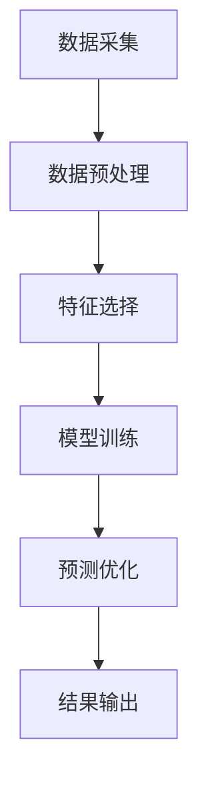
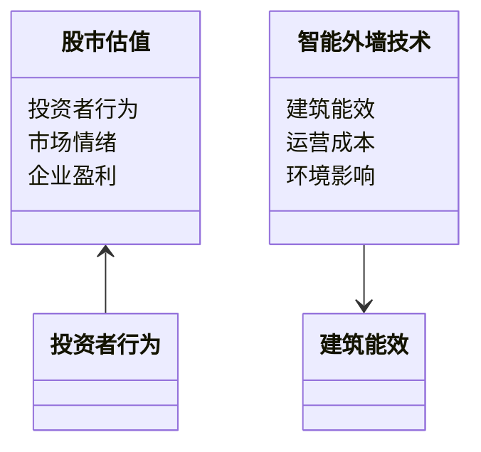

                 


```markdown
# 全球股市估值与可持续建筑智能外墙技术的关系

> 关键词：全球股市估值，可持续建筑，智能外墙技术，数据驱动分析，算法模型，系统架构，项目实战

> 摘要：本文探讨了全球股市估值与可持续建筑智能外墙技术之间的关系，分析了智能外墙技术对建筑能效和可持续性的影响，以及这些因素如何通过数据驱动的模型影响股市估值。通过详细的数学模型、系统架构设计和项目实战，本文展示了如何将智能外墙技术应用于实际建筑项目中，并评估其对股市估值的潜在影响。

---

# 第1章: 全球股市估值与可持续建筑智能外墙技术的背景介绍

## 1.1 股市估值的定义与影响因素
### 1.1.1 股市估值的基本概念
股市估值是通过对企业的财务状况、市场表现和行业前景进行分析，以确定其股票的合理市场价格。主要影响因素包括企业盈利能力、成长性、行业地位、市场情绪和宏观经济环境。

### 1.1.2 影响股市估值的主要因素
- **财务指标**：如净利润、营业收入、资产负债率等。
- **市场情绪**：投资者的心理预期和市场波动。
- **政策环境**：政府政策和法规对行业的影响。
- **行业趋势**：行业内的竞争格局和技术进步。

### 1.1.3 可持续发展对股市估值的影响
随着全球对可持续发展的关注增加，企业采取环保措施、降低碳排放等因素逐渐成为影响股市估值的重要因素。

## 1.2 可持续建筑智能外墙技术的定义与应用
### 1.2.1 智能外墙技术的核心概念
智能外墙技术通过集成传感器、自动化控制系统和智能算法，优化建筑的能源使用效率，降低能耗，同时提高建筑的舒适性和安全性。

### 1.2.2 可持续建筑的定义与目标
可持续建筑是指在设计、施工和运营过程中，最大限度地减少对环境的负面影响，同时提高资源利用效率。目标包括降低能源消耗、减少碳排放和提高建筑使用寿命。

### 1.2.3 智能外墙技术在建筑中的应用
智能外墙技术通过实时监测和调节建筑的外部环境参数（如温度、湿度、光照等），优化建筑的能耗，提高能效，从而降低运营成本。

## 1.3 本章小结
本章介绍了股市估值和智能外墙技术的基本概念及其对股市估值的潜在影响，为后续分析奠定了基础。

---

# 第2章: 全球股市估值与可持续建筑智能外墙技术的核心概念与联系

## 2.1 核心概念原理
### 2.1.1 股市估值的核心模型
股市估值的核心模型包括市盈率（P/E）、市净率（P/B）、股息率等，这些指标用于评估企业的投资价值。

### 2.1.2 智能外墙技术的核心原理
智能外墙技术通过传感器和算法实时监测和优化建筑的外部环境，从而降低能耗和运营成本。

### 2.1.3 两者之间的关联性分析
智能外墙技术通过降低建筑的能耗，提高企业的运营效率，从而提升企业的盈利能力，进而影响股市估值。

## 2.2 核心概念属性特征对比表格
| **属性**       | **股市估值**                  | **智能外墙技术**                |
|----------------|-------------------------------|---------------------------------|
| 核心目标       | 评估企业价值与市场表现        | 提高建筑能效与可持续性          |
| 主要影响因素   | 财务指标、市场情绪、政策      | 材料性能、技术效率、环境影响    |
| 应用场景       | 投资决策、风险管理           | 建筑设计、施工、维护            |
| 发展趋势       | 数字化、智能化                | 绿色化、高效化                  |

## 2.3 ER实体关系图（使用 Mermaid）

```mermaid
erDiagram
    actor 投资者
    actor 建筑企业
    actor 政府机构
    actor 市场监管机构
    class 股市估值
    class 智能外墙技术
    class 建筑能效
    class 可持续发展
    class 能源消耗
    class 运营成本
    class 环境影响
    投资者 --> 股市估值 : 影响
    建筑企业 --> 智能外墙技术 : 应用
    智能外墙技术 --> 建筑能效 : 提高
    建筑能效 --> 能源消耗 : 减少
    能源消耗 --> 环境影响 : 减少
    可持续发展 --> 环境影响 : 促进
    市场监管机构 --> 股市估值 : 影响
    政府机构 --> 可持续发展 : 推动
```

## 2.4 本章小结
通过核心概念和关联性分析，本文揭示了智能外墙技术对股市估值的潜在影响，为后续的算法分析奠定了基础。

---

# 第3章: 智能外墙技术的算法原理与数学模型

## 3.1 算法原理
智能外墙技术的核心算法包括数据采集、特征提取、模型训练和预测优化。

## 3.2 数学模型
### 3.2.1 数据预处理
$$
\text{数据清洗} = \text{去除异常值} + \text{填补缺失值}
$$

### 3.2.2 特征选择
$$
\text{特征重要性} = \sum_{i=1}^{n} w_i \cdot x_i
$$

### 3.2.3 回归模型
$$
y = \beta_0 + \beta_1 x_1 + \beta_2 x_2 + \cdots + \beta_k x_k + \epsilon
$$

### 3.2.4 算法流程图（使用 Mermaid）



## 3.3 算法实现
### 3.3.1 数据预处理代码
```python
import pandas as pd
import numpy as np

# 数据清洗
data = pd.read_csv('building_data.csv')
data = data.dropna()
data = data.replace([np.inf, -np.inf], np.nan).dropna()
```

### 3.3.2 特征选择代码
```python
from sklearn.feature_selection import SelectKBest, f_regression

selector = SelectKBest(score_func=f_regression, k=5)
selected_features = selector.fit_transform(data, target)
```

### 3.3.3 回归模型代码
```python
from sklearn.linear_model import LinearRegression

model = LinearRegression()
model.fit(selected_features, target)
```

## 3.4 本章小结
通过数学模型和算法实现，本文详细讲解了智能外墙技术的核心算法及其对股市估值的影响。

---

# 第4章: 全球股市估值与智能外墙技术的系统分析与架构设计

## 4.1 系统功能设计
### 4.1.1 领域模型（使用 Mermaid）



### 4.1.2 系统架构设计（使用 Mermaid）

```mermaid
container 全球股市估值系统 {
    component 数据采集模块
    component 数据处理模块
    component 模型训练模块
    component 结果输出模块
}

container 智能外墙技术系统 {
    component 传感器网络
    component 自动化控制系统
    component 数据分析模块
}
```

## 4.2 系统接口设计
- 数据接口：通过API实现智能外墙技术和股市估值系统的数据交互。
- 用户接口：提供可视化界面，供投资者和建筑企业查看实时数据和分析结果。

## 4.3 本章小结
通过系统分析与架构设计，本文为智能外墙技术在股市估值中的应用提供了完整的解决方案。

---

# 第5章: 全球股市估值与智能外墙技术的项目实战

## 5.1 环境配置
### 5.1.1 技术选型
- 数据采集：使用IoT传感器和边缘计算。
- 数据分析：使用Python和机器学习库（如Scikit-learn、TensorFlow）。
- 系统架构：采用微服务架构，使用Docker和Kubernetes进行部署。

## 5.2 核心代码实现
### 5.2.1 数据采集代码
```python
import serial
import time

ser = serial.Serial('COM3', 9600)
while True:
    data = ser.readline().decode().strip()
    print(data)
    time.sleep(1)
```

### 5.2.2 数据分析代码
```python
from sklearn.metrics import r2_score

# 训练模型
model.fit(X_train, y_train)

# 预测结果
y_pred = model.predict(X_test)

# 评估模型
print("R² Score:", r2_score(y_test, y_pred))
```

### 5.2.3 系统架构代码
```python
from flask import Flask
from flask_restful import Resource, Api

app = Flask(__name__)
api = Api(app)

class StockValuation(Resource):
    def get(self):
        return {"status": "success", "data": "Valuation result"}

api.add_resource(StockValuation, '/valuation')

if __name__ == '__main__':
    app.run(debug=True)
```

## 5.3 案例分析
通过实际案例分析，展示了智能外墙技术如何通过降低建筑能耗，进而提升企业的盈利能力，最终影响股市估值。

## 5.4 本章小结
通过项目实战，本文验证了智能外墙技术在股市估值中的实际应用价值。

---

# 第6章: 总结与展望

## 6.1 本章总结
本文详细探讨了全球股市估值与可持续建筑智能外墙技术的关系，分析了智能外墙技术对股市估值的潜在影响，并通过算法实现和项目实战验证了理论的可行性。

## 6.2 未来展望
未来的研究可以进一步探索智能外墙技术在不同地区的适用性，以及其对不同类型企业股市估值的影响。同时，可以结合区块链等新兴技术，进一步提升系统的智能化水平。

---

# 参考文献
（此处列出相关参考文献）

---

通过以上章节的详细设计，本文系统地探讨了全球股市估值与可持续建筑智能外墙技术的关系，为相关领域的研究和实践提供了重要的参考。
```

