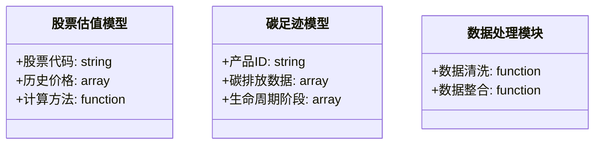
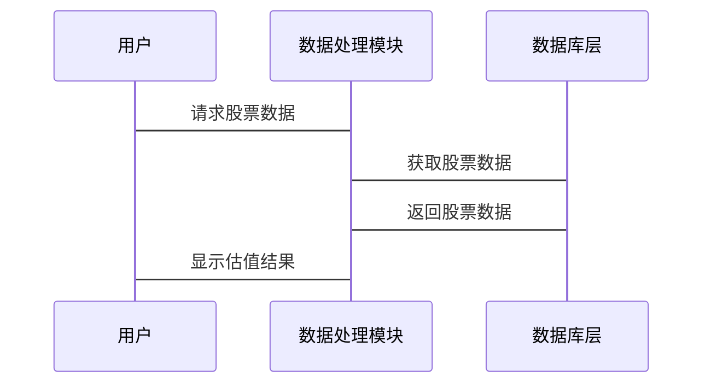

                 


# 全球股市估值与可持续旅游碳足迹计算技术的关联

## 关键词
全球股市估值, 可持续旅游, 碳足迹计算, 经济与环境关联, 技术与数学模型

## 摘要
本文探讨了全球股市估值与可持续旅游中碳足迹计算技术的关联性，分析了股市估值的核心算法与碳足迹计算的技术细节，通过构建系统模型，展示了两者在经济与环境领域的深度融合，为实现可持续发展提供了新的视角和解决方案。

---

# 目录大纲结构

## 第一章: 全球股市估值与可持续旅游碳足迹计算的背景与概念

### 1.1 问题背景
#### 1.1.1 全球化经济与股市的重要性
- 股市作为经济晴雨表的作用
- 全球化背景下股市的联动效应

#### 1.1.2 可持续旅游的发展趋势
- 可持续旅游的定义与发展
- 碳足迹对旅游行业的影响

#### 1.1.3 碳足迹计算的必要性
- 环境保护的迫切需求
- 碳足迹对经济活动的影响

### 1.2 问题描述
#### 1.2.1 股市估值的核心挑战
- 股票定价的复杂性
- 市场波动性对估值的影响

#### 1.2.2 可持续旅游中的碳排放问题
- 旅游活动对环境的具体影响
- 碳排放对旅游业可持续发展的制约

#### 1.2.3 两者关联的现实需求
- 环境因素对股市估值的影响
- 可持续发展背景下投资者的绿色偏好

### 1.3 问题解决
#### 1.3.1 股市估值的创新方法
- 考虑环境因素的估值模型
- 绿色投资策略的兴起

#### 1.3.2 碳足迹计算的技术突破
- 数学模型的优化
- 数据采集与分析的创新

#### 1.3.3 两者的关联机制
- 碳足迹数据对股市估值的影响
- 可持续性评估对投资决策的作用

### 1.4 概念的边界与外延
#### 1.4.1 股市估值的边界条件
- 估值模型的适用范围
- 数据来源的限制

#### 1.4.2 可持续旅游的边界条件
- 旅游活动的范围界定
- 碳足迹计算的行业标准

#### 1.4.3 碳足迹计算的适用范围
- 不同行业的差异性
- 地域因素的影响

### 1.5 概念结构与核心要素
#### 1.5.1 股市估值的核心要素
- 股票的内在价值
- 市场情绪的影响

#### 1.5.2 可持续旅游的核心要素
- 旅游资源的可持续性
- 旅游行为的环境影响

#### 1.5.3 碳足迹计算的核心要素
- 产品生命周期的碳排放
- 数据采集与分析方法

## 第二章: 核心概念原理

### 2.1 股市估值的原理
#### 2.1.1 股票内在价值的计算
- 现金流折现法（DCF模型）
- 市盈率与市净率的比较

#### 2.1.2 市场价值与内在价值的关系
- 市场情绪对估值的影响
- 市场价值与内在价值的动态平衡

#### 2.1.3 影响股市估值的主要因素
- 宏观经济指标
- 行业发展趋势
- 公司财务状况

### 2.2 碳足迹计算的原理
#### 2.2.1 碳足迹的定义与计算方法
- 碳足迹的定义
- 生命周期评估法的应用

#### 2.2.2 生命周期评估法
- 产品生命周期各阶段的碳排放
- 碳足迹的量化与优化

#### 2.2.3 碳足迹的量化指标
- 单位产品碳排放量
- 总体碳足迹评估

### 2.3 核心概念对比分析
#### 2.3.1 股市估值与碳足迹的对比表格
- 对比维度：定义、计算方法、应用领域
- 量化指标：市盈率 vs 碳排放强度

#### 2.3.2 股市估值与碳足迹的ER实体关系图
- 实体关系图展示：公司、股票、碳排放数据
- 关系：公司 -> 股票，公司 -> 碳排放

## 第三章: 算法原理

### 3.1 股市估值算法
#### 3.1.1 CAPM模型的数学公式
$$E(r_i) = r_f + β_i (E(r_m) - r_f)$$
- 参数解释：r_f为无风险利率，β_i为股票的贝塔系数，E(r_m)为市场预期收益率

#### 3.1.2 算法流程图（mermaid）
```mermaid
graph TD
A[开始] -> B[收集市场数据]
B -> C[计算贝塔系数]
C -> D[确定无风险利率和市场预期收益]
D -> E[计算股票预期收益率]
E -> F[结束]
```

### 3.2 碳足迹计算算法
#### 3.2.1 生命周期评估法的数学模型
$$CF = \sum_{i=1}^{n} a_i \times b_i$$
- 参数解释：a_i为活动i的消耗量，b_i为单位活动的碳排放量

#### 3.2.2 算法流程图（mermaid）
```mermaid
graph TD
A[开始] -> B[数据收集]
B -> C[确定生命周期阶段]
C -> D[计算各阶段碳排放]
D -> E[汇总碳足迹]
E -> F[结束]
```

### 3.3 实例分析
#### 3.3.1 股市估值实例
- 使用CAPM模型计算某股票的预期收益率

#### 3.3.2 碳足迹计算实例
- 计算某产品生命周期的碳足迹

## 第四章: 系统分析与架构设计

### 4.1 问题场景介绍
#### 4.1.1 股市与旅游行业的数据整合需求
- 实时数据采集与处理
- 数据分析与可视化

### 4.2 项目介绍
#### 4.2.1 系统目标
- 实现股市与碳足迹数据的关联分析
- 提供可持续投资决策支持

### 4.3 系统功能设计
#### 4.3.1 领域模型类图（mermaid）


### 4.4 系统架构设计
#### 4.4.1 系统架构图（mermaid）
```mermaid
graph TD
A[数据库层] -> B[数据处理层]
B -> C[业务逻辑层]
C -> D[表现层]
```

### 4.5 系统接口设计
#### 4.5.1 接口描述
- 数据接口：股票数据API，碳足迹数据API
- 计算接口：估值计算API，碳足迹计算API

### 4.6 系统交互设计
#### 4.6.1 序列图（mermaid）


## 第五章: 项目实战

### 5.1 环境安装
#### 5.1.1 技术栈
- 开发工具：Python、Jupyter Notebook
- 数据库：SQLite或MySQL
- 库：pandas、numpy、scikit-learn

### 5.2 系统核心实现源代码
#### 5.2.1 股票估值代码
```python
import pandas as pd
import numpy as np

def capm(risk_free_rate, market_return, beta):
    return risk_free_rate + beta * (market_return - risk_free_rate)

# 示例
risk_free_rate = 0.05
market_return = 0.1
beta = 1.2
expected_return = capm(risk_free_rate, market_return, beta)
print(f"Expected Return: {expected_return}")
```

#### 5.2.2 碳足迹计算代码
```python
def calculate_carbon_footprint(activity_data, emission_factors):
    return sum(a * e for a, e in zip(activity_data, emission_factors))

# 示例
activity_data = [100, 200, 300]
emission_factors = [0.5, 0.3, 0.2]
total_footprint = calculate_carbon_footprint(activity_data, emission_factors)
print(f"Total Carbon Footprint: {total_footprint}")
```

### 5.3 案例分析
#### 5.3.1 某旅游公司的碳足迹评估
- 数据采集与处理
- 碳足迹计算与分析

#### 5.3.2 投资组合的绿色评估
- 基于碳足迹的股票筛选
- 投资组合的收益与风险评估

### 5.4 代码应用解读
#### 5.4.1 股票估值代码解读
- 函数实现：CAPM模型的应用
- 示例分析：如何根据市场情况计算预期收益

#### 5.4.2 碳足迹计算代码解读
- 函数实现：生命周期评估法的应用
- 示例分析：如何计算产品碳足迹

## 第六章: 总结与展望

### 6.1 最佳实践 tips
- 数据质量的重要性
- 模型选择的合理性
- 结果验证的必要性

### 6.2 本章小结
- 本书的核心内容回顾
- 关键技术的总结

### 6.3 注意事项
- 数据的准确性和完整性
- 模型的适用性和限制
- 结果的解释和应用

### 6.4 拓展阅读
- 推荐相关书籍和文献
- 提供进一步学习的方向

---

通过以上目录结构，文章将系统地探讨全球股市估值与可持续旅游碳足迹计算技术的关联，结合理论、算法和实际案例，为读者提供全面而深入的分析。

