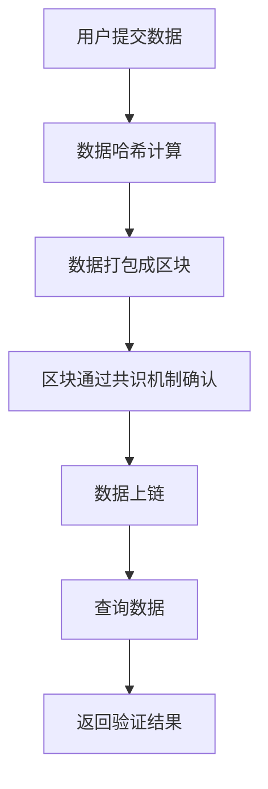
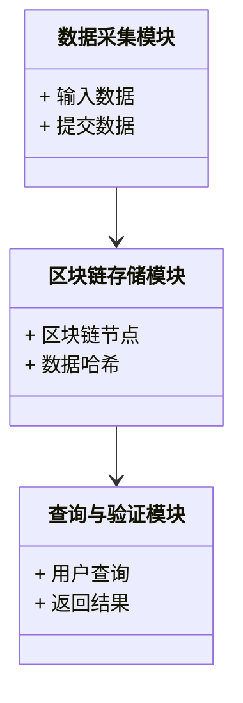
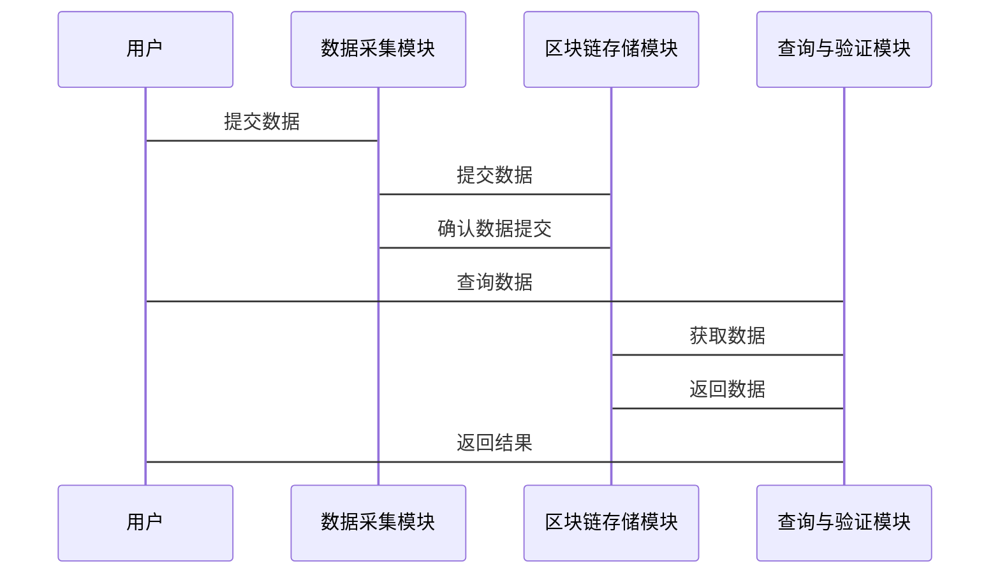

                 


# 全球股市估值与可持续时尚区块链溯源的关联

## 关键词：全球股市估值，可持续时尚，区块链，溯源系统，算法原理，系统架构

## 摘要：本文探讨了全球股市估值与可持续时尚区块链溯源的关联，分析了区块链技术在时尚行业中的应用，详细阐述了溯源系统的算法原理、系统架构及实现案例，展示了如何通过区块链技术提升股市估值与可持续时尚的透明度和信任度。

---

## 第一部分：全球股市估值与可持续时尚的背景与关联

### 第1章：全球股市估值的背景与挑战

#### 1.1 股市估值的重要性

- **1.1.1 股市估值的基本概念**  
  股市估值是通过对公司财务数据的分析，评估其市场价值的过程。常用的估值方法包括市盈率（P/E）、市净率（P/B）和现金流折现法（DCF）等。

- **1.1.2 股市估值的核心作用**  
  股市估值为投资者提供决策依据，影响资本市场的资源配置效率。准确的估值有助于企业融资、投资者收益和市场的稳定发展。

- **1.1.3 当前股市估值的主要挑战**  
  数据真实性不足、信息不对称、市场波动大等问题导致估值结果的准确性难以保证。

#### 1.2 可持续发展的背景与意义

- **1.2.1 可持续发展的定义与内涵**  
  可持续发展强调在满足当代需求的同时，不损害后代发展的可能性。在经济领域，可持续发展要求企业注重环境保护、社会责任和经济效益的平衡。

- **1.2.2 可持续发展在经济中的重要性**  
  随着全球对环保和伦理的关注增加，可持续发展已成为企业竞争力的重要组成部分，影响着企业的品牌形象和市场价值。

- **1.2.3 可持续时尚的兴起与趋势**  
  可持续时尚强调从原材料采购、生产过程到产品生命周期的全链条环保与社会责任。消费者对可持续产品的偏好日益增加，推动了行业的转型。

#### 1.3 区块链技术的背景与发展

- **1.3.1 区块链的基本概念**  
  区块链是一种去中心化的分布式账本技术，通过加密算法和共识机制确保数据的安全性和不可篡改性。

- **1.3.2 区块链的核心技术特点**  
  - 去中心化：无须信任第三方，数据由网络节点共同维护。
  - 不可篡改性：通过哈希计算和链式结构确保数据的唯一性和真实性。
  - 可追溯性：每个区块都记录时间戳和交易信息，便于追踪溯源。

- **1.3.3 区块链在溯源中的应用**  
  区块链技术能够有效解决信息不对称问题，提升供应链透明度，确保数据的真实性和可追溯性。

---

### 第2章：可持续时尚与区块链溯源的关联

#### 2.1 可持续时尚的核心要素

- **2.1.1 可持续时尚的定义与特征**  
  可持续时尚强调从原材料选择、生产过程到产品回收的全生命周期环保与社会责任。

- **2.1.2 可持续时尚的消费者需求**  
  消费者 increasingly demand transparency and ethical production practices, driving brands to adopt sustainable practices.

- **2.1.3 可持续时尚的生产与供应链管理**  
  供应链的复杂性增加了透明度的挑战，亟需技术创新来解决。

#### 2.2 区块链在时尚行业的应用

- **2.2.1 区块链在时尚行业中的应用**  
  区块链技术可以用于记录和追踪服装的生产过程，确保原材料来源、生产条件和劳工权益符合可持续标准。

- **2.2.2 区块链溯源系统的核心功能**  
  - 数据采集：记录原材料来源、生产过程和物流信息。
  - 数据存储：通过区块链确保数据的安全性和不可篡改性。
  - 查询与验证：消费者可以通过区块链查询产品信息，验证其真实性。

---

## 第二部分：区块链溯源系统的算法原理与实现

### 第3章：区块链溯源系统的算法原理

#### 3.1 溯源系统的基本原理

- **数据上链过程**  
  数据通过哈希函数加密后，被打包成区块，并通过共识机制（如PoW或PoS）确认区块的有效性。

- **哈希计算与时间戳**  
  每个数据块都包含哈希值和时间戳，确保数据的唯一性和真实性。

- **共识机制**  
  共识机制（如PoW或PoS）确保所有节点达成一致，保证区块链的安全性和稳定性。

#### 3.2 溯源系统的核心算法

- **哈希函数**  
  使用SHA-256算法对数据进行哈希计算，生成唯一的数据指纹。

- **时间戳**  
  每个数据块都包含时间戳，记录数据生成的时间，确保数据的时序性。

- **共识机制**  
  通过共识算法（如PoW）确保数据的一致性和不可篡改性。

#### 3.3 溯源系统的算法流程图



---

### 第4章：系统分析与架构设计

#### 4.1 系统功能设计

- **数据采集模块**  
  采集原材料来源、生产过程和物流信息。

- **区块链存储模块**  
  将数据加密后存储在区块链上，确保数据的安全性和不可篡改性。

- **查询与验证模块**  
  提供用户查询接口，验证产品信息的真实性。

#### 4.2 系统架构设计



#### 4.3 系统接口设计

- **数据提交接口**  
  提供API用于提交原材料来源和生产信息。

- **数据查询接口**  
  提供API用于查询产品信息和验证其真实性。

#### 4.4 系统交互流程图



---

### 第5章：项目实战

#### 5.1 环境安装

- **安装Python和Solidity**  
  安装Python 3.8及以上版本和Solidity编译器。

- **安装区块链框架**  
  使用以太坊框架（如Web3.py）或Hyperledger Fabric搭建开发环境。

#### 5.2 系统核心实现源代码

```python
from web3 import Web3, HTTPProvider
import json

# 初始化区块链节点
w3 = Web3(HTTPProvider("http://localhost:8545"))

# 定义智能合约ABI
abi = json.loads('''
    [
        {
            "constant": false,
            "inputs": [{"name": "data", "type": "string"}],
            "name": "submitData",
            "outputs": [],
            "payable": false,
            "stateMutability": "nonpayable",
            "type": "function"
        },
        {
            "constant": true,
            "inputs": [],
            "name": "getData",
            "outputs": [{"name": "data", "type": "string"}],
            "payable": false,
            "stateMutability": "view",
            "type": "function"
        }
    ]
''')

# 定义智能合约地址
contract_address = w3.to_checksum_address("0x123456789...")

# 实例化智能合约
contract = w3.eth.contract(address=contract_address, abi=abi)

# 提交数据
contract.functions.submitData("raw material origin").transact()

# 查询数据
data = contract.functions.getData().call()
print(data)
```

#### 5.3 代码解读与分析

- **智能合约实现**  
  使用Solidity编写智能合约，定义数据提交和查询接口。

- **Python代码实现**  
  使用Web3.py库与区块链节点交互，提交数据并查询结果。

#### 5.4 案例分析与详细讲解

- **案例背景**  
  某服装品牌希望通过区块链技术实现原材料溯源。

- **数据提交过程**  
  供应商提交原材料信息，区块链系统记录数据并生成哈希值。

- **数据查询过程**  
  消费者可以通过区块链查询产品信息，验证其真实性。

#### 5.5 项目小结

- **项目成果**  
  成功实现了基于区块链的可持续时尚溯源系统，提升了供应链的透明度和信任度。

- **经验总结**  
  区块链技术能够有效解决信息不对称问题，提升数据的可信度。

---

### 第6章：总结与展望

#### 6.1 项目总结

- **项目成果**  
  本文通过区块链技术实现了全球股市估值与可持续时尚的关联，展示了区块链在提升数据透明度和信任度方面的巨大潜力。

- **项目意义**  
  本文的研究为企业的可持续发展提供了新的思路，也为区块链技术在金融和时尚领域的应用提供了参考。

#### 6.2 未来展望

- **技术优化**  
  结合人工智能技术，进一步提升系统的智能化水平。

- **应用拓展**  
  推广区块链技术在更多领域的应用，如医疗、教育等。

#### 6.3 最佳实践 tips

- **数据安全**  
  区块链技术能够有效保护数据的安全性，防止数据篡改。

- **透明度提升**  
  区块链技术能够增强供应链的透明度，提升消费者信任度。

- **成本优化**  
  区块链技术能够降低企业的运营成本，提升效率。

---

## 结语

通过本文的探讨，我们深入了解了全球股市估值与可持续时尚区块链溯源的关联，展示了区块链技术在提升数据透明度和信任度方面的巨大潜力。未来，随着技术的不断进步和应用的拓展，区块链将在更多领域发挥重要作用。

