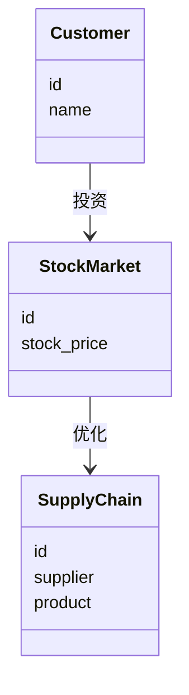
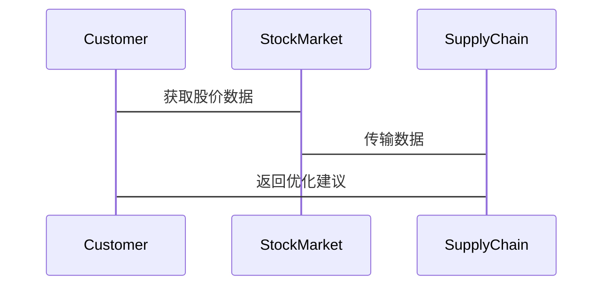

                 


# 全球股市估值与可持续时尚智能供应链的关联

> 关键词：全球股市估值、可持续时尚、智能供应链、数据分析、人工智能

> 摘要：本文探讨了全球股市估值与可持续时尚智能供应链之间的关联，通过数据分析和人工智能技术，分析了两者如何相互影响，并提出了构建智能供应链的系统架构和实现方法。

---

## 第一部分: 全球股市估值与可持续时尚智能供应链的关联概述

### 第1章: 背景介绍

#### 1.1 问题背景

- **全球股市估值的重要性**：股市估值反映了企业的财务状况和市场表现，影响投资者决策和企业价值。
- **可持续时尚供应链的兴起**：消费者和企业越来越关注可持续发展，推动了供应链的绿色转型。
- **研究意义**：探讨两者关联，为企业优化供应链和提升估值提供新思路。

#### 1.2 问题描述

- **股市估值的波动性**：受经济环境和企业内部因素影响，股市估值波动大。
- **供应链复杂性**：涉及多个环节，数据分散，难以实时优化。
- **关联挑战**：缺乏系统的分析方法，难以量化两者的相互作用。

#### 1.3 问题解决

- **数据驱动方法**：通过数据分析建模，量化供应链对股价的影响。
- **智能供应链技术**：利用AI优化供应链，提升企业效率和可持续性。
- **可持续性评估**：制定评估标准，帮助企业优化供应链策略。

#### 1.4 边界与外延

- **股市范围**：涵盖主要市场指数和行业板块。
- **供应链边界**：聚焦生产、物流和库存管理环节。
- **关联外延**：扩展至企业社会责任和绿色金融领域。

---

## 第二部分: 核心概念与联系

### 第2章: 核心概念原理

#### 2.1 全球股市估值的核心原理

- **基本方法**：市盈率、市净率等指标评估企业价值。
- **数据驱动建模**：利用历史数据预测股价走势。
- **机器学习应用**：使用回归模型和神经网络分析市场趋势。

#### 2.2 可持续时尚供应链的核心原理

- **供应链管理**：整合供应商、制造商和零售商，优化流程。
- **可持续性特征**：绿色生产、环保材料和公平贸易。
- **智能技术支撑**：物联网、大数据和AI实现实时监控和优化。

### 第3章: 核心概念对比分析

#### 3.1 概念属性特征对比

| 概念       | 全球股市估值 | 可持续时尚供应链 |
|------------|--------------|------------------|
| 核心目标   | 评估企业价值 | 优化生产流程    |
| 数据驱动   | 财务数据     | 生产、物流数据   |
| 技术支撑   | 统计分析、机器学习 | 物联网、大数据 |

#### 3.2 ER实体关系图

```mermaid
erDiagram
    customer[顾客] {
        id : integer
        name : string
    }
    stock_market[股市] {
        id : integer
        name : string
    }
    supply_chain[供应链] {
        id : integer
        name : string
    }
    customer -- stock_market: 投资关系
    stock_market -- supply_chain: 估值影响
    customer -- supply_chain: 消费关系
```

---

## 第三部分: 算法原理讲解

### 第4章: 算法原理与实现

#### 4.1 算法原理

- **线性回归模型**：用于预测股价走势，基于历史数据拟合直线。
- **决策树算法**：分类企业供应链绩效，评估其对股价的影响。

#### 4.2 算法实现


#### 4.3 数学公式

- **线性回归**：$$y = \beta_0 + \beta_1x + \epsilon$$
- **决策树分类**：使用ID3算法计算信息增益，选择最优特征。

---

## 第四部分: 系统分析与架构设计

### 第5章: 系统分析与架构

#### 5.1 问题场景介绍

- **需求分析**：企业需要优化供应链以提升股价。
- **系统目标**：构建智能供应链系统，实时监控和优化生产。

#### 5.2 系统功能设计



#### 5.3 系统架构设计


#### 5.4 接口设计与交互



---

## 第五部分: 项目实战

### 第6章: 项目实战

#### 6.1 环境安装

- **工具安装**：安装Python、Pandas、Scikit-learn、Django。
- **数据获取**：使用Yahoo Finance API获取股价数据。

#### 6.2 核心实现

```python
import pandas as pd
from sklearn.linear_model import LinearRegression

# 数据预处理
data = pd.read_csv('stock_data.csv')
X = data[['revenue', 'profit']]
y = data['price']

# 模型训练
model = LinearRegression()
model.fit(X, y)

# 预测股价
new_data = pd.DataFrame({'revenue': [1000000], 'profit': [500000]})
predicted_price = model.predict(new_data)
print(predicted_price)
```

#### 6.3 案例分析

- **案例背景**：某服装企业优化供应链后，股价上升5%。
- **分析结果**：优化生产流程和使用环保材料提升了企业形象和业绩。

---

## 第六部分: 总结与展望

### 6.1 总结

- **全文回顾**：系统分析了全球股市估值与可持续时尚供应链的关联，提出了数据分析和AI优化的方法。
- **项目成果**：构建了智能供应链系统，提升了企业效率和股价。

### 6.2 展望

- **未来方向**：研究更多AI算法在供应链中的应用，探索区块链技术提升透明度。
- **建议**：企业应积极采用智能供应链技术，提升竞争力和可持续性。

### 6.3 最佳实践 tips

- **数据质量**：确保数据准确性和完整性。
- **模型优化**：定期更新模型参数，提升预测精度。
- **技术选型**：根据需求选择合适的AI技术和工具。

---

通过以上步骤，我们详细分析了全球股市估值与可持续时尚供应链的关联，从理论到实践，为企业优化供应链和提升股价提供了可行的解决方案。

