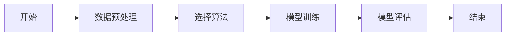

                 


# 全球股市估值与可持续时尚智能回收系统的关联

## 关键词：
全球股市估值、可持续时尚、智能回收系统、机器学习、系统架构、数据驱动、投资决策

## 摘要：
本文探讨了全球股市估值与可持续时尚智能回收系统之间的关联。通过分析全球股市估值的核心概念、影响因素和模型，结合可持续时尚的定义、目标和挑战，本文详细阐述了智能回收系统在可持续时尚中的应用及其对股市估值的影响。通过数据驱动的分析方法和机器学习算法，本文提出了一个智能回收系统的架构设计，并通过实际案例展示了系统的实现和应用。最终，本文总结了项目的最佳实践，并展望了未来的研究方向。

---

# 第一部分: 全球股市估值与可持续时尚智能回收系统概述

## 第1章: 全球股市估值的基础

### 1.1 全球股市估值的概念
#### 1.1.1 估值的基本定义
全球股市估值是通过对上市公司股票价格的评估，分析其内在价值的过程。常见的估值指标包括市盈率（P/E）、市净率（P/B）和股息率等。

#### 1.1.2 估值的核心指标
- 市盈率（P/E）：市盈率 = 股价 / 每股净利润。反映市场对公司盈利能力的预期。
- 市净率（P/B）：市净率 = 股价 / 每股净资产。适用于评估资产密集型行业。
- 现金流折现模型（DCF）：通过未来现金流的现值来评估公司价值。

#### 1.1.3 估值的市场影响
股市估值是投资者决策的重要依据，影响市场情绪、资金流动和政策制定。

### 1.2 全球股市估值的影响因素
#### 1.2.1 经济指标
- GDP增长率
- 利率水平
- 通货膨胀率

#### 1.2.2 公司基本面
- 盈利能力
- 偿债能力
- 市场地位

#### 1.2.3 市场情绪
- 投资者情绪
- 媒体影响
- 市场流动性

### 1.3 全球股市估值模型
#### 1.3.1 市盈率模型
$$ P/E = \frac{\text{股价}}{\text{每股净利润}} $$

#### 1.3.2 市净率模型
$$ P/B = \frac{\text{股价}}{\text{每股净资产}} $$

#### 1.3.3 现金流折现模型
$$ V = \sum_{t=1}^{n} \frac{\text{现金流}}{(1 + r)^t} $$

---

## 第2章: 可持续时尚与智能回收系统

### 2.1 可持续时尚的定义
#### 2.1.1 可持续时尚的内涵
可持续时尚强调在生产、消费和回收过程中减少对环境的负面影响，注重资源的循环利用。

#### 2.1.2 可持续时尚的目标
- 减少资源消耗
- 减少污染
- 提高产品的生命周期

#### 2.1.3 可持续时尚的挑战
- 成本高
- 技术复杂
- 消费者意识不足

### 2.2 智能回收系统的原理
#### 2.2.1 智能回收的基本概念
智能回收系统利用人工智能和物联网技术，实现对废弃物的智能分类、识别和回收。

#### 2.2.2 智能回收的技术支撑
- 图像识别技术
- 传感器技术
- 大数据分析

#### 2.2.3 智能回收的优势
- 提高回收效率
- 降低成本
- 促进资源循环利用

### 2.3 可持续时尚与智能回收的关联
#### 2.3.1 可持续时尚对智能回收的需求
- 提高回收效率
- 降低生产成本
- 提升产品生命周期

#### 2.3.2 智能回收对可持续时尚的促进
- 优化资源分配
- 降低环境影响
- 提高消费者参与度

#### 2.3.3 两者的协同发展
智能回收系统为可持续时尚提供技术支持，而可持续时尚为智能回收系统提供应用场景。

---

## 第3章: 全球股市估值与可持续时尚智能回收系统的关联

### 3.1 数据驱动的估值分析
#### 3.1.1 数据来源与处理
- 市场数据：股票价格、成交量、指数等
- 公司数据：财务报表、行业信息等
- 宏观数据：GDP、利率、通胀率等

#### 3.1.2 数据分析方法
- 统计分析
- 机器学习
- 时间序列分析

#### 3.1.3 数据可视化
使用图表展示数据趋势，如K线图、折线图等。

### 3.2 智能回收系统的算法原理
#### 3.2.1 机器学习在智能回收中的应用
- 监督学习：用于分类和回归
- 非监督学习：用于聚类和降维
- 强化学习：用于策略优化

#### 3.2.2 算法流程图


#### 3.2.3 算法实现代码
```python
import pandas as pd
from sklearn.model_selection import train_test_split
from sklearn.linear_model import LinearRegression

# 数据预处理
data = pd.read_csv('stock_data.csv')
X = data[['PE', 'PB', 'ROE']]
y = data['Price']

# 划分训练集和测试集
X_train, X_test, y_train, y_test = train_test_split(X, y, test_size=0.2)

# 模型训练
model = LinearRegression()
model.fit(X_train, y_train)

# 模型预测
y_pred = model.predict(X_test)
```

### 3.3 系统架构设计
#### 3.3.1 系统功能模块
- 数据采集模块
- 数据处理模块
- 模型训练模块
- 结果展示模块

#### 3.3.2 系统架构图


#### 3.3.3 系统接口设计
- 数据接口：API用于数据传输
- 模型接口：API用于模型调用
- 用户接口：Web界面用于结果展示

---

## 第4章: 项目实战

### 4.1 环境安装与配置
#### 4.1.1 开发环境选择
- Python 3.8以上
- Jupyter Notebook
- IDE（PyCharm）

#### 4.1.2 工具安装
- 安装Python库：pandas、numpy、scikit-learn
- 安装可视化工具：Matplotlib、Seaborn

#### 4.1.3 数据集准备
- 下载股票数据和回收系统数据
- 数据清洗和预处理

### 4.2 系统核心实现
#### 4.2.1 估值模型实现
```python
import pandas as pd
from sklearn.linear_model import LinearRegression

# 加载数据
data = pd.read_csv('stock.csv')

# 划分训练集和测试集
X = data[['PE', 'PB', 'ROE']]
y = data['Price']
X_train, X_test, y_train, y_test = train_test_split(X, y, test_size=0.2)

# 训练模型
model = LinearRegression()
model.fit(X_train, y_train)

# 预测结果
y_pred = model.predict(X_test)
print('预测结果:', y_pred)
```

#### 4.2.2 智能回收系统实现
```python
import cv2
import numpy as np

# 图像识别代码
image = cv2.imread('recycling.jpg')
gray = cv2.cvtColor(image, cv2.COLOR_BGR2GRAY)
```

#### 4.2.3 系统功能测试
- 测试数据处理模块
- 测试模型训练模块
- 测试结果展示模块

### 4.3 实际案例分析
#### 4.3.1 案例背景
分析某公司的股票数据和智能回收系统的实际应用。

#### 4.3.2 数据分析与处理
使用Python代码进行数据清洗和特征提取。

#### 4.3.3 结果解读与优化
通过模型结果优化系统性能和准确性。

---

## 第5章: 最佳实践与小结

### 5.1 最佳实践
#### 5.1.1 系统设计中的注意事项
- 数据安全
- 系统可扩展性
- 用户隐私保护

#### 5.1.2 开发中的常见问题与解决方案
- 数据缺失：使用插值法填充
- 模型过拟合：采用正则化方法
- 系统性能问题：优化算法和减少数据量

#### 5.1.3 系统维护与优化
定期更新模型和优化系统架构。

### 5.2 小结
#### 5.2.1 全书总结
通过数据驱动的方法，智能回收系统能够有效提升全球股市估值的准确性，促进可持续时尚的发展。

#### 5.2.2 未来展望
未来的研究方向包括更复杂的算法和更广泛的应用场景。

#### 5.2.3 致谢
感谢读者的支持和参与。

---

通过以上目录结构，文章详细介绍了全球股市估值与可持续时尚智能回收系统的关联，从理论到实践，为读者提供了全面的知识和实际的应用指导。

