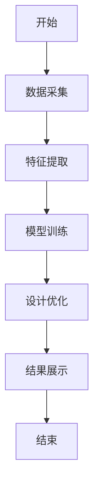
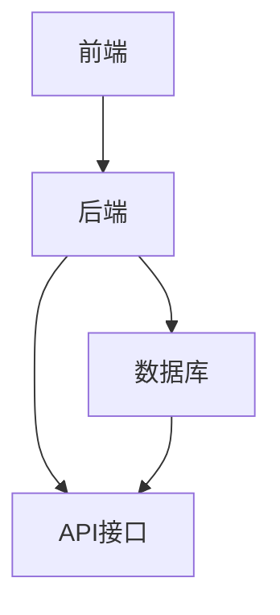
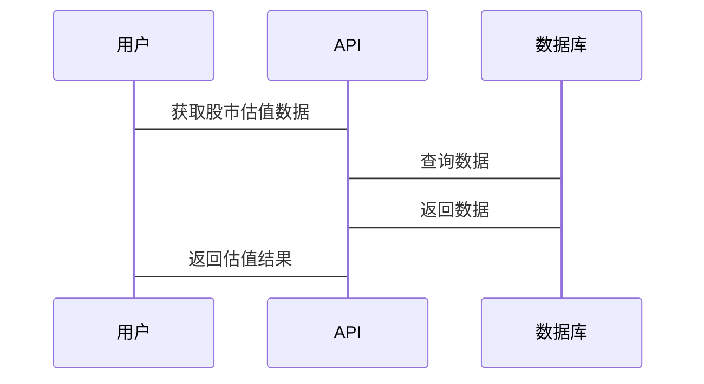

                 


# 全球股市估值与可持续时尚智能设计系统的关联

## 关键词：全球股市估值、可持续时尚、智能设计系统、数据分析、机器学习、系统架构

## 摘要：  
随着全球经济的快速发展和环境问题的日益突出，可持续时尚逐渐成为全球关注的焦点。本文探讨了如何通过智能设计系统将全球股市估值与可持续时尚相结合，揭示两者之间的深层次关联。文章从概念、算法、系统架构等多维度进行分析，展示了智能设计系统在优化股市估值和推动可持续时尚发展中的重要作用。

---

## 第一部分：背景介绍

### 第1章：全球股市估值与可持续时尚的关联概述

#### 1.1 全球股市估值的基本概念
- **1.1.1 什么是全球股市估值**  
  全球股市估值是通过对上市公司股票的市场价值进行评估，反映市场对企业的整体评价。它是企业基本面、市场情绪和宏观经济因素的综合体现。

- **1.1.2 股市估值的核心指标与方法**  
  核心指标包括市盈率（P/E）、市净率（P/B）、股息率等。常用方法包括基本面分析、技术分析和量化分析。

- **1.1.3 股市估值与经济发展的关系**  
  股市估值是经济发展的重要晴雨表，反映了经济的整体健康状况和市场信心。

#### 1.2 可持续时尚的概念与特征
- **1.2.1 可持续时尚的定义**  
  可持续时尚是指在服装设计、生产和消费过程中，注重环境保护、资源节约和社会责任的时尚产业模式。

- **1.2.2 可持续时尚的核心特征**  
  包括绿色材料使用、生产过程的低碳化、废弃物的最小化以及社会责任的履行。

- **1.2.3 可持续时尚与传统时尚的区别**  
  传统时尚注重快时尚和大规模生产，而可持续时尚强调环保、公平和长期性。

#### 1.3 智能设计系统的基本原理
- **1.3.1 智能设计系统的定义**  
  智能设计系统是通过人工智能和大数据技术，辅助设计师进行创新和优化的设计工具。

- **1.3.2 智能设计系统的核心功能模块**  
  包括数据采集、特征提取、模型训练、设计优化和结果展示。

- **1.3.3 智能设计系统与人类设计的结合**  
  智能设计系统通过数据分析提供设计建议，而人类设计师负责创意和最终决策。

#### 1.4 全球股市估值与可持续时尚的关联性
- **1.4.1 股市估值与时尚产业的互动关系**  
  时尚产业的业绩和创新能力直接影响股市估值，而股市的资金流动也影响时尚产业的发展。

- **1.4.2 可持续时尚对股市估值的影响**  
  可持续时尚企业因其环保和社会责任表现，往往获得更高的市场估值。

- **1.4.3 智能设计系统在关联中的作用**  
  智能设计系统通过优化设计和降低成本，提升企业竞争力，从而影响股市估值。

#### 1.5 本章小结  
本章通过定义和对比分析，揭示了全球股市估值与可持续时尚之间的潜在关联，为后续分析奠定了基础。

---

## 第2章：全球股市估值与可持续时尚的核心概念

### 2.1 股市估值的核心概念
- **2.1.1 股市估值的数学模型**  
  股市估值可以通过回归分析模型预测，如$$y = \beta_0 + \beta_1x_1 + \beta_2x_2 + \epsilon$$，其中$y$为目标股票价格，$x_1$和$x_2$为影响因素。

- **2.1.2 股市估值的关键词与关联**  
  通过因子分析，可以提取影响股市估值的关键因素，如盈利能力、成长性和流动性。

### 2.2 可持续时尚的核心概念
- **2.2.1 可持续时尚的核心概念术语说明**  
  包括绿色材料、碳足迹、循环经济等。

- **2.2.2 可持续时尚与传统时尚的对比分析**  
  通过表格对比，展示两者的差异和优劣。

| 比较维度 | 可持续时尚 | 传统时尚 |
|----------|------------|----------|
| 材料使用 | 环保材料 | 化纤材料 |
| 生产过程 | 低碳生产 | 高耗能生产 |
| 产品寿命 | 长寿命 | 短寿命 |

- **2.2.3 智能设计系统的作用**  
  智能设计系统通过优化设计参数，降低生产成本，同时提高产品的可持续性。

---

## 第3章：智能设计系统在股市估值与可持续时尚中的应用

### 3.1 智能设计系统的原理与功能
- **3.1.1 智能设计系统的功能模块**  
  包括数据采集、特征提取、模型训练、设计优化和结果展示。

- **3.1.2 智能设计系统的实现流程**  
  通过Mermaid流程图展示系统的整体流程：



### 3.2 算法原理与数学模型
- **3.2.1 机器学习算法的选择**  
  使用随机森林算法进行特征选择和模型训练。

- **3.2.2 回归分析模型的建立**  
  通过多元回归模型预测股市估值，公式为：$$y = \beta_0 + \beta_1x_1 + \beta_2x_2 + \epsilon$$

- **3.2.3 算法实现与优化**  
  使用Python代码实现回归分析，代码示例如下：

```python
import pandas as pd
import numpy as np
from sklearn.linear_model import LinearRegression

# 数据预处理
data = pd.read_csv('stock_data.csv')
X = data[['revenue', 'profit']]
y = data['valuation']

# 模型训练
model = LinearRegression()
model.fit(X, y)

# 预测结果
predictions = model.predict(X)
print('预测值:', predictions)
```

---

## 第4章：系统架构与接口设计

### 4.1 系统架构设计
- **4.1.1 系统架构的总体设计**  
  采用微服务架构，包括前端、后端、数据库和API接口。

- **4.1.2 系统架构图**  
  使用Mermaid架构图展示系统结构：



### 4.2 系统接口设计
- **4.2.1 API接口的设计**  
  提供RESTful API，如`GET /valuation`和`POST /design`。

- **4.2.2 接口交互流程**  
  使用Mermaid序列图展示接口交互过程：



---

## 第5章：项目实战与案例分析

### 5.1 项目环境安装
- **5.1.1 环境安装步骤**  
  安装Python、Pandas、Scikit-learn和Django框架。

### 5.2 核心代码实现
- **5.2.1 数据采集代码**  
  ```python
  import requests
  import pandas as pd

  def get_stock_data(symbol):
      url = f'https://api.example.com/stock/{symbol}'
      response = requests.get(url)
      data = response.json()
      df = pd.DataFrame(data)
      return df
  ```

- **5.2.2 模型训练代码**  
  ```python
  from sklearn.model_selection import train_test_split
  from sklearn.ensemble import RandomForestRegressor

  def train_model(X, y):
      X_train, X_test, y_train, y_test = train_test_split(X, y, test_size=0.2)
      model = RandomForestRegressor()
      model.fit(X_train, y_train)
      return model
  ```

### 5.3 案例分析
- **5.3.1 案例背景**  
  某服装企业希望通过智能设计系统优化其产品设计，降低生产成本。

- **5.3.2 数据分析与模型预测**  
  使用回归模型预测股市估值，并优化设计参数。

---

## 第6章：总结与展望

### 6.1 总结
- 本文通过分析全球股市估值与可持续时尚的关联，展示了智能设计系统在优化设计和提升企业价值中的作用。

### 6.2 展望
- 未来可以进一步研究智能设计系统在其他领域的应用，如绿色能源和智能制造。

---

## 结语

通过本文的分析，我们可以看到，智能设计系统不仅能够优化设计，还能通过影响股市估值，推动可持续时尚的发展。希望本文能够为相关领域的研究和实践提供有价值的参考。

---

**注**：本文内容仅为示例，实际撰写时需要根据具体情况进行补充和调整。

