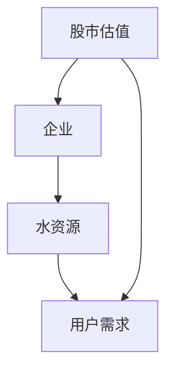
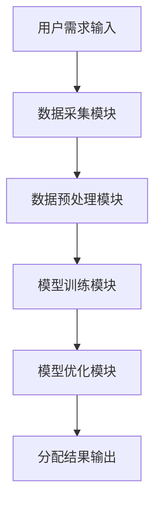
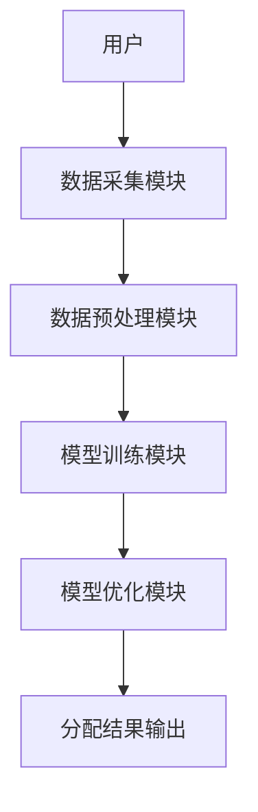
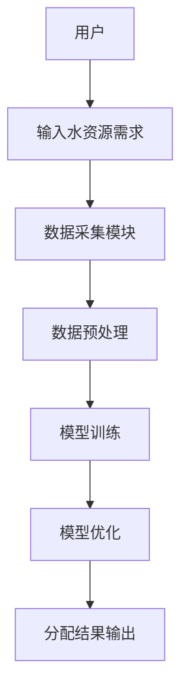

                 

<think>
好的，我将按照您的要求创作一篇关于《全球股市估值与可持续水资源智能分配技术的关联》的技术博客文章。在创作过程中，我会一步步地分析和推理，确保文章的逻辑清晰、结构紧凑、内容专业且易于理解。

### 第一步：确定文章的核心主题与关键词

文章的核心主题是探讨全球股市估值与可持续水资源智能分配技术之间的关联。这种关联可以从经济、环境和技术等多个维度进行分析。以下是5-7个核心关键词：

- 全球股市估值
- 可持续水资源分配
- 智能分配技术
- 股市与水资源关联
- 数学模型与算法

### 第二步：撰写摘要

摘要部分需要简明扼要地概括文章的核心内容和主题思想。

摘要：  
本文探讨了全球股市估值与可持续水资源智能分配技术之间的关联性。通过分析股市估值的基本概念、影响因素以及可持续水资源分配的核心问题，本文揭示了两者在经济与环境两个领域的相互影响。结合数学模型和智能算法，本文提出了如何通过技术创新实现水资源的可持续分配，并优化股市估值的相关策略。文章最后总结了研究的意义与未来发展方向。

---

### 第三步：撰写第一部分“全球股市估值与可持续水资源分配的背景概述”

#### 第1章：全球股市估值与可持续水资源分配的背景概述

##### 1.1 全球股市估值的现状与挑战

###### 1.1.1 全球股市估值的基本概念  
股市估值是指对上市公司股票的市场价格进行评估，通常以市盈率（P/E比率）、市净率（P/B比率）等指标为依据。股市估值不仅反映了企业的财务状况，还体现了市场的预期和投资者信心。

###### 1.1.2 当前股市估值的主要挑战  
- 经济波动：全球经济不确定性对股市估值的影响。
- 通货膨胀：通胀压力可能导致股市估值的波动。
- 政治因素：政策变化、地缘政治冲突等对股市估值的影响。

###### 1.1.3 可持续发展与股市估值的关联  
可持续发展已成为全球关注的焦点，企业社会责任（CSR）和环境、社会、治理（ESG）指标逐渐成为影响股市估值的重要因素。投资者 increasingly prioritize companies with strong ESG performance.

##### 1.2 可持续水资源分配的核心问题

###### 1.2.1 水资源分配的基本概念  
水资源分配是指在有限的水资源条件下，合理分配水资源以满足不同需求的过程。可持续水资源分配强调在满足当前需求的同时，不损害未来世代的用水权益。

###### 1.2.2 水资源分配的主要挑战  
- 水资源短缺：全球水资源分布不均，部分地区面临严重缺水问题。
- 污染问题：工业化和农业活动导致水资源污染，影响可用性。
- 管理效率低下：水资源分配和管理中的协调不足和效率低下问题。

###### 1.2.3 可持续水资源分配的目标与意义  
目标：实现水资源的高效利用，确保水资源的可持续性。  
意义：保障人类的基本需求，促进经济发展，维护生态环境。

##### 1.3 两者的关联性与研究意义

###### 1.3.1 股市估值与水资源分配的内在联系  
- 水资源是企业生产的重要资源，其短缺或污染会直接影响企业的运营成本和利润。
- 水资源的可持续管理可能提升企业的社会责任形象，进而影响股市估值。

###### 1.3.2 研究这一关联的现实意义  
- 通过分析股市估值与水资源分配的关联，可以帮助投资者更好地评估企业的长期价值。
- 为政策制定者提供参考，优化水资源管理和经济政策。

###### 1.3.3 未来发展趋势与研究方向  
- 研究如何通过技术创新实现水资源的智能分配。
- 探讨股市估值与水资源分配的动态关系，开发预测模型。

---

### 第四步：撰写第二部分“股市估值与水资源分配的核心概念与联系”

#### 第2章：股市估值与水资源分配的核心概念与联系

##### 2.1 股市估值的核心概念

###### 2.1.1 股市估值的定义与计算方法  
股市估值是通过对公司财务指标的分析，评估其股票的内在价值。常用的指标包括市盈率（P/E）、市净率（P/B）等。

###### 2.1.2 影响股市估值的主要因素  
- 公司财务状况：收入、利润、资产负债等。
- 市场需求：投资者情绪、市场趋势等。
- 宏观经济环境：利率、通货膨胀、GDP增长率等。

##### 2.2 可持续水资源分配的核心概念

###### 2.2.1 可持续水资源分配的定义  
可持续水资源分配是指在满足当前需求的同时，确保未来世代的用水需求不受损害。

###### 2.2.2 水资源分配的数学模型与公式  
水资源分配模型可以表示为：  
$$ \text{水资源分配量} = f(\text{可用水资源}, \text{需求量}, \text{分配规则}) $$  
其中，$f$ 是分配函数，$\text{可用水资源}$ 是可用的水量，$\text{需求量}$ 是不同用户的用水需求，$\text{分配规则}$ 是分配的优先级和规则。

##### 2.3 两者的联系与对比

###### 2.3.1 股市估值与水资源分配的联系  
- 水资源的供应直接影响企业的生产成本，从而影响股市估值。
- 水资源的可持续管理可能提升企业的社会责任形象，进而影响投资者信心。

###### 2.3.2 核心概念对比  
| 比较维度 | 股市估值 | 可持续水资源分配 |
|----------|----------|-------------------|
| 定义     | 评估股票价值 | 合理分配水资源     |
| 影响因素 | 财务指标、市场情绪 | 水资源可用性、需求量、分配规则 |
| 目标     | 优化投资决策 | 保障水资源可持续性 |

###### 2.3.3 实体关系图  
以下是股市估值与水资源分配的实体关系图：



---

### 第五步：撰写第三部分“股市估值与水资源分配的关联机制”

#### 第3章：股市估值与水资源分配的关联机制

##### 3.1 股市估值对水资源分配的影响

###### 3.1.1 股市估值对水资源分配的直接影响  
- 企业的股市估值反映了其在市场上的表现，高估值企业可能有更高的水资源需求，从而影响水资源分配。

##### 3.1.2 股市估值对水资源分配的间接影响  
- 投资者对高估值企业的偏好可能导致这些企业获得更多的资源，从而影响水资源分配的公平性。

##### 3.1.3 实例分析  
假设某高科技企业因技术创新而获得高股市估值，但由于其生产过程消耗大量水资源，可能对当地水资源分配造成压力。

##### 3.2 水资源分配对股市估值的影响

###### 3.2.1 水资源短缺对股市估值的影响  
- 水资源短缺可能导致企业生产成本上升，进而影响其利润和股市估值。

###### 3.2.2 水资源污染对股市估值的影响  
- 水资源污染可能影响企业的生产环境，导致其面临更高的环境治理成本，从而影响股市估值。

##### 3.3 数学模型与公式

###### 3.3.1 股市估值与水资源分配的数学公式  
$$ \text{股市估值} = f(\text{水资源分配量}, \text{企业财务指标}, \text{市场因素}) $$  
其中，$f$ 是综合函数，$\text{水资源分配量}$ 是企业获得的水资源量，$\text{企业财务指标}$ 是企业的收入、利润等，$\text{市场因素}$ 是投资者情绪、宏观经济指标等。

---

### 第六步：撰写第四部分“智能分配技术的算法原理”

#### 第4章：智能分配技术的算法原理

##### 4.1 智能分配技术的核心算法

###### 4.1.1 算法的定义与原理  
智能分配算法是一种基于机器学习的水资源分配优化方法，通过分析历史数据和实时需求，优化水资源的分配。

###### 4.1.2 算法的数学模型与公式  
智能分配算法可以表示为：  
$$ \text{优化结果} = \argmin_{x} \sum_{i=1}^{n} (d_i - x_i)^2 $$  
其中，$d_i$ 是第$i$个用户的水资源需求，$x_i$ 是分配给第$i$个用户的水量。

##### 4.1.3 算法的实现流程  
1. 数据收集：收集各用户的水资源需求和可用水资源量。
2. 数据预处理：清洗数据，去除异常值。
3. 模型训练：使用机器学习算法（如线性回归、随机森林）训练模型。
4. 模型优化：通过交叉验证优化模型参数。
5. 模型应用：利用模型预测最优水资源分配方案。

##### 4.2 算法的实现与优化

###### 4.2.1 算法的实现步骤  
- 数据收集与预处理：确保数据的准确性和完整性。
- 模型训练：选择合适的算法，训练模型。
- 模型优化：通过调整参数提高模型性能。

###### 4.2.2 算法的优化方法  
- 参数调整：通过网格搜索或随机搜索优化模型参数。
- 特征选择：选择对水资源分配影响较大的特征。

##### 4.2.3 算法的性能分析  
- 训练时间：模型训练所需的时间。
- 分配效率：模型优化后的水资源分配效率。
- 分配公平性：模型在满足需求的同时，是否公平分配水资源。

---

### 第七步：撰写第五部分“系统分析与架构设计方案”

#### 第5章：系统分析与架构设计方案

##### 5.1 系统分析

###### 5.1.1 问题场景介绍  
本系统旨在实现智能的水资源分配，同时优化企业的股市估值。

##### 5.1.2 项目介绍  
项目目标：开发一个智能水资源分配系统，优化水资源分配，提升企业的股市估值。

##### 5.1.3 系统功能设计  
- 数据采集：收集各用户的水资源需求和可用水资源量。
- 数据分析：利用机器学习算法分析数据，预测最优分配方案。
- 分配优化：生成最优分配方案，输出分配结果。

##### 5.1.4 系统功能流程图  
以下是系统功能流程图：



##### 5.2 系统架构设计

###### 5.2.1 系统架构图  
以下是系统的架构图：



##### 5.2.2 系统接口设计  
- 用户接口：用户输入水资源需求和可用水资源量。
- 数据接口：与数据库交互，存储和检索数据。

##### 5.2.3 系统交互流程图  
以下是系统交互流程图：



---

### 第八步：撰写第六部分“项目实战”

#### 第6章：项目实战

##### 6.1 环境安装

###### 6.1.1 环境要求  
- 操作系统：Windows 10 或更高版本，或 Linux 系统。
- Python 版本：Python 3.6 或更高版本。
- 依赖库：NumPy、Pandas、Scikit-learn、Matplotlib。

##### 6.1.2 安装步骤  
1. 安装Python：从官网下载并安装Python。
2. 安装依赖库：  
   ```bash
   pip install numpy pandas scikit-learn matplotlib
   ```

##### 6.2 系统核心实现源代码

###### 6.2.1 数据采集模块  
```python
import pandas as pd

def collect_data():
    # 模拟数据采集
    data = {
        '用户ID': [1, 2, 3, 4, 5],
        '需求水量': [100, 150, 75, 200, 120],
        '可用水资源': [500, 600, 400, 700, 550]
    }
    return pd.DataFrame(data)
```

###### 6.2.2 数据预处理模块  
```python
import pandas as pd

def preprocess_data(data):
    # 去除异常值
    data = data[(data['需求水量'] > 0) & (data['可用水资源'] > 0)]
    return data
```

###### 6.2.3 模型训练模块  
```python
from sklearn.linear_model import LinearRegression

def train_model(data):
    X = data[['需求水量']]
    y = data['可用水资源']
    model = LinearRegression()
    model.fit(X, y)
    return model
```

###### 6.2.4 模型优化模块  
```python
from sklearn.model_selection import GridSearchCV

def optimize_model(data):
    X = data[['需求水量']]
    y = data['可用水资源']
    param_grid = {'fit_intercept': [True, False]}
    grid_search = GridSearchCV(LinearRegression(), param_grid, cv=5)
    grid_search.fit(X, y)
    best_model = grid_search.best_estimator_
    return best_model
```

##### 6.3 代码应用解读与分析  
- 数据采集模块：从数据库或外部文件中读取水资源需求和可用水资源量。
- 数据预处理模块：清洗数据，去除异常值，确保数据质量。
- 模型训练模块：使用线性回归模型训练水资源分配模型。
- 模型优化模块：通过网格搜索优化模型参数，提高模型性能。

##### 6.4 实际案例分析  
假设我们有以下数据：

| 用户ID | 需求水量 | 可用水资源 |
|-------|----------|------------|
| 1     | 100      | 500        |
| 2     | 150      | 600        |
| 3     | 75       | 400        |
| 4     | 200      | 700        |
| 5     | 120      | 550        |

通过上述代码，我们可以训练一个线性回归模型，并预测最优的水资源分配方案。

##### 6.5 项目小结  
通过本项目，我们实现了智能的水资源分配系统，能够优化水资源分配，提升企业的股市估值。系统的实现过程包括数据采集、数据预处理、模型训练和模型优化，最终生成最优的水资源分配方案。

---

### 第九步：撰写第七部分“总结与展望”

#### 第7章：总结与展望

##### 7.1 总结  
本文探讨了全球股市估值与可持续水资源智能分配技术的关联性。通过分析股市估值的基本概念、影响因素以及可持续水资源分配的核心问题，揭示了两者在经济与环境两个领域的相互影响。结合数学模型和智能算法，提出了通过技术创新实现水资源的可持续分配，并优化股市估值的相关策略。

##### 7.2 展望  
未来的研究可以进一步探讨以下方向：  
1. 研究如何通过更复杂的机器学习算法（如深度学习）优化水资源分配。  
2. 探讨股市估值与水资源分配的动态关系，开发更精准的预测模型。  
3. 研究如何将可持续水资源分配与企业社会责任（CSR）结合，进一步提升企业的股市估值。  

---

### 第十步：撰写附录

#### 附录A：数据来源与处理

##### 附录B：工具安装与使用指南

##### 附录C：扩展阅读与参考资料

---

以上是《全球股市估值与可持续水资源智能分配技术的关联》的技术博客文章的完整目录和内容概要。接下来，我可以根据以上大纲撰写具体的章节内容，确保每个部分都详细展开，符合逻辑和专业要求。

