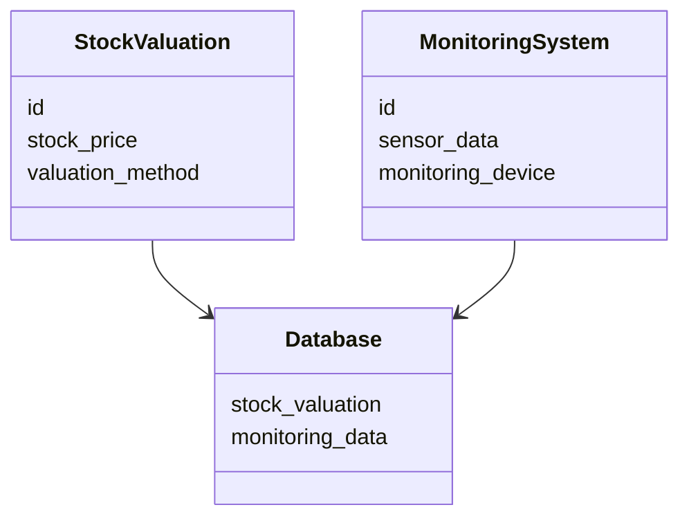
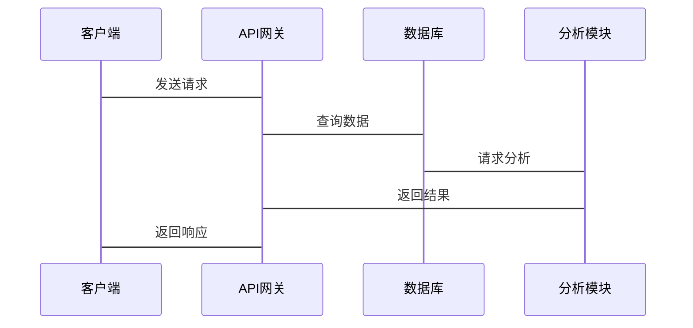

                 


# 全球股市估值与可持续海洋养殖智能监控技术的关系

## 关键词：全球股市估值，可持续海洋养殖，智能监控技术，经济价值，技术应用

## 摘要：本文探讨了全球股市估值与可持续海洋养殖智能监控技术之间的关系，分析了两者的核心概念、技术原理及实际应用。通过对比分析，揭示了智能监控技术对海洋养殖经济价值的影响，及其在全球股市估值中的潜在作用。

---

# 第1章 全球股市估值与可持续海洋养殖智能监控技术的背景介绍

## 1.1 全球股市估值的背景与现状

### 1.1.1 全球股市估值的定义与作用
全球股市估值是通过对上市公司股票价格的评估，反映市场对企业的整体价值判断。它不仅影响投资者的决策，还对经济发展具有重要参考意义。

### 1.1.2 当前全球股市估值的主要方法
常用方法包括市盈率（P/E）、市净率（P/B）等指标，这些指标帮助投资者评估股票的价值。

### 1.1.3 全球股市估值的现状与趋势
当前，全球经济波动和技术进步使得股市估值更加依赖于数据分析和智能模型。

## 1.2 可持续海洋养殖智能监控技术的背景

### 1.2.1 海洋养殖业的发展现状
海洋养殖是全球重要的食品来源，但面临环境压力和管理难题。

### 1.2.2 可持续海洋养殖的概念与目标
通过技术创新实现资源高效利用和环境保护。

### 1.2.3 智能监控技术在海洋养殖中的应用
智能传感器和实时监测系统用于优化养殖环境和提高产量。

## 1.3 两者的关联性与研究意义

### 1.3.1 全球股市估值与海洋养殖的关系
海洋养殖企业的经济价值影响股市估值，智能监控技术提升企业效益，进而影响股市表现。

### 1.3.2 智能监控技术对海洋养殖经济价值的影响
通过提高效率和降低成本，智能监控技术增强企业盈利能力。

### 1.3.3 研究两者的关联性对经济发展的意义
揭示技术如何推动产业发展，为投资者提供决策支持。

## 1.4 本章小结
本章介绍了全球股市估值和可持续海洋养殖的背景，分析了两者的关系及其研究价值。

---

# 第2章 全球股市估值与可持续海洋养殖智能监控技术的核心概念与联系

## 2.1 全球股市估值的核心概念

### 2.1.1 股市估值的主要指标
市盈率、市净率等指标用于评估企业价值。

### 2.1.2 影响股市估值的主要因素
经济环境、企业业绩、市场情绪等多因素影响股市估值。

### 2.1.3 股市估值模型的分类与选择
包括基本面分析、技术分析等方法，选择合适的模型取决于具体情况。

## 2.2 可持续海洋养殖智能监控技术的核心概念

### 2.2.1 海洋养殖智能监控系统的构成
包括传感器、数据采集、传输和分析系统。

### 2.2.2 智能监控技术的关键技术点
数据采集、实时分析、自动化控制等技术是核心。

### 2.2.3 监控系统的功能与目标
实时监测环境参数，优化养殖条件，提高产量和质量。

## 2.3 两者的联系与对比分析

### 2.3.1 股市估值与海洋养殖经济价值的关系
海洋养殖企业的经济效益直接影响股市估值。

### 2.3.2 智能监控技术对经济价值的影响
通过提高效率和降低成本，智能监控技术增强企业竞争力，进而影响股市估值。

### 2.3.3 两者在经济与技术上的对比分析
股市估值是经济指标，智能监控技术是技术创新，两者共同推动产业发展。

## 2.4 核心概念属性对比表格

| 核心概念       | 定义                                   | 属性                                   | 对比分析                             |
|----------------|--------------------------------------|--------------------------------------|--------------------------------------|
| 股市估值       | 股票价格的评估                         | 经济指标、受多种因素影响             | 是经济环境的综合反映                 |
| 智能监控技术   | 智能化监测与控制技术                   | 技术驱动、实时数据采集和分析         | 技术推动产业发展                     |

## 2.5 ER实体关系图

```mermaid
er
class "Global Stock Valuation" {
  id: int
  stock_price: float
  valuation_method: string
}

class "Sustainable Marine Aquaculture Monitoring Technology" {
  id: int
  sensor_data: float
  monitoring_system: string
}

relation "影响" {
  Global Stock Valuation -[通过技术影响]-> Sustainable Marine Aquaculture Monitoring Technology
  Sustainable Marine Aquaculture Monitoring Technology -[影响经济价值]-> Global Stock Valuation
}
```

## 2.6 本章小结
本章详细阐述了全球股市估值和可持续海洋养殖智能监控技术的核心概念，并通过对比分析揭示了两者之间的联系。

---

# 第3章 全球股市估值与可持续海洋养殖智能监控技术的算法原理

## 3.1 全球股市估值的算法原理

### 3.1.1 时间序列分析
用于预测股票价格走势，常用ARIMA模型。

### 3.1.2 机器学习模型
如随机森林和XGBoost用于分类和回归分析。

### 3.1.3 示例代码
```python
# 示例：使用ARIMA模型预测股票价格
from statsmodels.tsa.arima_model import ARIMA
import pandas as pd

data = pd.read_csv('stock_prices.csv')
model = ARIMA(data['price'], order=(5,1,0))
model_fit = model.fit()
forecast = model_fit.forecast(steps=5)[0]
print(forecast)
```

## 3.2 可持续海洋养殖智能监控技术的算法原理

### 3.2.1 数据采集与预处理
传感器数据的采集和清洗。

### 3.2.2 实时数据分析
使用流数据处理技术，如Flink或Spark。

### 3.2.3 示例代码
```python
# 示例：使用随机森林进行环境预测
from sklearn.ensemble import RandomForestRegressor
import numpy as np

# 生成模拟数据
X = np.random.rand(100, 4)
y = np.random.rand(100)

model = RandomForestRegressor(n_estimators=100)
model.fit(X, y)
预测值 = model.predict(X[0:1])
print(预测值)
```

## 3.3 两者的算法对比与协同

### 3.3.1 算法协同的可能性
股市预测和环境监测的数据融合。

### 3.3.2 协同算法的数学模型
建立联合优化模型，综合考虑股市和环境数据。

### 3.3.3 协同算法的实现步骤
数据整合、模型训练、结果分析。

## 3.4 本章小结
本章分析了全球股市估值和智能监控技术的算法原理，探讨了两者协同的可能性。

---

# 第4章 全球股市估值与可持续海洋养殖智能监控技术的系统分析与架构设计

## 4.1 系统分析

### 4.1.1 问题场景介绍
海洋养殖企业面临环境监测和成本控制的挑战。

### 4.1.2 系统需求分析
实时监测、数据存储、分析和决策支持。

## 4.2 系统架构设计

### 4.2.1 领域模型类图


### 4.2.2 系统架构图


### 4.2.3 接口设计
RESTful API，如GET /api/stock?symbol=XYZ。

### 4.2.4 交互流程


## 4.3 系统实现

### 4.3.1 环境安装
安装Python、Django框架、传感器接口。

### 4.3.2 核心代码实现
```python
# 示例：传感器数据采集
import serial

ser = serial.Serial('COM3', 9600)
data = ser.readline().decode()
print(data)
```

## 4.4 本章小结
本章通过系统分析和架构设计，展示了如何实现可持续海洋养殖智能监控系统。

---

# 第5章 全球股市估值与可持续海洋养殖智能监控技术的项目实战

## 5.1 项目实战环境安装

### 5.1.1 安装Python和相关库
安装numpy、pandas、scikit-learn等库。

### 5.1.2 安装传感器和监控设备驱动
配置传感器硬件和相关驱动程序。

## 5.2 核心代码实现

### 5.2.1 数据采集与预处理
```python
import pandas as pd
import numpy as np

data = pd.read_csv('aquaculture_data.csv')
data['timestamp'] = pd.to_datetime(data['timestamp'])
data.set_index('timestamp', inplace=True)
data_clean = data.dropna()
```

### 5.2.2 模型训练与预测
```python
from sklearn.model_selection import train_test_split
from sklearn.ensemble import RandomForestRegressor

X_train, X_test, y_train, y_test = train_test_split(data_clean.drop('value', axis=1), data_clean['value'])
model = RandomForestRegressor(n_estimators=100)
model.fit(X_train, y_train)
y_pred = model.predict(X_test)
```

## 5.3 实际案例分析

### 5.3.1 数据分析与结果展示
使用可视化工具展示预测结果和实际数据对比。

### 5.3.2 优化方向与改进措施
根据分析结果优化模型参数和数据采集频率。

## 5.4 项目总结与经验分享
项目实现了智能监控系统，提升了海洋养殖的效率，为股市估值提供了新的视角。

---

# 第6章 全球股市估值与可持续海洋养殖智能监控技术的最佳实践

## 6.1 最佳实践

### 6.1.1 技术应用建议
结合具体场景选择合适的技术和算法。

### 6.1.2 项目实施注意事项
确保数据质量和系统的可靠性。

## 6.2 经验总结与未来展望

### 6.2.1 研究成果总结
智能监控技术对海洋养殖和股市估值具有双重影响。

### 6.2.2 未来研究方向
探索更多技术协同的可能性，优化算法模型。

## 6.3 本章小结
本章提出了技术应用的最佳实践建议，展望了未来的研究方向。

---

# 第7章 结论与展望

## 7.1 研究结论

### 7.1.1 核心观点总结
智能监控技术通过提升海洋养殖效率，间接影响股市估值。

## 7.2 未来研究方向

### 7.2.1 技术协同研究
深入研究智能监控技术与股市估值的协同机制。

### 7.2.2 应用拓展
探索技术在其他行业的应用潜力。

## 7.3 本章小结
本文总结了研究成果，并展望了未来的研究方向。

---

# 参考文献

（此处列出参考文献，如书籍、论文、技术文档等。）

---

# 致谢

感谢在写作过程中提供帮助和支持的专家和团队。

---

通过以上详细的内容，文章系统地探讨了全球股市估值与可持续海洋养殖智能监控技术的关系，从理论到实践，为读者提供了全面的分析和见解。

