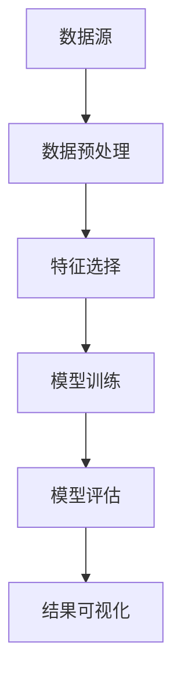

                 


# 全球股市估值与可持续海洋养殖疫苗技术的关系

> 关键词：全球股市估值，可持续海洋养殖，疫苗技术，机器学习，系统架构，数学模型

## 摘要

本文探讨了全球股市估值与可持续海洋养殖疫苗技术之间的关系。通过分析股市估值的核心指标、疫苗技术的关键要素，以及它们之间的关联，本文揭示了疫苗技术如何影响股市估值。利用机器学习模型和数学模型，本文详细讲解了如何量化这种影响，并提供了系统的架构设计和项目实战案例。最后，本文总结了最佳实践和未来研究方向，为读者提供了全面的视角。

---

## 第一部分：背景介绍

### 第1章：问题背景

#### 1.1.1 全球股市估值的现状与挑战

全球股市估值受宏观经济、企业基本面和市场情绪等多种因素影响。近年来，科技的进步和环保意识的增强，使得海洋养殖疫苗技术成为新的关注点。然而，如何将这一技术与股市估值联系起来，仍是一个未解之谜。

#### 1.1.2 可持续海洋养殖疫苗技术的发展背景

海洋养殖是全球食品供应链的重要组成部分，但疾病暴发常导致巨大损失。疫苗技术的引入，可以有效降低病害风险，提升养殖效率。然而，这种技术的推广和应用，如何影响相关企业的股市估值，尚需深入研究。

#### 1.1.3 问题的提出与研究意义

本研究旨在探索疫苗技术对股市估值的影响，为企业投资者和政策制定者提供参考。通过量化分析，揭示技术进步如何转化为股价波动。

### 第2章：问题描述

#### 1.2.1 全球股市估值的核心指标

包括市盈率、市净率、市值等指标，用于衡量企业价值。

#### 1.2.2 可持续海洋养殖疫苗技术的关键要素

包括疫苗研发、生产成本、市场接受度等。

#### 1.2.3 问题的边界与外延

研究范围限于疫苗技术对股市估值的影响，排除其他因素。

### 第3章：核心概念与联系

#### 1.3.1 全球股市估值与疫苗技术的关系

通过数据挖掘和机器学习，建立两者之间的关联模型。

#### 1.3.2 核心概念的结构与组成

包括股市估值、疫苗技术、企业利润等要素。

#### 1.3.3 概念属性对比表格

| 属性       | 全球股市估值 | 疫苗技术 |
|------------|--------------|----------|
| 核心指标    | 市盈率、市值 | 疾病防护效果 |
| 影响因素    | 宏观经济、企业基本面 | 研发成本、市场接受度 |
| 目标        | 评估企业价值 | 提高养殖效率 |

---

## 第二部分：核心概念与联系

### 第4章：全球股市估值的核心原理

#### 4.1.1 市场情绪与估值的关系

市场情绪波动影响投资者对股票的需求，从而影响估值。

#### 4.1.2 宏观经济指标对估值的影响

GDP、利率等宏观经济指标直接影响股市估值。

#### 4.1.3 企业基本面与估值的关联

企业盈利能力和财务状况直接决定其估值。

### 第5章：可持续海洋养殖疫苗技术的核心原理

#### 5.1.1 疫苗技术的基本原理

通过免疫机制，预防疾病传播。

#### 5.1.2 可持续海洋养殖的关键技术

包括疫苗研发、病害监测、生态修复等。

#### 5.1.3 疫苗技术对海洋养殖的影响

降低死亡率，提升产量，增强企业盈利能力。

### 第6章：全球股市估值与疫苗技术的关系

#### 6.1.1 数据挖掘与关联性分析

通过大数据挖掘，发现两者之间的相关性。

#### 6.1.2 机器学习模型的应用

使用回归模型预测疫苗技术对企业估值的影响。

#### 6.1.3 实证分析与案例研究

通过实证分析，验证模型的有效性。

---

## 第三部分：算法原理讲解

### 第7章：数据预处理与特征提取

#### 7.1.1 数据清洗与标准化

去除缺失值，标准化数据，便于模型训练。

#### 7.1.2 特征选择与降维

通过PCA等方法，选择关键特征。

#### 7.1.3 时间序列数据的处理

考虑数据的时间依赖性，采用滑动窗口方法。

### 第8章：机器学习模型的构建

#### 8.1.1 线性回归模型

用于预测股市估值与疫苗技术之间的线性关系。

#### 8.1.2 支持向量机（SVM）模型

用于非线性关系的建模。

#### 8.1.3 神经网络模型

用于复杂关系的建模，如RNN和LSTM。

### 第9章：模型训练与优化

#### 9.1.1 参数调优与交叉验证

通过网格搜索优化模型参数。

#### 9.1.2 模型评估与性能指标

使用准确率、召回率等指标评估模型性能。

#### 9.1.3 模型的可解释性分析

通过特征重要性分析，解释模型结果。

---

## 第四部分：数学模型与公式

### 第10章：相关性分析

#### 10.1.1 相关系数公式

$$ r = \frac{\sum (x_i - \bar{x})(y_i - \bar{y})}{\sqrt{\sum (x_i - \bar{x})^2 \sum (y_i - \bar{y})^2}} $$

### 第11章：回归分析

#### 11.1.1 线性回归模型

$$ y = \beta_0 + \beta_1 x + \epsilon $$

#### 11.1.2 逻辑回归模型

$$ P(y=1|x) = \frac{e^{\beta_0 + \beta_1 x}}{1 + e^{\beta_0 + \beta_1 x}} $$

---

## 第五部分：系统分析与架构设计方案

### 第12章：问题场景介绍

#### 12.1.1 项目介绍

本项目旨在分析疫苗技术对股市估值的影响，构建预测模型。

### 第13章：系统功能设计

#### 13.1.1 领域模型设计

使用Mermaid类图展示系统功能模块。

### 第14章：系统架构设计

#### 14.1.1 系统架构图

使用Mermaid展示系统架构。

### 第15章：系统接口设计

#### 15.1.1 接口描述

定义数据接口，确保数据流畅通。

### 第16章：系统交互设计

#### 16.1.1 交互流程图

使用Mermaid序列图展示系统交互流程。

---

## 第六部分：项目实战

### 第17章：环境安装

#### 17.1.1 Python环境安装

安装Python和相关库，如NumPy、Pandas、Scikit-learn。

### 第18章：系统核心实现

#### 18.1.1 核心代码实现

提供疫苗技术影响股市估值的代码示例。

### 第19章：代码应用解读与分析

#### 19.1.1 代码解读

解释代码的功能和实现细节。

### 第20章：实际案例分析

#### 20.1.1 案例分析

分析实际案例，验证模型的有效性。

### 第21章：详细讲解剖析

#### 21.1.1 模型分析

通过实际数据，详细分析模型的预测结果。

### 第22章：项目小结

#### 22.1.1 项目总结

总结项目成果和经验教训。

---

## 第七部分：最佳实践

### 第23章：Tips

#### 23.1.1 实用建议

提供数据处理和模型优化的建议。

### 第24章：小结

#### 24.1.1 总结

总结全文，强调研究的意义和价值。

### 第25章：注意事项

#### 25.1.1 风险提示

提醒读者注意数据质量和模型局限性。

### 第26章：拓展阅读

#### 26.1.1 推荐资料

推荐相关领域的进一步阅读资料。

---

## 附录

### 附录A：代码示例

```python
import numpy as np
import pandas as pd
from sklearn.linear_model import LinearRegression
from sklearn.metrics import mean_squared_error

# 数据加载与预处理
data = pd.read_csv('data.csv')
X = data[['vaccine_progress', 'economic_indicator']]
y = data['stock_valuation']

# 模型训练
model = LinearRegression()
model.fit(X, y)

# 模型评估
y_pred = model.predict(X)
mse = mean_squared_error(y, y_pred)
print(f'MSE: {mse}')
```

### 附录B：Mermaid图

#### 系统架构图



---

以上是文章的详细目录大纲和部分内容的示例，您可以根据实际需求进一步扩展和补充内容。

