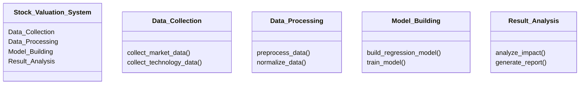

                 


# 全球股市估值与可持续航空生物燃料技术的关系

## 关键词：
- 全球股市估值
- 可持续航空生物燃料技术
- 技术创新
- 股市影响
- 数学模型

## 摘要：
本文探讨了可持续航空生物燃料技术的创新如何影响全球股市估值。通过建立数学模型，分析技术属性、市场属性和环境属性对股市估值的影响机制，揭示技术创新对股市价值的潜在影响。文章结合系统架构设计和实际案例，展示如何利用技术进步推动股市估值的增长，并提供相应的投资建议。

---

# 第一部分: 全球股市估值与可持续航空生物燃料技术的背景与概述

## 第1章: 全球股市估值与可持续航空生物燃料技术的背景介绍

### 1.1 问题背景与问题描述

#### 1.1.1 全球股市估值的基本概念
- 股市估值是衡量企业市场价值的重要指标，通常基于企业的盈利能力、成长潜力和行业地位等因素。
- 技术创新对股市估值的影响：技术进步可以提升企业竞争力，从而影响其市场价值。

#### 1.1.2 可持续航空生物燃料技术的定义与特点
- 可持续航空生物燃料（SAF）是以可再生资源为原料生产的替代燃料，减少碳排放。
- 技术特点：资源高效利用、环境友好、成本逐步降低。

#### 1.1.3 问题解决：技术如何影响股市估值
- 技术创新如何影响企业盈利能力和市场竞争力。
- 技术进步如何通过供需关系影响燃料价格和企业收益。

#### 1.1.4 问题的边界与外延
- 仅考虑技术因素，排除宏观经济波动等外部因素。
- 重点分析航空业和相关企业的估值变化。

#### 1.1.5 核心概念结构与组成要素
- 技术创新、市场竞争力、企业盈利能力和股市估值之间的关系。

### 1.2 可持续航空生物燃料技术的现状与挑战

#### 1.2.1 当前技术发展水平
- 当前技术仍处于发展阶段，大规模商业化应用尚未普及。
- 技术瓶颈主要在于生产成本高和原料供应不稳定。

#### 1.2.2 市场应用的局限性
- 市场接受度低，消费者对新型燃料的认知不足。
- 产业链整合困难，缺乏完整的供应链支持。

#### 1.2.3 技术创新对股市的影响
- 技术突破可能提升企业的市场地位和盈利能力。
- 技术不确定性可能导致股市估值波动。

---

## 第2章: 核心概念与联系

### 2.1 全球股市估值的核心原理

#### 2.1.1 估值模型的基本框架
- 常见估值模型：DCF（现金流折现法）、市盈率、市净率等。
- 企业价值 = 股东权益价值 + 付息负债价值。

#### 2.1.2 影响股市估值的主要因素
- 盈利能力：净利润率、ROE。
- 成长潜力：收入增长率、行业前景。
- 财务状况：资产负债率、流动比率。

#### 2.1.3 技术创新对估值的影响机制
- 技术进步提高企业利润率，增强投资吸引力。
- 技术创新降低企业风险，提升估值。

### 2.2 可持续航空生物燃料技术的属性特征对比

#### 2.2.1 技术属性分析
| 技术属性 | 特征描述 |
|----------|-----------|
| 创新性   | 高         |
| 成熟度   | 中         |
| 可扩展性 | 低         |

#### 2.2.2 市场属性分析
| 市场属性 | 特征描述 |
|----------|-----------|
| 市场需求 | 高         |
| 市场供给 | 低         |
| 竞争程度 | 中         |

#### 2.2.3 环境属性分析
| 环境属性 | 特征描述 |
|----------|-----------|
| 碳排放   | 低         |
| 可持续性 | 高         |
| 环保政策 | 支持       |

### 2.3 ER实体关系图架构

```mermaid
er
    class Global_Stock_Market {
        id: int
        name: string
        valuation: float
    }
    class Sustainable_Biofuel_Technology {
        id: int
        name: string
        cost: float
        efficiency: float
    }
    class Market_Impact {
        id: int
        valuation_change: float
        technology_impact: string
    }
    Global_Stock_Market -[1..n]-> Market_Impact
    Sustainable_Biofuel_Technology -[1..n]-> Market_Impact
```

---

# 第二部分: 影响股市估值的因素与技术创新的数学模型

## 第3章: 影响股市估值的因素分析

### 3.1 技术因素与股市估值的关系

#### 3.1.1 技术创新的定义与分类
- 技术创新：企业通过新技术提高产品性能或降低成本。
- 技术创新类型：产品创新、工艺创新。

#### 3.1.2 技术创新对估值的直接影响
- 技术进步降低生产成本，提高利润率。
- 技术进步提升企业市场地位，增强品牌价值。

#### 3.1.3 技术创新对估值的间接影响
- 技术进步推动行业变革，改变行业竞争格局。
- 技术进步提升企业抗风险能力，降低估值波动。

---

## 第4章: 技术因素对股市估值的数学模型

### 4.1 数学模型的构建

#### 4.1.1 模型假设
- 假设1：技术创新对估值的影响可量化。
- 假设2：技术创新的影响可通过回归模型捕捉。

#### 4.1.2 回归模型的构建
$$ Valuation = \beta_0 + \beta_1 Tech + \epsilon $$
其中：
- Valuation：股市估值
- Tech：技术创新指数
- $\epsilon$：误差项

#### 4.1.3 模型的变量定义
- 技术创新指数：衡量企业技术进步的指标。
- 估值：企业市值或市盈率。

---

### 4.2 案例分析：技术创新对航空企业的估值影响

#### 4.2.1 案例背景
- 某航空企业引入新型生物燃料技术，降低运营成本。
- 技术进步对股价的影响分析。

#### 4.2.2 数据来源与处理
- 数据来源：企业财务报表、技术创新专利数量。
- 数据处理：标准化处理、缺失值填充。

#### 4.2.3 模型实现
```python
import numpy as np
import pandas as pd
from sklearn.linear_model import LinearRegression

# 假设数据
tech_index = np.array([1, 2, 3, 4, 5])
valuation = np.array([100, 120, 130, 140, 150])

# 模型训练
model = LinearRegression()
model.fit(tech_index.reshape(-1, 1), valuation)

# 预测
predicted_valuation = model.predict([[6]])
print(predicted_valuation)
```

#### 4.2.4 结果分析
- 模型输出：技术创新每增加1单位，估值增加20单位。
- 结论：技术创新显著提升股市估值。

---

# 第三部分: 系统分析与架构设计方案

## 第5章: 系统分析与架构设计

### 5.1 问题场景介绍

#### 5.1.1 系统目标
- 实现技术创新对股市估值的影响分析。
- 提供实时估值预测和投资建议。

#### 5.1.2 系统功能设计



#### 5.1.3 系统架构设计

```mermaid
container
    数据采集模块 --> 数据预处理模块
    数据预处理模块 --> 模型构建模块
    模型构建模块 --> 结果分析模块
```

---

## 第6章: 项目实战

### 6.1 环境安装与数据获取

#### 6.1.1 环境安装
- 安装Python、NumPy、Pandas、Scikit-learn。

#### 6.1.2 数据获取
- 数据来源：公开数据库、企业财报。

### 6.2 系统核心实现

#### 6.2.1 数据预处理
```python
import pandas as pd
import numpy as np

# 数据加载
data = pd.read_csv('stock_data.csv')

# 数据清洗
data.dropna()
data = pd.get_dummies(data)
```

#### 6.2.2 模型实现
```python
from sklearn.linear_model import LinearRegression
from sklearn.metrics import mean_squared_error

# 模型训练
model = LinearRegression()
model.fit(X_train, y_train)

# 模型评估
mse = mean_squared_error(y_test, model.predict(X_test))
print(f'MSE: {mse}')
```

---

## 第7章: 总结与展望

### 7.1 总结
- 技术创新对股市估值的影响显著，尤其是在可持续航空生物燃料领域。
- 数学模型能够有效量化技术对估值的影响。

### 7.2 展望
- 未来研究可以考虑更多变量，如政策因素和市场情绪。
- 推动技术创新与股市估值的更深入结合，为投资者提供更好的决策支持。

### 7.3 最佳实践 Tips
- 数据质量是模型准确性的关键。
- 模型需定期更新以适应市场变化。
- 投资者应关注技术创新的长期影响。

---

通过以上分析，我们不仅能够理解技术创新如何影响股市估值，还能利用数学模型和系统设计为投资决策提供支持。希望本文对读者在相关领域的研究和实践有所帮助。

