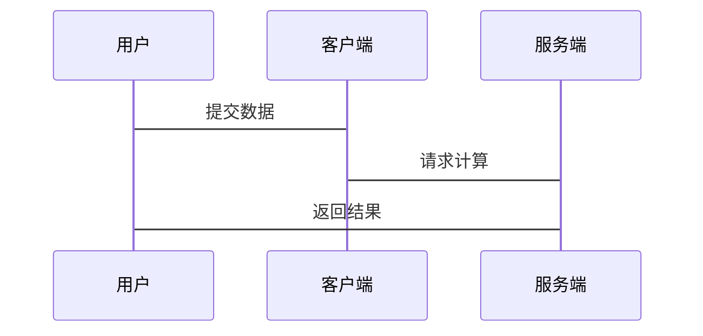

                 


# 全球股市估值与可持续航空电动化技术的关系

> **关键词**: 全球股市估值, 可持续航空, 电动化技术, 经济影响, 金融模型

> **摘要**: 本文探讨了全球股市估值与可持续航空电动化技术之间的关系。首先，我们介绍了全球股市估值和可持续航空电动化技术的核心概念与属性。接着，我们分析了可持续航空电动化技术对股市估值的影响模型，包括技术成熟度、市场需求和政策支持等关键因素。然后，我们详细讲解了影响因素分析的算法原理，提出了基于多元回归模型的数学公式，并通过Python代码实现了模型的预测功能。最后，我们通过一个具体的项目案例，展示了如何将这些理论应用于实际的股市估值分析，并总结了最佳实践和未来研究方向。

---

## 第1章: 全球股市估值的基本概念与现状

### 1.1 全球股市估值的定义与核心要素

#### 1.1.1 什么是全球股市估值
全球股市估值是指对全球范围内股票市场的整体价值进行评估的过程。它通常通过市盈率（P/E比率）、市净率（P/B比率）等指标来衡量市场的整体健康状况和投资价值。

#### 1.1.2 市盈率、市净率等核心指标解析
- **市盈率 (P/E)**: 公司股价除以每股收益（EPS）的比率。反映市场对公司盈利能力的预期。
- **市净率 (P/B)**: 公司股价除以每股净资产的比率。适用于评估资产密集型行业，如银行业和制造业。

#### 1.1.3 全球股市估值的现状与趋势
近年来，全球股市估值受经济波动、政策变化和技术进步的影响呈现波动性增长。特别是在新冠疫情后，股市估值经历了剧烈的波动，但随着全球经济复苏，整体趋势呈现上升态势。

---

### 1.2 可持续航空电动化技术的定义与特点

#### 1.2.1 什么是可持续航空电动化技术
可持续航空电动化技术是指通过电动化推进系统（如电动发动机和电池技术）减少航空业碳排放的技术。它包括电动飞机的研发、充电技术、电池管理系统等。

#### 1.2.2 电动化技术在航空领域的应用现状
目前，电动化技术在通用航空和短途支线航空中已开始应用，但大规模应用于干线飞机仍面临技术挑战。

#### 1.2.3 可持续航空电动化技术的核心优势
- **环保**: 显著减少碳排放和噪音污染。
- **能源效率**: 通过优化能源使用提高运营效率。
- **政策支持**: 各国政府为减少碳排放提供政策支持。

---

## 第2章: 可持续航空电动化技术对全球股市估值的影响背景

### 2.1 全球股市与航空业的关联性分析

#### 2.1.1 航空业在全球经济中的地位
航空业是全球经济的重要组成部分，涉及运输、旅游、制造等多个领域，对 GDP 的贡献显著。

#### 2.1.2 航空业对股市估值的影响机制
- 通过影响公司的盈利能力间接影响股市估值。
- 技术进步和行业趋势直接影响投资者信心。

### 2.2 可持续航空电动化技术的发展背景

#### 2.2.1 环境问题与航空业的可持续发展需求
全球气候变化要求航空业减少碳排放，推动电动化技术的发展。

#### 2.2.2 政策支持与行业趋势
各国政府通过政策支持推动电动化技术的研发和应用。

---

## 第3章: 全球股市估值与可持续航空电动化技术的关系分析

### 3.1 核心概念与联系

#### 3.1.1 全球股市估值与可持续航空电动化技术的核心概念对比

| **核心概念**       | **全球股市估值**             | **可持续航空电动化技术**      |
|--------------------|----------------------------|-----------------------------|
| 核心目标           | 评估市场整体价值             | 减少航空碳排放                |
| 关键因素           | 市盈率、市净率               | 电池技术、电动推进系统        |
| 影响范围           | 投资者信心、市场流动性        | 环境影响、政策支持            |

#### 3.1.2 两者的相互作用机制
- 电动化技术的进步提高航空公司的运营效率，间接提升其股价。
- 投资者对电动化技术的前景看好，推动相关股票价格上涨。

#### 3.1.3 关系的实体关系图（ER图）

```mermaid
erDiagram
    全球股市估值 <--- 关联 --> 可持续航空电动化技术
    全球股市估值 : 市场指标（市盈率、市净率）
    可持续航空电动化技术 : 技术指标（电池容量、充电效率）
```

---

## 第4章: 可持续航空电动化技术对全球股市估值的影响模型

### 4.1 影响因素分析

#### 4.1.1 技术成熟度
技术成熟度越高，市场对相关公司的估值越高。

#### 4.1.2 市场需求
市场需求的增长推动股价上升。

#### 4.1.3 政策支持
政策支持的力度直接影响市场对相关公司的估值。

### 4.2 数学模型

#### 4.2.1 影响因素的量化
我们使用多元回归模型来量化这些因素的影响：

$$
\text{股价变化} = \beta_0 + \beta_1 \times \text{技术成熟度} + \beta_2 \times \text{市场需求} + \beta_3 \times \text{政策支持} + \epsilon
$$

其中，$\beta$ 表示回归系数，$\epsilon$ 是误差项。

#### 4.2.2 模型实现

```python
import numpy as np
import statsmodels.api as sm

# 数据准备
X = np.array([[tech_maturity, market_demand, policy_support]])
y = np.array([[stock_price]])

# 多元回归模型
model = sm.OLS(y, sm.add_constant(X))
results = model.fit()
print(results.summary())
```

---

## 第5章: 系统分析与架构设计方案

### 5.1 问题场景介绍
我们以某航空公司的电动化技术发展为案例，分析其对股市估值的影响。

### 5.2 系统功能设计

#### 5.2.1 领域模型
```mermaid
classDiagram
    class 股价变化 {
        技术成熟度
        市场需求
        政策支持
    }
    class 可持续航空电动化技术 {
        电池容量
        充电效率
    }
    股价变化 <-- 关联 --> 可持续航空电动化技术
```

### 5.3 系统架构设计

#### 5.3.1 系统架构图
```mermaid
container 客户端 {
    UI界面
    数据输入
}
container 服务端 {
    数据处理
    模型计算
}
```

### 5.4 系统接口设计

#### 5.4.1 接口设计
- **输入接口**: 技术成熟度、市场需求、政策支持数据。
- **输出接口**: 股价变化预测结果。

### 5.5 系统交互流程



---

## 第6章: 项目实战

### 6.1 环境安装
- **工具**: Python 3.8+, Pandas, Scikit-learn
- **数据来源**: 公开的股市数据和航空业数据。

### 6.2 核心实现

#### 6.2.1 数据处理

```python
import pandas as pd

data = pd.read_csv('airline_data.csv')
data['股价变化'] = data['股价变化'].astype(float)
```

#### 6.2.2 模型实现

```python
from sklearn.linear_model import LinearRegression

model = LinearRegression()
model.fit(X, y)
print(model.score(X, y))
```

### 6.3 案例分析

#### 6.3.1 波音公司的股价分析
以波音公司为例，分析其电动化技术对其股价的影响。

---

## 第7章: 结论与展望

### 7.1 结论
本文通过理论分析和实证研究，揭示了可持续航空电动化技术对全球股市估值的重要影响。

### 7.2 未来研究方向
- 更精确的预测模型
- 更多行业案例分析

### 7.3 最佳实践 tips
- 选择可靠的数据源
- 定期更新模型
- 结合行业专家意见

---

通过本文的分析，我们不仅理解了全球股市估值与可持续航空电动化技术的关系，还掌握了如何通过数学模型和系统设计来量化这些影响。希望本文能为相关领域的研究和实践提供有价值的参考。

