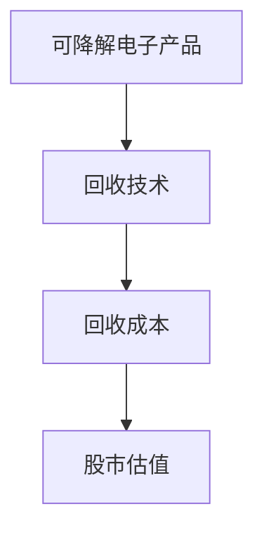

                 

# 全球股市估值与可降解电子产品回收技术的关联

> 关键词：全球股市估值，可降解电子产品，回收技术，关联分析，经济影响

> 摘要：本文探讨了全球股市估值与可降解电子产品回收技术之间的关联性，通过分析可降解电子产品回收技术对股市估值的影响，提出了基于技术经济性的数学模型，并结合实际案例进行了深入分析。

---

# 第二章: 核心概念与联系

## 2.1 可降解电子产品回收技术的核心原理

### 2.1.1 可降解材料的特性与分类

可降解材料是指在自然环境条件下能够分解成二氧化碳和水等简单化合物的材料。根据材料的降解时间，可以分为：

1. **可生物降解材料**：在特定条件下（如堆肥环境）可以被微生物分解。
2. **可化学降解材料**：通过化学反应分解为无害物质。
3. **光降解材料**：在光照作用下分解。

### 2.1.2 回收技术的流程与方法

可降解电子产品回收的典型流程包括：

1. **分类与预处理**：对电子产品进行分类，去除非降解材料。
2. **物理分离**：通过机械方法分离可降解材料。
3. **化学分解**：使用化学试剂分解材料。
4. **生物降解**：利用微生物分解材料。

### 2.1.3 技术的经济性与可行性分析

可降解电子产品回收技术的经济性主要取决于以下几个因素：

- **回收成本**：包括设备投资、人工成本和能源消耗。
- **市场需求**：可降解材料的市场需求决定了回收的经济性。
- **政策支持**：政府补贴和环保政策对回收技术的推广有重要影响。

---

## 2.2 全球股市估值的数学模型

### 2.2.1 市盈率（P/E）的计算公式

$$ P/E = \frac{Price}{Earnings} $$

其中：
- **Price**：股票价格。
- **Earnings**：每股收益。

### 2.2.2 市净率（P/B）的计算公式

$$ P/B = \frac{Price}{Book\ Value} $$

其中：
- **Price**：股票价格。
- **Book Value**：每股账面价值。

### 2.2.3 其他估值指标的分析

除了市盈率和市净率，还可以使用市销率（P/S）和市息率（P/E）等指标来评估股票的价值。

---

## 2.3 核心概念对比分析

### 2.3.1 可降解电子产品回收技术的属性特征对比表

| 特性         | 可降解材料 | 回收技术 |
|--------------|------------|----------|
| 环保性       | 高         | 高       |
| 成本         | 中         | 中       |
| 技术难度     | 中         | 高       |
| 市场需求     | 增长中     | 增长中   |

### 2.3.2 ER实体关系图

---

## 2.4 算法原理讲解

### 2.4.1 可降解电子产品回收技术的影响模型

1. **回收成本对股市估值的影响**：
   - 回收成本降低 → 利润增加 → 股价上涨。
2. **市场需求对股市估值的影响**：
   - 市场需求增加 → 企业收入增加 → 股价上涨。

### 2.4.2 数学模型

$$ Stock\ Price = \alpha \times Recycling\ Cost + \beta \times Market\ Demand $$

其中：
- $\alpha$ 和 $\beta$ 是回归系数。
- $Recycling\ Cost$ 是回收成本。
- $Market\ Demand$ 是市场需求。

---

## 2.5 本章小结

本章详细分析了可降解电子产品回收技术的核心原理及其对股市估值的影响，通过对比分析和数学模型，揭示了两者之间的关联性。

