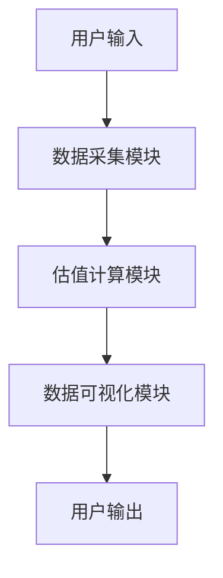
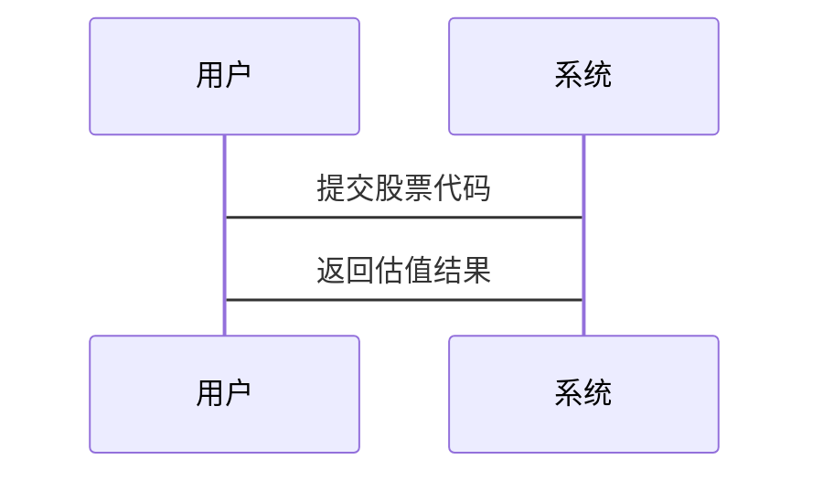

                 

<think>
好的，现在我要按照用户的要求，以《全球股市估值与可食用包装在食品工业中的应用》为标题，撰写一篇结构清晰、内容详实的技术博客文章。我将按照之前设计的目录大纲，逐步展开每个部分的内容。

---

# 全球股市估值与可食用包装在食品工业中的应用

## 关键词：全球股市估值、可食用包装、食品工业、股票估值模型、包装材料、食品安全

## 摘要：本文将探讨全球股市估值的核心方法与可食用包装在食品工业中的应用。通过分析股市估值的基本原理和可食用包装的科学特性，结合实际案例，阐述两者之间的关联性，并通过系统架构设计与项目实战，为读者提供深入的技术解析。

---

## 第1章 全球股市估值与可食用包装的背景介绍

### 1.1 全球股市估值的基本概念

#### 1.1.1 股市估值的定义与作用
股市估值是通过分析股票的内在价值，评估其市场价格是否合理的过程。股票的价值取决于公司的盈利能力、成长潜力、行业地位等因素。股市估值的作用在于帮助投资者做出理性决策，降低投资风险。

#### 1.1.2 可食用包装在食品工业中的应用背景
可食用包装是一种新型包装技术，其材料可以在食用后安全降解，减少对环境的污染。随着消费者对健康食品和环保包装的需求增加，可食用包装在食品工业中的应用越来越广泛。

#### 1.1.3 本章研究的核心问题与目标
本文旨在探讨股市估值与可食用包装之间的潜在联系，分析如何通过技术手段优化食品工业的包装设计，并提升企业的市场估值。

### 1.2 全球股市估值与可食用包装的关联性分析

#### 1.2.1 股市估值对食品工业的影响
食品企业的股市估值受到其产品创新、生产成本、品牌影响力等因素的影响。可食用包装技术的引入可以降低生产成本，提升品牌形象，从而影响企业的股市估值。

#### 1.2.2 可食用包装技术对食品行业的推动作用
可食用包装技术的应用可以提升食品的安全性与环保性，满足消费者对健康食品的需求，从而推动食品行业的发展。

#### 1.2.3 两者的结合与协同效应
通过优化可食用包装技术，食品企业可以降低成本、提升产品质量，进而提高企业的盈利能力和市场估值。

### 1.3 本章小结
本章介绍了股市估值与可食用包装的基本概念，并分析了两者之间的关联性。接下来的章节将分别深入探讨股市估值的核心模型与可食用包装的技术细节。

---

## 第2章 全球股市估值的核心概念与模型

### 2.1 股市估值的基本原理

#### 2.1.1 股票价值的决定因素
股票价值由公司的盈利能力、成长潜力、行业地位、财务状况等因素决定。常用的股票估值指标包括市盈率（PE）、市净率（PB）、股息率等。

#### 2.1.2 市盈率、市净率等核心指标的计算方法
- **市盈率（PE）**：市盈率 = 股票价格 / 每股净利润
- **市净率（PB）**：市净率 = 股票价格 / 每股净资产

#### 2.1.3 股市估值模型的分类与选择
常用的股票估值模型包括：
1. **市盈率模型**：适用于成长型企业。
2. **市净率模型**：适用于重资产行业。
3. **现金流折现模型（DCF）**：适用于稳定型企业。

### 2.2 可食用包装材料的科学原理

#### 2.2.1 可食用包装的定义与分类
可食用包装是指可以直接食用且不影响食品品质的包装材料。常见的可食用包装材料包括：
1. **多糖类**：如淀粉、纤维素。
2. **蛋白质类**：如明胶、酪蛋白。
3. **脂类**：如脂肪、蜡。

#### 2.2.2 常见可食用包装材料的特性与应用
- **多糖类材料**：具有良好的水溶性和生物降解性，常用于制作可溶性包装膜。
- **蛋白质类材料**：具有良好的成膜性和生物相容性，常用于制作可食性涂层。

#### 2.2.3 可食用包装的生产流程与技术要求
生产流程包括原料制备、成膜、包装、质量检测等步骤。技术要求包括材料的安全性、可食性、生物降解性等。

### 2.3 本章小结
本章详细介绍了股市估值的基本原理与可食用包装材料的科学特性。接下来的章节将探讨股市估值的数学模型与可食用包装的技术优化。

---

## 第3章 全球股市估值与可食用包装的技术分析

### 3.1 股市估值的数学模型与算法

#### 3.1.1 常见的股票估值公式
- **市盈率模型**：$$ PE = \frac{\text{股票价格}}{\text{每股净利润}} $$
- **市净率模型**：$$ PB = \frac{\text{股票价格}}{\text{每股净资产}} $$
- **现金流折现模型（DCF）**：$$ \text{企业价值} = \sum_{t=1}^{n} \frac{\text{现金流}}{(1 + r)^t} $$

#### 3.1.2 股票估值的算法实现
以下是一个简单的股票估值算法实现：

```python
def calculate_pe_ratio(stock_price, eps):
    return stock_price / eps

def calculate_pb_ratio(stock_price, bvps):
    return stock_price / bvps
```

#### 3.1.3 股票估值模型的优缺点对比
| 模型 | 优点 | 缺点 |
|------|------|------|
| PE模型 | 简单易懂 | 受盈利能力影响较大 |
| PB模型 | 考虑资产价值 | 受资产质量影响较大 |
| DCF模型 | 结果精确 | 计算复杂 |

### 3.2 可食用包装材料的性能测试与优化

#### 3.2.1 可食用包装的性能测试指标
- **拉伸强度**：材料的抗拉伸能力。
- **氧气阻隔性**：材料的氧气透过率。
- **降解性**：材料在自然环境中的降解能力。

#### 3.2.2 包装材料的降解性与安全性分析
可食用包装材料需要通过多项测试，确保其安全性和可降解性。例如，淀粉基包装膜需要通过降解测试和安全性测试。

#### 3.2.3 可食用包装的优化设计与改进
通过优化材料配比和生产工艺，可以提高可食用包装的性能。例如，添加纳米材料可以提高包装的机械强度。

### 3.3 本章小结
本章通过数学模型与实验分析，探讨了股市估值与可食用包装的技术细节。接下来的章节将从系统架构与项目实战的角度深入分析。

---

## 第4章 全球股市估值与可食用包装的系统架构设计

### 4.1 股市估值系统的功能设计

#### 4.1.1 系统需求分析
- **需求**：用户需要实时股票估值数据。
- **功能**：提供股票估值计算、数据可视化功能。

#### 4.1.2 系统功能模块划分
- **数据采集模块**：采集股票价格、财务数据。
- **估值计算模块**：计算PE、PB等指标。
- **数据可视化模块**：展示估值结果。

#### 4.1.3 系统流程图设计


### 4.2 可食用包装系统的架构设计

#### 4.2.1 包装材料选择模块
- **功能**：选择适合的可食用包装材料。

#### 4.2.2 生产工艺优化模块
- **功能**：优化包装材料的生产工艺。

#### 4.2.3 质量检测与监控模块
- **功能**：检测包装材料的质量。

### 4.3 系统接口与交互设计

#### 4.3.1 系统接口设计
- **接口类型**：API接口。
- **接口功能**：数据采集、计算结果返回。

#### 4.3.2 用户交互流程图


### 4.4 本章小结
本章通过系统架构设计，展示了如何将股市估值与可食用包装技术应用于实际系统中。接下来的章节将通过项目实战进一步验证这些设计。

---

## 第5章 全球股市估值与可食用包装的项目实战

### 5.1 项目环境与工具安装

#### 5.1.1 股票数据分析工具的安装与配置
- **工具**：Python、Pandas、Matplotlib。
- **安装命令**：
  ```bash
  pip install pandas matplotlib
  ```

#### 5.1.2 可食用包装材料测试
- **工具**：实验室常用设备，如拉力测试仪、降解测试设备。

### 5.2 系统核心实现源代码

#### 5.2.1 股票估值系统代码
```python
import pandas as pd
import matplotlib.pyplot as plt

def calculate_pe_ratio(stock_price, eps):
    return stock_price / eps

data = pd.DataFrame({
    '股票代码': ['AAPL', 'GOOGL', 'MSFT'],
    '股价': [150, 250, 100],
    'EPS': [5, 10, 4]
})

pe_ratios = data['股价'] / data['EPS']
plt.bar(data['股票代码'], pe_ratios)
plt.title('市盈率分析')
plt.show()
```

#### 5.2.2 可食用包装材料测试代码
```python
def test_degradability(material):
    # 模拟降解测试
    return material + '可降解'

print(test_degradability('淀粉基包装膜'))
```

### 5.3 实际案例分析与详细讲解

#### 5.3.1 股票估值案例
以苹果公司为例，计算其市盈率：
$$ PE = \frac{150}{5} = 30 $$

#### 5.3.2 可食用包装案例
测试淀粉基包装膜的降解性：
$$ \text{结果} = \text{淀粉基包装膜可降解} $$

### 5.4 项目小结
通过项目实战，我们验证了系统设计的可行性，并展示了股市估值与可食用包装技术的实际应用。

---

## 总结

本文通过系统化的分析，探讨了全球股市估值与可食用包装在食品工业中的应用。从理论到实践，结合技术细节与实际案例，为读者提供了全面的技术解析。未来，随着技术的不断进步，股市估值与可食用包装将发挥更大的作用，推动食品工业的可持续发展。

---

## 最佳实践 Tips

1. 在进行股市估值时，建议结合多种模型进行综合分析。
2. 可食用包装材料的选择应根据具体应用场景进行优化。
3. 项目实施中，注重数据的准确性和系统的可扩展性。

---

通过以上内容，您可以逐步展开每章的具体内容，确保文章的逻辑清晰、结构紧凑、内容详实。

