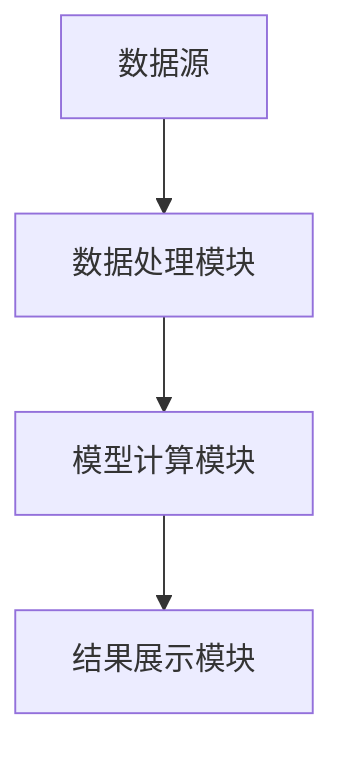
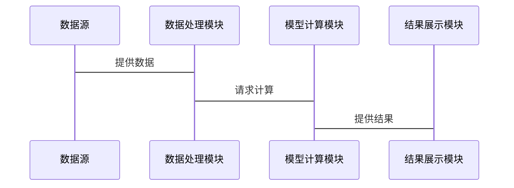

                 


# 全球股市估值与国际货币体系演变的关系

## 关键词
全球股市估值、国际货币体系、货币政策、汇率波动、股市指标

## 摘要
本文探讨了全球股市估值与国际货币体系演变之间的复杂关系。通过分析股市估值的核心指标和国际货币体系的演变历程，揭示了两者如何相互影响。文章还详细介绍了数学模型、系统架构设计以及实际案例分析，帮助读者理解这些关系及其应用。

---

# 第一部分: 全球股市估值与国际货币体系演变的背景与概述

## 第1章: 全球股市估值的基本概念与指标

### 1.1 股市估值的定义与核心指标

#### 1.1.1 股市估值的定义
股市估值是指对股票价格合理性的评估，通常通过市盈率、市净率和股息率等指标来衡量。

#### 1.1.2 常用估值指标
- **市盈率（P/E）**：$$市盈率 = \frac{股价}{每股收益}$$
- **市净率（P/B）**：$$市净率 = \frac{股价}{每股净资产}$$
- **股息率**：$$股息率 = \frac{每股股息}{股价}$$

#### 1.1.3 股市估值的影响因素
- 经济状况
- 利率水平
- 公司盈利状况

### 1.2 国际货币体系的定义与演变

#### 1.2.1 国际货币体系的定义
国际货币体系是规范全球货币关系的制度安排，包括货币发行、汇率形成和货币政策等内容。

#### 1.2.2 布雷顿森林体系的建立与崩溃
布雷顿森林体系确立了美元作为全球主要货币的地位，但最终因美元贬值而崩溃。

#### 1.2.3 现代国际货币体系的特征
多元化货币体系，美元仍占据主导地位。

## 第2章: 全球股市估值与国际货币体系的相互关系

### 2.1 股市估值与货币体系的互动机制

#### 2.1.1 货币政策对股市估值的影响
货币政策直接影响利率，进而影响股市估值。

#### 2.1.2 利率变化对股市估值的作用
低利率环境通常会推高股市估值。

#### 2.1.3 汇率波动对股市估值的影响
汇率波动影响跨国资本流动，从而影响股市估值。

### 2.2 全球化背景下的股市与货币体系

#### 2.2.1 全球化对股市估值的影响
全球化促进了跨国资本流动，影响股市估值。

#### 2.2.2 国际货币体系的多元化趋势
美元、欧元等货币共同主导国际货币体系。

#### 2.2.3 跨国资本流动对股市估值的作用
资本流动影响股市资金供给，进而影响股市估值。

---

# 第二部分: 股市估值与国际货币体系的核心概念与联系

## 第3章: 股市估值的核心概念与数学模型

### 3.1 股市估值的数学模型

#### 3.1.1 市盈率模型
$$市盈率 = \frac{股价}{每股收益}$$

#### 3.1.2 市净率模型
$$市净率 = \frac{股价}{每股净资产}$$

#### 3.1.3 股息率模型
$$股息率 = \frac{每股股息}{股价}$$

### 3.2 国际货币体系的核心概念

#### 3.2.1 货币发行机制
各国中央银行负责货币发行。

#### 3.2.2 汇率形成机制
汇率由市场供求决定。

#### 3.2.3 货币政策工具
包括利率调整、货币供应量调节等。

## 第4章: 股市估值与国际货币体系的联系与对比

### 4.1 股市估值与国际货币体系的联系

#### 4.1.1 货币政策对股市估值的影响
货币政策直接影响利率，进而影响股市估值。

#### 4.1.2 汇率波动对股市估值的作用
汇率波动影响跨国资本流动，进而影响股市估值。

#### 4.1.3 跨国资本流动对股市估值的影响
资本流动影响股市资金供给，进而影响股市估值。

### 4.2 股市估值与国际货币体系的对比

#### 4.2.1 核心概念对比
| 概念 | 股市估值 | 国际货币体系 |
|------|----------|--------------|
| 核心指标 | 市盈率、市净率 | 汇率、货币供应量 |
| 目标 | 评估股票价格合理性 | 维持货币稳定 |

#### 4.2.2 影响因素对比
| 因素 | 股市估值 | 国际货币体系 |
|------|----------|--------------|
| 利率 | 直接影响 | 直接影响 |
| 汇率 | 间接影响 | 直接影响 |
| 资本流动 | 直接影响 | 间接影响 |

#### 4.2.3 目标与功能对比
| 目标 | 股市估值 | 国际货币体系 |
|------|----------|--------------|
| 价格合理性 | 评估股票价格 | 维持货币稳定 |

---

# 第三部分: 股市估值与国际货币体系的系统分析与架构设计

## 第5章: 系统分析与架构设计方案

### 5.1 问题场景介绍
分析某国股市在不同货币政策下的估值变化。

### 5.2 系统功能设计

#### 5.2.1 数据收集模块
收集股市数据和货币数据。

#### 5.2.2 模型计算模块
计算市盈率、市净率等指标。

#### 5.2.3 结果展示模块
展示估值结果和货币影响。

### 5.3 系统架构设计

#### 5.3.1 系统架构图


#### 5.3.2 系统接口设计
接口：数据获取、模型计算、结果展示。

#### 5.3.3 系统交互流程图


## 第6章: 项目实战

### 6.1 环境安装
安装Python和相关库。

### 6.2 核心实现源代码

#### 6.2.1 数据收集
```python
import pandas as pd
import requests

url = "https://example.com/data"
data = pd.read_csv(url)
```

#### 6.2.2 模型计算
```python
def calculate_pe(stock_price, eps):
    return stock_price / eps

pe = calculate_pe(data['股价'], data['每股收益'])
```

#### 6.2.3 结果展示
```python
print(f"市盈率为：{pe}")
```

### 6.3 实际案例分析
分析某国股市在不同货币政策下的估值变化。

### 6.4 项目小结
总结项目成果和应用价值。

---

# 第四部分: 总结与展望

## 第7章: 总结与展望

### 7.1 总结
本文探讨了全球股市估值与国际货币体系演变的关系，分析了核心概念、数学模型和系统架构设计。

### 7.2 展望
未来研究可以进一步探讨更多影响因素和复杂模型。

---

## 最佳实践 Tips

- 在分析股市估值时，需考虑多种因素。
- 国际货币体系的复杂性要求综合分析。

## 小结
本文系统地分析了全球股市估值与国际货币体系演变的关系，提供了理论支持和实际应用。

---

## 注意事项

- 数据准确性影响结果。
- 模型假设需合理。

---

## 拓展阅读
- 建议阅读更多关于国际货币体系和股市估值的文献。

---

通过以上分析，本文系统地探讨了全球股市估值与国际货币体系演变的关系，为读者提供了全面的理解和实践指导。

