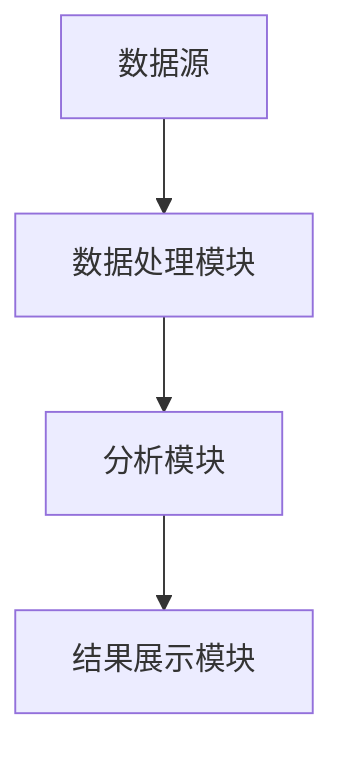

                 


# 全球股市估值与国际贸易格局的互动

> 关键词：全球股市估值，国际贸易格局，经济互动，金融模型，系统架构

> 摘要：本文探讨了全球股市估值与国际贸易格局之间的互动关系，分析了两者在经济全球化背景下的相互影响，构建了数学模型，并通过系统架构和项目实战验证了理论的可行性。

---

## 第1章: 全球股市估值与国际贸易格局的互动概述

### 1.1 全球化与金融化的背景
经济全球化是20世纪末至21世纪初最显著的经济特征之一，推动了跨国公司的发展和资本的自由流动。金融化则是指金融在经济中的地位日益上升，成为推动经济增长的重要引擎。在此背景下，全球股市估值与国际贸易格局的互动变得愈发复杂。

#### 1.1.1 全球经济一体化的历史演变
1970年代至1990年代，布雷顿森林体系的解体标志着汇率浮动制度的兴起，推动了全球资本市场的自由化。进入21世纪，互联网技术的发展进一步加速了金融信息的流通和资本的跨境流动。

#### 1.1.2 金融化对全球经济的深远影响
金融化使得金融资产在家庭和企业资产中的占比显著上升。2008年金融危机后，全球金融监管体系趋于严格，但金融化趋势仍在延续。

#### 1.1.3 股市估值与国际贸易的相互影响
股市估值反映市场对未来的预期，而国际贸易格局的变化直接影响企业的盈利能力，从而影响股市估值。

---

### 1.2 核心概念与问题描述
#### 1.2.1 全球股市估值的定义与特征
股市估值是指市场参与者对上市公司未来盈利能力的预期，通常通过市盈率（P/E）、市净率（P/B）等指标衡量。

#### 1.2.2 国际贸易格局的核心要素
国际贸易格局包括贸易总量、贸易结构（如商品与服务贸易）、主要贸易伙伴之间的依赖程度等。

#### 1.2.3 问题背景：股市估值与国际贸易的互动机制
股市估值的变化会影响企业的投资决策，进而影响国际贸易；而国际贸易的变化又会反过来影响企业的盈利能力和股市估值。

---

## 第2章: 核心概念与联系

### 2.1 全球股市估值的理论基础
#### 2.1.1 股市估值的基本原理
股市估值是市场对上市公司未来现金流的折现值的估计，受到宏观经济环境、行业景气度和企业基本面等因素的影响。

#### 2.1.2 股市估值与宏观经济的关系
股市估值与GDP增长率、通货膨胀率、利率水平等宏观经济指标密切相关。

#### 2.1.3 股市估值的国际差异与原因
不同国家的股市估值差异主要由经济发展水平、货币政策、企业盈利能力等因素决定。

---

### 2.2 国际贸易格局的构成要素
#### 2.2.1 国际贸易的定义与分类
国际贸易包括商品贸易、服务贸易和知识产权贸易。不同国家在这些领域的优势差异显著。

#### 2.2.2 主要国际贸易理论与模型
- **古典贸易理论**：基于比较优势的贸易分工。
- **新贸易理论**：强调规模经济和不完全竞争对国际贸易的影响。

#### 2.2.3 国际贸易格局的变化趋势
随着技术进步和全球化的深入，服务贸易和数字经济的比重逐渐上升。

---

### 2.3 股市估值与国际贸易的互动机制
#### 2.3.1 股市估值对国际贸易的影响
- 企业市值的增加可能带来更多的投资，推动出口增长。
- 股市波动会影响企业的融资成本，进而影响其进口需求。

#### 2.3.2 国际贸易对股市估值的反向影响
- 进出口数据的变化会影响企业的盈利预期，从而影响股市估值。
- 贸易政策的变化（如关税调整）会直接影响企业的利润率和股市估值。

---

## 第3章: 数学模型与算法原理

### 3.1 股市估值与国际贸易互动的数学模型
#### 3.1.1 模型假设
- 假设股市估值与国际贸易呈线性关系。
- 考虑宏观经济变量（如GDP增长率、通货膨胀率）作为控制变量。

#### 3.1.2 模型构建
$$\text{股市估值} = \beta_1 \times \text{国际贸易量} + \beta_2 \times \text{GDP增长率} + \epsilon$$

#### 3.1.3 模型验证
通过回归分析验证模型的显著性，使用历史数据进行拟合和预测。

---

### 3.2 算法原理
#### 3.2.1 数据预处理
- 数据清洗：处理缺失值、异常值。
- 数据标准化：将数据转换为统一尺度。

#### 3.2.2 回归分析
使用Python的`statsmodels`库进行线性回归分析。

示例代码：
```python
import pandas as pd
import statsmodels.api as sm

# 数据加载
data = pd.read_csv('international_trade_stock.csv')

# 模型构建
X = data[['国际贸易量', 'GDP增长率']]
X = sm.add_constant(X)
model = sm.OLS(data['股市估值'], X)
results = model.fit()

# 输出结果
print(results.summary())
```

---

## 第4章: 系统架构与实现

### 4.1 系统功能设计
#### 4.1.1 领域模型


#### 4.1.2 系统架构


---

## 第5章: 项目实战

### 5.1 实际案例分析
以2020年新冠疫情为例，分析国际贸易格局的变化对股市估值的影响。

#### 5.1.1 数据获取
使用公开的国际贸易和股市数据，清洗并处理。

#### 5.1.2 模型实现
使用上述回归模型进行预测，并分析结果。

---

## 第6章: 总结与建议

### 6.1 研究意义
本文构建了股市估值与国际贸易互动的数学模型，并通过案例验证了其可行性。

### 6.2 未来研究方向
进一步研究非线性关系，引入机器学习方法进行预测。

### 6.3 实践建议
投资者应关注宏观经济指标和国际贸易政策的变化，以优化投资决策。

---

## 参考文献
1. IMF（国际货币基金组织）年度报告
2. 《国际贸易理论与实务》
3. 《金融市场与投资学》

---

通过以上分析，我们可以看到，全球股市估值与国际贸易格局的互动是一个复杂但具有重要研究价值的课题。本文从理论、模型、系统架构和实战案例等多个角度进行了深入探讨，为后续研究提供了参考。

