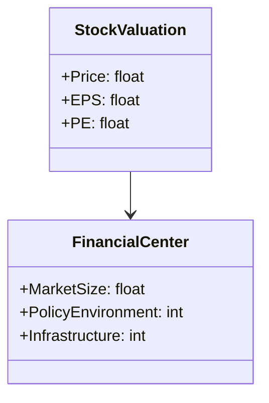

                 


# 全球股市估值与国际金融中心竞争的关联

## 关键词：全球股市估值、国际金融中心、竞争关系、股市波动、金融中心吸引力

## 摘要：
本文探讨了全球股市估值与国际金融中心竞争之间的关联性，分析了股市估值的核心概念、国际金融中心的竞争属性，以及两者之间的相互影响。通过多因素模型、数学公式和实际案例，本文详细阐述了股市估值与金融中心竞争的内在联系，并提出了优化策略和未来研究方向。

---

# 第一部分: 全球股市估值与国际金融中心竞争的背景介绍

## 第1章: 全球股市估值的基本概念

### 1.1 股市估值的定义与意义

#### 1.1.1 股市估值的定义
股市估值是指通过对公司财务数据（如利润表、资产负债表）和市场指标（如市盈率、市净率）进行分析，估算公司股票的合理价格范围。其目的是为投资者提供参考，帮助其做出理性投资决策。

#### 1.1.2 股市估值的重要性
股市估值是金融市场的基石，它不仅影响投资者的决策，还关系到资本市场的资源配置效率。合理的估值能够引导资金流向高效率的企业，促进经济发展。

#### 1.1.3 股市估值的核心要素
- **财务数据**：包括收入、利润、资产、负债等。
- **市场指标**：如市盈率（P/E）、市净率（P/B）、股息率（Dividend Yield）。
- **宏观经济因素**：如GDP增长率、利率水平、通货膨胀率。

---

## 第2章: 国际金融中心的定义与现状

### 2.1 国际金融中心的定义

#### 2.1.1 金融中心的定义
金融中心是集中了大量金融机构、资本市场和金融交易的地理区域，通常具有完善的法律体系、高效的金融服务和国际化程度高的特点。

#### 2.1.2 国际金融中心的特征
- **国际化**：吸引全球资本和投资者。
- **金融服务业发达**：包括银行、证券、保险、基金等。
- **基础设施完善**：如交易所、清算系统、法律服务等。

#### 2.1.3 全球主要金融中心概述
全球主要金融中心包括纽约、伦敦、东京、上海、新加坡等。这些城市通过强大的金融实力、市场规模和国际化程度，成为全球资本流动的核心枢纽。

---

## 第3章: 问题背景与研究意义

### 3.1 全球股市估值的波动性

#### 3.1.1 股市估值波动的原因
- **市场情绪**：投资者情绪波动会导致股市估值的短期波动。
- **宏观经济因素**：如利率变化、经济政策调整等。
- **企业基本面**：公司业绩的好坏直接影响股市估值。

#### 3.1.2 金融中心竞争的加剧
随着全球化进程的加快，国际金融中心之间的竞争日益激烈。各金融中心纷纷通过政策优惠、市场开放和基础设施建设吸引更多的资本和企业。

#### 3.1.3 两者关联的现实需求
股市估值与金融中心竞争之间存在密切关联。一方面，金融中心的竞争力影响股市估值，另一方面，股市估值的变化也反过来影响金融中心的吸引力。

---

# 第二部分: 核心概念与联系

## 第4章: 核心概念的原理与属性

### 4.1 股市估值的核心原理

#### 4.1.1 市盈率与市净率的计算方法
- **市盈率（P/E）** = 股价 / 每股净利润。
- **市净率（P/B）** = 股价 / 每股净资产。

#### 4.1.2 股息率与股票估值的关系
股息率 = 每股股息 / 股价。股息率高的股票通常被认为具有较高的投资价值。

#### 4.1.3 资产负债表与利润表对估值的影响
通过分析公司的资产负债表和利润表，可以评估公司的财务健康状况，从而影响股市估值。

### 4.2 国际金融中心的竞争属性

#### 4.2.1 金融中心的吸引力因素
- **市场规模**：市场规模越大，吸引力越强。
- **政策环境**：税收优惠、监管宽松等政策吸引企业入驻。
- **基础设施**：完善的金融服务业和高效的交易系统。

#### 4.2.2 金融中心的核心竞争力
- **人才资源**：高素质的金融人才是金融中心的核心竞争力。
- **技术创新**：金融科技的应用提升了金融中心的竞争力。
- **国际化程度**：国际化程度高的金融中心更容易吸引全球资本。

---

## 第5章: 核心概念的对比分析

### 5.1 股市估值与金融中心竞争的对比表格

| 对比维度 | 股市估值 | 金融中心竞争 |
|----------|----------|---------------|
| 核心要素 | 财务数据、市场指标 | 市场规模、政策环境、基础设施 |
| 影响因素 | 宏观经济、企业业绩、市场情绪 | 政策、技术、人才 |
| 表现形式 | 估值波动、市场指数 | 吸引力排名、交易量 |

### 5.2 股市估值与金融中心竞争的ER实体关系图


---

# 第三部分: 算法原理与数学模型

## 第6章: 算法原理与流程图

### 6.1 算法原理

#### 6.1.1 多因素模型的构建
多因素模型用于分析影响股市估值的主要因素，包括宏观经济因素、行业因素和公司特有因素。

#### 6.1.2 金融中心竞争力的量化方法
通过构建指标体系（如市场规模、政策环境、基础设施）量化金融中心的竞争力。

---

## 第7章: 数学公式与模型解读

### 7.1 CAPM模型的应用

#### 7.1.1 CAPM公式
$$ R_i = R_f + \beta_i (R_m - R_f) $$

其中：
- \( R_i \) 是股票的预期回报率。
- \( R_f \) 是无风险利率。
- \( \beta_i \) 是股票的贝塔系数。
- \( R_m \) 是市场预期回报率。

#### 7.1.2 实际案例分析
假设某股票的贝塔系数为1.2，无风险利率为3%，市场预期回报率为8%。根据CAPM公式：
$$ R_i = 3\% + 1.2 \times (8\% - 3\%) = 9.6\% $$

---

## 第8章: 项目实战

### 8.1 环境安装与代码实现

#### 8.1.1 环境安装
需要安装Python和相关库（如pandas、numpy、scipy）。

#### 8.1.2 核心代码实现
```python
import pandas as pd
import numpy as np

# 数据加载
data = pd.read_csv('stock_data.csv')

# 计算市盈率
data['PE'] = data['Price'] / data['EPS']

# 计算市净率
data['PB'] = data['Price'] / data['BVPS']

# 打印结果
print(data[['PE', 'PB']].head())
```

---

## 第9章: 系统分析与架构设计

### 9.1 系统功能设计

#### 9.1.1 领域模型


---

## 第10章: 最佳实践与小结

### 10.1 小结
通过本文的分析，我们可以看到全球股市估值与国际金融中心竞争之间存在密切的关联。理解这些关联有助于投资者和政策制定者做出更明智的决策。

### 10.2 注意事项
- 数据分析时要注意样本的代表性和数据的准确性。
- 模型的应用要结合实际情况，避免过度简化。

### 10.3 拓展阅读
建议读者进一步阅读相关领域的经典文献，如《投资学原理》和《金融市场分析》。

---

以上是文章的详细目录和内容概要。希望这篇文章能为读者提供清晰的思路和深入的分析，帮助理解全球股市估值与国际金融中心竞争的关联性。

