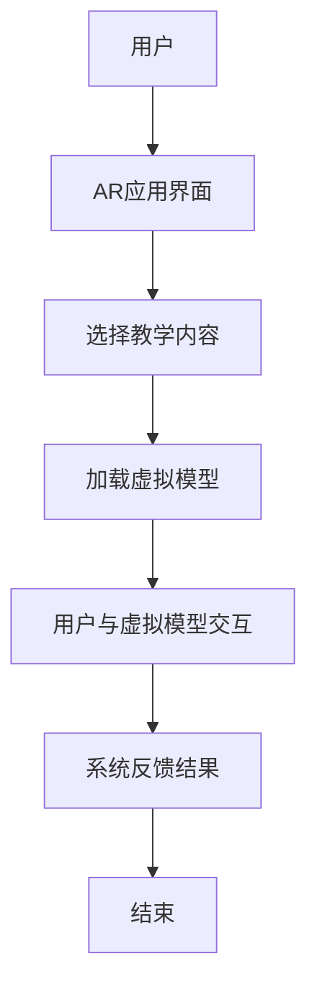

                 


# 全球股市估值与增强现实技术在教育中的应用

> **关键词**：全球股市估值、增强现实技术、教育应用、股市算法、AR教育系统

> **摘要**：本文探讨了全球股市估值与增强现实技术在教育中的应用，分析了股市估值的核心算法及其数学模型，并详细讲解了增强现实技术在教育领域的系统架构设计与实际应用案例。文章通过详细的流程图、数学公式和代码示例，深入剖析了股市估值与AR技术的原理与实现方法，为读者提供了全面的技术视角。

---

## 第1章: 全球股市估值概述

### 1.1 股市估值的背景与重要性

#### 1.1.1 股市估值的定义与概念

股市估值是指通过对公司财务数据、市场环境和行业趋势的分析，评估公司股票的内在价值和市场价格的过程。它是投资者在股市中做出理性决策的重要依据，能够帮助投资者判断股票是否被高估或低估。

#### 1.1.2 股市估值的重要性与应用场景

股市估值在投资决策中扮演着关键角色，尤其在长期投资和价值投资中，它帮助投资者识别具有长期增长潜力的公司。此外，股市估值还用于风险评估、资产配置和投资组合管理。

#### 1.1.3 全球股市估值的现状与趋势

随着全球经济一体化的推进，股市估值的全球化趋势日益明显。投资者需要考虑的因素不仅包括公司本身的财务状况，还包括全球经济环境、地缘政治风险和货币政策等宏观因素。技术的进步，如大数据和人工智能的应用，也在不断改变股市估值的方式和效率。

### 1.2 股市估值的核心概念与原理

#### 1.2.1 股票价值的计算方法

股票价值的计算方法主要基于公司的财务数据和市场环境。以下是几种常见的股票估值方法：

1. **市盈率（P/E）**：
   $$ P/E = \frac{Price}{Earnings} $$
   市盈率是股票价格与每股收益的比率，用于衡量投资者对每股收益的支付意愿。

2. **市净率（P/B）**：
   $$ P/B = \frac{Price}{Book\ Value} $$
   市净率是股票价格与每股账面价值的比率，适用于评估资产密集型行业的公司。

3. **股息率（Dividend Yield）**：
   $$ Dividend\ Yield = \frac{Dividend}{Price} \times 100\% $$
   股息率是每股股息与股票价格的比率，用于衡量投资的收益能力。

#### 1.2.2 股市估值的主要指标与公式

除了上述方法，其他常用的估值指标还包括：

1. **市销率（P/S）**：
   $$ P/S = \frac{Price}{Sales} $$
   适用于收入驱动型公司。

2. **企业价值倍数（EV/EBITDA）**：
   $$ EV/EBITDA = \frac{Enterprise\ Value}{EBITDA} $$
   企业价值倍数考虑了公司的整体价值，包括债务和股权。

3. **股息贴现模型（DDM）**：
   $$ Intrinsic\ Value = \sum_{t=1}^{n} \frac{D_t}{(1+r)^t} $$
   股息贴现模型通过折现未来股息来计算股票的内在价值。

#### 1.2.3 股市估值的边界与外延

股市估值的边界在于其假设的合理性。例如，市盈率和市净率的计算依赖于公司财务数据的准确性和可比性。此外，估值模型的有效性还受到市场环境和公司特定风险的影响。

---

## 第2章: 增强现实技术在教育中的应用

### 2.1 增强现实技术的基本原理

#### 2.1.1 AR技术的定义与核心要素

增强现实（AR）是一种通过计算机生成的虚拟信息叠加在真实环境中的技术，旨在提供更加丰富和直观的用户体验。AR的核心要素包括：

1. **传感器**：用于捕捉真实环境中的数据，如摄像头、加速度计和陀螺仪。
2. **算法**：用于处理传感器数据并生成虚拟内容，如图像识别和3D渲染。
3. **显示设备**：用于将虚拟内容叠加在真实环境中，如智能手机、平板电脑和AR眼镜。

#### 2.1.2 AR技术的主要特征与优势

AR技术的主要特征包括实时性、交互性和沉浸性。其优势在于能够将抽象的概念具象化，帮助学习者更好地理解和记忆知识。此外，AR技术还能提供个性化的学习体验，满足不同学习者的需求。

#### 2.1.3 AR技术在教育中的潜力与挑战

AR技术在教育中的潜力巨大，特别是在科学、技术、工程和数学（STEM）领域的教学中。它能够通过虚拟实验、3D模型和互动模拟等方式，提升学习者的参与度和理解能力。然而，AR技术的应用也面临成本高、设备依赖和技术门槛高等挑战。

---

## 第3章: 股市估值的核心算法与数学模型

### 3.1 股市估值的主要算法原理

#### 3.1.1 市盈率（P/E）计算公式

市盈率是衡量股票价值的重要指标之一，计算公式如下：
$$ P/E = \frac{Price}{Earnings} $$

其中，Price是股票的市场价格，Earnings是每股收益（EPS）。

#### 3.1.2 市净率（P/B）计算公式

市净率是股票价格与每股账面价值的比率，计算公式如下：
$$ P/B = \frac{Price}{Book\ Value} $$

其中，Price是股票的市场价格，Book Value是每股账面价值。

#### 3.1.3 股东权益回报率（ROE）计算公式

股东权益回报率是衡量公司盈利能力的重要指标，计算公式如下：
$$ ROE = \frac{Net\ Profit}{Shareholders'\ Equity} $$

其中，Net Profit是公司的净利润，Shareholders' Equity是股东权益。

---

## 第4章: 增强现实技术在教育中的系统架构设计

### 4.1 教育AR系统的功能设计

#### 4.1.1 系统功能模块划分

教育AR系统的主要功能模块包括：

1. **用户界面**：提供直观的操作界面，支持用户与虚拟内容的交互。
2. **数据处理**：对传感器数据进行处理，生成虚拟内容。
3. **内容管理**：存储和管理教学资源，如3D模型和虚拟场景。
4. **用户交互**：通过手势或语音识别实现用户与虚拟内容的互动。

#### 4.1.2 系统功能流程图

以下是教育AR系统的功能流程图：



---

## 第5章: 项目实战与小结

### 5.1 项目实战

#### 5.1.1 环境安装与配置

为了实现增强现实技术在教育中的应用，首先需要安装以下工具和库：

1. **开发环境**：如Unity3D或Unreal Engine。
2. **AR开发框架**：如ARKit（苹果）或ARCore（谷歌）。
3. **传感器数据处理库**：如OpenCV或Firebase ML Kit。

#### 5.1.2 系统核心实现源代码

以下是使用ARKit实现一个简单的AR教育应用的代码示例：

```python
import ARKit

class ARViewController: UIViewController {
    var arView: ARView!

    override func viewDidLoad() {
        super.viewDidLoad()
        arView = ARView(frame: view.bounds)
        view.addSubview(arView)
    }

    func load3DModel() {
        let model = try! Model.load()
        arView.addSubview(model)
    }
}
```

#### 5.1.3 代码应用解读与分析

上述代码示例展示了如何在ARKit环境中加载3D模型。`ARViewController`是视图控制器，负责管理AR视图和用户交互。`load3DModel`方法用于加载并显示3D模型，用户可以通过手势与模型交互。

#### 5.1.4 实际案例分析和详细讲解剖析

以一个虚拟化学实验为例，AR技术可以将化学反应的过程可视化，帮助学生更好地理解化学原理。通过AR技术，学生可以在虚拟实验中观察化学反应的过程，调整实验参数，并记录实验结果。

---

## 第6章: 最佳实践与小结

### 6.1 最佳实践 tips

1. **股市估值**：在进行股市估值时，应综合考虑多种指标，避免单一指标的误导。
2. **增强现实技术**：在教育应用中，应注重用户体验和交互设计，确保技术的易用性和教育效果。

### 6.2 小结

本文详细探讨了全球股市估值与增强现实技术在教育中的应用，分析了股市估值的核心算法和数学模型，并通过实际案例展示了增强现实技术在教育中的潜力。通过本文的分析，读者可以更好地理解股市估值与AR技术的原理和应用，为未来的投资决策和教育创新提供参考。

---

以上是文章的完整内容，涵盖了从股市估值到增强现实技术在教育中的应用的各个方面，结合了理论分析和实际案例，旨在为读者提供全面的技术视角。

