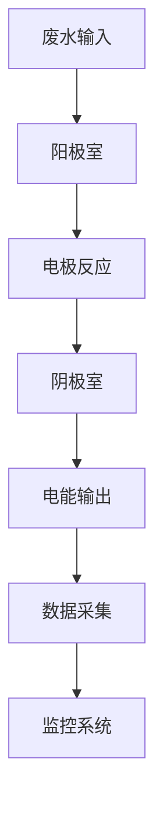

                 


# 全球股市估值与微生物燃料电池在废水处理中的应用

> 关键词：全球股市估值, 微生物燃料电池, 废水处理, 经济分析, 可持续技术

> 摘要：本文探讨了全球股市估值与微生物燃料电池在废水处理中的应用。首先介绍了全球股市估值的基本概念、方法及其对经济的影响力；然后详细阐述了微生物燃料电池的工作原理及其在废水处理中的应用；最后分析了两者的联系，探讨了如何通过股市估值的方法来优化微生物燃料电池的经济性和可持续性。本文旨在为金融和环境工程领域的专业人士提供深入的技术分析和实践指导。

---

# 第1章 全球股市估值的基础与方法

## 1.1 股市估值的定义与作用

### 1.1.1 股市估值的定义
股市估值是指通过对公司基本面和市场因素的分析，确定股票的内在价值或市场价格的过程。

### 1.1.2 股市估值的作用与意义
股市估值帮助投资者做出理性决策，指导投资行为，维护市场的公平性和透明性。

### 1.1.3 股市估值的常见指标
- 市盈率（P/E）
- 市净率（P/B）
- 股息率
- 内在价值

## 1.2 股市估值的主要方法

### 1.2.1 市盈率（P/E）法
市盈率=股票价格/每股净利润，用于衡量股票的投资价值。

### 1.2.2 市净率（P/B）法
市净率=股票价格/每股净资产，适用于评估资产密集型行业的公司。

### 1.2.3 股息率法
股息率=每股股息/股票价格，用于衡量股票的收益能力。

### 1.2.4 内在价值法
内在价值法通过DCF模型等方法计算公司未来现金流的现值。

## 1.3 股市估值的影响因素

### 1.3.1 宏观经济因素
宏观经济环境、利率水平、通货膨胀等对股市估值有直接影响。

### 1.3.2 行业因素
行业发展趋势、竞争格局、政策法规等影响股市估值。

### 1.3.3 公司基本面因素
收入、利润、资产负债率、ROE等财务指标是股市估值的重要依据。

### 1.3.4 市场情绪因素
投资者情绪、市场流动性等非理性因素也会影响股市估值。

---

# 第2章 微生物燃料电池在废水处理中的应用

## 2.1 微生物燃料电池的基本原理

### 2.1.1 微生物燃料电池的定义
微生物燃料电池是一种利用微生物的代谢活动产生电能的装置。

### 2.1.2 微生物燃料电池的工作原理
微生物在燃料电池中分解有机物，产生电能和水，同时去除废水中的污染物。

### 2.1.3 微生物燃料电池的核心组件
- 阳极室
- 阴极室
- 分隔层
- 电极材料
- 电解质

## 2.2 微生物燃料电池在废水处理中的应用

### 2.2.1 微生物燃料电池在有机物降解中的应用
通过微生物的代谢作用，将有机物转化为甲烷、二氧化碳等气体，实现有机物的高效降解。

### 2.2.2 微生物燃料电池在重金属去除中的应用
利用微生物的吸附作用，去除废水中的重金属离子。

### 2.2.3 微生物燃料电池在氮磷去除中的应用
通过微生物的硝化和反硝化作用，去除废水中的氮和磷。

## 2.3 微生物燃料电池的优势与挑战

### 2.3.1 微生物燃料电池的优势
- 环保高效
- 可再生资源利用
- 节能减排

### 2.3.2 微生物燃料电池的挑战
- 技术复杂性
- 成本较高
- 稳定性问题

### 2.3.3 微生物燃料电池的未来发展方向
- 技术优化
- 成本降低
- 规模化应用

---

# 第3章 全球股市估值与微生物燃料电池的联系

## 3.1 全球股市估值的全球性特征

### 3.1.1 全球股市估值的波动性
全球股市估值受宏观经济、地缘政治、市场情绪等多种因素影响，具有较强的波动性。

### 3.1.2 全球经济对股市估值的影响
全球经济的增长、衰退、通货膨胀等因素直接影响全球股市估值。

### 3.1.3 全球股市估值的区域差异
不同国家和地区的经济政策、市场环境导致全球股市估值存在显著差异。

## 3.2 微生物燃料电池的全球性应用

### 3.2.1 微生物燃料电池在发达国家的应用
发达国家在技术研发和产业化方面处于领先地位。

### 3.2.2 微生物燃料电池在发展中国家的应用
发展中国家在废水处理和能源需求方面有较大的应用潜力。

### 3.2.3 微生物燃料电池在国际环保合作中的应用
国际环保合作为微生物燃料电池的推广提供了重要的平台和机会。

## 3.3 全球股市估值与微生物燃料电池的协同作用

### 3.3.1 微生物燃料电池的技术创新对股市估值的影响
技术创新提升微生物燃料电池的市场竞争力，推动相关股票的估值上升。

### 3.3.2 全球股市估值对微生物燃料电池发展的促进作用
股市估值为微生物燃料电池的研发和产业化提供了资金支持。

### 3.3.3 微生物燃料电池的经济性与可持续性对股市的影响
微生物燃料电池的经济性和可持续性直接影响投资者对其相关股票的估值。

---

# 第4章 微生物燃料电池系统的数学建模与优化

## 4.1 微生物燃料电池的数学模型

### 4.1.1 阳极反应模型
$$ \text{有机物} + \text{水} \rightarrow \text{甲烷} + \text{电子} + \text{质子} $$

### 4.1.2 阴极反应模型
$$ \text{电子} + \text{氧气} + \text{质子} \rightarrow \text{水} $$

### 4.1.3 整体反应模型
$$ \text{有机物} + \text{氧气} \rightarrow \text{甲烷} + \text{水} $$

## 4.2 微生物燃料电池的优化算法

### 4.2.1 基于遗传算法的优化
```python
def genetic_algorithm(population, fitness_func):
    # 选择、交叉、变异
    # 计算适应度
    fitness = [fitness_func(individual) for individual in population]
    # 选择
    selected = select(population, fitness)
    # 交叉
    crossed = crossover(selected)
    # 变异
    mutated = mutate(crossed)
    return mutated
```

### 4.2.2 基于粒子群优化的算法
```python
def particle_swarm_optimization(n_particles, n_iterations):
    for _ in range(n_iterations):
        for particle in particles:
            # 更新速度
            particle.velocity = inertia * particle.velocity + \
                                cognitive * random() * (particle.best - particle.position) + \
                                social * random() * (global_best - particle.position)
            # 更新位置
            particle.position += particle.velocity
```

## 4.3 数学模型与实际应用的结合

### 4.3.1 数学模型的验证
通过实验数据验证数学模型的准确性。

### 4.3.2 模型优化与系统性能提升
利用优化算法提升微生物燃料电池的效率和稳定性。

---

# 第5章 微生物燃料电池系统的架构设计与实现

## 5.1 系统设计与架构

### 5.1.1 系统功能设计
- 废水处理模块
- 电能生成模块
- 数据采集与监控模块

### 5.1.2 系统架构设计


### 5.1.3 系统接口设计
- 废水输入接口
- 电能输出接口
- 数据采集接口

## 5.2 系统实现与代码示例

### 5.2.1 废水处理模块实现
```python
class WasteWaterTreatment:
    def __init__(self, flow_rate):
        self.flow_rate = flow_rate
    def treat(self):
        # 处理废水
        pass
```

### 5.2.2 电能生成模块实现
```python
class ElectricityGeneration:
    def __init__(self, voltage, current):
        self.voltage = voltage
        self.current = current
    def generate(self):
        # 生成电能
        pass
```

## 5.3 系统测试与性能分析

### 5.3.1 系统测试
通过实验测试系统的处理效率和电能输出稳定性。

### 5.3.2 性能分析
分析系统的处理能力、能量转换效率和经济性。

---

# 第6章 项目实战：微生物燃料电池在废水处理中的经济分析

## 6.1 项目背景与目标

### 6.1.1 项目背景
某工业园区废水处理项目，采用微生物燃料电池技术。

### 6.1.2 项目目标
评估微生物燃料电池技术的经济性和可持续性。

## 6.2 项目实施与分析

### 6.2.1 项目实施
- 系统设计
- 设备采购
- 系统安装
- 系统调试

### 6.2.2 项目分析
通过股市估值的方法，评估微生物燃料电池技术的经济效益。

## 6.3 项目总结与优化

### 6.3.1 项目总结
总结项目的实施过程和取得的成果。

### 6.3.2 项目优化
提出进一步优化系统性能和降低成本的建议。

---

# 第7章 总结与展望

## 7.1 总结
本文探讨了全球股市估值与微生物燃料电池在废水处理中的应用，分析了两者的联系和协同作用，提出了优化算法和系统架构设计方案。

## 7.2 展望
未来，随着技术的进步和市场的推广，微生物燃料电池在废水处理中的应用将更加广泛，股市估值的方法也将进一步优化。

---

# 参考文献
（此处列出相关文献和参考资料）

---

# 致谢
感谢所有参与本项目研究和写作的人员和机构。

