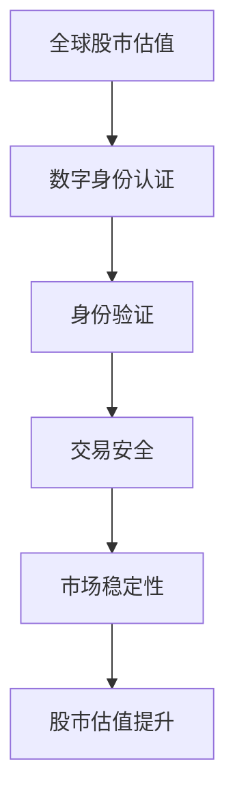

                 


# 全球股市估值与数字身份认证的关联

## 关键词：全球股市估值，数字身份认证，关联性分析，算法原理，系统架构，项目实战

## 摘要

在全球经济日益数字化的背景下，数字身份认证与全球股市估值之间的关联性逐渐显现。本文将探讨这两者如何相互作用，分析其核心概念、技术原理、系统架构，并通过实际案例展示其应用。我们还将讨论数字身份认证在提升股市估值准确性和安全性方面的作用，以及未来的发展方向。

---

## 第一部分：背景与核心概念

### 第1章：全球股市估值与数字身份认证的背景介绍

#### 1.1 问题背景

全球股市估值是衡量市场健康状况的重要指标，而数字身份认证则是确保交易安全的关键技术。随着数字化转型的推进，两者的关系变得愈发紧密。

- **全球股市估值的重要性**：股市估值反映了市场的整体价值，影响投资者决策和经济政策。
- **数字身份认证的兴起**：随着在线交易的增加，数字身份认证成为保障交易安全的核心技术。
- **问题解决**：数字身份认证如何提升股市估值的准确性和安全性。

#### 1.2 核心概念

- **数字身份认证的定义与特征**：
  - **定义**：通过技术手段验证用户身份的真实性。
  - **特征**：安全性、唯一性、便捷性。
- **全球股市估值的定义与特征**：
  - **定义**：对上市公司价值的评估。
  - **特征**：数据驱动、动态性、风险评估。
- **核心要素对比分析**：
  - 数字身份认证：依赖于密码学、生物识别技术。
  - 全球股市估值：依赖于财务数据、市场分析。

#### 1.3 关联性分析

通过Mermaid图展示两者的关联：



---

### 第2章：数字身份认证与全球股市估值的核心联系

#### 2.1 核心概念原理

- **数字身份认证的原理**：通过加密算法验证用户身份，防止欺诈。
- **全球股市估值的原理**：基于财务指标和市场分析，评估公司价值。

#### 2.2 核心概念对比分析

| 属性         | 数字身份认证       | 全球股市估值          |
|--------------|--------------------|-----------------------|
| 核心目标     | 验证用户身份       | 评估公司价值          |
| 依赖技术     | 密码学、生物识别   | 财务数据、算法模型     |
| 应用场景     | 在线交易、登录     | 投资决策、市场分析     |

---

## 第二部分：技术原理与数学模型

### 第3章：数字身份认证的算法原理

#### 3.1 算法原理讲解

数字身份认证通常采用多因素认证（MFA）和公钥加密技术。以下是步骤：

1. 用户提供身份信息（如密码或生物特征）。
2. 系统验证身份。
3. 生成加密令牌。
4. 授权访问。

#### 3.2 数学模型与公式

- **哈希函数**：用于验证数据完整性。
  $$ hash(m) = h $$
  其中，\( m \) 是明文，\( h \) 是哈希值。

- **RSA加密**：用于公钥加密。
  $$ e \equiv 1 \mod (p-1)(q-1) $$
  其中，\( e \) 是公钥指数，\( p \) 和 \( q \) 是大质数。

---

### 第4章：全球股市估值的数学模型

#### 4.1 数学模型与公式

- **市盈率（P/E）**：
  $$ P/E = \frac{Price}{Earnings} $$
  其中，Price是股价，Earnings是每股收益。

- **市净率（P/B）**：
  $$ P/B = \frac{Price}{Book\ Value} $$
  其中，Book Value是账面价值。

---

## 第三部分：系统架构与设计

### 第5章：数字身份认证系统的架构设计

#### 5.1 系统功能设计

- 用户身份验证：通过多因素认证验证用户身份。
- 权限管理：根据用户角色分配权限。
- 安全审计：记录和分析安全事件。

#### 5.2 系统架构设计

采用分层架构：

- **表现层**：用户界面。
- **业务逻辑层**：处理认证逻辑。
- **数据访问层**：与数据库交互。

---

### 第6章：全球股市估值系统的架构设计

#### 6.1 系统功能设计

- 数据采集：收集财务数据和市场数据。
- 估值计算：应用算法模型进行估值。
- 报告生成：输出估值报告。

#### 6.2 系统架构设计

采用分布式架构：

- **数据源**：上市公司财务数据。
- **计算引擎**：运行估值算法。
- **用户界面**：展示估值结果。

---

## 第四部分：项目实战与案例分析

### 第7章：数字身份

#### 7.1 项目实战

- **环境安装**：安装Python和相关库（如 bcrypt、jwt）。
- **代码实现**：
  ```python
  import bcrypt
  from jwt import encode, decode

  # 用户注册
  def register(username, password):
      hashed = bcrypt.hashpw(password.encode(), bcrypt.gensalt())
      return {"status": "success"}

  # 用户登录
  def login(username, password):
      if bcrypt.checkpw(password.encode(), hashed.encode()):
          token = encode({"user": username}, "secret", algorithm="HS256")
          return {"token": token}
  ```

#### 7.2 案例分析

通过实际案例分析数字身份认证在提升股市估值中的作用，展示如何通过安全的身份验证机制提高交易效率和准确性。

---

## 第五部分：总结与展望

### 8.1 总结

本文详细探讨了数字身份认证与全球股市估值的关联性，分析了其技术原理和系统架构，并通过实际案例展示了其应用。

### 8.2 展望

未来，数字身份认证技术将进一步提升股市估值的准确性和安全性，推动金融数字化的发展。

---

## 最佳实践 tips

- **安全性**：确保数字身份认证的多因素和高强度加密。
- **合规性**：遵循相关法律法规，保护用户隐私。
- **可扩展性**：设计灵活的架构，适应市场变化。

---

## 小结

通过本文的分析，读者可以全面理解数字身份认证与全球股市估值的关联性，并掌握其技术实现和应用方法。希望本文能为相关领域的研究和实践提供有价值的参考。

