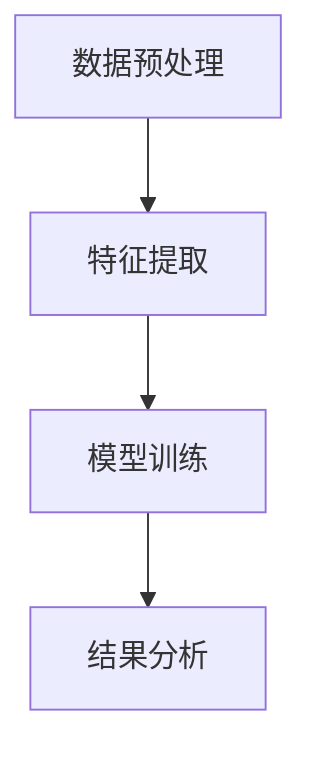
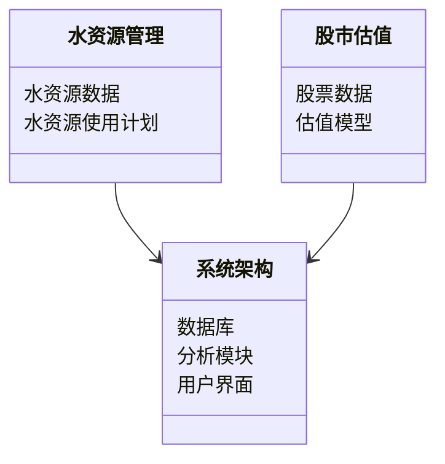
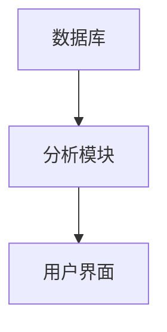
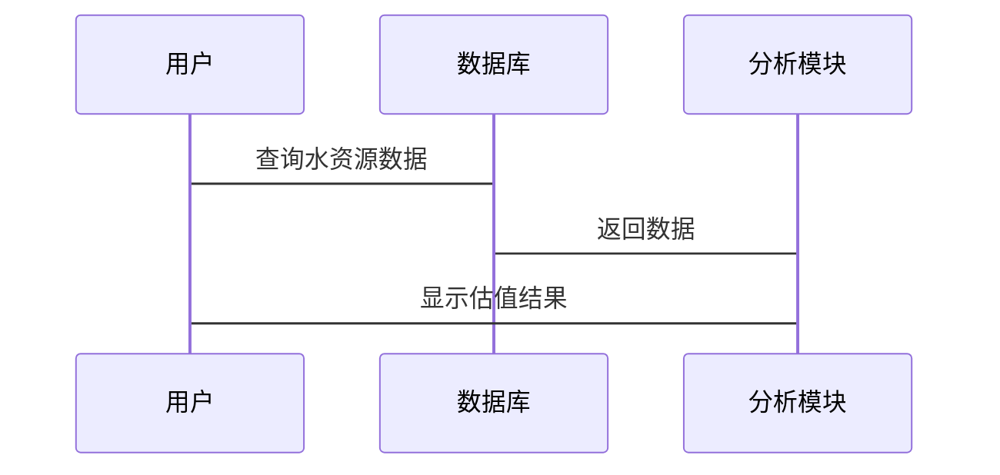

                 


# 全球股市估值与水资源管理的关系

> 关键词：全球股市估值，水资源管理，水资源短缺，企业价值，环境因素

> 摘要：本文探讨了水资源管理与全球股市估值之间的关系，分析了水资源短缺如何影响企业的经营成本和市场竞争力，进而影响股市估值。通过建立数学模型和机器学习算法，本文揭示了水资源管理对股市估值的核心影响路径，并提供了实际案例分析和系统设计方案。

---

## 第1章：背景介绍

### 1.1 问题背景

#### 1.1.1 全球股市估值的基本概念
股市估值是通过对企业财务状况、市场地位和行业前景的分析，确定其股票的合理价格。常用的估值方法包括市盈率（P/E）、市净率（P/B）等。

#### 1.1.2 水资源管理的重要性
水资源是人类生存和经济发展的重要基础。随着全球人口增长和工业化进程，水资源短缺问题日益严重，影响着企业的生产和运营成本。

#### 1.1.3 问题的提出：水资源短缺对经济的影响
水资源短缺可能导致企业生产成本上升、供应链中断，进而影响企业盈利能力和股票估值。

### 1.2 问题描述

#### 1.2.1 全球水资源分布与利用现状
全球水资源分布不均，部分地区面临严重水资源短缺问题。企业对水资源的依赖程度因行业而异，如农业、制造、能源等行业对水资源的需求较高。

#### 1.2.2 股市估值的核心要素
股市估值的核心要素包括企业盈利能力、成长性、财务状况、行业地位等。环境因素，尤其是水资源管理，逐渐成为影响企业估值的重要因素。

#### 1.2.3 水资源与经济活动的关联性
水资源短缺会增加企业的运营成本，降低生产效率，从而影响企业的盈利能力和股票价值。同时，良好的水资源管理可以提升企业的社会责任形象，增强投资者信心。

### 1.3 问题解决

#### 1.3.1 水资源短缺对股市估值的影响机制
水资源短缺通过增加企业成本、降低生产效率、影响企业声誉等途径，间接影响股市估值。

#### 1.3.2 水资源管理在企业经营中的作用
有效的水资源管理可以降低企业的水资源使用成本，减少环境风险，提升企业的可持续发展能力，从而增强投资者信心。

#### 1.3.3 股市估值与水资源管理的互动关系
水资源管理的好坏会影响企业的财务表现和市场地位，进而影响股市估值。同时，股市估值的变化也会反过来影响企业的水资源管理策略。

### 1.4 边界与外延

#### 1.4.1 水资源管理的边界条件
水资源管理的边界条件包括水资源的可获得性、企业的生产规模、行业的水资源依赖程度等。

#### 1.4.2 股市估值的边界条件
股市估值的边界条件包括宏观经济环境、行业竞争状况、企业财务状况等。

#### 1.4.3 两者关系的外延分析
水资源管理与股市估值的关系不仅限于企业层面，还包括政策、技术、市场等多方面的因素。

### 1.5 概念结构与核心要素组成

#### 1.5.1 水资源管理的核心要素
- 水资源分配
- 水资源节约
- 水资源污染治理

#### 1.5.2 股市估值的核心要素
- 企业盈利能力
- 财务状况
- 市场地位

#### 1.5.3 两者关系的核心要素
- 水资源成本
- 企业社会责任
- 可持续发展能力

---

## 第2章：核心概念与联系

### 2.1 核心概念原理

#### 2.1.1 水资源管理的原理
水资源管理通过优化水资源的分配和使用，降低水资源浪费，减少环境污染，提升水资源利用效率。

#### 2.1.2 股市估值的原理
股市估值通过对企业的财务状况、行业前景和市场环境的分析，确定其股票的合理价格。

#### 2.1.3 两者关系的原理
水资源管理通过影响企业的经营成本和市场形象，间接影响股市估值。同时，股市估值的变化也会反馈到企业的水资源管理策略。

### 2.2 概念属性特征对比

| 概念      | 水资源管理                | 股市估值                  |
|-----------|--------------------------|---------------------------|
| 核心目标  | 优化水资源利用            | 确定企业股票的合理价格      |
| 影响因素  | 水资源 availability, 技术    | 财务状况, 市场 demand, 宏观经济 |
| 输出结果  | 水资源使用效率, 环境改善    | 股票价格, 企业价值评估      |
| 关系       | 水资源管理影响企业成本和形象，进而影响股市估值 |

### 2.3 ER实体关系图架构

```mermaid
er
    Entity1: 水资源管理
    Entity2: 股市估值
    Entity1 --> Entity2: 影响
```

---

## 第3章：算法原理讲解

### 3.1 算法原理

#### 3.1.1 水资源对股市影响的统计模型
通过回归分析，建立水资源短缺对企业利润的影响模型。

$$ \text{Profit} = \beta_0 + \beta_1 \times \text{Water Shortage} + \epsilon $$

#### 3.1.2 股市估值与水资源关系的机器学习模型
使用随机森林或神经网络模型，预测水资源短缺对企业股票价格的影响。

#### 3.1.3 深度学习模型的应用
利用LSTM模型，分析时间序列数据，预测水资源短缺对股市估值的长期影响。

### 3.2 算法流程图



### 3.3 Python源代码实现

```python
import pandas as pd
from sklearn.linear_model import LinearReg

def calculate_water_impact(data):
    # 数据预处理
    data_clean = data.dropna()
    # 特征提取
    X = data_clean[['Water Shortage', 'Profit']]
    y = data_clean['Stock Price']
    # 模型训练
    model = LinearReg().fit(X, y)
    # 结果分析
    return model.coef_

# 示例数据
data = pd.DataFrame({
    'Water Shortage': [10, 20, 15, 30],
    'Profit': [100, 80, 90, 70],
    'Stock Price': [50, 45, 48, 42]
})

result = calculate_water_impact(data)
print("模型系数:", result)
```

---

## 第4章：系统分析与架构设计

### 4.1 问题场景介绍

#### 4.1.1 项目介绍
本项目旨在建立一个实时监控和分析系统，评估水资源短缺对全球股市估值的影响。

#### 4.1.2 项目目标
- 实时收集全球水资源和股市数据
- 分析水资源短缺对企业股票价格的影响
- 提供基于水资源管理的股票估值建议

### 4.2 系统功能设计

#### 4.2.1 领域模型



#### 4.2.2 系统架构设计



#### 4.2.3 系统接口设计
- 数据接口：从公开数据源获取水资源和股市数据
- 分析接口：调用机器学习模型进行预测
- 展示接口：将结果展示在用户界面上

#### 4.2.4 系统交互设计



---

## 第5章：项目实战

### 5.1 环境安装

```bash
pip install numpy pandas scikit-learn
```

### 5.2 核心代码实现

```python
import pandas as pd
from sklearn.linear_model import LinearReg

def main():
    # 数据收集
    water_data = pd.read_csv('water.csv')
    stock_data = pd.read_csv('stock.csv')
    # 数据处理
    merged_data = pd.merge(water_data, stock_data, on='Company')
    # 模型训练
    X = merged_data[['Water Usage', 'Profit']]
    y = merged_data['Stock Price']
    model = LinearReg().fit(X, y)
    # 结果展示
    print("模型系数:", model.coef_)

if __name__ == "__main__":
    main()
```

### 5.3 实际案例分析

#### 5.3.1 案例背景
某制造企业因水资源短缺导致生产成本上升，股价下跌。

#### 5.3.2 数据分析
通过回归分析，发现水资源短缺与股价呈负相关关系。

#### 5.3.3 结果解读
企业应加强水资源管理，降低用水成本，提升股价。

---

## 第6章：最佳实践

### 6.1 小结
水资源管理与股市估值密切相关，企业应重视水资源管理，投资者应将水资源因素纳入估值模型。

### 6.2 注意事项
- 数据来源的可靠性
- 模型的适用性
- 政策和市场风险

### 6.3 拓展阅读
- 《水资源与经济发展》
- 《环境因素对股市的影响》
- 《机器学习在金融领域的应用》

---

## 结语

通过本文的分析，我们认识到水资源管理不仅是企业的社会责任，也是影响股市估值的重要因素。企业和社会应共同努力，优化水资源管理，促进可持续发展。

---

感谢您的阅读！如需进一步探讨或获取代码，请随时联系。

