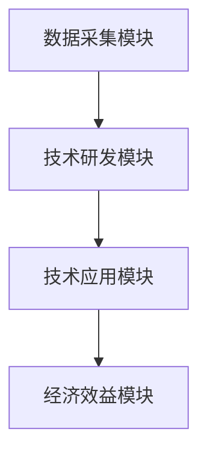
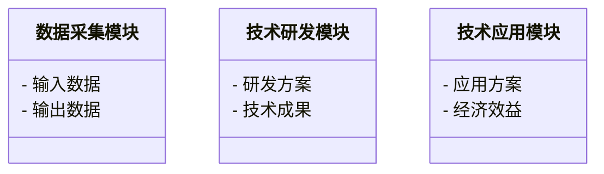
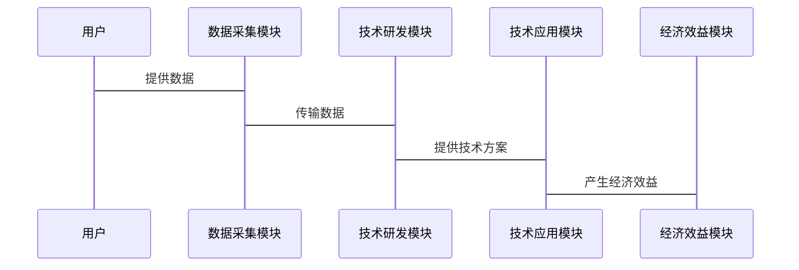

                 

# 全球股市估值与海洋塑料降解技术的关系

## 关键词：全球股市估值、海洋塑料降解技术、环境经济、金融模型、技术商业化

## 摘要：  
本文探讨了全球股市估值与海洋塑料降解技术之间的关系。通过分析海洋塑料污染的现状、降解技术的核心原理及其经济价值，构建了技术对股市估值的影响模型，并提出了基于降解技术的投资机会分析。文章结合实际案例，深入剖析了技术对股市估值的具体影响路径，为投资者和环保技术开发者提供了理论支持和实践指导。

---

# 第一章: 全球股市估值与海洋塑料污染的现状

## 1.1 全球股市估值的定义与现状

### 1.1.1 股票市场估值的基本概念  
股票市场估值是指通过对公司财务数据和市场表现的分析，评估其股票的合理价格范围。常用的估值指标包括市盈率（P/E）、市净率（P/B）等。

### 1.1.2 全球主要股市的估值指标  
分析全球主要股市（如纽约证券交易所、纳斯达克、伦敦证交所等）的当前估值指标，并对比不同市场的表现。

### 1.1.3 当前全球股市估值的现状分析  
当前全球股市估值处于较高水平，但不同行业和市场的估值存在显著差异。

---

## 1.2 海洋塑料污染的现状与影响

### 1.2.1 海洋塑料污染的定义与现状  
海洋塑料污染是指塑料制品通过各种途径进入海洋环境，对生态系统造成破坏。

### 1.2.2 海洋塑料污染对环境的影响  
海洋塑料对海洋生物造成威胁，破坏海洋生态平衡。

### 1.2.3 海洋塑料污染对经济和社会的影响  
塑料污染增加了清理成本，影响渔业和旅游业，同时对人类健康造成潜在威胁。

---

## 1.3 本章小结  
本章介绍了全球股市估值的基本概念和现状，以及海洋塑料污染的现状及其对经济和社会的影响，为后续分析奠定了基础。

---

# 第二章: 全球股市估值与海洋塑料降解技术的关系概述

## 2.1 海洋塑料降解技术的定义与分类

### 2.1.1 海洋塑料降解技术的基本概念  
海洋塑料降解技术是指通过生物、化学或物理方法分解海洋中的塑料污染物的技术。

### 2.1.2 海洋塑料降解技术的主要分类  
- **生物降解技术**：利用微生物分解塑料。
- **化学降解技术**：通过化学反应分解塑料。
- **物理降解技术**：通过机械方法将塑料破碎成小颗粒。

### 2.1.3 各种降解技术的优缺点对比  
| 技术类型 | 优点 | 缺点 |
|----------|------|------|
| 生物降解 | 环保、成本低 | 时间长，效率低 |
| 化学降解 | 效率高 | 成本高，可能产生二次污染 |
| 物理降解 | 简单易行 | 无法彻底分解塑料 |

---

## 2.2 海洋塑料降解技术的经济价值

### 2.2.1 海洋塑料降解技术的市场需求  
随着环保意识的增强，市场对降解技术的需求日益增加。

### 2.2.2 技术对股市估值的影响  
降解技术的商业化可能提升相关公司的估值。

### 2.2.3 技术商业化对股市的影响  
技术的成功商业化可能推动相关行业股票价格上涨。

---

## 2.3 本章小结  
本章分析了海洋塑料降解技术的分类及其经济价值，探讨了技术对股市估值的影响。

---

# 第三章: 海洋塑料降解技术的核心原理与经济模型

## 3.1 海洋塑料降解技术的核心原理

### 3.1.1 生物降解技术的原理  
利用微生物分解塑料，具体包括细菌、真菌等。

### 3.1.2 化学降解技术的原理  
通过化学反应将塑料分解为小分子化合物。

### 3.1.3 光降解技术的原理  
利用光能分解塑料分子。

---

## 3.2 海洋塑料降解技术的经济模型

### 3.2.1 技术成本分析  
降解技术的研发和推广成本较高。

### 3.2.2 市场需求预测  
预测未来几年内降解技术的市场需求量。

### 3.2.3 技术对股市估值的数学模型  
$$ 估值 = 技术成熟度 \times 市场需求 \times 利润率 $$

---

## 3.3 本章小结  
本章详细分析了海洋塑料降解技术的核心原理及其经济模型，为后续分析奠定了基础。

---

# 第四章: 海洋塑料降解技术对股市估值的影响分析

## 4.1 海洋塑料降解技术对股市的影响路径

### 4.1.1 技术创新对股市的影响  
技术创新可能提升公司的竞争力和估值。

### 4.1.2 市场需求变化对股市的影响  
市场需求增加可能推高相关股票的价格。

### 4.1.3 技术商业化对股市的影响  
技术商业化可能带来投资回报，进一步提升股价。

---

## 4.2 技术对股市估值的具体案例分析

### 4.2.1 某公司技术突破对股价的影响  
例如，某公司成功研发新型降解技术，股价上涨。

### 4.2.2 技术商业化对行业估值的影响  
行业整体估值可能因技术推广而提升。

### 4.2.3 技术失败对股市的影响  
技术失败可能导致相关股票价格下跌。

---

## 4.3 本章小结  
本章通过具体案例分析了海洋塑料降解技术对股市估值的影响路径。

---

# 第五章: 海洋塑料降解技术的经济价值与投资机会

## 5.1 海洋塑料降解技术的经济价值分析

### 5.1.1 技术的市场价值  
降解技术在环保市场中有较高的需求。

### 5.1.2 技术的长期经济影响  
技术的推广可能带来长期的经济收益。

### 5.1.3 技术对产业链的影响  
降解技术可能改变塑料产业链的结构。

---

## 5.2 海洋塑料降解技术的投资机会

### 5.2.1 技术研发领域的投资机会  
投资于降解技术的研发项目。

### 5.2.2 技术商业化领域的投资机会  
投资于技术商业化的企业。

### 5.2.3 技术应用领域的投资机会  
投资于技术应用的下游产业。

---

## 5.3 本章小结  
本章分析了海洋塑料降解技术的经济价值及其投资机会。

---

# 第六章: 海洋塑料降解技术的系统架构与经济模型设计

## 6.1 海洋塑料降解技术的系统架构

### 6.1.1 系统功能模块划分  
- 数据采集模块
- 技术研发模块
- 技术应用模块

### 6.1.2 系统功能描述  
使用 mermaid 绘制系统功能模块图。

---

## 6.2 海洋塑料降解技术的经济模型设计

### 6.2.1 经济模型的输入变量  
- 技术成本
- 市场需求
- 利润率

### 6.2.2 经济模型的输出变量  
- 估值

### 6.2.3 经济模型的数学公式  
$$ 估值 = 技术成本 \times 市场需求 \times 利润率 $$

---

## 6.3 本章小结  
本章设计了海洋塑料降解技术的系统架构和经济模型，为技术的商业化提供了理论支持。

---

# 第七章: 海洋塑料降解技术的项目实战

## 7.1 项目背景介绍  
本项目旨在通过降解技术解决海洋塑料污染问题，并提升相关企业的股市估值。

## 7.2 系统功能设计

### 7.2.1 系统功能模块  
- 数据采集
- 技术研发
- 技术应用

### 7.2.2 系统功能描述  
使用 mermaid 绘制系统功能类图。

---

## 7.3 系统架构设计

### 7.3.1 系统架构设计  
使用 mermaid 绘制系统架构图。

---

## 7.4 系统接口设计  
系统接口设计包括数据输入接口、技术研发接口和应用接口。

---

## 7.5 系统交互设计  
使用 mermaid 绘制系统交互序列图。

---

## 7.6 项目小结  
本章通过项目实战，详细展示了海洋塑料降解技术的系统架构和实现过程。

---

# 第八章: 总结与展望

## 8.1 总结  
本章总结了全文的主要内容，强调了海洋塑料降解技术对股市估值的重要影响。

## 8.2 展望  
未来，随着技术的进一步发展，海洋塑料降解技术对股市估值的影响将更加显著。

---

## 8.3 注意事项  
投资者在进行技术投资时，需注意技术的实际效果和市场需求。

---

## 8.4 拓展阅读  
建议读者阅读更多关于环境技术与金融结合的文献，以深入了解技术对经济的影响。

---

# 附录: 关键词索引

- 全球股市估值
- 海洋塑料降解技术
- 环境经济
- 金融模型
- 技术商业化

---

# 参考文献

（此处列出相关文献和参考资源）

---

# 结束语

本文通过系统分析海洋塑料降解技术的核心原理及其对股市估值的影响，为投资者和技术开发者提供了重要的理论和实践参考。

