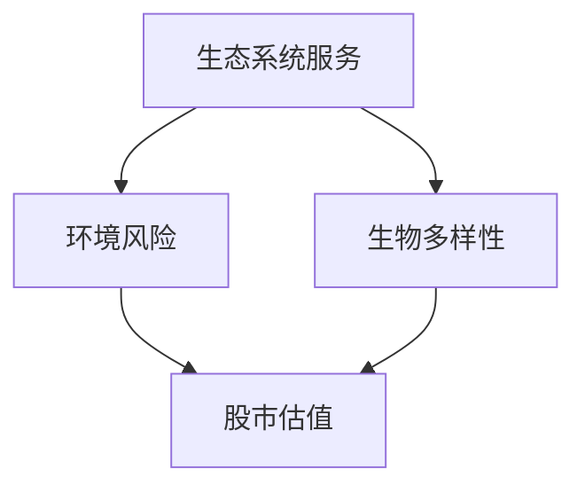
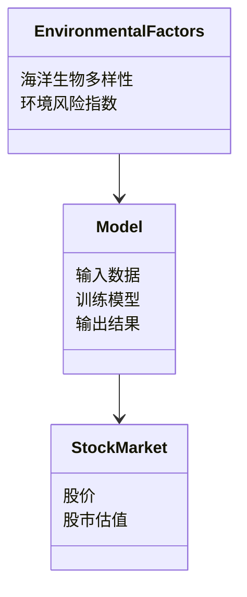
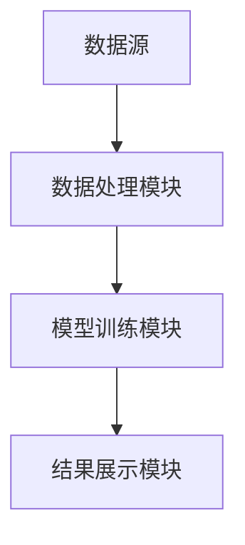

                 


# 全球股市估值与海洋生物多样性保护技术的关系

## 关键词：全球股市估值，海洋生物多样性，环境风险，生态系统服务价值，机器学习算法，随机森林，时间序列分析

## 摘要：本文探讨了全球股市估值与海洋生物多样性保护技术之间的关系，分析了环境因素对股市的影响机制，提出了基于机器学习的环境风险评估模型，并通过实际案例展示了如何将海洋生物多样性数据整合到股市估值模型中。本文还讨论了相关技术的实现细节和应用前景。

---

## 第1章: 背景介绍

### 1.1 问题背景

#### 1.1.1 全球股市估值的重要性
股市估值是衡量市场健康状况的重要指标，反映了投资者对经济前景的信心。然而，近年来环境问题，尤其是海洋生物多样性的减少，已成为影响经济的重要因素。

#### 1.1.2 海洋生物多样性保护的紧迫性
海洋生物多样性对全球生态系统的稳定性至关重要。海洋生态系统服务（如渔业资源、滨海旅游业）的价值高达数万亿美元，其退化对经济和股市估值的影响不容忽视。

#### 1.1.3 两者关系的初步探讨
环境因素对经济的影响逐渐被纳入金融分析。海洋生物多样性保护技术的进步可以量化这些环境因素，为股市估值提供新的视角。

---

### 1.2 问题描述

#### 1.2.1 海洋生物多样性对经济的影响
海洋生物多样性退化可能导致渔业资源减少、旅游资源受损，进而影响相关企业的盈利能力和股市表现。

#### 1.2.2 全球股市与环境因素的关联性
环境风险（如气候变化、污染）已成为影响企业价值的重要因素。股市估值需要考虑这些环境风险。

#### 1.2.3 环境风险对股市估值的潜在影响
通过统计和机器学习方法，可以量化环境风险对股市的影响，帮助投资者做出更明智的决策。

---

### 1.3 问题解决

#### 1.3.1 环境经济学的基本原理
环境经济学研究如何将环境因素纳入经济决策。生态系统服务价值（ESV）是衡量环境影响的重要工具。

#### 1.3.2 生态系统服务价值的量化方法
生态系统服务价值可以通过市场价和影子价格进行量化。例如，渔业资源的价值可以通过捕捞量和市场价格计算。

#### 1.3.3 环境因素对股市的影响机制
环境风险通过影响企业成本、利润和声誉间接影响股市估值。例如，污染企业可能面临更高的监管成本和负面舆论。

---

### 1.4 边界与外延

#### 1.4.1 研究的范围界定
本研究仅关注海洋生物多样性对股市的影响，不涉及其他环境因素（如空气污染）。

#### 1.4.2 相关领域的扩展
未来研究可以扩展到其他环境因素（如气候变化）对股市的影响，以及不同地区的差异。

#### 1.4.3 研究的局限性与未来方向
数据获取和模型精度是主要挑战。未来可以利用更多样化的数据（如卫星图像）和更复杂的模型（如深度学习）进行研究。

---

## 第2章: 核心概念与联系

### 2.1 核心概念原理

#### 2.1.1 生态系统服务价值的计算模型
生态系统服务价值（ESV）= ∑（服务类型的价值 × 数量）

#### 2.1.2 环境风险的量化方法
环境风险指数 = ∑（风险因素权重 × 风险因素值）

#### 2.1.3 环境因素对股市的影响机制
环境风险 → 企业成本 → 利润 → 股价

---

### 2.2 概念属性特征对比表格

| 概念         | 属性         | 特征描述                                   |
|--------------|--------------|------------------------------------------|
| 生态系统服务 | 经济价值     | 可量化，依赖于生物多样性                 |
| 环境风险     | 影响因素     | 包括气候变化、污染等                     |
| 股市估值     | 市场预期     | 反映投资者对环境因素的感知               |

---

### 2.3 ER实体关系图



---

## 第3章: 算法原理讲解

### 3.1 算法原理

#### 3.1.1 统计模型：多元回归分析
多元回归模型可以量化环境因素对股市的影响。例如：

$$ \text{股价} = \beta_0 + \beta_1 \times \text{环境风险} + \beta_2 \times \text{其他因素} + \epsilon $$

#### 3.1.2 机器学习模型：随机森林
随机森林通过特征重要性分析，识别对股市影响最大的环境因素。

---

### 3.2 算法实现

#### 3.2.1 数据预处理
```python
import pandas as pd
import numpy as np

data = pd.read_csv('marine_data.csv')
data = data.dropna()
```

#### 3.2.2 模型训练
```python
from sklearn.ensemble import RandomForestRegressor

model = RandomForestRegressor(n_estimators=100, random_state=42)
model.fit(X_train, y_train)
```

#### 3.2.3 结果分析
特征重要性分析可以帮助识别对股市影响最大的环境因素。

---

## 第4章: 系统分析与架构设计方案

### 4.1 问题场景介绍
假设我们有一个包含海洋生物多样性数据和股市数据的数据库，需要设计一个系统来量化环境因素对股市的影响。

### 4.2 系统功能设计

#### 4.2.1 领域模型


### 4.3 系统架构设计



---

## 第5章: 项目实战

### 5.1 环境安装
安装必要的库：
```bash
pip install pandas scikit-learn matplotlib
```

### 5.2 核心实现

#### 5.2.1 数据处理
```python
import pandas as pd
import numpy as np
from sklearn.ensemble import RandomForestRegressor
from sklearn.metrics import mean_squared_error

# 读取数据
data = pd.read_csv('marine_data.csv')

# 数据预处理
X = data.drop(columns=['股价'])
y = data['股价']

# 划分训练集和测试集
from sklearn.model_selection import train_test_split
X_train, X_test, y_train, y_test = train_test_split(X, y, test_size=0.2, random_state=42)

# 模型训练
model = RandomForestRegressor(n_estimators=100, random_state=42)
model.fit(X_train, y_train)

# 模型评估
y_pred = model.predict(X_test)
print('均方误差:', mean_squared_error(y_test, y_pred))
```

#### 5.2.2 模型解释
特征重要性分析：
```python
importances = model.feature_importances_
feature_names = X.columns
```

---

## 第6章: 总结与展望

### 6.1 最佳实践 tips
- 在金融分析中引入环境因素可以帮助更全面地评估企业风险。
- 使用机器学习算法可以更好地捕捉环境因素与股市之间的非线性关系。

### 6.2 小结
通过量化海洋生物多样性对股市的影响，投资者和政策制定者可以更好地应对环境风险。

### 6.3 注意事项
- 数据质量对模型性能至关重要。
- 模型需要定期更新以反映最新的环境变化。

### 6.4 拓展阅读
建议阅读关于环境经济学和金融风险管理的书籍，以进一步理解环境因素对经济的影响。

---

通过以上步骤，我们可以系统地分析全球股市估值与海洋生物多样性保护技术之间的关系，并为实际应用提供有价值的见解。

